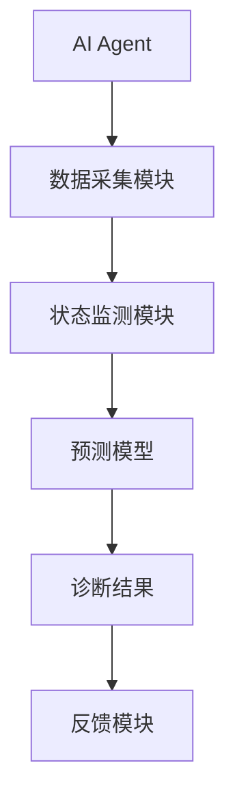
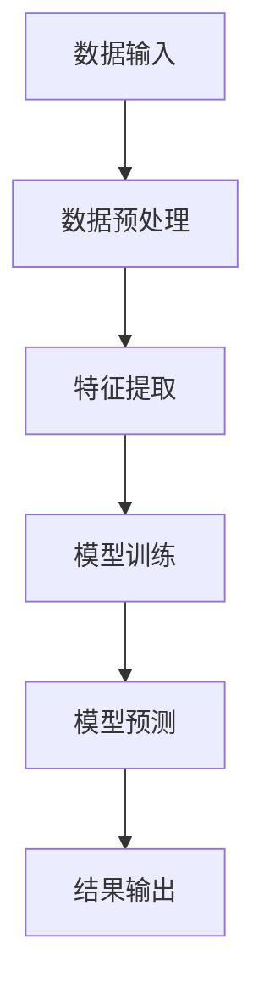
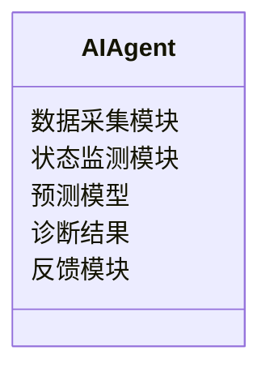
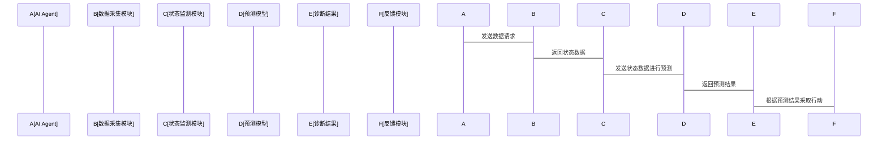

                 


# 智能汽车：AI Agent的预测性维护与故障诊断

> **关键词**：智能汽车，AI Agent，预测性维护，故障诊断，机器学习，时间序列分析，系统架构

> **摘要**：本文探讨了AI Agent在智能汽车中的应用，特别是在预测性维护和故障诊断方面。通过分析AI Agent的核心概念、算法原理、系统架构以及实际项目案例，详细阐述了AI Agent如何利用机器学习和时间序列分析等技术，实现智能汽车的高效维护和故障诊断。文章还提供了系统的实现方案和最佳实践，为智能汽车的技术发展提供了深入的见解。

---

## 第一部分: 智能汽车与AI Agent概述

### 第1章: 智能汽车的发展与AI Agent的引入

#### 1.1 智能汽车的发展现状
##### 1.1.1 智能汽车的定义与分类
智能汽车是一种结合了人工智能、物联网和大数据分析的高级交通工具。根据功能的不同，智能汽车可以分为初级智能汽车（如具备车道偏离预警系统）、中级智能汽车（如具备自动泊车功能）和高级智能汽车（如具备全自动驾驶能力）。AI Agent作为智能汽车的核心组件，通过实时数据处理和决策支持，显著提升了汽车的智能化水平。

##### 1.1.2 智能汽车的核心技术与发展趋势
智能汽车的核心技术包括：
- **传感器技术**：如激光雷达、摄像头和超声波传感器，用于实时环境感知。
- **人工智能技术**：如机器学习和深度学习，用于数据分析和决策制定。
- **通信技术**：如5G和V2X（车路协同），实现车辆与周围环境的实时通信。
- **大数据分析**：通过海量数据的处理，优化车辆性能和用户体验。

智能汽车的发展趋势主要体现在：
1. **更高的自动驾驶能力**：从辅助驾驶向全自动驾驶迈进。
2. **更智能的交互系统**：通过语音和手势识别，提升用户交互体验。
3. **更高效的预测性维护**：通过AI Agent实现预防性维护，减少车辆故障率。

##### 1.1.3 AI Agent在智能汽车中的作用
AI Agent在智能汽车中扮演着关键角色，主要负责：
- **实时数据处理**：通过传感器收集车辆运行数据，分析车辆状态。
- **预测性维护**：基于历史数据和当前状态，预测潜在故障，提前采取措施。
- **故障诊断**：当故障发生时，快速定位问题并提供解决方案。
- **决策支持**：在复杂情况下，为自动驾驶系统提供决策支持。

#### 1.2 AI Agent的基本概念
##### 1.2.1 AI Agent的定义与特点
AI Agent（智能代理）是指能够感知环境、自主决策并采取行动的智能实体。其特点包括：
- **自主性**：能够独立运行，无需外部干预。
- **反应性**：能够实时感知环境变化并做出反应。
- **学习能力**：通过机器学习不断优化自身的决策模型。
- **交互性**：能够与用户和其他系统进行有效通信。

##### 1.2.2 AI Agent与传统算法的区别
| **对比维度** | **AI Agent** | **传统算法** |
|--------------|--------------|---------------|
| 数据处理能力 | 高度智能，能够处理复杂数据 | 基于规则或简单模型，处理能力有限 |
| 决策能力     | 具备自主决策能力 | 需要人工干预或固定规则 |
| 学习能力     | 能够通过数据学习和优化 | 无法学习，依赖预设规则 |
| 实时性       | 高，能够实时响应 | 较低，需要周期性处理 |

##### 1.2.3 AI Agent在智能汽车中的应用场景
AI Agent在智能汽车中的应用场景包括：
- **自动驾驶辅助**：通过实时环境感知和路径规划，辅助驾驶员完成驾驶任务。
- **故障预测与诊断**：通过分析车辆数据，预测潜在故障并提供解决方案。
- **用户交互优化**：通过语音识别和自然语言处理，提升用户的交互体验。

#### 1.3 预测性维护与故障诊断的重要性
##### 1.3.1 预测性维护的定义与优势
预测性维护是一种基于实时数据和历史数据的维护策略，能够提前发现潜在故障，避免突发性故障的发生。其优势包括：
- **减少停机时间**：通过提前预测故障，减少车辆的停运时间。
- **降低维护成本**：通过精准的维护计划，降低维护成本。
- **延长设备寿命**：通过预防性维护，延长设备的使用寿命。

##### 1.3.2 故障诊断的定义与挑战
故障诊断是通过分析系统运行数据，识别和定位系统故障的过程。其挑战包括：
- **数据复杂性**：车辆运行数据种类繁多，且具有高度的动态性。
- **诊断准确性**：需要高精度的诊断算法，以确保诊断的准确性。
- **实时性要求**：故障诊断需要在短时间内完成，以避免故障扩大化。

##### 1.3.3 AI Agent在预测性维护与故障诊断中的价值
AI Agent通过实时数据处理和智能分析，显著提升了预测性维护和故障诊断的效率和准确性。其价值体现在：
- **提升维护效率**：通过智能化的预测和诊断，减少维护时间和成本。
- **提高车辆可靠性**：通过预防性维护，降低车辆故障率，提升车辆可靠性。
- **优化用户体验**：通过快速诊断和修复，提升用户的使用体验。

---

## 第二部分: AI Agent的核心概念与工作原理

### 第2章: AI Agent的核心概念与工作原理

#### 2.1 AI Agent的核心概念
##### 2.1.1 状态监测与数据采集
AI Agent通过多种传感器（如温度传感器、压力传感器、加速度传感器等）实时采集车辆运行数据，包括：
- **车辆状态数据**：如车速、加速度、转向角度等。
- **环境数据**：如温度、湿度、光照强度等。
- **故障数据**：如故障码、异常声音等。

##### 2.1.2 预测模型与诊断逻辑
AI Agent通过机器学习算法建立预测模型，分析车辆运行数据，预测潜在故障。其预测模型包括：
- **时间序列分析模型**：如ARIMA模型和LSTM模型，用于预测未来状态。
- **机器学习模型**：如支持向量机（SVM）和随机森林（Random Forest），用于分类和回归分析。

##### 2.1.3 决策与反馈机制
AI Agent通过分析预测结果，制定相应的决策策略，并通过反馈机制不断优化自身的决策模型。其决策机制包括：
- **条件判断**：根据当前状态和预测结果，判断是否需要采取行动。
- **决策执行**：根据判断结果，执行相应的操作，如发出维护提醒或调整车辆参数。
- **反馈优化**：根据执行结果，调整预测模型和决策策略，以提高准确性。

#### 2.2 AI Agent的实体关系与诊断流程


---

## 第三部分: AI Agent的算法原理与数学模型

### 第3章: AI Agent的算法原理与数学模型

#### 3.1 算法原理概述
##### 3.1.1 基于时间序列分析的故障预测模型
时间序列分析是一种常用的预测方法，其基本原理是通过分析历史数据，预测未来趋势。常用的算法包括：
- **ARIMA模型**：适用于线性趋势和季节性变化的数据。
- **LSTM模型**：适用于非线性趋势和长序列数据。

##### 3.1.2 基于机器学习的故障诊断算法
机器学习算法通过训练数据，建立分类或回归模型，用于故障诊断。常用的算法包括：
- **支持向量机（SVM）**：适用于分类问题。
- **随机森林（Random Forest）**：适用于分类和回归问题。

##### 3.1.3 基于知识图谱的故障推理方法
知识图谱是一种结构化的数据表示方法，通过图结构表示知识，用于故障推理。其基本原理是通过分析故障之间的关系，推理出可能的故障原因。

#### 3.2 算法流程图


#### 3.3 算法实现与案例分析
##### 3.3.1 算法实现
```python
import pandas as pd
from sklearn.model_selection import train_test_split
from sklearn.ensemble import RandomForestClassifier
from sklearn.metrics import accuracy_score

# 加载数据
data = pd.read_csv('vehicle_data.csv')

# 数据预处理
X = data.drop('label', axis=1)
y = data['label']

# 划分训练集和测试集
X_train, X_test, y_train, y_test = train_test_split(X, y, test_size=0.2, random_state=42)

# 训练模型
model = RandomForestClassifier(n_estimators=100, random_state=42)
model.fit(X_train, y_train)

# 预测结果
y_pred = model.predict(X_test)

# 评估准确率
accuracy = accuracy_score(y_test, y_pred)
print(f'准确率: {accuracy}')
```

##### 3.3.2 案例分析
以发动机故障诊断为例，通过收集发动机运行数据，包括转速、温度、压力等参数，训练随机森林模型，预测发动机故障类型。通过实际案例分析，验证模型的准确性和鲁棒性。

---

## 第四部分: 系统分析与架构设计方案

### 第4章: 系统分析与架构设计方案

#### 4.1 项目背景与目标
本项目旨在通过AI Agent实现智能汽车的预测性维护和故障诊断，提升车辆的可靠性和用户体验。

#### 4.2 系统功能设计
##### 4.2.1 领域模型


##### 4.2.2 系统架构


##### 4.2.3 接口设计
系统接口包括：
- **数据接口**：与传感器和数据库交互。
- **用户接口**：与驾驶员和系统管理员交互。
- **通信接口**：与车辆控制系统和外部系统交互。

##### 4.2.4 交互流程图


---

## 第五部分: 项目实战

### 第5章: 项目实战

#### 5.1 环境安装与配置
##### 5.1.1 环境要求
- **操作系统**：Linux或Windows 10及以上版本。
- **编程语言**：Python 3.6及以上版本。
- **依赖库**：Pandas、Scikit-learn、Mermaid等。

##### 5.1.2 安装步骤
```bash
pip install pandas scikit-learn mermaid
```

#### 5.2 系统核心实现
##### 5.2.1 核心代码实现
```python
import pandas as pd
from sklearn.ensemble import RandomForestClassifier
from sklearn.metrics import accuracy_score

# 加载数据
data = pd.read_csv('vehicle_data.csv')

# 数据预处理
X = data.drop('label', axis=1)
y = data['label']

# 划分训练集和测试集
X_train, X_test, y_train, y_test = train_test_split(X, y, test_size=0.2, random_state=42)

# 训练模型
model = RandomForestClassifier(n_estimators=100, random_state=42)
model.fit(X_train, y_train)

# 预测结果
y_pred = model.predict(X_test)

# 评估准确率
accuracy = accuracy_score(y_test, y_pred)
print(f'准确率: {accuracy}')
```

##### 5.2.2 代码解读与分析
- **数据加载**：从CSV文件中加载车辆运行数据。
- **数据预处理**：删除目标变量，将数据分为训练集和测试集。
- **模型训练**：使用随机森林算法训练分类模型。
- **模型预测**：对测试集进行预测，并计算准确率。

#### 5.3 实际案例分析
##### 5.3.1 案例背景
以发动机故障诊断为例，收集发动机运行数据，包括转速、温度、压力等参数，训练随机森林模型，预测发动机故障类型。

##### 5.3.2 数据分析与结果展示
通过分析预测结果，验证模型的准确性和鲁棒性，并根据实际应用效果提出改进建议。

#### 5.4 项目小结
本项目通过AI Agent实现了智能汽车的预测性维护和故障诊断，提升了车辆的可靠性和用户体验。通过实际案例分析，验证了模型的准确性和鲁棒性，并为未来的优化提供了方向。

---

## 第六部分: 最佳实践与未来展望

### 第6章: 最佳实践与未来展望

#### 6.1 小结
本文详细探讨了AI Agent在智能汽车中的应用，特别是在预测性维护和故障诊断方面。通过分析AI Agent的核心概念、算法原理、系统架构以及实际项目案例，展示了AI Agent在智能汽车中的巨大潜力。

#### 6.2 注意事项
- **数据质量**：确保数据的准确性和完整性，避免因数据问题影响模型性能。
- **模型优化**：根据实际应用效果，不断优化模型参数，提高预测准确性。
- **系统安全**：确保系统的安全性，防止数据泄露和网络攻击。

#### 6.3 未来展望
随着人工智能和大数据技术的不断发展，AI Agent在智能汽车中的应用将更加广泛和深入。未来的研究方向包括：
- **更高效的算法**：开发更高效的算法，提升预测和诊断的准确性和实时性。
- **更智能的系统架构**：设计更智能的系统架构，实现更高水平的自动驾驶和智能维护。
- **更广泛的应用场景**：拓展AI Agent的应用场景，提升智能汽车的智能化水平和用户体验。

---

## 第七部分: 作者信息

**作者：AI天才研究院/AI Genius Institute & 禅与计算机程序设计艺术 /Zen And The Art of Computer Programming**

---

# 结语
通过本文的详细阐述，读者可以深入了解AI Agent在智能汽车中的应用，特别是在预测性维护和故障诊断方面。未来，随着人工智能技术的不断发展，AI Agent将在智能汽车中发挥越来越重要的作用，为智能汽车的技术进步和产业发展提供强有力的支持。

