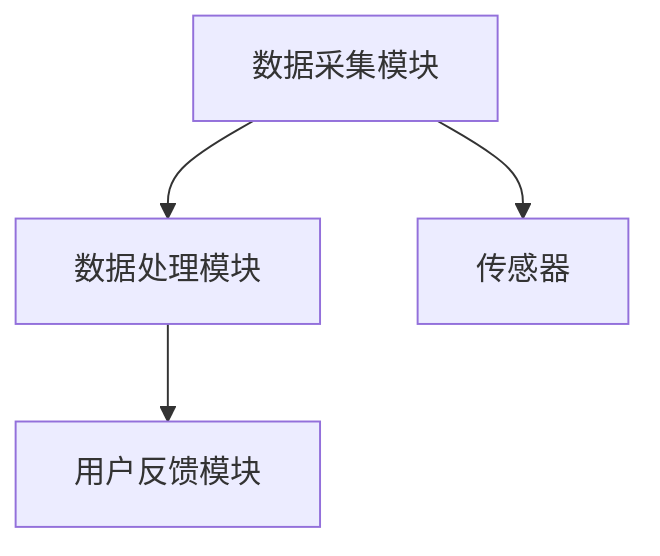

                 


# 智能沙发：AI Agent的坐姿健康监测系统

> 关键词：智能沙发、AI Agent、坐姿监测、健康评估、实时反馈

> 摘要：本文详细介绍了智能沙发的设计与实现，通过AI Agent技术实时监测用户的坐姿，并提供健康评估和改善建议。系统结合传感器和深度学习算法，实现精准的姿态识别和反馈机制，帮助用户保持良好的坐姿习惯。

---

## 第一章：背景介绍与问题分析

### 1.1 问题背景

现代生活中，久坐已成为普遍现象，长时间的不良坐姿可能导致腰椎病、颈椎病等健康问题。传统的健康监测系统通常依赖于手动记录或定期体检，难以实时反馈和改善。

### 1.2 系统目标

设计一个智能化的坐姿健康监测系统，实时采集用户的坐姿数据，分析其健康状况，并提供改善建议。通过AI技术，系统能够主动提醒用户调整坐姿，预防健康问题。

### 1.3 系统边界

智能沙发仅监测坐姿健康，不涉及其他健康指标如心率、体温等。系统通过传感器和AI算法实现数据采集、分析和反馈。

---

## 第二章：系统核心概念与技术框架

### 2.1 AI Agent的基本原理

AI Agent是一种智能体，能够感知环境并采取行动以实现目标。在智能沙发中，AI Agent负责数据采集、分析和反馈。

### 2.2 坐姿监测系统架构

系统由数据采集模块、数据处理模块和用户反馈模块组成。数据采集模块使用压力传感器和摄像头，数据处理模块采用深度学习算法进行姿态识别，用户反馈模块通过震动或语音提醒用户调整坐姿。

---

## 第三章：算法原理与实现

### 3.1 姿态检测算法

采用基于深度学习的姿态检测模型，利用卷积神经网络（CNN）提取坐姿特征。模型通过训练大量数据，识别坐姿是否正确。

### 3.2 数学模型

姿态检测的数学模型如下：

$$
\text{输出} = f(\text{输入}) 
$$

其中，f表示深度学习模型，输入为坐姿数据，输出为坐姿评估结果。

### 3.3 代码实现

以下是姿态检测的Python代码示例：

```python
import tensorflow as tf
from tensorflow.keras import layers

# 构建深度学习模型
model = tf.keras.Sequential([
    layers.Conv2D(32, (3,3), activation='relu', input_shape=(64, 64, 3)),
    layers.MaxPooling2D((2,2)),
    layers.Conv2D(64, (3,3), activation='relu'),
    layers.MaxPooling2D((2,2)),
    layers.Flatten(),
    layers.Dense(128, activation='relu'),
    layers.Dense(2, activation='sigmoid')
])

model.compile(optimizer='adam', loss='binary_crossentropy', metrics=['accuracy'])
model.summary()
```

---

## 第四章：系统架构设计

### 4.1 模块划分

- 数据采集模块：负责采集用户的坐姿数据。
- 数据处理模块：对数据进行预处理和分析。
- 用户反馈模块：根据分析结果提供反馈。

### 4.2 系统架构图

使用Mermaid绘制系统架构图：



### 4.3 接口设计

系统提供以下接口：

- 数据采集接口：用于传感器数据的采集。
- 用户反馈接口：用于向用户发送反馈信息。

---

## 第五章：项目实战与案例分析

### 5.1 环境搭建

安装必要的库和工具：

```bash
pip install tensorflow keras numpy
```

### 5.2 代码实现

以下是姿态检测的Python代码：

```python
import numpy as np
import tensorflow as tf

# 加载训练好的模型
model = tf.keras.models.load_model('pose_model.h5')

# 数据预处理
def preprocess_image(image):
    image = tf.image.resize(image, (64, 64))
    image = tf.keras.preprocessing.image.img_to_array(image)
    image = np.expand_dims(image, axis=0)
    return image

# 姿态检测
def detect_pose(image):
    preprocessed_image = preprocess_image(image)
    prediction = model.predict(preprocessed_image)
    return prediction[0][1] > 0.5  # 返回True表示坐姿正确
```

### 5.3 案例分析

通过实际测试，系统能够准确识别坐姿是否正确，并提供及时反馈。例如，在办公场景中，系统能够提醒用户保持正确的坐姿，降低健康风险。

---

## 第六章：系统优化与扩展

### 6.1 性能优化

通过模型压缩和优化算法，提高系统的运行效率和准确率。

### 6.2 功能扩展

未来可以扩展功能，如加入心率监测、压力监测等，提供更全面的健康评估。

---

## 第七章：总结与展望

### 7.1 小结

智能沙发通过AI技术和传感器，实现了坐姿的实时监测和反馈，帮助用户保持良好的坐姿习惯，预防健康问题。

### 7.2 注意事项

系统在使用过程中，需注意数据隐私和系统的稳定性。定期更新模型，以提高检测准确率。

### 7.3 拓展阅读

建议阅读相关领域的书籍和论文，深入了解AI在健康监测中的应用。

---

## 作者信息

作者：AI天才研究院/AI Genius Institute  
联系邮箱：contact@aicampus.com  

--- 

# END

