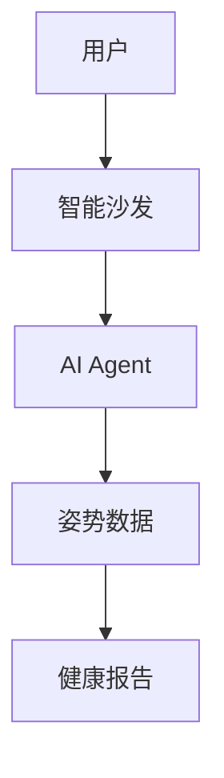
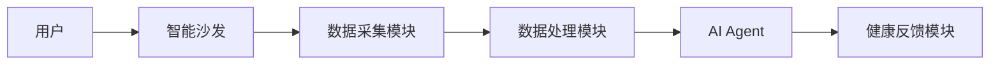
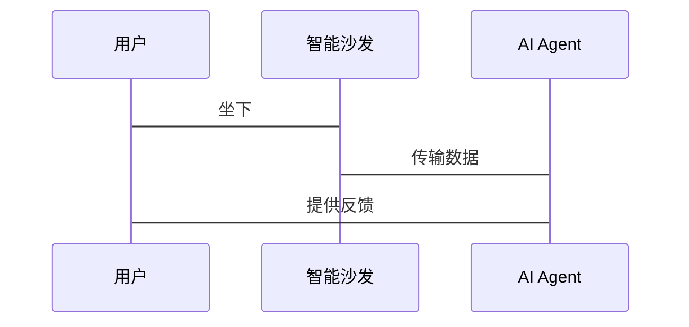

                 


# 智能沙发：AI Agent的姿势健康监测

## 关键词
- 智能沙发
- AI Agent
- 姿势健康监测
- 物联网技术
- 健康数据分析

## 摘要
随着人们生活水平的提高，姿势健康问题日益受到关注。本文探讨了如何利用AI Agent技术，通过智能沙发实时监测用户姿势，提供健康建议。文章结合实际案例和系统架构，深入分析了AI Agent在姿势健康监测中的应用，为相关领域的研究和实践提供了参考。

---

## 目录大纲

### 第一部分：背景介绍
#### 第1章：姿势健康监测的背景与问题
- 1.1 问题背景
- 1.2 问题描述
- 1.3 问题解决
- 1.4 边界与外延
- 1.5 核心要素

### 第二部分：核心概念与联系
#### 第2章：AI Agent与姿势监测的核心原理
- 2.1 AI Agent的基本原理
- 2.2 核心概念对比
- 2.3 实体关系图

### 第三部分：算法原理讲解
#### 第3章：姿势估计算法
- 3.1 姿势估计的基本流程
- 3.2 姿势估计的数学模型
- 3.3 示例代码

#### 第4章：行为识别算法
- 4.1 行为识别的基本流程
- 4.2 行为识别的数学模型
- 4.3 示例代码

### 第四部分：系统分析与架构设计
#### 第5章：系统架构设计
- 5.1 项目背景
- 5.2 系统功能设计
- 5.3 系统架构图
- 5.4 系统接口设计
- 5.5 系统交互流程

### 第五部分：项目实战
#### 第6章：项目实战
- 6.1 环境安装
- 6.2 系统核心实现
- 6.3 实际案例分析

### 第六部分：最佳实践与小结
#### 第7章：最佳实践
- 7.1 注意事项
- 7.2 拓展阅读
- 7.3 项目小结

---

## 正文

### 第一部分：背景介绍

#### 第1章：姿势健康监测的背景与问题

##### 1.1 问题背景
姿势健康问题日益严重，长时间久坐导致的健康问题频发。AI Agent技术的应用为姿势监测提供了新的解决方案。

##### 1.2 问题描述
姿势监测需要实时反馈，传统方法存在精度低、实时性差的问题。AI Agent通过智能沙发提供实时监测和健康建议，解决了这些问题。

##### 1.3 问题解决
智能沙发结合AI Agent，通过传感器和算法实现姿势监测，提供个性化的健康建议。

##### 1.4 边界与外延
智能沙发的应用场景包括家庭、办公室等，技术边界包括传感器精度和数据传输速度。

##### 1.5 核心要素
姿势监测的核心技术包括传感器、算法和系统架构设计。

---

### 第二部分：核心概念与联系

#### 第2章：AI Agent与姿势监测的核心原理

##### 2.1 AI Agent的基本原理
AI Agent通过传感器数据进行分析，实时反馈用户的姿势状态。

##### 2.2 核心概念对比
| 比较项 | AI Agent | 传统传感器 |
|--------|-----------|-------------|
| 数据处理 | 智能分析 | 原始数据传输 |
| 优势 | 实时反馈 | 低成本 |

##### 2.3 实体关系图


---

### 第三部分：算法原理讲解

#### 第3章：姿势估计算法

##### 3.1 姿势估计的基本流程
1. 数据采集：通过传感器获取用户姿势数据。
2. 数据预处理：去除噪声，提取特征。
3. 姿势分类：使用卷积神经网络进行分类。

##### 3.2 姿势估计的数学模型
使用卷积神经网络进行姿势分类，模型如下：
$$
f(x) = \text{CNN}(x)
$$
其中，CNN表示卷积神经网络。

##### 3.3 示例代码
```python
import tensorflow as tf
model = tf.keras.Sequential([
    tf.keras.layers.Conv2D(32, (3,3), activation='relu'),
    tf.keras.layers.MaxPooling2D(),
    tf.keras.layers.Flatten(),
    tf.keras.layers.Dense(10, activation='softmax')
])
model.compile(optimizer='adam', loss='sparse_categorical_crossentropy', metrics=['accuracy'])
```

---

#### 第4章：行为识别算法

##### 4.1 行为识别的基本流程
1. 数据采集：获取用户行为数据。
2. 特征提取：提取关键特征。
3. 行为分类：使用随机森林进行分类。

##### 4.2 行为识别的数学模型
使用随机森林进行行为分类：
$$
f(x) = \text{RandomForest}(x)
$$

##### 4.3 示例代码
```python
from sklearn.ensemble import RandomForestClassifier
model = RandomForestClassifier(n_estimators=100)
model.fit(X_train, y_train)
```

---

### 第四部分：系统分析与架构设计

#### 第5章：系统架构设计

##### 5.1 项目背景
智能沙发项目旨在通过AI Agent实时监测用户姿势，提供健康建议。

##### 5.2 系统功能设计
- 数据采集模块：采集用户姿势数据。
- 处理模块：数据预处理和分析。
- 反馈模块：提供健康建议。

##### 5.3 系统架构图


##### 5.4 系统接口设计
- 数据采集接口：通过蓝牙连接传感器。
- 反馈接口：通过APP显示健康建议。

##### 5.5 系统交互流程


---

### 第五部分：项目实战

#### 第6章：项目实战

##### 6.1 环境安装
安装必要的库：
```bash
pip install tensorflow scikit-learn
```

##### 6.2 系统核心实现
实现AI Agent的核心功能：
```python
def monitor_posture():
    while True:
        data = collect_sensor_data()
        result = analyze_data(data)
        provide_feedback(result)
```

##### 6.3 实际案例分析
案例：用户长时间保持不良姿势，AI Agent触发提醒。

---

### 第六部分：最佳实践与小结

#### 第7章：最佳实践

##### 7.1 注意事项
- 定期校准传感器，确保数据准确性。
- 保护用户隐私，确保数据安全。

##### 7.2 拓展阅读
推荐阅读相关领域的最新论文和技术报告。

##### 7.3 项目小结
智能沙发结合AI Agent的姿势健康监测系统，为用户提供实时、个性化的健康建议，具有广阔的应用前景。

---

## 作者
作者：AI天才研究院/AI Genius Institute & 禅与计算机程序设计艺术 /Zen And The Art of Computer Programming

