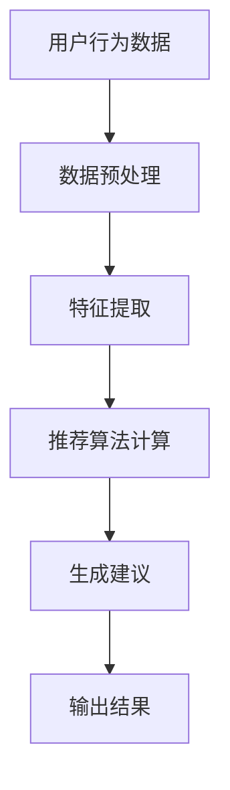
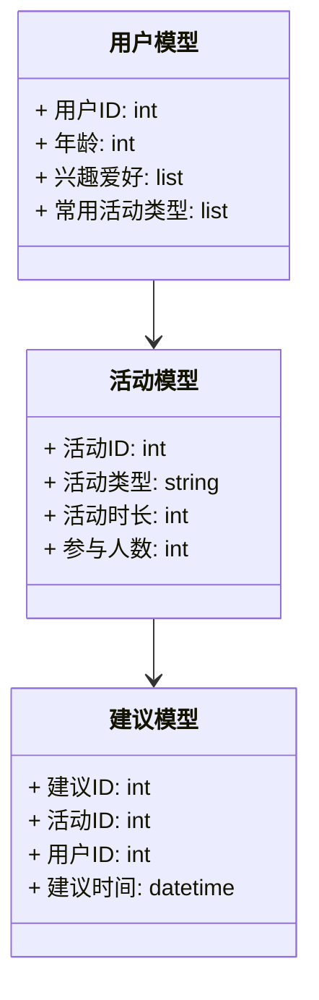
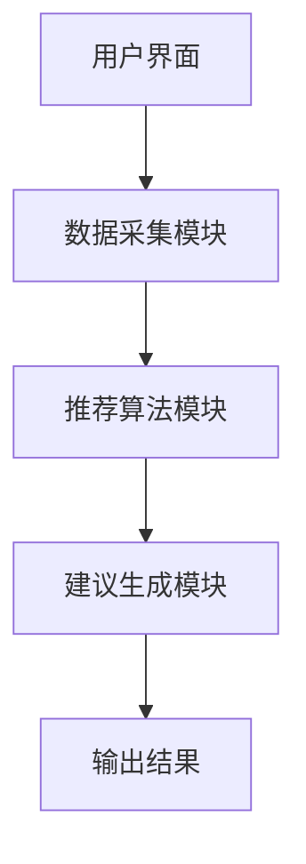
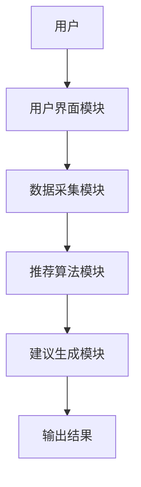

                 


# 智能沙发：AI Agent的家庭活动建议系统

## 关键词：AI Agent，智能家居，家庭活动建议系统，推荐算法，系统架构

## 摘要：智能沙发是一种结合了AI Agent技术的家庭活动建议系统，旨在通过智能化的算法和系统架构设计，为家庭成员提供个性化的活动建议，优化家庭生活质量。本文从背景、核心概念、算法原理、系统架构到项目实战，全面解析智能沙发的设计与实现。

---

# 第一部分: 智能沙发：AI Agent的家庭活动建议系统概述

## 第1章: 问题背景与需求分析

### 1.1 家庭活动管理的现状与挑战

#### 1.1.1 家庭活动管理的痛点分析
现代家庭中，成员的活动安排常常面临时间冲突、资源分配不合理等问题。例如，父母可能希望孩子参与体育活动，而孩子可能更倾向于玩游戏。这种矛盾导致家庭活动安排效率低下，难以满足所有成员的需求。

#### 1.1.2 用户需求的多样性与复杂性
家庭成员的需求多样化，不同年龄段的人对活动的偏好不同。例如，儿童可能喜欢动画片，而成年人可能更倾向于阅读或运动。此外，家庭活动的频率、时长、地点等也需要灵活调整，增加了管理的复杂性。

#### 1.1.3 当前解决方案的局限性
传统的家庭活动管理方式主要依赖人工安排，效率低且难以兼顾所有成员的需求。现有的智能家居设备虽然能够提供一些自动化服务，但缺乏智能化的活动建议功能，无法真正优化家庭活动安排。

### 1.2 AI Agent在家庭活动管理中的应用前景

#### 1.2.1 AI Agent的基本概念与特点
AI Agent是一种智能代理系统，能够通过感知环境、理解用户需求并采取行动来实现目标。其特点包括自主性、反应性、社会性等。

#### 1.2.2 智能沙发的定义与功能定位
智能沙发是一种结合了AI Agent技术的智能家居设备，能够根据家庭成员的行为数据和偏好，提供个性化的活动建议。其功能包括活动推荐、时间管理、资源分配等。

#### 1.2.3 智能沙发的目标用户与市场潜力
智能沙发的目标用户主要是家庭用户，尤其是有孩子的家庭。随着智能家居市场的快速发展，智能沙发具有广阔的市场潜力。

---

## 第2章: 智能沙发系统的核心概念与架构

### 2.1 AI Agent在智能沙发中的角色

#### 2.1.1 AI Agent的基本工作原理
AI Agent通过数据采集、分析、决策和执行四个步骤，为用户提供智能化服务。例如，智能沙发可以通过传感器采集家庭成员的行为数据，分析用户的偏好，然后推荐合适的活动。

#### 2.1.2 智能沙发中的AI Agent功能模块
智能沙发中的AI Agent主要包括数据采集模块、推荐算法模块和执行模块。数据采集模块负责收集用户行为数据，推荐算法模块根据数据生成个性化建议，执行模块则通过智能家居设备执行建议。

### 2.2 家庭活动建议系统的功能架构

#### 2.2.1 用户行为数据采集模块
用户行为数据采集模块负责收集家庭成员的行为数据，例如看电视的时间、运动频率等。这些数据是后续推荐的基础。

#### 2.2.2 活动推荐算法模块
活动推荐算法模块根据用户行为数据，使用协同过滤、基于内容的推荐等算法，生成个性化的活动建议。

#### 2.2.3 个性化建议生成模块
个性化建议生成模块将推荐结果转化为具体的活动建议，并通过智能沙发的用户界面呈现给用户。

### 2.3 系统核心要素与概念模型

#### 2.3.1 用户模型
用户模型是智能沙发系统的核心要素之一，用于描述用户的行为、偏好和需求。例如，用户模型可以包括用户的年龄、兴趣爱好、常用活动类型等。

#### 2.3.2 活动模型
活动模型用于描述家庭活动的基本信息，例如活动类型、时长、参与人数等。智能沙发可以根据活动模型生成推荐。

#### 2.3.3 建议模型
建议模型是智能沙发系统生成活动建议的核心，它将用户模型和活动模型结合，生成个性化的活动建议。

---

## 第3章: 智能沙发系统的算法原理与数学模型

### 3.1 基于用户行为的推荐算法

#### 3.1.1 协同过滤算法
协同过滤是一种基于用户相似性推荐算法。例如，如果用户A和用户B的行为相似，那么用户A喜欢的活动，用户B也可能喜欢。

#### 3.1.2 基于内容的推荐算法
基于内容的推荐算法通过分析活动的属性，推荐与用户偏好相似的活动。例如，如果用户喜欢运动类活动，系统会推荐更多的运动类活动。

#### 3.1.3 混合推荐模型
混合推荐模型结合了协同过滤和基于内容的推荐算法，能够兼顾用户相似性和活动属性的推荐。

### 3.2 活动建议生成的数学模型

#### 3.2.1 用户偏好度计算公式
$$ \text{用户偏好度} = \sum_{i=1}^{n} w_i \cdot x_i $$
其中，\( w_i \) 是第i个活动属性的权重，\( x_i \) 是第i个活动属性的值。

#### 3.2.2 活动相似度计算公式
$$ \text{活动相似度} = \frac{\sum_{i=1}^{n} w_i \cdot x_i}{\sqrt{\sum_{i=1}^{n} w_i^2} \cdot \sqrt{\sum_{i=1}^{n} x_i^2}} $$

#### 3.2.3 推荐权重分配模型
$$ \text{推荐权重} = \alpha \cdot \text{协同过滤权重} + (1-\alpha) \cdot \text{基于内容的权重} $$
其中，\( \alpha \) 是协同过滤权重，\( 1-\alpha \) 是基于内容的权重。

### 3.3 算法实现的流程图



---

## 第4章: 智能沙发系统的系统架构设计

### 4.1 系统功能模块划分

#### 4.1.1 用户界面模块
用户界面模块是智能沙发与用户交互的接口，用户可以通过该模块查看活动建议并进行操作。

#### 4.1.2 数据采集模块
数据采集模块负责收集家庭成员的行为数据，例如看电视的时间、运动频率等。

#### 4.1.3 推荐算法模块
推荐算法模块根据用户行为数据，使用协同过滤、基于内容的推荐等算法，生成个性化的活动建议。

### 4.2 系统架构设计

#### 4.2.1 领域模型类图


#### 4.2.2 系统架构图


### 4.3 系统接口设计与交互流程图

#### 4.3.1 系统接口设计
系统接口主要包括数据采集接口、推荐算法接口和建议生成接口。

#### 4.3.2 交互流程图


---

## 第5章: 智能沙发系统的项目实战

### 5.1 环境安装与配置

#### 5.1.1 Python环境安装
需要安装Python 3.8及以上版本，安装命令：`python --version`

#### 5.1.2 第三方库安装
安装numpy、pandas、scikit-learn等库，安装命令：`pip install numpy pandas scikit-learn`

### 5.2 系统核心实现源代码

#### 5.2.1 数据预处理代码
```python
import pandas as pd

# 读取数据
data = pd.read_csv('user_activity.csv')

# 数据清洗
data.dropna(inplace=True)
data = data.drop_duplicates()
```

#### 5.2.2 推荐算法实现
```python
from sklearn.metrics.pairwise import cosine_similarity

# 协同过滤推荐
def collaborative_filtering(user_id, data):
    # 计算用户相似性
    user_similarities = cosine_similarity(data[user_id].values.reshape(-1,1))
    # 返回相似用户
    return user_similarities.argsort()[::-1]

# 基于内容的推荐
def content_based_recommendation(user_id, data):
    # 计算活动相似度
    activity_similarities = cosine_similarity(data.T[user_id].values.reshape(-1,1))
    # 返回相似活动
    return activity_similarities.argsort()[::-1]
```

### 5.3 实际案例分析与解读

#### 5.3.1 案例背景
以一个四口之家为例，父母和两个孩子，假设父母喜欢运动，孩子喜欢动画片。

#### 5.3.2 数据分析
根据用户行为数据，系统会发现父母的运动偏好和孩子的动画片偏好。

#### 5.3.3 推荐结果
系统会推荐父母参加跑步活动，同时推荐孩子观看动画片。

### 5.4 项目小结
通过实际案例分析，智能沙发系统能够有效优化家庭活动安排，提高生活质量。

---

## 第6章: 总结与展望

### 6.1 最佳实践 Tips
- 确保数据的准确性和完整性
- 定期更新推荐算法
- 提供灵活的用户配置选项

### 6.2 小结
智能沙发系统通过结合AI Agent技术，能够为家庭成员提供个性化的活动建议，优化家庭活动管理。

### 6.3 注意事项
- 数据隐私保护
- 系统稳定性与安全性
- 用户体验优化

### 6.4 拓展阅读
- 智能家居相关技术
- 个性化推荐算法研究
- 人机交互设计

---

作者：AI天才研究院/AI Genius Institute & 禅与计算机程序设计艺术 /Zen And The Art of Computer Programming

