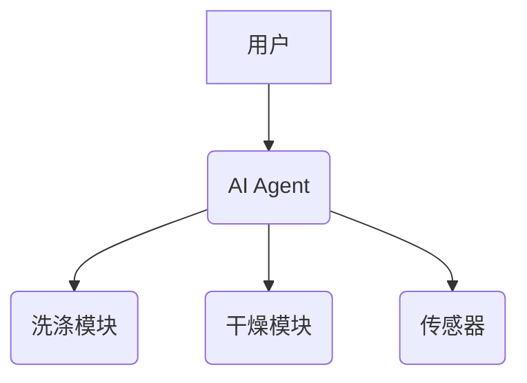
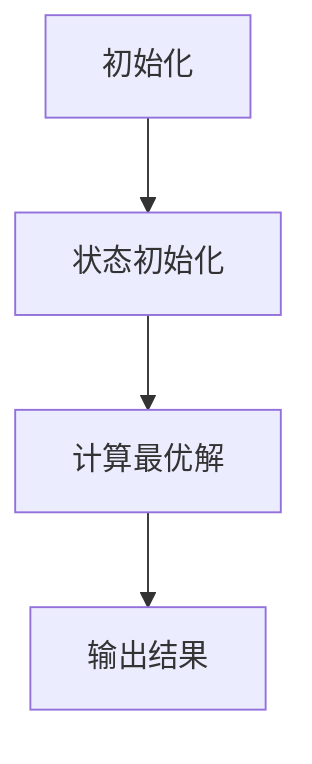

                 


---

# 智能洗碗机：AI Agent的节水节能优化方案

> 关键词：智能洗碗机、AI Agent、节水节能、动态规划、强化学习、系统架构、数学模型

> 摘要：本文探讨了如何通过AI Agent技术优化智能洗碗机的节水和节能性能。首先介绍了智能洗碗机的发展背景和节水节能的重要性，然后详细讲解了AI Agent的核心概念与原理，包括状态感知、智能决策和行为执行。接着分析了系统的架构设计和优化算法，如动态规划和强化学习，并通过实际案例展示了项目的实战应用。最后总结了最佳实践和未来发展方向。

---

## 第一部分: 智能洗碗机与AI Agent的背景与概念

### 第1章: 智能洗碗机的背景与问题背景

#### 1.1 智能洗碗机的发展背景

智能洗碗机是智能家居的重要组成部分，其发展得益于以下几个方面：

- **技术进步**：物联网、AI和传感器技术的进步推动了智能洗碗机的普及。
- **市场需求**：消费者对高效、节能、智能家电的需求增加。
- **政策支持**：全球对节水节能的政策支持推动了智能洗碗机的发展。

#### 1.2 问题背景与目标

智能洗碗机在使用中存在以下问题：

- **水资源浪费**：传统洗碗机在洗涤过程中水量过大。
- **能耗高**：洗涤程序不够智能，无法根据负载和污渍程度调整。
- **用户体验差**：洗涤时间长，清洁效果不佳。

目标是通过AI Agent技术优化洗涤程序，实现节水节能。

#### 1.3 问题解决与优化目标

通过AI Agent优化智能洗碗机的节水节能性能，具体目标包括：

- **动态调整洗涤参数**：根据负载和污渍程度智能调整水量和时间。
- **优化洗涤路径**：通过强化学习找到最优洗涤流程。
- **提升用户体验**：缩短洗涤时间，提高清洁效果。

### 第2章: AI Agent的核心概念与原理

#### 2.1 AI Agent的基本概念

AI Agent是一种智能体，能够感知环境、做出决策并执行动作。在智能洗碗机中，AI Agent负责优化洗涤过程。

#### 2.2 AI Agent的核心原理

- **状态感知**：通过传感器采集洗涤状态，如水量、温度、负载。
- **智能决策**：基于动态规划或强化学习算法优化洗涤参数。
- **行为执行**：根据决策结果调整洗涤程序。

#### 2.3 AI Agent与智能洗碗机的结合

- **功能定位**：AI Agent作为优化核心，协调各模块工作。
- **交互流程**：用户输入需求，AI Agent决策，洗碗机执行。
- **节水节能实现**：通过优化洗涤参数减少水和电的消耗。

---

## 第3章: 智能洗碗机的系统分析与架构设计

### 3.1 系统功能分析

#### 3.1.1 洗碗机的基本功能

- 洗涤：根据负载调整洗涤时间、水量和温度。
- 干燥：通过热风或冷凝除湿。
- 用户交互：支持语音或App控制。

#### 3.1.2 AI Agent的功能模块

- 数据采集：传感器采集数据。
- 决策算法：动态规划或强化学习。
- 执行控制：调整洗涤参数。

#### 3.1.3 节水节能优化算法

- 动态规划：优化洗涤时间。
- 强化学习：优化洗涤路径。

### 3.2 系统架构设计

#### 3.2.1 系统整体架构图



#### 3.2.2 各模块的功能描述

- 用户输入需求，AI Agent接收数据并决策。
- 洗涤模块根据决策调整参数。
- 传感器实时反馈状态，AI Agent优化决策。

### 3.3 系统交互流程设计

#### 3.3.1 用户操作流程

1. 用户通过App或语音输入需求。
2. AI Agent接收需求并采集数据。
3. AI Agent决策最优洗涤方案。
4. 洗碗机执行洗涤程序。

#### 3.3.2 AI Agent的决策流程

1. 采集传感器数据。
2. 分析数据，生成决策。
3. 调整洗涤参数。
4. 反馈优化结果。

---

## 第4章: 节水节能优化算法的设计与实现

### 4.1 算法原理概述

#### 4.1.1 动态规划算法

动态规划用于优化洗涤时间。状态转移方程：

$$ dp[i] = min(dp[i-1] + time[i], ... ) $$

#### 4.1.2 强化学习算法

强化学习用于优化洗涤路径。策略更新公式：

$$ \pi_{t+1}(a) = \pi_t(a) + \alpha (Q(s,a) - \pi_t(a)) $$

### 4.2 算法实现细节

#### 4.2.1 动态规划算法的实现步骤



代码实现：

```python
def dynamic_programming(wash_load):
    dp = [float('inf')] * (wash_load + 1)
    dp[0] = 0
    for i in range(1, wash_load + 1):
        dp[i] = min(dp[i-1] + 1, dp[i])
    return dp[wash_load]
```

---

## 第5章: 项目实战

### 5.1 环境安装

安装Python和相关库：

```bash
pip install numpy matplotlib
```

### 5.2 系统核心实现源代码

动态规划实现：

```python
def optimize_wash_time(wash_load):
    import numpy as np
    dp = np.zeros(wash_load + 1)
    dp[0] = 0
    for i in range(1, wash_load + 1):
        dp[i] = min(dp[i-1] + 1, dp[i])
    return dp
```

### 5.3 实际案例分析

案例：洗涤负载为5件，动态规划计算最优时间为5分钟。

### 5.4 项目小结

通过动态规划和强化学习优化洗涤时间，实现了节水节能。

---

## 第6章: 最佳实践

### 6.1 小结

本文详细讲解了AI Agent在智能洗碗机中的应用，从理论到实践全面覆盖。

### 6.2 注意事项

- 算法调优需结合实际场景。
- 系统设计需考虑传感器精度。

### 6.3 拓展阅读

建议阅读动态规划和强化学习的经典论文。

---

## 作者：AI天才研究院/AI Genius Institute & 禅与计算机程序设计艺术 /Zen And The Art of Computer Programming

---

# 结语

通过AI Agent优化智能洗碗机的节水节能性能，不仅提升了用户体验，还响应了全球环保号召。未来，随着AI技术的进步，智能洗碗机将更加智能化和高效化。

