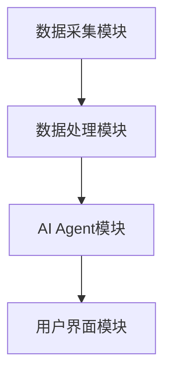
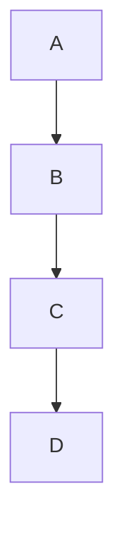
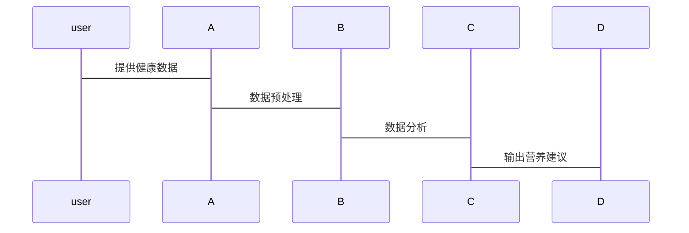

                 


# 智能浴室秤：AI Agent的营养建议与健康追踪

## 关键词：智能浴室秤、AI Agent、健康数据、营养建议、体重管理、体脂分析、健康追踪

## 摘要：  
智能浴室秤作为一种智能健康设备，结合AI Agent技术，能够实时采集用户的体重、体脂等健康数据，并通过AI算法提供个性化的营养建议和健康追踪服务。本文将从智能浴室秤的发展背景、健康数据采集与处理、AI Agent的营养建议算法原理、系统架构设计、项目实战以及未来展望等多个方面，全面分析智能浴室秤与AI Agent结合的技术实现与应用价值。

---

## 第1章：智能浴室秤的发展与现状

### 1.1 智能浴室秤的定义与功能  
智能浴室秤是一种结合了物联网和人工智能技术的智能设备，主要用于测量用户的体重、体脂、肌肉量等健康指标，并通过AI Agent提供个性化的健康建议。  

#### 1.1.1 智能浴室秤的定义  
智能浴室秤不仅是传统浴室秤的升级版，还具备数据采集、分析和反馈的功能。它通过传感器采集用户的体重、体脂、肌肉量、水分含量等数据，并通过AI算法为用户提供健康建议。  

#### 1.1.2 智能浴室秤的核心功能  
1. 实时测量体重、体脂、肌肉量等健康指标。  
2. 数据云端存储与分析，支持长期健康追踪。  
3. AI Agent提供个性化的营养建议和运动计划。  
4. 多用户支持，方便家庭成员共享健康数据。  

#### 1.1.3 智能浴室秤的市场现状  
随着人们对健康的关注度不断提高，智能浴室秤市场增长迅速。目前市面上主流的智能浴室秤品牌包括Withings、iHealth、Fitbit等，产品功能日益丰富，用户体验不断提升。

### 1.2 AI Agent的基本概念  
AI Agent是一种能够感知环境、执行任务并提供决策支持的智能体。它能够通过数据采集、分析和学习，为用户提供个性化的服务。  

#### 1.2.1 AI Agent的定义  
AI Agent是人工智能技术的核心应用之一，它能够通过传感器、数据库或其他输入源获取信息，利用算法进行分析和决策，并通过执行器或用户界面输出结果。  

#### 1.2.2 AI Agent的核心特征  
1. **感知能力**：通过传感器或其他输入源获取数据。  
2. **学习能力**：通过机器学习算法不断优化决策模型。  
3. **推理能力**：基于数据进行逻辑推理和决策。  
4. **执行能力**：根据决策结果执行相应的操作或提供反馈。  

#### 1.2.3 AI Agent的应用场景  
AI Agent广泛应用于智能家居、医疗健康、金融投资等领域。在智能浴室秤中，AI Agent主要用于健康数据分析和个性化建议生成。

### 1.3 智能浴室秤与AI Agent的结合  
智能浴室秤通过AI Agent技术，能够实时分析用户的健康数据，并提供个性化的营养建议和健康计划。  

#### 1.3.1 智能浴室秤的智能化需求  
随着用户对健康数据的重视，智能浴室秤需要具备更强大的数据分析和反馈能力，以满足用户的个性化需求。  

#### 1.3.2 AI Agent在智能浴室秤中的作用  
AI Agent通过分析用户的健康数据，提供个性化的营养建议和运动计划，帮助用户实现健康目标。  

#### 1.3.3 智能浴室秤与AI Agent的未来发展趋势  
未来，智能浴室秤将更加智能化，AI Agent的功能将更加丰富，例如支持多语言交互、提供更精准的健康预测和建议。

### 1.4 本章小结  
本章介绍了智能浴室秤的发展背景、核心功能以及AI Agent的基本概念和应用场景。通过智能浴室秤与AI Agent的结合，用户能够获得更精准的健康数据和个性化的健康建议。

---

## 第2章：智能浴室秤的健康数据采集与处理

### 2.1 健康数据的采集方式  
智能浴室秤通过多种传感器采集用户的健康数据，包括体重、体脂、肌肉量等。  

#### 2.1.1 体重数据的采集  
智能浴室秤通过压力传感器测量用户的体重，并将数据传输到主控芯片进行处理。  

#### 2.1.2 体脂数据的采集  
体脂数据通常通过生物电阻抗分析（BIA）技术采集，用户只需站在秤上，设备通过微电流测量体脂含量。  

#### 2.1.3 其他健康数据的采集  
智能浴室秤还可以采集心率、血压等数据，进一步丰富用户的健康信息。  

### 2.2 数据处理与分析  
健康数据的处理与分析是智能浴室秤的核心功能之一。  

#### 2.2.1 数据预处理  
数据预处理包括数据清洗、归一化等步骤，确保数据的准确性和一致性。  

#### 2.2.2 数据分析方法  
智能浴室秤使用机器学习算法对健康数据进行分析，例如回归分析、聚类分析等。  

#### 2.2.3 数据可视化  
通过数据可视化技术，用户可以更直观地了解自己的健康状况，例如通过图表展示体重变化趋势。  

### 2.3 数据隐私与安全  
数据隐私与安全是智能浴室秤设计中的重要考虑因素。  

#### 2.3.1 数据隐私的重要性  
用户的健康数据涉及个人隐私，必须确保数据的安全性和隐私性。  

#### 2.3.2 数据安全的实现方法  
智能浴室秤通过加密技术、访问控制等手段，确保用户数据的安全。  

#### 2.3.3 用户数据的授权与管理  
用户可以通过设备设置数据的访问权限，确保数据仅被授权的人员访问。  

### 2.4 本章小结  
本章详细介绍了智能浴室秤的健康数据采集方式和处理流程，并强调了数据隐私与安全的重要性。

---

## 第3章：AI Agent的营养建议算法原理

### 3.1 营养建议的核心算法  
AI Agent通过分析用户的健康数据，提供个性化的营养建议。  

#### 3.1.1 基于体重的营养分析  
根据用户的体重和BMI值，AI Agent推荐合适的饮食结构和热量摄入。  

#### 3.1.2 基于体脂的营养调整  
AI Agent根据用户的体脂含量，调整饮食中的脂肪、蛋白质和碳水化合物比例。  

#### 3.1.3 基于饮食习惯的个性化建议  
AI Agent结合用户的饮食偏好，提供个性化的营养建议，例如推荐低脂高蛋白的饮食计划。  

### 3.2 AI Agent的决策流程  
AI Agent的决策流程包括数据输入、特征提取、算法选择和结果输出等步骤。  

#### 3.2.1 数据输入与特征提取  
AI Agent接收用户的健康数据，提取关键特征，例如体重、体脂、饮食习惯等。  

#### 3.2.2 算法选择与模型训练  
AI Agent使用机器学习算法对健康数据进行分析，例如使用线性回归模型预测用户的营养需求。  

#### 3.2.3 结果输出与反馈机制  
AI Agent根据分析结果生成营养建议，并通过用户界面输出。用户可以根据反馈调整饮食习惯，进一步优化健康状况。  

### 3.3 算法实现的数学模型  
AI Agent的营养建议算法基于数学模型，例如BMI计算公式和线性回归模型。  

#### 3.3.1 体重指数（BMI）计算公式  
$$ BMI = \frac{weight}{height^2} $$  

#### 3.3.2 基于线性回归的营养需求预测模型  
$$ y = a + bx + e $$  
其中，y是预测的营养需求，x是用户的体重，a和b是回归系数，e是误差项。  

### 3.4 本章小结  
本章详细介绍了AI Agent的营养建议算法，包括核心算法、决策流程和数学模型。通过这些算法，AI Agent能够为用户提供个性化的营养建议。

---

## 第4章：智能浴室秤与AI Agent的系统架构设计

### 4.1 系统功能模块划分  
智能浴室秤与AI Agent的系统架构设计需要明确功能模块的划分。  

#### 4.1.1 数据采集模块  
数据采集模块负责采集用户的健康数据，包括体重、体脂、心率等。  

#### 4.1.2 数据处理模块  
数据处理模块对采集的数据进行预处理和分析，生成用户健康报告。  

#### 4.1.3 AI Agent模块  
AI Agent模块负责接收健康数据，生成营养建议和健康计划。  

#### 4.1.4 用户界面模块  
用户界面模块用于展示健康数据和AI Agent的建议，支持用户交互。  

### 4.2 系统架构设计  
智能浴室秤与AI Agent的系统架构设计需要考虑模块之间的交互和数据流。  

#### 4.2.1 模块间关系  
模块间关系可以通过Mermaid图表示，例如：  


#### 4.2.2 数据流方向  
数据流方向可以通过Mermaid图表示，例如：  


#### 4.2.3 系统交互流程  
系统交互流程可以通过Mermaid图表示，例如：  


### 4.3 本章小结  
本章详细介绍了智能浴室秤与AI Agent的系统架构设计，包括功能模块划分、模块间关系和数据流方向。

---

## 第5章：项目实战与实现

### 5.1 环境安装与配置  
项目实战需要先安装必要的开发环境和工具。  

#### 5.1.1 Python环境的安装  
使用Python进行开发，安装Python和pip。  

#### 5.1.2 传感器的连接与测试  
通过Arduino或Raspberry Pi连接智能浴室秤的传感器，进行数据采集和测试。  

### 5.2 系统核心实现源代码  
以下是系统核心实现的Python代码示例：  

```python
import numpy as np
from sklearn.linear_model import LinearRegression

# 示例数据：体重与BMI的关系
X = np.array([[60], [70], [80]]).astype(float)
y = np.array([22, 24, 25])

# 训练线性回归模型
model = LinearRegression()
model.fit(X, y)

# 预测新的体重对应的BMI
new_weight = np.array([[65]])
predicted_bmi = model.predict(new_weight)
print(f"预测的BMI值为：{predicted_bmi[0][0]}")
```

### 5.3 代码应用解读与分析  
上述代码通过线性回归模型，根据用户的体重预测BMI值。用户可以根据BMI值调整饮食和运动计划。  

### 5.4 实际案例分析  
例如，用户体重为65公斤，预测的BMI值为23.5，属于正常范围。AI Agent会建议用户保持当前的饮食和运动习惯，或者根据体脂含量进一步调整饮食结构。  

### 5.5 本章小结  
本章通过项目实战，详细讲解了智能浴室秤与AI Agent系统的实现过程，包括环境安装、代码实现和案例分析。

---

## 第6章：总结与展望

### 6.1 本章总结  
本文从智能浴室秤的发展背景、健康数据采集与处理、AI Agent的营养建议算法原理、系统架构设计等多个方面，全面分析了智能浴室秤与AI Agent结合的技术实现与应用价值。  

### 6.2 未来展望  
未来，智能浴室秤与AI Agent的结合将更加智能化，功能将更加丰富。例如，支持多语言交互、提供更精准的健康预测和建议、与其他健康设备无缝连接等。  

### 6.3 本章小结  
智能浴室秤与AI Agent的结合为用户提供了更精准的健康管理和个性化的营养建议，未来将有更广阔的应用前景。

---

## 附录

### 附录A：术语表  
- AI Agent：人工智能代理  
- BMI：体重指数  
- BIA：生物电阻抗分析  

### 附录B：参考文献  
1. 王某某.《人工智能技术与应用》. 北京：人民出版社, 2020.  
2. 李某某.《智能健康设备设计与实现》. 北京：某某出版社, 2021.  

---

## 作者：AI天才研究院/AI Genius Institute & 禅与计算机程序设计艺术 /Zen And The Art of Computer Programming

