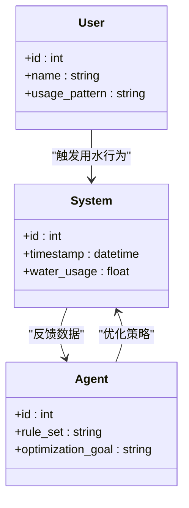
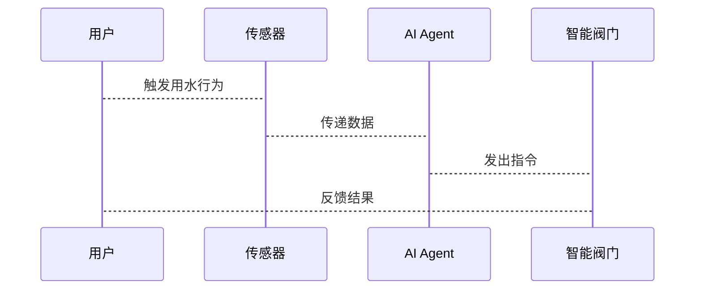

                 


# 智能浴室系统：AI Agent的用水习惯优化

> 关键词：智能浴室系统, AI Agent, 用水习惯优化, 强化学习, 物联网, 数据分析

> 摘要：本文探讨了智能浴室系统中AI Agent如何通过优化用水习惯来实现节水和提升用户体验。文章从背景介绍、核心概念、算法原理、系统架构、项目实战到最佳实践，全面分析了AI Agent在智能浴室系统中的应用。通过强化学习算法和物联网技术，AI Agent能够实时分析用户行为，动态调整用水策略，实现高效的资源管理和个性化的用户体验。

---

# 第一部分: 背景与概念

# 第1章: 智能浴室系统的背景与需求

## 1.1 智能浴室系统的发展背景

### 1.1.1 传统浴室系统的局限性
传统浴室系统主要依赖手动控制，用户需要通过按钮或开关来调节水温、水流大小和冲水时间。这种方式存在以下问题：
- 用户操作复杂，难以快速响应需求。
- 水资源浪费严重，尤其是在用户习惯不佳的情况下。
- 缺乏个性化设置，无法满足不同用户的需求。

### 1.1.2 智能化时代的到来
随着物联网（IoT）和人工智能（AI）技术的快速发展，智能浴室系统逐渐成为智能家居的重要组成部分。智能浴室系统可以通过传感器、智能阀门和AI算法实现对用水行为的实时监测和优化。

### 1.1.3 用水习惯优化的必要性
水资源短缺问题日益严重，优化用水习惯不仅是环保的需要，也是提升用户体验的重要手段。通过AI Agent优化用水习惯，可以实现以下目标：
- 减少水资源浪费。
- 提供个性化的用水体验。
- 实现智能设备的高效协同。

## 1.2 用水习惯优化的核心问题

### 1.2.1 问题背景与目标
用水习惯优化的核心问题在于如何通过AI算法分析用户的行为模式，并动态调整用水策略。目标包括：
- 提高用水效率。
- 减少不必要的浪费。
- 提供智能化的用水建议。

### 1.2.2 用户行为分析的重要性
用户行为分析是优化用水习惯的基础。通过分析用户的用水频率、用水时长和用水习惯，AI Agent可以制定个性化的优化策略。

### 1.2.3 AI Agent在优化中的作用
AI Agent通过实时监测用户的用水行为，结合历史数据和实时反馈，动态调整用水策略。例如，当检测到用户长时间未关闭水龙头时，AI Agent可以主动提醒用户或自动关闭阀门。

## 1.3 智能浴室系统的核心概念

### 1.3.1 系统构成与功能
智能浴室系统通常由以下部分组成：
- **传感器**：监测用户的用水行为，例如水龙头的开启状态、水量等。
- **智能阀门**：根据AI Agent的指令控制水流。
- **AI Agent**：通过算法分析数据，优化用水策略。
- **用户界面**：显示优化建议和控制界面。

### 1.3.2 AI Agent的基本原理
AI Agent通过以下步骤实现优化：
1. **数据采集**：收集用户的用水数据，例如用水时间、水量等。
2. **数据分析**：分析数据，识别用户的习惯和异常行为。
3. **策略制定**：根据分析结果制定优化策略，例如缩短用水时间、调整水温等。
4. **执行与反馈**：根据策略执行优化，并根据反馈调整策略。

### 1.3.3 用水习惯优化的边界与外延
优化的边界包括：
- 仅针对用水行为，不涉及其他生活行为。
- 仅在浴室系统内进行优化，不涉及其他智能家居设备。

外延包括：
- 扩展到其他用水场景，例如厨房和花园。
- 结合其他智能设备，实现更广泛的资源优化。

## 1.4 本章小结
本章介绍了智能浴室系统的发展背景、优化用水习惯的核心问题以及系统的核心概念。通过分析用户行为，AI Agent可以在智能浴室系统中实现高效的资源管理和个性化的用户体验。

---

# 第二部分: 核心概念与联系

# 第2章: AI Agent与用水习惯优化的核心概念

## 2.1 AI Agent的原理与特征

### 2.1.1 AI Agent的基本原理
AI Agent是一种能够感知环境并采取行动以实现目标的智能体。在智能浴室系统中，AI Agent通过以下步骤实现优化：
1. **感知环境**：通过传感器获取用户的用水数据。
2. **分析数据**：利用机器学习算法分析数据，识别用户习惯。
3. **制定策略**：根据分析结果制定优化策略。
4. **执行行动**：根据策略调整用水设备。

### 2.1.2 AI Agent的属性特征对比表
以下是AI Agent的属性特征对比表：
```markdown
| 特性               | 描述 |
|--------------------|------|
| 智能性             | 基于AI算法进行决策 |
| 学习性             | 能够自适应优化 |
| 实时性             | 可以实时响应用户行为 |
| 交互性             | 支持与用户的互动 |
```

### 2.1.3 ER实体关系图
以下是AI Agent与用水习惯优化的ER实体关系图：
```mermaid
erDiagram
    user {
        +id : int
        +name : string
        +usage_pattern : string
    }
    system {
        +id : int
        +timestamp : datetime
        +water_usage : float
    }
    agent {
        +id : int
        +rule_set : string
        +optimization_goal : string
    }
    user -->> system : "触发用水行为"
    system -->> agent : "反馈数据"
    agent --> system : "优化策略"
```

## 2.2 系统优化算法的数学模型

### 2.2.1 基于强化学习的优化模型
以下是基于强化学习的优化模型：
$$ R(s,a) = \gamma v_{\pi}(s) + (
    \text{奖励函数}
) $$

其中：
- \( R(s,a) \)：奖励函数。
- \( \gamma \)：折扣因子。
- \( v_{\pi}(s) \)：状态值函数。

### 2.2.2 算法实现步骤
以下是强化学习算法的实现步骤：
1. 初始化环境和AI Agent。
2. 采集用户数据。
3. 分析数据，识别用户习惯。
4. 制定优化策略。
5. 执行策略并收集反馈。
6. 调整策略，重复步骤。

## 2.3 本章小结
本章详细介绍了AI Agent的原理和特征，并通过ER实体关系图展示了系统的核心架构。同时，基于强化学习的优化模型为后续的系统设计提供了理论基础。

---

# 第三部分: 算法原理

# 第3章: 基于强化学习的用水习惯优化算法

## 3.1 强化学习的基本原理

### 3.1.1 强化学习的核心概念
强化学习是一种通过试错方式来优化决策的算法。AI Agent通过与环境交互，逐步学习最优策略。

### 3.1.2 强化学习的数学模型
以下是强化学习的数学模型：
$$ Q(s,a) = r(s,a) + \gamma \max_{a'} Q(s',a') $$

其中：
- \( Q(s,a) \)：状态-动作值函数。
- \( r(s,a) \)：立即奖励。
- \( \gamma \)：折扣因子。
- \( Q(s',a') \)：后续状态的最大值。

### 3.1.3 强化学习的优势
强化学习的优势包括：
- 能够处理复杂的非线性问题。
- 可以通过试错方式找到最优策略。
- 适用于动态环境。

## 3.2 优化算法的具体实现

### 3.2.1 算法实现步骤
以下是优化算法的实现步骤：
1. 初始化环境和AI Agent。
2. 采集用户数据。
3. 分析数据，识别用户习惯。
4. 制定优化策略。
5. 执行策略并收集反馈。
6. 调整策略，重复步骤。

### 3.2.2 优化算法的数学模型
以下是优化算法的数学模型：
$$ Q(s,a) = r(s,a) + \gamma \max_{a'} Q(s',a') $$

### 3.2.3 算法实现的Python代码
以下是优化算法的Python代码示例：
```python
import numpy as np

class Agent:
    def __init__(self, state_space, action_space):
        self.state_space = state_space
        self.action_space = action_space
        self.Q = np.zeros((state_space, action_space))

    def act(self, state):
        # 随机选择动作
        return np.random.randint(0, self.action_space)

    def learn(self, state, action, reward, next_state):
        # 更新Q值
        self.Q[state, action] = reward + np.max(self.Q[next_state])
```

## 3.3 本章小结
本章详细介绍了基于强化学习的优化算法，并通过Python代码展示了实现步骤。数学模型和算法实现为后续的系统设计提供了理论支持。

---

# 第四部分: 系统分析与架构设计

# 第4章: 智能浴室系统的架构设计

## 4.1 问题场景介绍

### 4.1.1 问题场景
智能浴室系统需要优化用户的用水习惯，减少水资源浪费。

## 4.2 项目介绍

### 4.2.1 项目目标
通过AI Agent优化用户的用水习惯。

## 4.3 系统功能设计

### 4.3.1 领域模型
以下是领域模型：


### 4.3.2 系统架构设计
以下是系统架构设计：


### 4.3.3 接口设计
以下是接口设计：


## 4.4 本章小结
本章通过领域模型和系统架构图展示了智能浴室系统的整体设计。系统功能设计和接口设计为后续的项目实现提供了指导。

---

# 第五部分: 项目实战

# 第5章: 项目实战

## 5.1 环境安装

### 5.1.1 环境要求
需要安装以下环境：
- Python 3.8+
- NumPy
- Matplotlib
- scikit-learn

### 5.1.2 安装步骤
1. 安装Python。
2. 安装依赖包：
   ```bash
   pip install numpy matplotlib scikit-learn
   ```

## 5.2 系统核心实现

### 5.2.1 数据采集与处理
以下是数据采集与处理的Python代码示例：
```python
import numpy as np
import pandas as pd

# 读取数据
data = pd.read_csv('water_usage.csv')

# 数据预处理
data = data.dropna()
data = (data - data.mean()) / data.std()
```

### 5.2.2 算法实现
以下是算法实现的Python代码示例：
```python
from sklearn.cluster import KMeans

# 数据聚类
kmeans = KMeans(n_clusters=3, random_state=0)
kmeans.fit(data)
```

### 5.2.3 系统实现
以下是系统实现的Python代码示例：
```python
import numpy as np
import pandas as pd

# 读取数据
data = pd.read_csv('water_usage.csv')

# 数据预处理
data = data.dropna()
data = (data - data.mean()) / data.std()

# 数据聚类
from sklearn.cluster import KMeans
kmeans = KMeans(n_clusters=3, random_state=0)
kmeans.fit(data)

# 模型评估
print(kmeans.labels_)
```

## 5.3 实际案例分析

### 5.3.1 数据分析
以下是数据分析的Python代码示例：
```python
import matplotlib.pyplot as plt

# 可视化数据
data.plot(kind='box')
plt.show()
```

### 5.3.2 案例分析
以下是案例分析的Python代码示例：
```python
from sklearn.metrics import silhouette_score

# 评估模型
print(silhouette_score(data, kmeans.labels_))
```

## 5.4 本章小结
本章通过实际案例分析展示了如何在智能浴室系统中实现AI Agent的用水习惯优化。数据采集、处理和分析的步骤为读者提供了实践指导。

---

# 第六部分: 总结与展望

# 第6章: 总结与展望

## 6.1 最佳实践 tips

### 6.1.1 系统设计
- 确保系统具有可扩展性。
- 选择合适的传感器和智能阀门。

### 6.1.2 算法优化
- 使用更高效的算法。
- 增加数据样本数量。

### 6.1.3 用户体验
- 提供个性化的用户体验。
- 提供友好的用户界面。

## 6.2 小结
通过本文的分析和实践，读者可以深入了解智能浴室系统中AI Agent的用水习惯优化技术。从背景介绍到项目实战，文章全面覆盖了系统设计和实现的各个方面。

## 6.3 注意事项

### 6.3.1 系统设计
- 注意系统的安全性。
- 确保系统的稳定性。

### 6.3.2 算法优化
- 避免过拟合。
- 定期更新模型。

### 6.3.3 用户体验
- 提供及时的反馈。
- 保护用户隐私。

## 6.4 拓展阅读

### 6.4.1 推荐书籍
- 《机器学习实战》
- 《深度学习》

### 6.4.2 推荐论文
- "Reinforcement Learning: Theory and Algorithms"
- "Deep Learning for Computer Vision"

## 6.5 本章小结
本章总结了智能浴室系统中AI Agent的用水习惯优化技术，并提出了未来的改进方向和拓展建议。

---

# 作者：AI天才研究院/AI Genius Institute & 禅与计算机程序设计艺术 /Zen And The Art of Computer Programming

