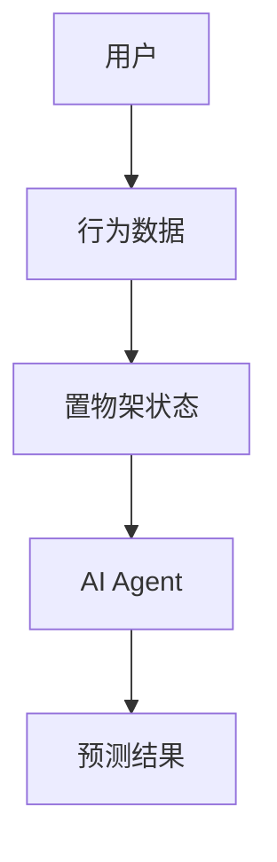
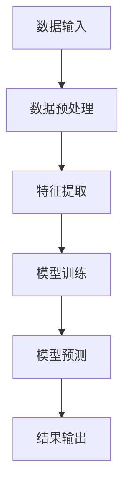
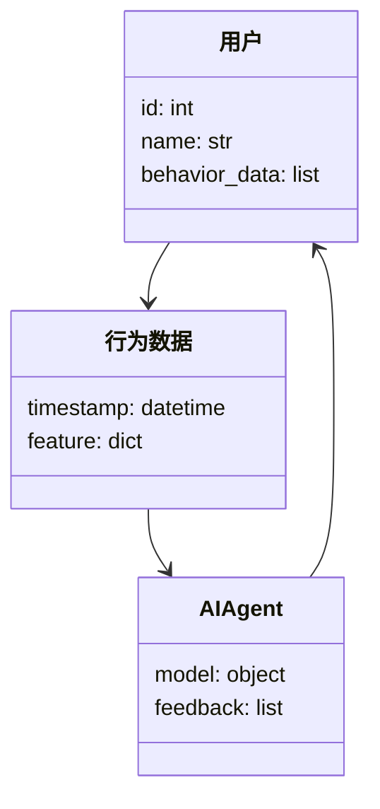
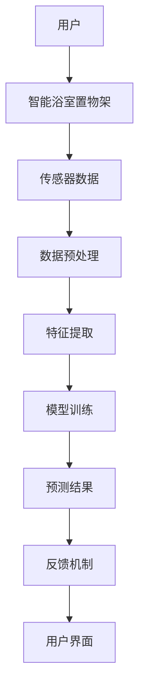
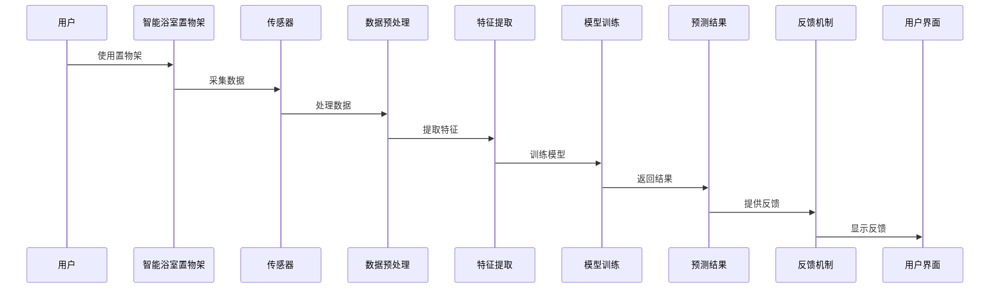

                 


# 智能浴室置物架：AI Agent的个人卫生习惯分析

> 关键词：智能浴室置物架，AI Agent，个人卫生习惯，物联网，数据分析，行为预测

> 摘要：本文通过分析智能浴室置物架的设计与实现，探讨AI Agent在个人卫生习惯分析中的应用。文章从背景、核心概念、算法原理、系统架构到项目实战，全面解析智能浴室置物架的技术实现与实际应用。通过本文，读者可以深入了解如何利用AI技术优化个人卫生习惯，提升智能家居的生活质量。

---

# 第一部分: 智能浴室置物架的背景与核心概念

# 第1章: 问题背景与需求分析

## 1.1 问题背景

### 1.1.1 个人卫生习惯的重要性
个人卫生习惯是健康生活的基石，直接关系到个人的健康状况和生活质量。良好的卫生习惯可以预防疾病，提升生活品质，而不良的卫生习惯可能导致健康问题。因此，如何通过技术手段帮助用户养成良好的卫生习惯，成为一个重要的研究方向。

### 1.1.2 智能家居的发展趋势
智能家居的快速发展为个人卫生习惯的数字化管理提供了可能。随着物联网技术的普及，浴室设备智能化成为趋势。智能浴室置物架作为智能家居的一部分，可以通过传感器和AI技术实现对用户行为的实时监测和分析。

### 1.1.3 智能浴室置物架的市场需求
智能浴室置物架不仅需要满足基本的置物功能，还需要具备智能化的特点，能够通过传感器和AI技术分析用户的卫生习惯，提供个性化的建议和反馈。这种智能化的置物架能够帮助用户更好地管理个人卫生，提升生活质量。

## 1.2 问题描述

### 1.2.1 卫生习惯的数字化需求
传统的卫生习惯管理主要依赖于用户的自我记录和记忆，这种方式存在主观性和不准确性。通过数字化手段，可以更客观、准确地记录和分析用户的卫生习惯，为用户提供科学的管理工具。

### 1.2.2 智能浴室置物架的功能定位
智能浴室置物架不仅是放置物品的工具，更是一个集成传感器、数据采集和AI分析的智能设备。它能够实时监测用户的卫生行为，分析习惯，并提供反馈和建议。

### 1.2.3 用户行为分析的必要性
通过分析用户的卫生行为，可以发现潜在的不良习惯，并及时给予纠正。例如，用户是否定期更换毛巾、是否及时清洁浴室等行为，都可以通过智能置物架进行监测和分析。

## 1.3 问题解决思路

### 1.3.1 AI Agent在个人卫生管理中的应用
AI Agent（智能代理）可以通过传感器数据和用户行为数据，实时分析用户的卫生习惯，并提供个性化的建议和反馈。例如，当用户忘记更换毛巾时，AI Agent可以通过手机App或语音助手提醒用户。

### 1.3.2 智能浴室置物架的设计目标
智能浴室置物架的设计目标是通过集成传感器、数据采集和AI分析技术，实现对用户卫生习惯的实时监测和分析，并提供个性化的管理建议。

### 1.3.3 数据驱动的卫生习惯分析方法
通过收集和分析用户的卫生行为数据，利用数据挖掘和机器学习技术，可以发现用户的卫生习惯模式，并预测未来的卫生行为，从而实现预防和管理。

## 1.4 系统边界与外延

### 1.4.1 系统的功能边界
智能浴室置物架的功能包括：数据采集、行为分析、反馈提醒和数据存储。系统不直接干预用户的实际行为，而是通过数据和反馈影响用户的决策。

### 1.4.2 与智能家居系统的关联
智能浴室置物架可以与智能家居系统集成，例如与智能灯、智能马桶等设备联动。当用户的行为符合健康习惯时，系统可以联动其他设备提供奖励，例如播放音乐或开启灯光。

### 1.4.3 数据隐私与安全的边界
系统必须确保用户数据的隐私和安全。数据采集和分析必须在用户授权下进行，数据存储必须加密，防止数据泄露。

## 1.5 核心概念与系统架构

### 1.5.1 AI Agent的核心要素
AI Agent的核心要素包括：传感器数据采集、数据预处理、行为分析算法、反馈机制和用户界面。

### 1.5.2 物理硬件与传感器的作用
传感器负责采集用户的卫生行为数据，例如毛巾的使用频率、置物架的使用时间等。物理硬件则负责数据的传输和处理。

### 1.5.3 数据分析与行为预测的逻辑
通过数据分析，AI Agent可以识别用户的卫生习惯模式，并预测未来的卫生行为。例如，通过分析用户的毛巾更换频率，预测用户是否需要更换毛巾。

---

# 第2章: 智能浴室置物架的核心概念与联系

## 2.1 核心概念原理

### 2.1.1 AI Agent的基本原理
AI Agent通过传感器数据和用户行为数据，利用机器学习算法进行行为分析，并通过反馈机制影响用户的决策。

### 2.1.2 物联网技术的应用
物联网技术将智能浴室置物架与智能家居系统连接，实现数据的实时采集和传输。

### 2.1.3 数据分析与行为建模
通过对传感器数据和用户行为数据的分析，建立用户行为模型，预测未来的卫生习惯。

## 2.2 核心概念对比分析

### 2.2.1 AI Agent与传统传感器的区别
AI Agent不仅仅是传感器，它还具备数据处理和分析能力，能够主动影响用户的决策。

### 2.2.2 数据分析与行为预测的对比
数据分析是行为预测的基础，而行为预测则是数据分析的延伸。数据分析关注数据的特征提取，而行为预测关注数据的模式识别。

### 2.2.3 物理硬件与软件算法的协同关系
物理硬件负责数据的采集和传输，软件算法负责数据的分析和处理。两者协同工作，才能实现智能浴室置物架的功能。

## 2.3 ER实体关系图



---

# 第3章: 数据采集与特征提取

## 3.1 数据采集方法

### 3.1.1 传感器数据的采集
传感器负责采集用户的卫生行为数据，例如毛巾的使用频率、置物架的使用时间等。

### 3.1.2 用户行为数据的记录
通过传感器和日志记录用户的行为数据，例如用户何时使用置物架、使用频率等。

### 3.1.3 环境数据的获取
环境数据包括浴室的湿度、温度等，这些数据可以帮助分析用户的卫生习惯。

## 3.2 数据预处理

### 3.2.1 数据清洗与标准化
去除异常数据，标准化数据格式，确保数据的准确性和一致性。

### 3.2.2 时间序列数据的处理
对时间序列数据进行平滑处理，去除噪声，提取有用的特征。

### 3.2.3 异常数据的识别与处理
识别异常数据，例如传感器故障或用户异常行为，进行相应的处理。

## 3.3 特征提取

### 3.3.1 基于时间序列的特征提取
提取时间序列数据的特征，例如均值、方差、周期性等。

### 3.3.2 基于频率分析的特征提取
通过频谱分析提取数据的频率特征，例如用户行为的周期性。

### 3.3.3 基于模式识别的特征提取
通过模式识别技术提取数据的模式特征，例如用户的习惯模式。

---

# 第4章: AI Agent的算法原理

## 4.1 算法选择与原理

### 4.1.1 机器学习算法的选择
选择适合的机器学习算法，例如随机森林、支持向量机等，用于分类和回归任务。

### 4.1.2 深度学习算法的适用性
深度学习算法适用于复杂的模式识别任务，例如卷积神经网络用于图像识别。

### 4.1.3 混合模型的优势
混合模型结合了传统机器学习和深度学习的优点，能够处理多种类型的数据。

## 4.2 算法流程图



## 4.3 算法实现

### 4.3.1 数据预处理代码
```python
import pandas as pd

# 读取数据
data = pd.read_csv('behavior.csv')

# 数据清洗
data.dropna(inplace=True)

# 标准化
from sklearn.preprocessing import StandardScaler
scaler = StandardScaler()
data_scaled = scaler.fit_transform(data)
```

### 4.3.2 特征提取代码
```python
from sklearn.feature_selection import SelectKBest
from sklearn.feature_selection import chi2

# 特征选择
selector = SelectKBest(score_func=chi2, k=5)
data_features = selector.fit_transform(data_scaled, labels)
```

### 4.3.3 分类模型代码
```python
from sklearn.ensemble import RandomForestClassifier

# 训练模型
model = RandomForestClassifier()
model.fit(X_train, y_train)

# 预测结果
y_pred = model.predict(X_test)
```

### 4.3.4 行为分析算法
通过分析模型的预测结果，识别用户的卫生习惯模式，例如用户的毛巾更换频率、洗澡时间等。

---

# 第5章: 系统分析与架构设计

## 5.1 问题场景介绍

### 5.1.1 系统场景
智能浴室置物架部署在用户的浴室中，通过传感器和AI技术实现对用户卫生习惯的实时监测和分析。

### 5.1.2 项目介绍
本项目旨在通过智能浴室置物架帮助用户养成良好的卫生习惯，提升生活质量。

## 5.2 系统功能设计

### 5.2.1 领域模型


### 5.2.2 系统架构


### 5.2.3 系统接口设计
系统接口包括传感器数据接口、模型训练接口、用户反馈接口等。

### 5.2.4 系统交互


---

# 第6章: 项目实战

## 6.1 环境安装

### 6.1.1 安装Python
安装Python 3.x版本，确保环境满足项目要求。

### 6.1.2 安装依赖库
安装所需的Python库，例如pandas、scikit-learn、mermaid等。

## 6.2 核心实现

### 6.2.1 数据预处理
```python
import pandas as pd
from sklearn.preprocessing import StandardScaler

data = pd.read_csv('behavior.csv')
data.dropna(inplace=True)
data_scaled = StandardScaler().fit_transform(data)
```

### 6.2.2 特征提取
```python
from sklearn.feature_selection import SelectKBest
from sklearn.feature_selection import chi2

selector = SelectKBest(score_func=chi2, k=5)
data_features = selector.fit_transform(data_scaled, labels)
```

### 6.2.3 模型训练
```python
from sklearn.ensemble import RandomForestClassifier

model = RandomForestClassifier()
model.fit(X_train, y_train)
```

### 6.2.4 反馈机制
通过手机App或语音助手，向用户发送反馈和建议。

## 6.3 应用解读与分析

### 6.3.1 系统实现
智能浴室置物架通过传感器和AI技术，实时监测用户的卫生行为，分析习惯，并提供反馈。

### 6.3.2 实际案例分析
例如，当用户忘记更换毛巾时，系统会通过手机App提醒用户。

### 6.3.3 案例分析
通过实际案例分析，验证系统的有效性和实用性。

## 6.4 项目小结

### 6.4.1 核心功能实现
智能浴室置物架的核心功能包括数据采集、行为分析、反馈提醒和数据存储。

### 6.4.2 技术难点
传感器数据的采集、数据预处理和模型训练是技术难点。

### 6.4.3 项目总结
通过本项目，我们成功实现了智能浴室置物架的功能，验证了AI技术在个人卫生习惯分析中的应用价值。

---

# 第7章: 最佳实践与注意事项

## 7.1 小结

### 7.1.1 核心知识点回顾
回顾本文的核心知识点，包括智能浴室置物架的设计、数据采集、特征提取、算法实现和系统架构。

## 7.2 注意事项

### 7.2.1 数据隐私与安全
确保用户数据的隐私和安全，数据存储必须加密，防止数据泄露。

### 7.2.2 系统稳定性
确保系统的稳定性和可靠性，避免因传感器故障或网络问题导致系统崩溃。

### 7.2.3 用户体验
注重用户体验，确保系统操作简单，反馈及时，提升用户的满意度。

## 7.3 拓展阅读

### 7.3.1 相关技术
进一步学习AI技术、物联网技术、数据挖掘和机器学习的相关知识。

### 7.3.2 实际应用
探索智能浴室置物架在其他领域的应用，例如酒店、健身房等。

---

# 结语

智能浴室置物架通过AI Agent技术，不仅提升了个人卫生习惯的管理效率，还为智能家居的发展提供了新的思路。未来，随着技术的不断进步，智能浴室置物架将更加智能化、个性化，为用户的生活带来更多便利。

---

# 作者：AI天才研究院/AI Genius Institute & 禅与计算机程序设计艺术 /Zen And The Art of Computer Programming

