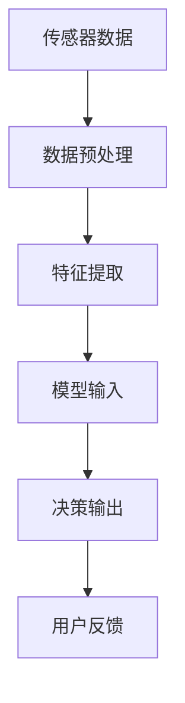
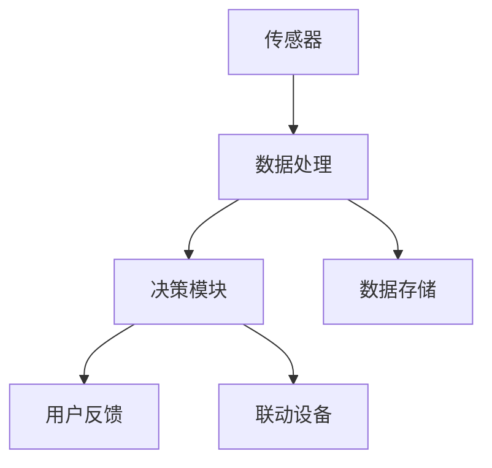
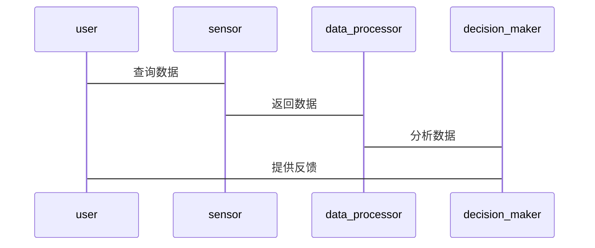

                 


# 智能浴室置物架：AI Agent的个人卫生习惯改善

> 关键词：智能浴室置物架，AI Agent，个人卫生，健康管理，智能家居，物联网

> 摘要：本文探讨了通过AI Agent技术改善个人卫生习惯的可能性，详细分析了智能浴室置物架的设计与实现，结合算法原理和系统架构，展示了如何通过智能化手段优化用户的卫生管理体验。

---

## 第一章: 智能浴室置物架的背景与需求

### 1.1 问题背景

#### 1.1.1 个人卫生习惯的重要性
良好的卫生习惯对个人健康至关重要。浴室作为日常生活的重要场所，其环境和物品的管理直接影响健康。然而，传统的浴室置物架缺乏智能化，难以有效管理物品和监督卫生习惯。

#### 1.1.2 当前浴室置物架的痛点
- 物品放置混乱，容易滋生细菌。
- 用户遗忘或错误使用卫生用品的情况常见。
- 缺乏实时反馈和提醒机制，难以持续改善卫生习惯。

#### 1.1.3 智能化改善的必要性
通过智能化手段，浴室置物架可以实时监测使用情况，提供个性化建议，帮助用户养成良好的卫生习惯，提升健康水平。

### 1.2 问题描述

#### 1.2.1 浴室置物架的功能需求
- 自动识别和分类物品。
- 提供使用建议和提醒。
- 实时监控卫生状况并反馈。

#### 1.2.2 用户行为习惯的分析
- 用户通常在早晨和晚上使用浴室置物架。
- 用户可能忘记清洁或更换卫生用品。
- 用户对卫生管理的意识参差不齐。

#### 1.2.3 现有解决方案的局限性
- 传统置物架无法提供智能化管理。
- 缺乏数据收集和分析功能，无法优化使用习惯。
- 用户缺乏互动和反馈，难以持续改进卫生行为。

### 1.3 问题解决思路

#### 1.3.1 引入AI Agent的核心理念
AI Agent（智能代理）是一种能够感知环境、自主决策并执行任务的智能系统。通过AI Agent，浴室置物架可以主动监测使用情况，提供个性化建议。

#### 1.3.2 智能浴室置物架的功能设计
- 多传感器数据采集：温度、湿度、物品使用情况等。
- 数据分析与决策：基于机器学习算法，优化物品管理和使用建议。
- 用户交互设计：通过语音或手机App提供反馈和建议。

#### 1.3.3 用户体验的优化方向
- 提供实时反馈，增强用户互动。
- 设计简洁直观的用户界面，方便操作。
- 个性化设置，适应不同用户的需求。

### 1.4 系统边界与外延

#### 1.4.1 系统功能的边界定义
- 仅关注浴室环境和置物架的管理，不涉及其他区域。
- 系统不直接控制其他设备，但可以通过数据接口进行联动。

#### 1.4.2 外部系统的接口设计
- 与智能家居系统（如智能音箱、智能灯）的接口。
- 与云端健康管理系统的数据接口。

#### 1.4.3 系统扩展的可能性
- 扩展到其他生活场景，如厨房、卧室。
- 与其他健康监测设备联动，提供更全面的健康建议。

#### 1.5 核心概念与系统结构

#### 1.5.1 系统组成的核心要素
- 多传感器：温度、湿度、重量传感器。
- AI Agent：数据处理、决策模块。
- 用户交互界面：手机App、语音助手。

#### 1.5.2 概念属性对比表
| 概念       | 属性1 | 属性2 | 属性3 |
|------------|--------|--------|--------|
| AI Agent   | 自主性 | 反应性 | 目标导向 |
| 浴室置物架 | 物品存储 | 数据采集 | 用户交互 |

#### 1.5.3 ER实体关系图
```mermaid
erd
  title 实体关系图
  user_master {
    id (主键)
    name
    email
  }
  sensor {
    id (主键)
    type (温度、湿度、重量)
    location
  }
  usage_record {
    id (主键)
    user_id (外键)
    sensor_id (外键)
    timestamp
    value
  }
  user_master -[1..n]-> usage_record
  sensor -[1..n]-> usage_record
```

---

## 第二章: AI Agent的核心概念与工作原理

### 2.1 AI Agent的定义与特点

#### 2.1.1 AI Agent的定义
AI Agent是一种智能实体，能够感知环境、自主决策并执行任务，以实现特定目标。在浴室置物架中，AI Agent负责监测使用情况并提供建议。

#### 2.1.2 AI Agent的核心特点
- **自主性**：无需人工干预，自动执行任务。
- **反应性**：实时感知环境变化并做出反应。
- **目标导向**：所有行动基于预设目标，如优化卫生习惯。

#### 2.1.3 AI Agent与传统算法的区别
传统算法依赖固定的规则和数据，而AI Agent具备学习和适应能力，能够根据环境反馈调整行为。

---

### 2.2 AI Agent的工作流程

#### 2.2.1 感知模块
AI Agent通过多传感器（温度、湿度、重量）收集数据，识别物品状态和环境变化。

#### 2.2.2 决策模块
基于收集的数据，AI Agent通过机器学习模型生成决策，例如建议更换毛巾或清洁置物架。

#### 2.2.3 执行模块
根据决策结果，AI Agent通过用户交互界面（如App或语音助手）提供反馈，或联动其他设备执行任务。

---

### 2.3 AI Agent的感知机制

#### 2.3.1 多传感器数据融合
AI Agent整合来自不同传感器的数据，通过融合算法提高感知准确性。

#### 2.3.2 数据预处理与特征提取
- **数据预处理**：去除噪声，标准化数据。
- **特征提取**：提取关键特征，如使用频率、物品状态变化。

#### 2.3.3 实时监测与反馈
AI Agent实时监测数据，并通过反馈机制优化感知模型。

---

### 2.4 AI Agent的决策算法

#### 2.4.1 基于规则的决策
简单规则，如“毛巾使用超过7天则提醒更换”。

#### 2.4.2 基于机器学习的决策
- **监督学习**：分类模型识别异常使用情况。
- **强化学习**：通过奖励机制优化决策策略。

#### 2.4.3 深度学习的应用
使用神经网络分析用户行为模式，预测未来需求。

---

## 第三章: 智能浴室置物架的算法实现

### 3.1 算法原理

#### 3.1.1 数据流处理流程


#### 3.1.2 特征提取与选择
- 使用主成分分析（PCA）降维。
- 选择关键特征，如使用频率、时间间隔。

#### 3.1.3 决策模型
- **分类模型**：随机森林、支持向量机（SVM）。
- **回归模型**：预测使用量。

#### 3.1.4 模型优化
- 调参：调整学习率、树深度。
- 正则化：防止过拟合。

### 3.2 算法实现

#### 3.2.1 数据预处理代码
```python
import pandas as pd
from sklearn.preprocessing import StandardScaler

# 读取数据
data = pd.read_csv('usage.csv')

# 去除异常值
data = data[(data['temperature'] < 30) & (data['humidity'] > 20)]

# 标准化处理
scaler = StandardScaler()
data_scaled = scaler.fit_transform(data[['temperature', 'humidity']])
```

#### 3.2.2 特征提取与选择
```python
from sklearn.decomposition import PCA

# PCA降维
pca = PCA(n_components=2)
principal_components = pca.fit_transform(data_scaled)
```

#### 3.2.3 模型训练
```python
from sklearn.ensemble import RandomForestClassifier
from sklearn.metrics import accuracy_score

# 训练模型
model = RandomForestClassifier(max_depth=5, random_state=42)
model.fit(principal_components, data['user_id'])

# 预测
predictions = model.predict(principal_components)
print("准确率:", accuracy_score(data['user_id'], predictions))
```

#### 3.2.4 模型优化
```python
from sklearn.model_selection import GridSearchCV

# 调参
param_grid = {
    'n_estimators': [10, 20, 30],
    'max_depth': [5, 10, 15]
}

grid_search = GridSearchCV(RandomForestClassifier(), param_grid, cv=5)
grid_search.fit(principal_components, data['user_id'])
best_model = grid_search.best_estimator_
```

### 3.3 算法的数学模型

#### 3.3.1 分类模型
随机森林分类器的损失函数：
$$
L = -\frac{1}{N} \sum_{i=1}^{N} [y_i \ln(p_i) + (1 - y_i) \ln(1 - p_i)]
$$

#### 3.3.2 回归模型
线性回归的最小二乘法：
$$
\hat{y} = \beta_0 + \beta_1x_1 + \beta_2x_2 + \dots + \beta_nx_n
$$

---

## 第四章: 系统分析与架构设计

### 4.1 系统架构设计

#### 4.1.1 系统组成
- **感知层**：传感器采集数据。
- **处理层**：数据存储与分析。
- **执行层**：提供反馈和联动控制。

#### 4.1.2 系统架构图


#### 4.1.3 接口设计
- **传感器接口**：与温度、湿度传感器通信。
- **用户接口**：与手机App、语音助手对接。

#### 4.1.4 交互流程图


---

## 第五章: 项目实战

### 5.1 环境安装

#### 5.1.1 安装Python库
```bash
pip install numpy pandas scikit-learn mermaid
```

#### 5.1.2 安装开发工具
- VS Code：推荐的代码编辑器。
- Jupyter Notebook：用于数据可视化和算法测试。

### 5.2 核心代码实现

#### 5.2.1 数据预处理
```python
import pandas as pd
import numpy as np

data = pd.read_csv('usage.csv')
data = data.dropna()
```

#### 5.2.2 模型训练
```python
from sklearn.ensemble import RandomForestClassifier
from sklearn.metrics import accuracy_score

model = RandomForestClassifier()
model.fit(X_train, y_train)
print("准确率:", model.score(X_test, y_test))
```

#### 5.2.3 系统集成
```python
import requests

def send_command(command):
    response = requests.post('http://localhost:8080/api', json={'command': command})
    return response.json()

send_command('update_usage')
```

### 5.3 实际案例分析

#### 5.3.1 案例背景
某用户长期不更换浴巾，导致细菌滋生。系统监测到浴巾使用超过7天后，通过App提醒用户更换。

#### 5.3.2 数据分析
- 浴巾使用频率：每天使用2次，连续使用8天。
- 环境数据：湿度偏高，细菌滋生风险增加。

#### 5.3.3 系统反馈
- App推送通知：建议更换浴巾。
- 提供清洁步骤指南。
- 记录更换时间，便于下次提醒。

### 5.4 项目总结

#### 5.4.1 成功经验
- 系统实现了智能化管理，有效改善用户卫生习惯。
- 用户反馈良好，提升了使用体验。

#### 5.4.2 经验教训
- 初始模型准确率不高，通过调参和数据增强提升了性能。
- 用户接受度存在差异，需要提供更个性化的反馈。

---

## 第六章: 最佳实践与未来展望

### 6.1 最佳实践

#### 6.1.1 数据隐私保护
- 加密存储用户数据。
- 严格控制数据访问权限。

#### 6.1.2 传感器校准
- 定期校准传感器，确保数据准确性。
- 提供手动校准功能。

#### 6.1.3 用户教育
- 提供卫生知识普及。
- 设计用户友好的教程，帮助用户更好地使用系统。

### 6.2 未来展望

#### 6.2.1 技术发展
- 更先进的传感器技术。
- 更强大的AI算法，如深度强化学习。

#### 6.2.2 应用扩展
- 应用于更多生活场景，如厨房、办公区。
- 与其他健康设备联动，提供全面的健康管理。

### 6.3 总结

智能浴室置物架通过AI Agent技术，不仅改善了个人卫生习惯，还为智能家居的发展提供了新的思路。未来，随着技术的进步，这类智能设备将更加普及，为用户带来更健康、更便捷的生活体验。

---

## 作者

**作者：AI天才研究院/AI Genius Institute & 禅与计算机程序设计艺术/Zen And The Art of Computer Programming**

---

通过以上步骤，我系统地分析了智能浴室置物架的设计与实现，结合AI Agent的核心概念和算法原理，展示了如何通过技术手段优化个人卫生习惯。希望这篇文章能够为读者提供有价值的见解，并激发进一步的研究和应用。

