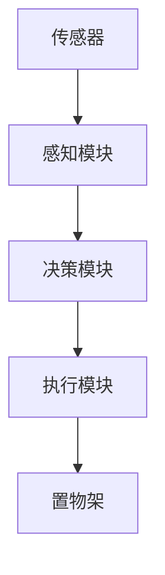
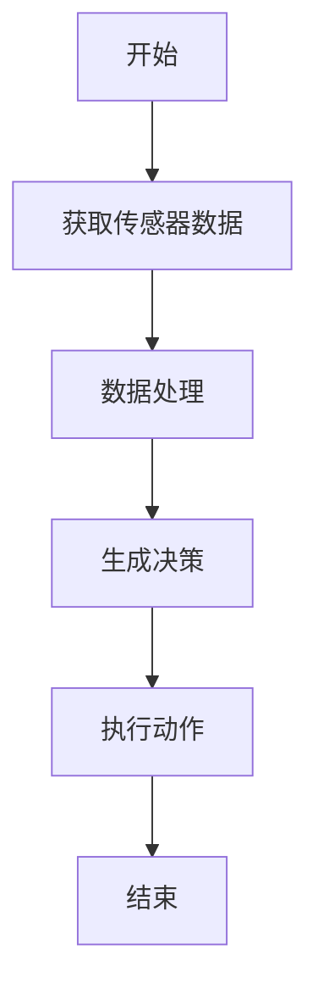

                 


# 智能浴室置物架：AI Agent的个人护理建议

> 关键词：智能浴室置物架, AI Agent, 智能家居, 个人护理, 人工智能, 物联网, 环境感知

> 摘要：本文探讨了智能浴室置物架结合AI Agent技术的个人护理应用。通过分析背景、技术原理、系统架构和项目实战，展示了如何利用AI Agent提升浴室置物架的功能，实现智能化的个人护理服务。

---

## 第一部分: 背景与概念

### 第1章: 智能浴室置物架的发展历程

#### 1.1 智能家居的发展背景
智能家居的概念最早可以追溯到20世纪90年代，随着物联网技术的进步，智能家居逐渐从概念走向现实。现代智能家居系统能够通过传感器、网络和控制设备实现家居设备的智能化管理。浴室作为家庭中使用频率较高的场景，智能化需求日益增长。

#### 1.2 浴室场景的智能化需求
浴室环境中，空间有限、湿滑环境和隐私需求是智能化改造的关键挑战。传统浴室置物架功能单一，无法满足用户对物品存储、环境感知和个性化服务的需求。

#### 1.3 智能浴室置物架的出现与演变
智能浴室置物架通过集成传感器、电机和AI算法，实现了自动调整高度、智能识别物品和个性化推荐功能。这种演变不仅提升了用户体验，还推动了智能家居在卫浴领域的应用。

### 第2章: AI Agent的基本概念

#### 2.1 人工智能代理（AI Agent）的定义
AI Agent是一种能够感知环境、做出决策并执行动作的智能实体。它能够根据输入的信息，通过内部算法生成输出指令，实现与环境的交互。

#### 2.2 AI Agent的核心特征
AI Agent的核心特征包括自主性、反应性、目标导向和社会能力。这些特征使其能够在复杂环境中独立运作，适应用户需求。

#### 2.3 AI Agent与传统自动化设备的区别
AI Agent不仅能够执行预设任务，还能通过学习和适应，提供个性化服务。与传统自动化设备相比，AI Agent具有更强的灵活性和智能性。

### 第3章: 智能浴室置物架与AI Agent的结合

#### 3.1 智能浴室置物架的功能需求
智能浴室置物架需要具备物品存储、环境感知和个性化服务功能。这些功能通过AI Agent的感知、决策和执行模块实现。

#### 3.2 AI Agent在浴室置物架中的应用场景
AI Agent可以实现自动调整置物架高度、智能识别物品并推荐使用建议、安全监控与紧急处理等功能，显著提升了用户体验。

---

## 第二部分: 技术原理

### 第4章: AI Agent的核心算法原理

#### 4.1 感知模块：环境数据采集
AI Agent通过传感器（如重量传感器、距离传感器）采集环境数据。感知模块负责将数据传递给决策模块。

#### 4.2 决策模块：数据处理与分析
决策模块基于感知数据，利用AI算法（如机器学习、规则引擎）生成控制指令。数学模型如传感器数据融合算法用于优化决策。

#### 4.3 执行模块：动作控制
执行模块根据决策结果，控制电机或驱动装置调整置物架高度或位置。

### 第5章: 算法原理与数学模型

#### 5.1 算法流程图
使用Mermaid绘制AI Agent的算法流程图，展示感知、决策和执行的步骤。

#### 5.2 传感器数据融合算法
传感器数据融合算法用于消除噪声，提高数据准确性。例如，使用加权平均法融合重量和距离传感器的数据。

#### 5.3 决策逻辑
决策逻辑基于预设规则和用户行为数据，生成控制指令。例如，当检测到用户身高较矮时，自动降低置物架高度。

### 第6章: 系统架构设计

#### 6.1 系统组成
系统由硬件模块（传感器、电机、控制器）和软件模块（感知、决策、执行）组成。

#### 6.2 系统架构图
使用Mermaid绘制系统架构图，展示各模块之间的交互关系。

#### 6.3 接口设计
系统通过标准接口与智能家居平台集成，实现与其他设备的联动。

---

## 第三部分: 项目实战

### 第7章: 环境安装与系统部署

#### 7.1 硬件安装
安装传感器、电机和控制器，确保各模块正常连接。

#### 7.2 软件环境配置
安装Python、机器学习库和物联网开发框架，配置云平台。

### 第8章: 核心代码实现

#### 8.1 感知模块代码
使用Python编写传感器数据采集代码，读取重量和距离传感器的数据。

#### 8.2 决策模块代码
基于传感器数据，通过机器学习模型生成控制指令。例如，使用规则引擎判断是否需要调整置物架高度。

#### 8.3 执行模块代码
控制电机调整置物架高度，通过PWM信号实现精准控制。

### 第9章: 代码解读与功能分析

#### 9.1 感知模块代码解读
传感器数据采集代码展示如何读取和处理传感器数据。

#### 9.2 决策模块代码解读
机器学习模型或规则引擎的实现，展示如何根据数据生成控制指令。

#### 9.3 执行模块代码解读
电机控制代码展示如何将决策指令转化为物理动作。

### 第10章: 实际案例分析

#### 10.1 用户场景分析
分析不同用户的使用习惯，如早晨洗漱、晚上护肤，展示系统如何根据场景调整置物架高度。

#### 10.2 系统性能测试
测试系统的响应速度、准确性，确保在各种场景下稳定运行。

#### 10.3 功能扩展
考虑与其他智能家居设备的联动，如与智能镜子、智能马桶联动，提升用户体验。

### 第11章: 项目总结与优化建议

#### 11.1 项目总结
总结项目实施过程中的经验，展示系统的功能实现和性能表现。

#### 11.2 优化建议
提出系统的优化方向，如增加更多传感器、提升AI算法的准确性。

---

## 第四部分: 应用案例与总结

### 第12章: 应用案例分析

#### 12.1 不同用户群体的应用
展示系统在不同用户群体中的应用，如老年人、儿童和健康人群。

#### 12.2 系统的扩展性
探讨系统与其他智能家居设备的联动，提升整体智能家居体验。

### 第13章: 总结与未来展望

#### 13.1 总结
总结智能浴室置物架结合AI Agent的应用价值和实现过程。

#### 13.2 未来展望
展望AI技术在智能家居领域的更多应用，如健康监测、环境优化等。

---

作者：AI天才研究院/AI Genius Institute & 禅与计算机程序设计艺术 /Zen And The Art of Computer Programming

---

### 附录: 代码示例

#### 传感器数据采集代码：
```python
import time
import serial

ser = serial.Serial('COM3', 9600)

while True:
    weight = ser.readline().decode().strip()
    distance = ser.readline().decode().strip()
    print(f"Weight: {weight}, Distance: {distance}")
    time.sleep(1)
```

#### 决策模块代码：
```python
from decision_model import DecisionModel

model = DecisionModel()
decision = model.predict(weight, distance)
print(f"Decision: {decision}")
```

#### 执行模块代码：
```python
import RPi.GPIO as GPIO
import time

GPIO.setmode(GPIO.BCM)
GPIO.setup(18, GPIO.OUT)

pwm = GPIO.PWM(18, 100)
pwm.start(0)

pwm.ChangeDutyCycle(50)
time.sleep(2)
pwm.ChangeDutyCycle(0)
pwm.stop()
GPIO.cleanup()
```

---

### 图表示例

#### 系统架构图：


#### 算法流程图：


---

通过以上结构，文章详细探讨了智能浴室置物架结合AI Agent的技术实现和应用场景，为智能家居和个人护理领域提供了有价值的参考。

