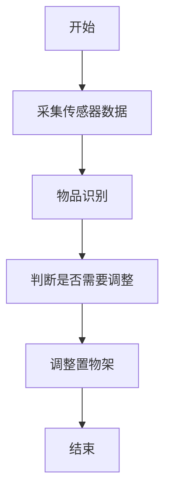
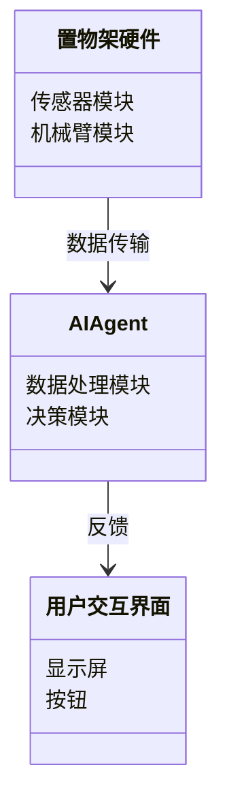

                 


# 智能浴室置物架：AI Agent的洗护用品管理

> 关键词：智能浴室置物架, AI Agent, 洗护用品管理, 物品识别, 智能推荐, 传感器技术

> 摘要：本文深入探讨了如何利用AI Agent技术实现智能浴室置物架的洗护用品管理。通过分析问题背景，提出AI Agent在空间优化和用户便利性方面的解决方案，详细介绍了系统架构、算法原理和实现细节，并通过实际案例展示了系统的应用价值。

---

# 第一章: 背景介绍

## 1.1 智能浴室置物架的发展背景
### 1.1.1 智能家居的发展趋势
智能家居的普及推动了浴室设备的智能化，AI Agent技术的应用使其更具交互性和自动化能力。

### 1.1.2 浴室空间管理的痛点
传统浴室置物架存在空间浪费、管理混乱等问题，用户对智能化管理的需求日益增加。

### 1.1.3 AI Agent技术的引入
AI Agent通过感知和决策能力，优化洗护用品管理，提升用户体验。

## 1.2 问题背景与问题描述
### 1.2.1 浴室洗护用品管理的常见问题
空间利用率低、用品过期未提醒、管理不便等。

### 1.2.2 空间利用率低的现状
传统置物架设计不合理，导致空间浪费。

### 1.2.3 用户需求与痛点分析
用户希望实现洗护用品的智能化管理，提升使用体验和效率。

## 1.3 AI Agent在洗护用品管理中的作用
### 1.3.1 AI Agent的核心功能
感知环境、识别物品、智能推荐、提醒维护等。

### 1.3.2 AI Agent如何解决浴室空间管理问题
通过优化物品存储和推荐使用顺序，提高空间利用率和用户便利性。

### 1.3.3 AI Agent的边界与外延
定义AI Agent的功能边界，明确其与其他系统的协作关系。

---

# 第二章: 核心概念与系统架构

## 2.1 AI Agent的基本原理
### 2.1.1 AI Agent的定义与特点
智能体具备感知和决策能力，能够与环境交互。

### 2.1.2 AI Agent的感知与决策能力
通过传感器获取信息，结合算法进行分析和决策。

### 2.1.3 AI Agent与传统自动化设备的区别
AI Agent具备学习和自适应能力，能够处理复杂任务。

## 2.2 智能浴室置物架的系统构成
### 2.2.1 置物架的硬件结构
传感器模块、机械臂、显示屏等硬件设备。

### 2.2.2 置物架的软件架构
数据采集、物品识别、智能推荐等软件模块。

### 2.2.3 置物架的核心功能模块
物品识别、库存管理、智能推荐、用户交互等。

## 2.3 AI Agent与智能浴室置物架的关系
### 2.3.1 AI Agent在置物架中的角色
作为系统的智能核心，处理数据并控制硬件设备。

### 2.3.2 置物架与AI Agent的交互流程
传感器数据采集 → AI Agent分析 → 系统反馈执行。

### 2.3.3 置物架系统的核心要素组成
硬件设备、AI算法、用户交互界面。

---

# 第三章: 核心概念对比与ER实体关系图

## 3.1 核心概念对比分析
| 概念       | 定义                                                                 | 属性                     | 示例                         |
|------------|----------------------------------------------------------------------|--------------------------|------------------------------|
| AI Agent   | 具备感知和决策能力的智能体                                     | 感知能力、决策能力、学习能力 | 智能音箱、智能助手           |
| 智能置物架 | 集成AI Agent的智能设备，用于优化浴室洗护用品管理               | 物品识别、智能推荐、交互性  | 智能浴室置物架             |

## 3.2 ER实体关系图
```mermaid
er
  actor(用户) 
  item(物品) 
  sensor(传感器) 
  shelf(置物架)
  
  用户 --> 传感器: 使用
  物品 --> 置物架: 存储
  传感器 --> AI Agent: 采集数据
  AI Agent --> 置物架: 控制
```

---

# 第四章: 算法原理讲解

## 4.1 算法流程图


## 4.2 算法数学模型
传感器数据通过分类算法进行处理：
$$
y = f(x) = \sum_{i=1}^{n} w_i x_i + b
$$
其中，$x_i$为输入特征，$w_i$为权重，$b$为偏置。

---

# 第五章: 系统分析与架构设计

## 5.1 系统功能设计
### 5.1.1 物品识别模块
使用图像识别技术，识别洗护用品种类和数量。

### 5.1.2 库存管理模块
记录物品使用情况，提醒补充。

## 5.2 系统架构设计


## 5.3 接口设计
- 传感器接口：接收环境数据。
- 用户交互接口：显示状态和操作按钮。

---

# 第六章: 项目实战

## 6.1 环境安装
安装Python、TensorFlow、OpenCV等开发工具。

## 6.2 核心代码实现
```python
import tensorflow as tf
from keras.models import Sequential
from keras.layers import Dense

# 加载数据
data = ...

# 模型训练
model = Sequential()
model.add(Dense(64, activation='relu', input_dim=64))
model.add(Dense(10, activation='softmax'))
model.compile(optimizer='adam', loss='sparse_categorical_crossentropy', metrics=['accuracy'])
model.fit(data, labels, epochs=10, batch_size=32)
```

## 6.3 代码解读与分析
模型训练用于物品分类，机械臂根据AI Agent的决策进行调整。

## 6.4 实际案例分析
通过实际案例展示系统如何优化物品存储和推荐使用顺序。

---

# 第七章: 总结与展望

## 7.1 最佳实践 tips
定期更新模型，确保传感器精度。

## 7.2 小结
AI Agent技术有效提升了浴室置物架的智能化水平，优化了用户体验。

## 7.3 注意事项
注意数据隐私，确保系统安全。

## 7.4 拓展阅读
推荐相关技术书籍和论文。

---

作者：AI天才研究院 & 禅与计算机程序设计艺术

