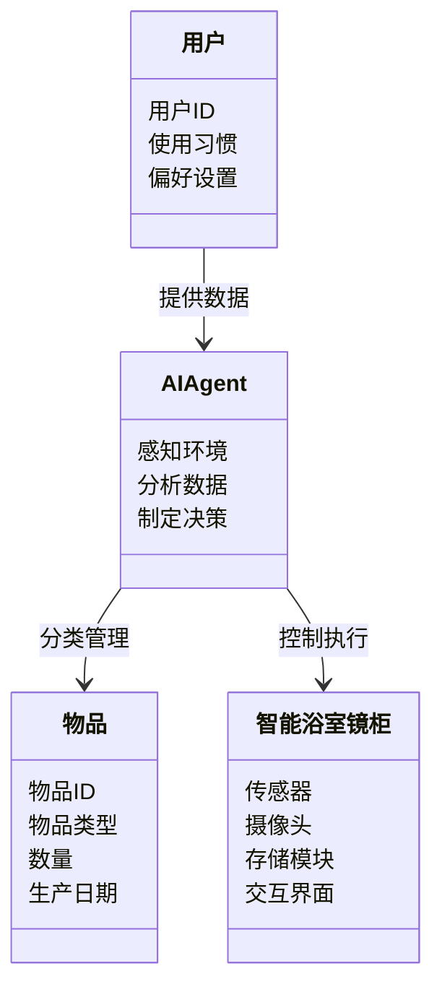
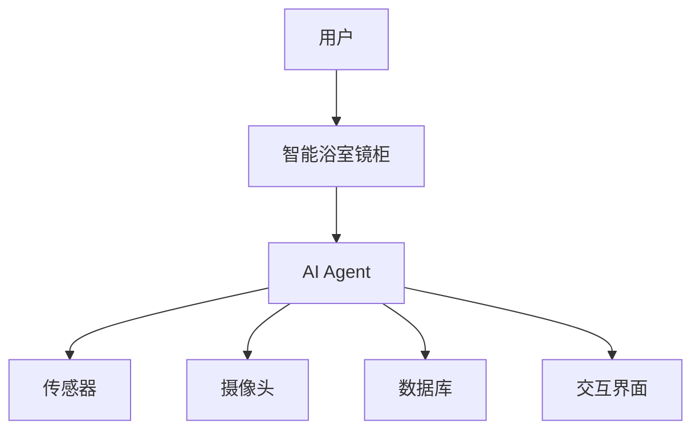
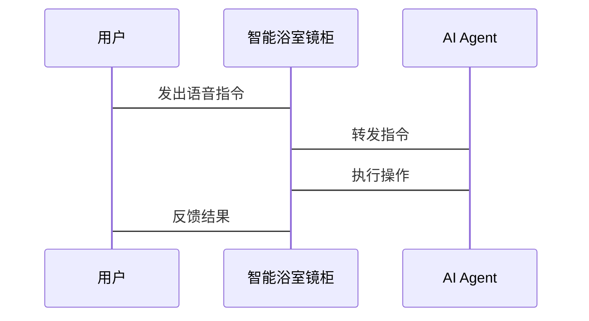

                 


# 智能浴室镜柜：AI Agent的个人护理用品管理

> 关键词：智能浴室镜柜、AI Agent、个人护理用品、物联网、智能管理

> 摘要：本文详细探讨了AI Agent在智能浴室镜柜中的应用，分析了其在个人护理用品管理中的作用，从背景、核心概念、算法原理到系统架构、项目实战和最佳实践，层层剖析，全面解读智能浴室镜柜的技术实现与应用价值。

---

## 第一部分：智能浴室镜柜与AI Agent的背景与概念

### 第1章：智能浴室镜柜的背景与问题背景

#### 1.1 问题背景
##### 1.1.1 传统浴室镜柜的痛点
传统浴室镜柜在设计和功能上存在诸多痛点，例如：
- **空间利用低效**：浴室镜柜通常仅用于存储少量物品，空间利用率不高。
- **物品管理复杂**：个人护理用品种类繁多，传统镜柜缺乏智能化管理功能，导致物品查找和管理效率低下。
- **用户行为习惯未被优化**：传统镜柜无法根据用户的使用习惯提供个性化的存储和管理建议。

##### 1.1.2 个人护理用品管理的难点
- **物品分类与识别**：不同类型的护理用品（如化妆品、牙膏、剃须刀等）需要精准识别和分类。
- **库存管理**：需要实时跟踪物品的库存状态，避免过期或遗漏。
- **用户行为分析**：需要根据用户的使用习惯优化存储和推荐。

##### 1.1.3 智能化管理的需求
- **智能化存储**：通过传感器和AI技术实现智能分类和存储。
- **实时反馈与建议**：AI Agent可以根据用户的使用习惯提供个性化的建议。
- **高效交互**：通过语音或视觉交互提升用户体验。

#### 1.2 问题描述
##### 1.2.1 个人护理用品管理的复杂性
- **物品多样性**：个人护理用品种类繁多，管理复杂。
- **使用场景多样化**：浴室环境潮湿、空间有限，增加了管理的难度。

##### 1.2.2 浴室空间利用的低效性
- **空间浪费**：传统镜柜无法充分利用浴室空间。
- **存储效率低下**：物品查找和存储效率不高，影响用户体验。

##### 1.2.3 用户行为习惯的多样性
- **个性化需求**：不同用户有不同的使用习惯和偏好。
- **动态变化**：用户的使用习惯会随时间变化，需要系统动态调整。

#### 1.3 问题解决
##### 1.3.1 AI Agent的引入
AI Agent（人工智能代理）是一种能够感知环境并自主决策的智能体，能够通过传感器和算法实现对环境的感知和控制。

##### 1.3.2 智能浴室镜柜的设计目标
- **智能化存储与管理**：通过AI技术实现物品的智能分类和存储。
- **高效交互**：提供语音或视觉交互方式，提升用户体验。
- **个性化服务**：根据用户的使用习惯提供个性化建议。

##### 1.3.3 解决方案的可行性分析
- **技术可行性**：AI技术近年来发展迅速，传感器和物联网技术已较为成熟，能够支持智能浴室镜柜的实现。
- **市场可行性**：随着智能家居的普及，智能浴室镜柜有较大的市场潜力。
- **用户接受度**：通过提升用户体验，逐步培养用户的使用习惯，提高市场接受度。

#### 1.4 边界与外延
##### 1.4.1 系统的边界定义
- **物理边界**：智能浴室镜柜的硬件设备，包括镜子、传感器、摄像头等。
- **功能边界**：AI Agent的核心功能，包括物品识别、库存管理、用户行为分析等。

##### 1.4.2 功能的外延范围
- **外延功能**：未来可能扩展的功能，如健康监测、环境监测等。
- **交互方式**：除了语音和视觉交互，可能引入其他交互方式，如手势识别。

##### 1.4.3 与其他系统的接口关系
- **智能家居系统**：与智能家居中枢（如智能音箱、智能灯泡）联动。
- **云服务**：通过云服务实现数据的存储与共享。
- **第三方应用**：与其他健康类应用（如健康APP）数据互通。

#### 1.5 核心概念与组成
##### 1.5.1 AI Agent的核心要素
- **感知能力**：通过传感器和摄像头感知环境。
- **决策能力**：基于感知数据做出决策。
- **执行能力**：通过执行机构完成任务。

##### 1.5.2 智能浴室镜柜的组成部分
- **硬件部分**：镜子、传感器、摄像头、存储模块。
- **软件部分**：AI算法、数据库、交互界面。
- **网络部分**：Wi-Fi、蓝牙等无线通信模块。

##### 1.5.3 系统的交互流程
1. **用户触发**：用户通过语音或手势等方式触发系统。
2. **感知环境**：系统通过传感器和摄像头感知环境。
3. **数据处理**：AI Agent对数据进行分析和处理。
4. **决策与反馈**：系统根据分析结果做出决策，并通过交互界面反馈给用户。

---

### 第2章：AI Agent与智能浴室镜柜的核心概念

#### 2.1 AI Agent的定义与特点
##### 2.1.1 AI Agent的基本定义
AI Agent是一种能够感知环境并自主决策的智能体，能够根据任务需求采取行动以实现目标。

##### 2.1.2 AI Agent的核心特点
- **自主性**：能够在没有外部干预的情况下自主运行。
- **反应性**：能够实时感知环境并做出反应。
- **目标导向**：所有行为都以实现特定目标为导向。

##### 2.1.3 AI Agent与传统软件的区别
- **传统软件**：基于规则的被动响应。
- **AI Agent**：基于感知的主动决策。

#### 2.2 智能浴室镜柜的功能模块
##### 2.2.1 物品识别与分类模块
- **功能**：通过摄像头和图像识别技术识别物品，并根据类别进行分类。
- **实现方式**：基于卷积神经网络（CNN）的图像分类算法。

##### 2.2.2 库存管理模块
- **功能**：实时跟踪物品的库存状态，提醒用户补充或更换。
- **实现方式**：通过传感器和数据库实现库存的动态管理。

##### 2.2.3 用户行为分析模块
- **功能**：分析用户的使用习惯，提供个性化的存储和使用建议。
- **实现方式**：通过机器学习算法分析用户行为数据。

#### 2.3 AI Agent与智能浴室镜柜的关联
##### 2.3.1 AI Agent在智能镜柜中的角色
- **数据处理**：负责对传感器和摄像头获取的数据进行处理。
- **决策制定**：根据处理后的数据制定存储和管理策略。
- **用户交互**：通过交互界面与用户进行实时反馈。

##### 2.3.2 AI Agent的核心功能与任务
- **物品识别**：通过图像识别技术识别物品类型。
- **库存管理**：动态更新库存信息，提醒用户补充或更换。
- **行为分析**：分析用户的使用习惯，优化存储策略。

##### 2.3.3 AI Agent与用户交互的方式
- **语音交互**：通过语音识别技术实现用户的语音指令。
- **视觉交互**：通过摄像头和图像识别技术实现视觉交互。
- **触觉交互**：通过触摸屏或按钮实现用户触控指令。

#### 2.4 核心概念对比表
| 概念 | 定义 | 特点 | 示例 |
|------|------|------|------|
| AI Agent | 人工智能代理 | 能够感知环境并自主决策 | 自然语言处理、图像识别 |
| 智能浴室镜柜 | 带有AI Agent的智能设备 | 集成传感器、摄像头、AI算法 | 物品识别、库存管理 |

#### 2.5 ER实体关系图

```mermaid
er
  actor: 用户
  mirror_cabinet: 智能浴室镜柜
  item: 个人护理用品
  agent: AI Agent
  relation: 管理
  actor --> mirror_cabinet: 使用
  mirror_cabinet --> agent: 集成
  agent --> item: 识别
  mirror_cabinet --> item: 存储
```

---

### 第3章：AI Agent的算法原理与数学模型

#### 3.1 算法原理
##### 3.1.1 自然语言处理（NLP）算法
- **功能**：通过语音交互理解用户的意图。
- **实现方式**：基于Transformer的模型（如BERT）进行文本理解和生成。

##### 3.1.2 图像识别算法
- **功能**：通过摄像头识别物品类型。
- **实现方式**：基于卷积神经网络（CNN）的图像分类算法。

##### 3.1.3 机器学习算法
- **功能**：分析用户的使用习惯，优化存储策略。
- **实现方式**：基于随机森林或支持向量机（SVM）的分类算法。

#### 3.2 算法流程
##### 3.2.1 自然语言处理流程
1. **语音输入**：用户通过语音输入指令。
2. **语音识别**：将语音转换为文本。
3. **语义理解**：理解文本的语义。
4. **生成回复**：根据理解生成回复。

##### 3.2.2 图像识别流程
1. **图像采集**：摄像头采集物品图像。
2. **图像预处理**：对图像进行增强和归一化处理。
3. **特征提取**：提取图像的特征。
4. **分类识别**：基于CNN进行分类识别。

#### 3.3 数学模型
##### 3.3.1 概率模型
- **贝叶斯定理**：用于分类任务中的概率计算。
  $$ P(y|x) = \frac{P(x|y)P(y)}{P(x)} $$
  
##### 3.3.2 分类模型
- **支持向量机（SVM）**：用于分类任务。
  $$ \text{目标函数}：\min_{w,b} \frac{1}{2}\|w\|^2 + C \sum_{i=1}^n \xi_i $$
  
##### 3.3.3 回归模型
- **线性回归**：用于预测任务。
  $$ y = wx + b $$

---

## 第四部分：系统分析与架构设计

### 第4章：系统分析与架构设计

#### 4.1 项目介绍
- **项目名称**：智能浴室镜柜AI Agent管理系统。
- **项目目标**：通过AI技术实现智能存储与管理，提升用户体验。

#### 4.2 系统功能设计
##### 4.2.1 领域模型类图



#### 4.3 系统架构设计
##### 4.3.1 系统架构图



#### 4.4 系统接口设计
##### 4.4.1 系统接口
- **传感器接口**：与温度、湿度等传感器连接。
- **摄像头接口**：与摄像头连接，用于图像采集。
- **交互界面接口**：与语音助手、触摸屏等交互设备连接。

##### 4.4.2 交互流程图



---

## 第五部分：项目实战

### 第5章：项目实战

#### 5.1 环境安装
- **Python环境**：安装Python 3.8及以上版本。
- **AI框架**：安装TensorFlow或PyTorch框架。
- **传感器与摄像头**：安装相应的硬件驱动和SDK。

#### 5.2 核心代码实现
##### 5.2.1 物品识别代码
```python
import tensorflow as tf
from tensorflow.keras import layers

# 加载预训练模型
model = tf.keras.applications.VGG16(weights='imagenet', include_top=False)

# 定义图像处理函数
def process_image(image_path):
    image = tf.keras.preprocessing.image.load_img(image_path, target_size=(224, 224))
    image = tf.keras.preprocessing.image.img_to_array(image)
    image = tf.keras.applications.vgg16.preprocess_input(image)
    return image

# 预测物品类型
def predict_item(image_path):
    image = process_image(image_path)
    features = model.predict(tf.expand_dims(image, axis=0))
    return features
```

##### 5.2.2 库存管理代码
```python
import sqlite3

# 数据库初始化
conn = sqlite3.connect('inventory.db')
cursor = conn.cursor()

# 创建物品表
cursor.execute('''CREATE TABLE items
              (item_id INTEGER PRIMARY KEY AUTOINCREMENT,
               item_type TEXT,
               quantity INTEGER,
               production_date TEXT)''')

# 插入数据
cursor.execute('''INSERT INTO items(item_type, quantity, production_date)
              VALUES('牙膏', 2, '2023-10-01')''')
conn.commit()

# 查询数据
cursor.execute('SELECT * FROM items')
for row in cursor.fetchall():
    print(row)
```

##### 5.2.3 用户行为分析代码
```python
import pandas as pd
from sklearn.tree import DecisionTreeClassifier

# 数据预处理
data = pd.read_csv('user_behavior.csv')
X = data.drop('target', axis=1)
y = data['target']

# 训练模型
model = DecisionTreeClassifier()
model.fit(X, y)

# 预测用户行为
new_user = [[25, '早晨', '牙膏']]
predicted = model.predict(new_user)
print(predicted)
```

#### 5.3 案例分析
##### 5.3.1 物品识别案例
- **输入**：用户放置牙膏在镜柜上。
- **处理**：摄像头采集图像，AI Agent通过图像识别算法识别出牙膏类型。
- **输出**：系统记录牙膏库存，提醒用户牙膏即将用完。

##### 5.3.2 库存管理案例
- **输入**：用户使用完一瓶洗面奶。
- **处理**：系统自动更新库存，提醒用户补充洗面奶。
- **输出**：通过语音提示用户补充洗面奶。

##### 5.3.3 用户行为分析案例
- **输入**：用户每天早晨使用牙膏和洗面奶。
- **处理**：AI Agent分析用户的使用习惯，优化存储位置。
- **输出**：系统建议用户将常用物品放置在易取位置。

#### 5.4 项目小结
- **实现成果**：成功实现了物品识别、库存管理和用户行为分析功能。
- **系统优势**：通过AI Agent实现了智能化管理，提升了用户体验。
- **改进建议**：未来可以进一步优化算法，提升系统的响应速度和准确性。

---

## 第六部分：最佳实践

### 第6章：最佳实践

#### 6.1 小结
- **系统概述**：本文详细介绍了AI Agent在智能浴室镜柜中的应用，从背景、核心概念到算法原理、系统架构和项目实战，层层剖析，全面解读了智能浴室镜柜的技术实现与应用价值。
- **技术总结**：通过AI Agent实现智能管理，提升了浴室镜柜的功能和用户体验。

#### 6.2 注意事项
- **数据隐私**：用户数据的安全性和隐私保护至关重要。
- **系统稳定性**：确保系统的稳定运行，避免因故障导致数据丢失。
- **用户体验**：注重用户体验设计，提升用户满意度。

#### 6.3 拓展阅读
- **推荐书籍**：《人工智能：一种现代方法》、《深度学习入门：基于Python和TensorFlow》。
- **推荐博客**：AI领域的技术博客、物联网相关的技术博客。

---

## 作者：AI天才研究院 & 禅与计算机程序设计艺术

