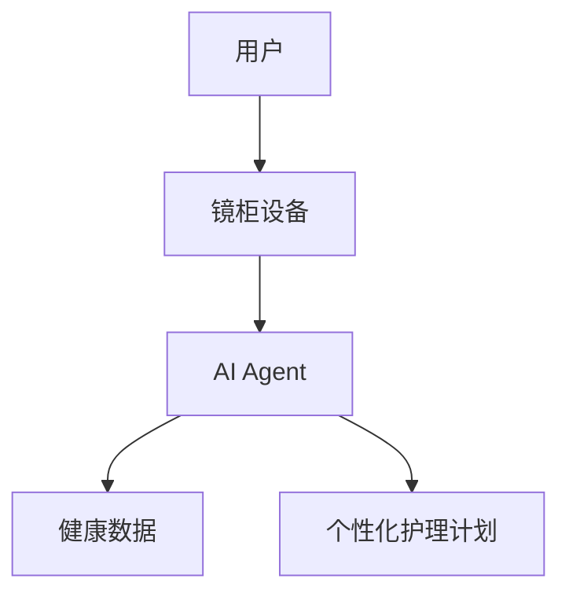
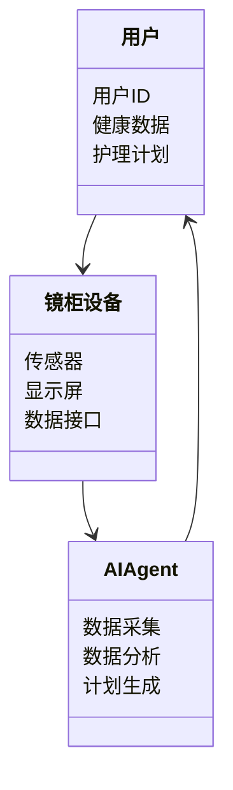
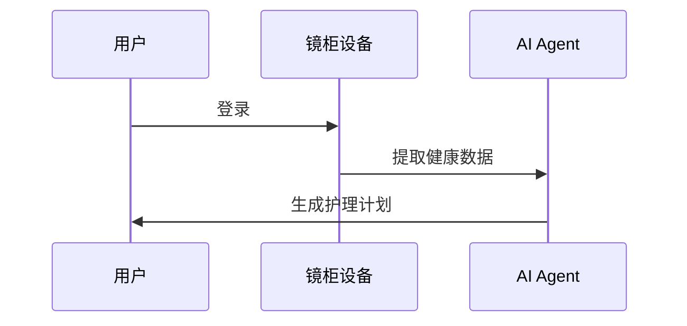

                 


# 智能浴室镜柜：AI Agent的个人护理计划制定

## 关键词：
智能浴室镜柜, AI Agent, 个人护理计划, 人工智能, 健康监测, 个性化护理

## 摘要：
本文详细探讨了智能浴室镜柜中AI Agent在个人护理计划制定中的应用。通过分析AI Agent的核心概念、算法原理、系统架构以及实际案例，本文揭示了如何通过智能化技术提升个人健康护理的效率与精准度。文章内容涵盖从背景介绍到系统实现的全过程，帮助读者全面理解智能浴室镜柜的技术与应用。

---

# 第一部分: 智能浴室镜柜与AI Agent的背景介绍

## 第1章: 智能浴室镜柜的发展历程

### 1.1 传统浴室镜柜的功能与局限
传统的浴室镜柜主要用于存储洗漱用品和提供基础的镜子功能。然而，随着人们对健康管理和个性化护理需求的增加，传统镜柜的功能逐渐显得不足。

### 1.2 智能化技术的引入与发展
近年来，智能化技术的引入使得浴室镜柜的功能得到了极大的扩展。通过集成AI技术，镜柜能够实现健康监测、个性化护理建议和数据管理等功能。

### 1.3 当前市场现状与未来趋势
当前，智能浴室镜柜市场正在快速增长，主要品牌纷纷推出结合AI技术的产品。未来，随着AI技术的进一步发展，智能浴室镜柜将更加智能化和个性化。

---

## 第2章: AI Agent的基本概念与核心功能

### 2.1 AI Agent的定义与特点
AI Agent（人工智能代理）是一种能够感知环境、自主决策并执行任务的智能实体。其核心特点包括自主性、反应性、目标导向和学习能力。

### 2.2 AI Agent在智能浴室镜柜中的应用
AI Agent在智能浴室镜柜中的主要应用包括健康数据监测、个性化护理计划制定和用户交互优化。

### 2.3 AI Agent的核心功能
AI Agent的核心功能包括数据采集与分析、个性化建议生成和动态调整。

---

## 第3章: 智能浴室镜柜的AI Agent应用场景

### 3.1 个人健康数据监测
AI Agent通过集成传感器和摄像头，实时监测用户的健康数据，包括心率、体温和皮肤状况等。

### 3.2 个性化护理计划制定
基于用户的健康数据和生活习惯，AI Agent能够制定个性化的护理计划，包括护肤建议和健康提醒。

### 3.3 健康数据的隐私保护与安全
AI Agent需要确保用户数据的隐私和安全，采用加密技术和数据访问控制。

---

# 第二部分: AI Agent的核心概念与技术原理

## 第4章: AI Agent的核心概念与原理

### 4.1 AI Agent的基本原理
AI Agent通过感知环境、分析数据、制定决策和执行任务来实现智能化功能。

### 4.2 AI Agent的核心技术
AI Agent的核心技术包括自然语言处理（NLP）、机器学习和深度学习。

### 4.3 AI Agent的自适应与学习能力
AI Agent能够通过不断学习和优化算法，提高其在健康监测和护理计划制定中的准确性和效率。

---

## 第5章: AI Agent与智能浴室镜柜的实体关系分析

### 5.1 实体关系图（ER图）
智能浴室镜柜的实体关系图包括用户、镜柜设备、AI Agent和健康数据。

### 5.2 实体关系图的Mermaid流程图


---

## 第6章: AI Agent的算法原理与实现

### 6.1 算法原理
AI Agent的算法主要包括数据采集、数据处理、模型训练和结果输出。

### 6.2 算法的数学模型与公式
AI Agent的核心算法可以表示为：
$$
\text{预测结果} = f(\text{输入数据})
$$
其中，$f$ 是训练好的机器学习模型。

### 6.3 算法实现
AI Agent的算法实现主要分为数据预处理、模型训练和结果输出三个阶段。

---

# 第三部分: 智能浴室镜柜的系统分析与架构设计

## 第7章: 系统功能设计

### 7.1 系统功能模块
智能浴室镜柜系统主要包括健康监测模块、个性化护理模块和用户交互模块。

### 7.2 系统功能的领域模型


### 7.3 系统功能的实现
AI Agent通过集成传感器和数据分析算法，实现对用户健康数据的实时监测和个性化护理计划的制定。

---

## 第8章: 系统架构设计

### 8.1 系统架构
智能浴室镜柜的系统架构包括前端界面、AI Agent和后端数据处理模块。

### 8.2 系统架构图


### 8.3 系统接口设计
系统接口主要包括数据采集接口、用户交互接口和数据存储接口。

---

## 第9章: 系统交互设计

### 9.1 系统交互流程
系统交互流程包括用户登录、健康数据采集、护理计划生成和结果展示。

### 9.2 系统交互的Mermaid序列图


---

# 第四部分: 智能浴室镜柜的项目实战

## 第10章: 项目实战

### 10.1 环境安装与配置
安装必要的硬件和软件环境，包括传感器、摄像头和AI算法框架。

### 10.2 系统核心代码实现
以下是AI Agent的核心代码实现：
```python
def collect_health_data():
    # 采集健康数据
    return data

def analyze_data(data):
    # 数据分析
    return analysis_result

def generate_plan(analysis_result):
    # 生成护理计划
    return plan
```

### 10.3 代码实现与解读
AI Agent的代码实现包括数据采集、数据分析和计划生成三个部分，每个部分都有对应的函数和算法。

### 10.4 实际案例分析
通过实际案例分析，展示AI Agent在智能浴室镜柜中的具体应用。

### 10.5 项目小结
总结项目实现的关键点和经验教训。

---

# 第五部分: 最佳实践与注意事项

## 第11章: 最佳实践

### 11.1 AI Agent的优化技巧
通过优化算法和数据处理流程，提高AI Agent的效率和准确性。

### 11.2 数据隐私与安全保护
确保用户数据的隐私和安全，采用加密技术和访问控制。

### 11.3 系统维护与更新
定期维护和更新系统，确保其功能的稳定性和先进性。

---

## 第12章: 小结与展望

### 12.1 小结
总结全文，强调智能浴室镜柜在AI Agent技术下的重要性和应用前景。

### 12.2 未来展望
展望未来，随着AI技术的进一步发展，智能浴室镜柜将更加智能化和个性化。

---

# 作者：AI天才研究院/AI Genius Institute & 禅与计算机程序设计艺术 /Zen And The Art of Computer Programming

