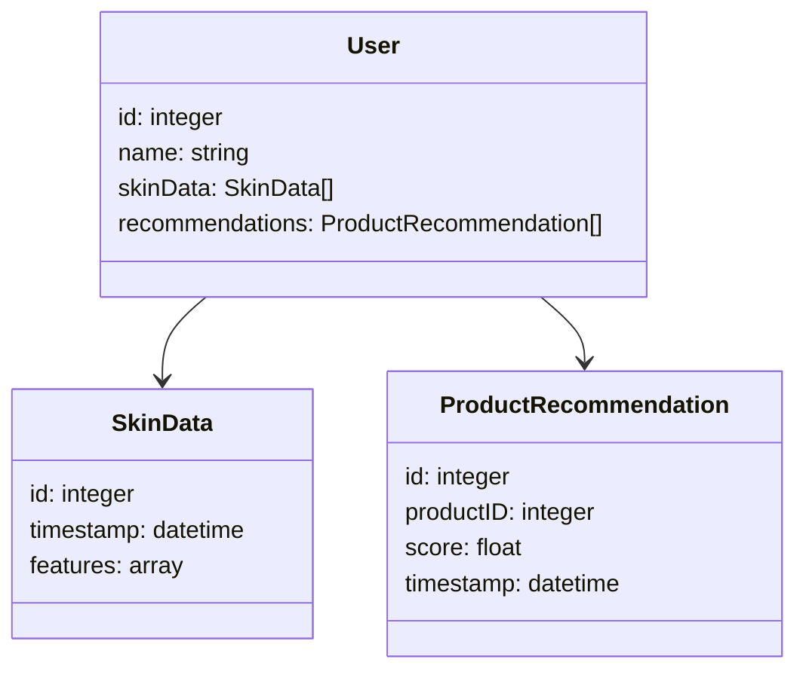
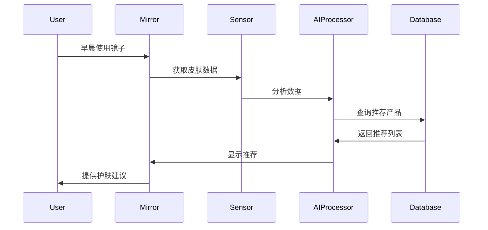

                 


# 智能浴室镜柜：AI Agent的护肤品使用建议

> 关键词：智能浴室镜柜、AI Agent、护肤品推荐、人工智能、物联网、智能家居

> 摘要：本文探讨了智能浴室镜柜与AI Agent结合的创新应用，重点分析了AI Agent如何通过数据采集、算法模型和系统架构为用户提供个性化护肤品建议。文章详细阐述了智能浴室镜柜的发展背景、AI Agent的核心概念、算法原理、系统设计、项目实战、优化与扩展，最后总结了未来发展。

---

## 第一部分: 智能浴室镜柜与AI Agent的背景介绍

## 第1章: 背景介绍

### 1.1 智能浴室镜柜的发展历程

#### 1.1.1 传统浴室镜柜的功能与局限性
传统浴室镜柜主要用于存储护肤品和化妆品，功能单一。用户选择护肤品时，常面临信息过载和知识不足的问题，导致难以做出科学决策。

#### 1.1.2 智能化趋势的兴起
随着物联网和人工智能技术的发展，浴室镜柜逐渐智能化。智能镜柜不仅能存储物品，还能通过传感器和AI算法提供个性化建议。

#### 1.1.3 AI技术在浴室镜柜中的应用前景
AI技术可帮助智能镜柜分析用户皮肤状况，推荐适合的护肤品，提升用户体验。

### 1.2 AI Agent的概念与特点

#### 1.2.1 AI Agent的定义与核心功能
AI Agent是智能系统，通过数据采集和分析，为用户提供个性化建议。在浴室镜柜中，AI Agent能通过摄像头和传感器分析用户皮肤状况，推荐护肤品。

#### 1.2.2 AI Agent在智能浴室镜柜中的具体应用
AI Agent可以识别用户皮肤问题，如痘痘、过敏，推荐适合的护肤品。它还能记录用户使用产品的效果，调整建议。

#### 1.2.3 AI Agent的优势与局限性
优势：个性化建议、实时反馈、便捷性。局限性：依赖数据准确性，用户隐私问题。

### 1.3 智能浴室镜柜的应用场景与优势

#### 1.3.1 场景化应用分析
用户早晨使用镜子查看皮肤状况，AI Agent提供护肤建议。晚上记录护肤效果，AI Agent优化建议。

#### 1.3.2 AI Agent在护肤建议中的具体作用
AI Agent通过图像识别和数据分析，提供个性化建议，帮助用户选择适合的护肤品。

#### 1.3.3 用户体验的提升
AI Agent提升了护肤效率和效果，使用户更便捷地管理护肤品使用。

### 1.4 本章小结
本章介绍了智能浴室镜柜的发展历程，AI Agent的概念和特点，及其在智能浴室镜柜中的应用前景。

---

## 第二部分: AI Agent的核心概念与原理

## 第2章: AI Agent的核心概念与联系

### 2.1 AI Agent的核心原理

#### 2.1.1 数据采集与处理流程
AI Agent通过摄像头和传感器采集用户皮肤数据，结合用户输入的历史数据，进行分析和处理。

#### 2.1.2 AI算法的基本原理
AI算法包括数据预处理、特征提取、模型训练和推理反馈。常用算法有协同过滤和基于内容的推荐。

#### 2.1.3 系统输出与反馈机制
系统根据分析结果推荐护肤品，并根据用户反馈优化建议。

### 2.2 核心概念对比与ER实体关系图

#### 2.2.1 关键概念对比表
| 概念 | 描述 |
|------|------|
| 数据采集 | 通过传感器和摄像头获取用户数据 |
| 特征提取 | 提取数据中的有用特征 |
| 模型训练 | 建立模型进行数据分析 |
| 反馈机制 | 根据用户反馈调整建议 |

#### 2.2.2 ER实体关系图（Mermaid流程）

```mermaid
er
    actor User
    entity SkinData
    entity ProductRecommendation
    User -> SkinData: 提供
    SkinData -> ProductRecommendation: 基于
```

### 2.3 算法原理讲解

#### 2.3.1 协同过滤算法
协同过滤基于用户相似性推荐产品。公式：
$$ sim(u, v) = \frac{\sum_{i}(u_i - \bar{u})(v_i - \bar{v})}{\sqrt{\sum_{i}(u_i - \bar{u})^2} \sqrt{\sum_{i}(v_i - \bar{v})^2}} $$

#### 2.3.2 基于内容的推荐算法
基于内容的推荐基于产品特征向量相似度：
$$ similarity = \frac{\sum_{i=1}^{n} w_i \cdot (f_{ui} \cdot f_{vi})}{\sqrt{\sum_{i=1}^{n} w_i \cdot f_{ui}^2} \cdot \sqrt{\sum_{i=1}^{n} w_i \cdot f_{vi}^2}}} $$

---

## 第三部分: 智能浴室镜柜的系统设计与实现

## 第3章: 系统分析与架构设计方案

### 3.1 项目介绍

#### 3.1.1 项目背景与目标
开发一个智能浴室镜柜系统，通过AI Agent为用户提供个性化护肤品建议。

### 3.2 系统功能设计

#### 3.2.1 领域模型类图（Mermaid）



### 3.3 系统架构设计

#### 3.3.1 系统架构图（Mermaid）


### 3.4 系统接口设计

#### 3.4.1 数据接口
- 传感器接口：获取皮肤数据
- 数据库接口：存储和检索数据

### 3.5 系统交互流程

#### 3.5.1 交互流程图（Mermaid）



---

## 第四部分: 项目实战

## 第4章: 项目实战

### 4.1 环境搭建

#### 4.1.1 系统环境
- Python 3.8+
- OpenCV、TensorFlow、Keras

### 4.2 核心代码实现

#### 4.2.1 数据预处理代码

```python
import cv2
import numpy as np

def preprocess_image(image_path):
    img = cv2.imread(image_path)
    img_gray = cv2.cvtColor(img, cv2.COLOR_BGR2GRAY)
    features = extract_features(img_gray)
    return features

def extract_features(image):
    # 示例特征提取代码
    return cv2.cvtColor(image, cv2.COLOR_GRAY2RGB)
```

#### 4.2.2 模型训练代码

```python
from sklearn.neighbors import NearestNeighbors

X = [...]  # 特征数据
model = NearestNeighbors(n_neighbors=5)
model.fit(X)
```

#### 4.2.3 推荐结果输出代码

```python
def get_recommendations(user_id):
    user_data = get_user_data(user_id)
    recommendations = model.kneighbors(user_data, n=5)
    return recommendations
```

### 4.3 代码解读与分析

#### 4.3.1 代码实现细节
代码实现数据预处理、模型训练和结果输出，展示了AI Agent的核心功能。

### 4.4 案例分析与详细讲解

#### 4.4.1 案例分析
通过具体案例展示AI Agent如何根据皮肤数据推荐护肤品，分析推荐的准确性和用户反馈。

### 4.5 项目小结
总结项目实现的关键步骤和成果，强调AI技术在智能浴室镜柜中的应用潜力。

---

## 第五部分: 优化与扩展

## 第5章: 优化与扩展

### 5.1 性能优化

#### 5.1.1 算法优化
优化特征提取和模型训练，提升推荐准确率。

#### 5.1.2 系统优化
优化数据存储和检索效率，提升系统响应速度。

### 5.2 功能扩展

#### 5.2.1 扩展功能
扩展健康监测功能，监测用户健康状况，提供更全面的建议。

### 5.3 实际应用案例

#### 5.3.1 应用案例分析
分析实际应用中的成功案例和遇到的问题，总结经验教训。

### 5.4 本章小结
总结优化措施和扩展方向，为未来发展提供方向。

---

## 第六部分: 总结与展望

## 第6章: 总结与展望

### 6.1 总结

#### 6.1.1 核心内容回顾
回顾文章的核心内容，强调AI Agent在智能浴室镜柜中的应用价值。

### 6.2 展望

#### 6.2.1 未来发展方向
展望AI Agent在智能浴室镜柜中的潜在应用，如健康监测、更智能的交互方式。

### 6.3 注意事项与最佳实践 Tips

#### 6.3.1 注意事项
注意数据隐私和系统安全，确保用户体验。

#### 6.3.2 最佳实践 Tips
建议持续优化算法和系统架构，保持技术领先。

### 6.4 本章小结
总结全文，强调AI技术在智能浴室镜柜中的重要性，为未来发展提供方向。

---

## 作者信息

作者：AI天才研究院/AI Genius Institute & 禅与计算机程序设计艺术 /Zen And The Art of Computer Programming

---

本文通过详细分析智能浴室镜柜与AI Agent的结合，展示了AI技术在护肤品推荐中的应用潜力，为未来的智能化浴室镜柜设计提供了理论和实践指导。

