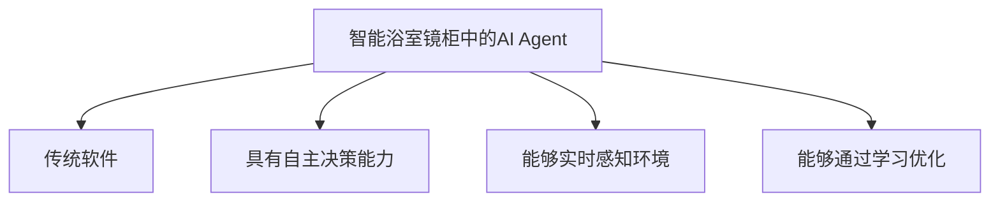
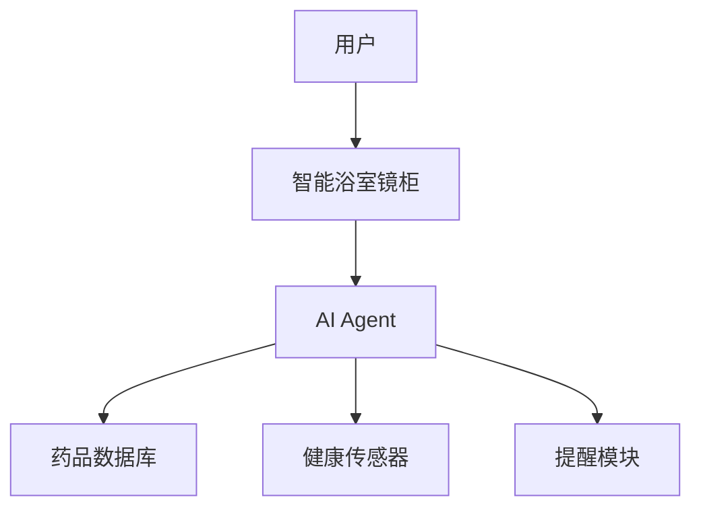
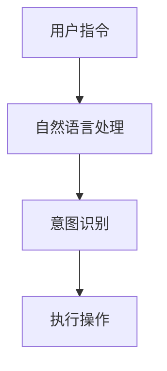
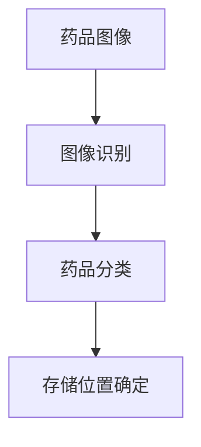
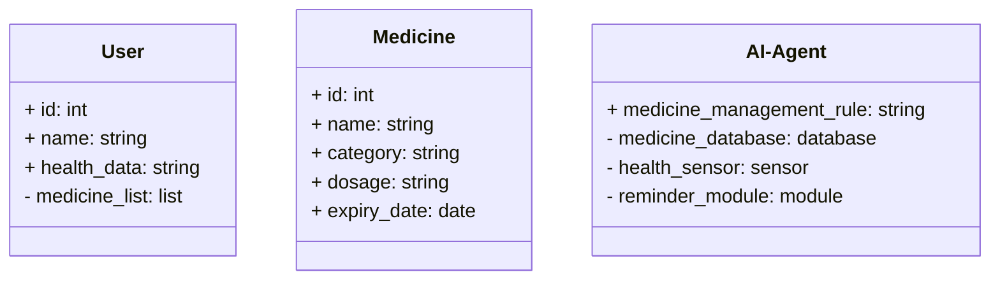
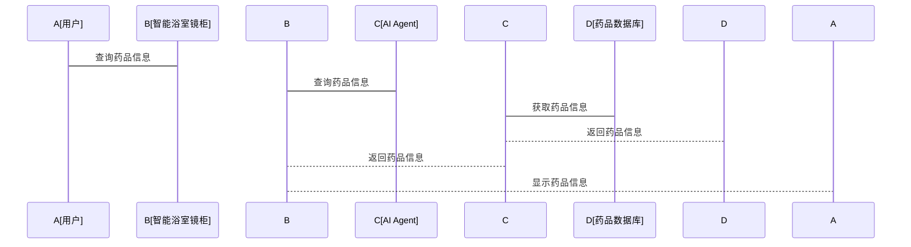

                 


# 智能浴室镜柜：AI Agent的药品管理

> 关键词：智能浴室镜柜, AI Agent, 药品管理, 自然语言处理, 图像识别, 机器学习

> 摘要：本文探讨了智能浴室镜柜中AI Agent在药品管理中的应用，分析了传统药品管理问题，详细阐述了AI Agent的核心概念、算法原理、系统架构，并通过实际案例展示了项目的实现过程，最后总结了项目的成果与经验。

---

# 第一部分: 智能浴室镜柜与AI Agent概述

## 第1章: 智能浴室镜柜的发展背景

### 1.1 智能浴室镜柜的概念与特点

#### 1.1.1 智能浴室镜柜的定义
智能浴室镜柜是一种结合了智能技术的浴室设备，除了传统的储物功能外，还集成了电子显示屏、传感器、AI技术等多种功能，能够实现智能化的交互和管理。

#### 1.1.2 智能浴室镜柜的核心功能
1. 药品管理：通过AI技术实现药品的自动分类、存储提醒和用量监控。
2. 健康监测：集成健康传感器，实时监测用户的健康数据。
3. 智能交互：通过语音或触控方式与用户进行交互，提供健康建议。

#### 1.1.3 智能浴室镜柜与传统浴室镜柜的区别
| 特性          | 传统浴室镜柜          | 智能浴室镜柜          |
|---------------|-----------------------|-----------------------|
| 功能          | 储物、镜面反射        | 储物、镜面反射 + 智能管理 |
| 技术          | 无智能技术            | 集成AI、传感器等技术    |
| 交互方式      | 无智能交互            | 支持语音、触控交互      |
| 应用场景      | 仅限浴室使用          | 智能家居生态的一部分    |

### 1.2 AI Agent在智能浴室镜柜中的应用

#### 1.2.1 AI Agent的定义与特点
AI Agent（人工智能代理）是一种能够感知环境并采取行动以实现目标的智能实体。它具有以下特点：
1. **自主性**：能够自主决策。
2. **反应性**：能够实时感知环境并做出反应。
3. **目标导向**：通过行动实现特定目标。
4. **学习能力**：能够通过数据学习和优化。

#### 1.2.2 AI Agent在智能浴室镜柜中的作用
1. **药品分类与管理**：通过图像识别和自然语言处理技术，自动识别药品并分类存储。
2. **智能提醒**：根据用户的健康数据和药品信息，提供用药提醒和用量建议。
3. **健康建议**：结合用户的健康数据，提供个性化的健康建议。

#### 1.2.3 智能浴室镜柜中的AI Agent与传统软件的区别


---

## 第2章: 智能浴室镜柜中的药品管理问题背景

### 2.1 药品管理的传统问题

#### 2.1.1 药品过期问题
传统药品管理中，药品容易过期，用户往往无法及时发现，导致药品浪费或使用过期药品。

#### 2.1.2 药品分类与存储问题
药品种类繁多，传统管理方式难以实现分类存储，导致药品查找困难，管理混乱。

#### 2.1.3 药品用量与提醒问题
用户常常忘记药品的用量和服用时间，传统管理方式无法提供实时提醒。

### 2.2 AI Agent在药品管理中的优势

#### 2.2.1 智能识别与分类
AI Agent通过图像识别技术，能够自动识别药品并分类存储，确保药品的有序管理。

#### 2.2.2 自动提醒与管理
AI Agent能够根据药品信息和用户健康数据，提供实时的用药提醒和用量建议。

#### 2.2.3 数据分析与健康建议
AI Agent能够通过数据分析，为用户提供个性化的健康建议，帮助用户更好地管理健康。

---

## 第3章: 智能浴室镜柜中的AI Agent药品管理解决方案

### 3.1 解决方案概述

#### 3.1.1 系统架构设计


#### 3.1.2 功能模块划分
1. **用户交互模块**：负责与用户的交互，接收用户的指令。
2. **AI Agent模块**：负责处理用户的指令，调用相关功能。
3. **药品管理模块**：负责药品的分类、存储和提醒。
4. **健康监测模块**：负责监测用户的健康数据。

#### 3.1.3 用户交互流程
1. 用户通过语音或触控方式向AI Agent发出指令。
2. AI Agent接收指令后，调用相关功能模块进行处理。
3. 处理结果通过显示屏或语音反馈给用户。

### 3.2 系统边界与外延

#### 3.2.1 系统功能边界
智能浴室镜柜的药品管理功能仅限于药品分类、存储和提醒，不涉及药品采购和配送。

#### 3.2.2 系统与外部系统的接口
智能浴室镜柜可以通过家庭局域网与智能家居系统（如智能音箱、智能灯）进行联动。

#### 3.2.3 系统扩展性与兼容性
智能浴室镜柜的设计应考虑未来的扩展性，如接入更多健康传感器或与其他智能家居设备联动。

---

## 第4章: AI Agent药品管理的核心概念与联系

### 4.1 核心概念原理

#### 4.1.1 AI Agent的基本原理
AI Agent通过感知环境、分析数据、制定策略并执行行动来实现目标。在智能浴室镜柜中，AI Agent的核心任务是管理药品。

#### 4.1.2 药品管理的核心要素
1. **药品信息**：包括药品名称、类别、用量、保质期等。
2. **用户健康数据**：包括用户的健康状况、用药习惯等。
3. **管理规则**：包括药品存储规则、用药提醒规则等。

### 4.2 概念属性特征对比

| 特性         | 药品信息             | 用户健康数据         | 管理规则           |
|--------------|----------------------|----------------------|-------------------|
| 核心内容     | 药品名称、类别、用量、保质期 | 用户健康状况、用药习惯 | 药品存储规则、用药提醒规则 |
| 数据来源     | 药品包装信息、数据库 | 用户健康传感器、数据库 | 系统配置          |
| 数据处理     | 分类、存储           | 分析、建议           | 规则匹配、提醒     |

### 4.3 ER实体关系图架构

```mermaid
erd
node User{
  id: int
  name: string
  health_data: string
}
node Medicine{
  id: int
  name: string
  category: string
  dosage: string
  expiry_date: date
}
node AI-Agent{
  id: int
  medicine_management_rule: string
}
```

---

## 第5章: 算法原理讲解

### 5.1 算法原理概述

#### 5.1.1 自然语言处理
AI Agent通过自然语言处理技术，解析用户的指令并生成响应。

#### 5.1.2 图像识别
AI Agent通过图像识别技术，自动识别药品并分类存储。

#### 5.1.3 机器学习
AI Agent通过机器学习技术，分析用户的健康数据并提供个性化建议。

### 5.2 算法实现

#### 5.2.1 自然语言处理流程


#### 5.2.2 图像识别流程


#### 5.2.3 机器学习模型
AI Agent使用朴素贝叶斯分类器进行药品分类和健康建议生成。

---

## 第6章: 系统分析与架构设计

### 6.1 问题场景介绍

#### 6.1.1 项目介绍
智能浴室镜柜中的AI Agent药品管理系统旨在通过智能化的管理方式，解决传统药品管理中的问题。

### 6.2 系统功能设计

#### 6.2.1 领域模型


### 6.3 系统架构设计

#### 6.3.1 系统架构


### 6.4 系统接口设计

#### 6.4.1 接口描述
智能浴室镜柜通过局域网与家庭其他智能设备进行通信，接口采用RESTful API。

### 6.5 系统交互流程

#### 6.5.1 交互流程


---

## 第7章: 项目实战

### 7.1 环境搭建

#### 7.1.1 环境要求
- Python 3.8+
- TensorFlow 2.0+
- OpenCV 4.0+

### 7.2 核心代码实现

#### 7.2.1 药品分类代码
```python
import cv2
import numpy as np

def recognize_medicine(image_path):
    # 加载预训练模型
    model = cv2.dnn.readNet('medicine_classifier.pb')
    # 加载图像
    image = cv2.imread(image_path)
    # 前向传播
    output = model.predict(image)
    # 获取分类结果
    prediction = np.argmax(output, axis=1)
    return prediction[0]
```

#### 7.2.2 提醒模块代码
```python
import datetime

def schedule_reminder(medicine_info):
    # 设置提醒时间
    now = datetime.datetime.now()
    reminder_time = now + datetime.timedelta(minutes=30)
    # 提醒信息
    message = f"提醒：请按时服用{medicine_info['name']}，用量为{medicine_info['dosage']}。"
    # 提醒触发
    print(message)
```

### 7.3 代码应用解读与分析

#### 7.3.1 药品分类代码解读
上述代码实现了基于OpenCV的图像识别，用于自动识别药品并分类存储。

#### 7.3.2 提醒模块代码解读
上述代码实现了基于Python的定时提醒功能，用于提醒用户按时服药。

### 7.4 实际案例分析

#### 7.4.1 案例描述
用户购买了感冒药，将其放入智能浴室镜柜中，AI Agent自动识别并分类存储，同时设置提醒。

### 7.5 项目小结

#### 7.5.1 成果总结
通过本项目，我们实现了智能浴室镜柜中的AI Agent药品管理功能，包括药品分类、存储和提醒。

#### 7.5.2 经验总结
项目实施过程中，需要注意硬件与软件的协同设计，以及系统的扩展性和兼容性。

---

## 第8章: 总结与展望

### 8.1 最佳实践 tips

#### 8.1.1 数据隐私
智能浴室镜柜中的健康数据和药品信息属于用户的隐私，必须严格保护。

#### 8.1.2 系统维护
定期更新AI Agent的模型和规则，确保系统的准确性和实用性。

### 8.2 小结

通过本文的探讨，我们了解了智能浴室镜柜中AI Agent在药品管理中的应用，掌握了相关的核心概念、算法原理和系统架构设计。

### 8.3 注意事项

#### 8.3.1 系统安全
确保系统的安全性，防止数据泄露和恶意攻击。

#### 8.3.2 用户体验
优化用户交互设计，提升用户体验。

### 8.4 拓展阅读

#### 8.4.1 智能家居
建议阅读相关智能家居的技术资料，了解智能浴室镜柜在智能家居生态中的应用。

#### 8.4.2 人工智能
建议深入学习人工智能技术，掌握更多AI Agent的应用场景。

---

作者：AI天才研究院/AI Genius Institute & 禅与计算机程序设计艺术 /Zen And The Art of Computer Programming

