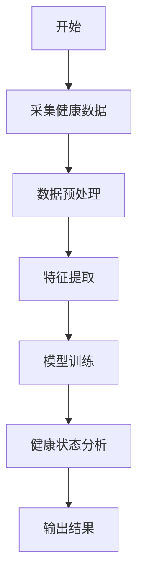
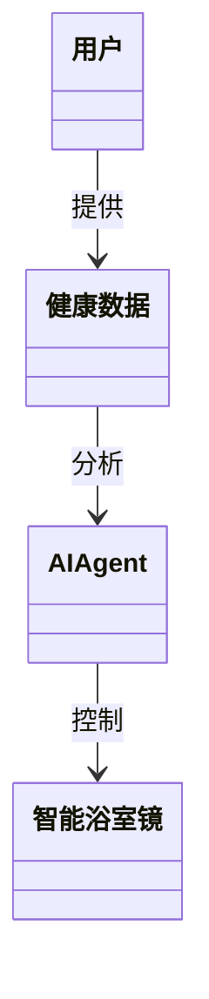
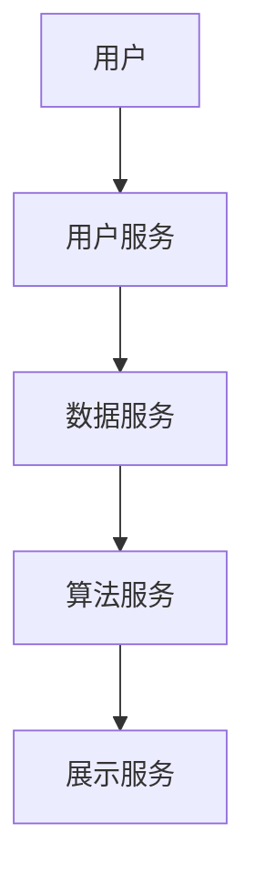
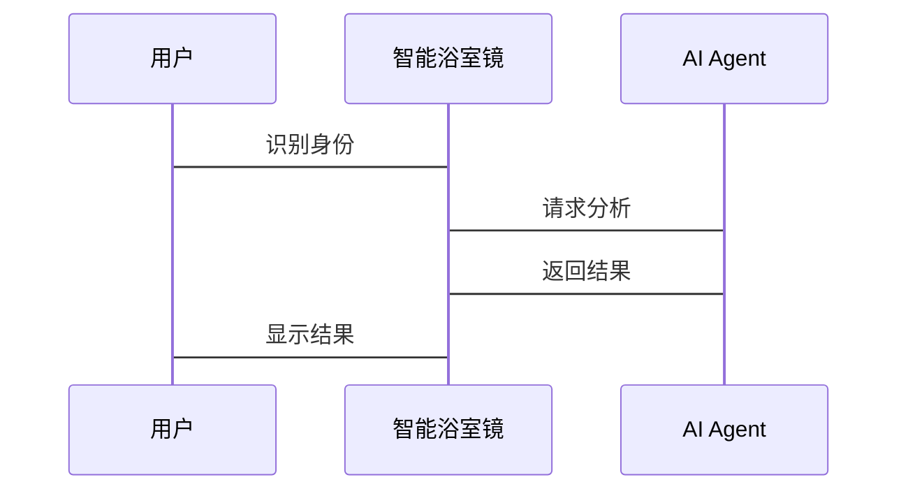

                 


# 智能浴室镜：AI Agent的健康状态分析

> **关键词**：智能浴室镜，AI Agent，健康状态分析，系统架构设计，项目实战

> **摘要**：  
本文探讨了智能浴室镜与AI Agent在健康状态分析中的应用，详细分析了智能浴室镜的功能模块、AI Agent的核心原理、系统架构设计，以及实际项目实现。通过结合健康监测技术与人工智能，本文展示了如何利用AI Agent提升智能浴室镜的健康状态分析能力，并为未来的研究和应用提供了方向。

---

# 第1章 智能浴室镜与AI Agent概述

## 1.1 智能浴室镜的概念与背景

### 1.1.1 智能浴室镜的定义与基本功能  
智能浴室镜是一种结合了物联网（IoT）和人工智能（AI）技术的智能设备，安装在浴室环境中，支持多种智能功能，如环境监测、健康数据采集、信息显示等。它不仅是一个普通的镜子，还是一个集成了传感器、摄像头、显示屏和AI算法的智能终端设备。

### 1.1.2 AI Agent在智能浴室镜中的作用  
AI Agent（人工智能代理）是一种能够感知环境、自主决策并执行任务的智能实体。在智能浴室镜中，AI Agent负责处理用户的交互请求、分析健康数据、提供个性化建议，并与外部系统（如智能家居、医疗机构）进行通信。AI Agent的存在使得智能浴室镜能够实现从数据采集到智能分析的闭环流程。

### 1.1.3 智能浴室镜的市场现状与发展趋势  
近年来，随着AI和IoT技术的快速发展，智能浴室镜逐渐成为智能家居领域的重要组成部分。市场上的产品主要集中在健康监测、环境优化和智能交互三大功能。未来，智能浴室镜将进一步集成更复杂的健康监测功能，并与医疗系统深度结合。

## 1.2 健康状态分析的核心问题

### 1.2.1 健康状态分析的定义与目标  
健康状态分析是通过采集用户的生理数据（如心率、体温、血氧饱和度）和行为数据（如运动量、睡眠质量），利用AI算法对用户的健康状况进行评估和预测。其目标是帮助用户实时了解健康状况，并提供个性化的健康建议。

### 1.2.2 智能浴室镜健康状态分析的关键问题  
1. 数据采集的准确性：智能浴室镜需要高精度的传感器来采集生理数据。  
2. 数据分析的实时性：健康状态分析需要快速响应，以确保数据的实时性。  
3. 数据隐私的安全性：用户的健康数据需要在传输和存储过程中得到严格保护。

### 1.2.3 健康状态分析的边界与外延  
健康状态分析的边界包括数据采集的范围、分析的深度以及建议的范围。外延则涉及健康数据的长期跟踪、健康干预的实施以及与医疗系统的联动。

## 1.3 AI Agent与智能浴室镜的结合

### 1.3.1 AI Agent的基本概念与特点  
AI Agent是一种能够感知环境、自主决策并执行任务的智能实体。它具有以下特点：  
1. **自主性**：能够在没有外部干预的情况下完成任务。  
2. **反应性**：能够实时感知环境变化并做出响应。  
3. **社会性**：能够与其他AI Agent或人类进行交互和协作。  

### 1.3.2 AI Agent在智能浴室镜中的应用场景  
1. **用户身份识别**：通过人脸识别技术，快速识别用户身份。  
2. **健康数据采集**：利用传感器采集用户的生理数据。  
3. **健康状态分析**：基于AI算法对用户的健康数据进行分析，并提供个性化建议。  
4. **智能交互**：通过语音或手势交互，与用户进行实时对话。  

### 1.3.3 AI Agent与智能浴室镜的系统架构  
智能浴室镜的系统架构包括硬件层、数据层、算法层和应用层。AI Agent主要负责算法层的实现，包括数据处理、模型训练和决策执行。

## 1.4 本章小结  
本章介绍了智能浴室镜的概念、AI Agent的作用以及健康状态分析的核心问题。通过分析智能浴室镜与AI Agent的结合，我们明确了健康状态分析的关键技术与实现路径。

---

# 第2章 AI Agent的核心原理

## 2.1 AI Agent的基本原理

### 2.1.1 AI Agent的感知与推理机制  
AI Agent通过传感器和摄像头感知环境信息，并利用自然语言处理（NLP）技术理解用户的意图。感知信息后，AI Agent通过知识图谱和逻辑推理对数据进行分析，得出结论。

### 2.1.2 AI Agent的决策与执行流程  
AI Agent的决策流程包括：  
1. **目标设定**：明确任务目标。  
2. **信息收集**：通过传感器和数据库获取相关信息。  
3. **决策推理**：利用算法对信息进行分析，得出最优决策。  
4. **执行操作**：根据决策结果执行操作。  

### 2.1.3 AI Agent的核心算法与技术  
AI Agent的核心算法包括：  
1. **机器学习算法**：用于数据分类和预测。  
2. **自然语言处理技术**：用于理解用户的语音指令。  
3. **知识图谱技术**：用于存储和推理知识。  

## 2.2 健康状态分析的数学模型与公式

### 2.2.1 健康状态分析的数学模型  
健康状态分析的数学模型可以表示为：  
$$ S = f(D, T) $$  
其中，$S$ 表示健康状态，$D$ 表示健康数据，$T$ 表示时间变量，$f$ 表示分析模型。

### 2.2.2 关键算法的公式推导  
以心率监测为例，AI Agent可以通过以下公式计算心率变异性（HRV）：  
$$ HRV = \sqrt{\frac{\sum_{i=1}^{n}(x_i - \mu)^2}{n}} $$  
其中，$\mu$ 是平均心率，$x_i$ 是单次心率测量值，$n$ 是测量次数。

### 2.2.3 健康状态分析的流程图（Mermaid）  


## 2.3 AI Agent与健康状态分析的实体关系图（Mermaid）

```mermaid
erDiagram
    用户 : 实体
    健康数据 : 实体
    AI Agent : 实体
    智能浴室镜 : 实体
    用户 --> 健康数据 : 提供
    健康数据 --> AI Agent : 分析
    AI Agent --> 智能浴室镜 : 控制
```

## 2.4 本章小结  
本章详细介绍了AI Agent的核心原理，包括感知与推理机制、决策与执行流程，以及健康状态分析的数学模型与公式。通过流程图和实体关系图，我们明确了AI Agent在健康状态分析中的作用。

---

# 第3章 智能浴室镜的系统分析与架构设计

## 3.1 系统功能设计

### 3.1.1 用户身份识别模块  
用户身份识别模块通过人脸识别技术，快速识别用户身份。其实现流程如下：  
1. 用户靠近镜子，系统启动人脸识别。  
2. 传感器采集用户面部特征数据。  
3. AI Agent利用预训练的模型进行身份匹配。  
4. 匹配成功后，系统显示个性化界面。

### 3.1.2 健康数据采集模块  
健康数据采集模块通过传感器采集用户的生理数据，包括：  
- 心率：通过光学传感器检测心率变化。  
- 体温：通过温度传感器检测体温。  
- 血氧饱和度：通过光电传感器检测血氧值。  

### 3.1.3 健康状态分析模块  
健康状态分析模块基于AI算法对采集的健康数据进行分析，生成健康报告。分析过程包括：  
1. 数据预处理：去除噪声，提取有效特征。  
2. 数据分析：利用机器学习算法进行分类和预测。  
3. 报告生成：输出健康评估结果和个性化建议。

### 3.1.4 个性化健康建议模块  
个性化健康建议模块根据健康报告生成个性化的建议，包括：  
- 运动建议：根据用户的身体状况推荐运动计划。  
- 饮食建议：根据用户的代谢情况推荐饮食方案。  
- 医疗建议：根据用户的健康问题推荐就医方案。

## 3.2 系统功能设计的领域模型（Mermaid类图）



## 3.3 系统架构设计

### 3.3.1 分层架构设计  
智能浴室镜的系统架构采用分层设计，包括：  
- **数据采集层**：负责采集健康数据。  
- **数据处理层**：负责数据预处理和特征提取。  
- **算法层**：负责健康状态分析和决策。  
- **应用层**：负责用户交互和结果显示。

### 3.3.2 微服务架构设计  
微服务架构将智能浴室镜的功能模块化，包括：  
- **用户服务**：负责用户身份识别。  
- **数据服务**：负责健康数据采集。  
- **算法服务**：负责健康状态分析。  
- **展示服务**：负责结果显示和用户交互。

### 3.3.3 系统架构图（Mermaid）



## 3.4 系统接口设计

### 3.4.1 用户接口设计  
用户接口包括：  
- **显示界面**：用于显示健康数据和建议。  
- **语音交互**：支持用户的语音指令。  

### 3.4.2 数据接口设计  
数据接口包括：  
- **传感器接口**：与健康传感器通信。  
- **数据库接口**：与云端数据库通信。  

### 3.4.3 API接口设计  
API接口包括：  
- **身份验证接口**：用于用户身份验证。  
- **数据查询接口**：用于获取健康数据。  
- **指令执行接口**：用于控制智能浴室镜的功能。

## 3.5 系统交互流程设计（Mermaid序列图）



## 3.6 本章小结  
本章详细分析了智能浴室镜的系统功能设计、架构设计和接口设计。通过分层架构和微服务架构的结合，我们明确了系统的实现路径。

---

# 第4章 项目实战与代码实现

## 4.1 开发环境配置

### 4.1.1 系统环境要求  
- 操作系统：Linux或Windows  
- 开发工具：Python、Jupyter Notebook  
- 传感器：心率传感器、温度传感器、摄像头  

### 4.1.2 安装依赖库  
```bash
pip install numpy
pip install pandas
pip install scikit-learn
pip install tensorflow
pip install cv2
```

## 4.2 核心代码实现

### 4.2.1 数据采集代码  
```python
import cv2

def capture_face():
    cap = cv2.VideoCapture(0)
    ret, frame = cap.read()
    if ret:
        cv2.imwrite("face.jpg", frame)
    cap.release()
```

### 4.2.2 数据分析代码  
```python
import numpy as np
from sklearn.model_selection import train_test_split
from tensorflow.keras.models import Sequential
from tensorflow.keras.layers import Dense, Flatten

# 加载数据
data = np.load("health_data.npy")
labels = np.load("health_labels.npy")

# 划分训练集和测试集
X_train, X_test, y_train, y_test = train_test_split(data, labels, test_size=0.2)

# 构建模型
model = Sequential()
model.add(Flatten())
model.add(Dense(128, activation="relu"))
model.add(Dense(10, activation="softmax"))

# 编译模型
model.compile(optimizer="adam", loss="sparse_categorical_crossentropy", metrics=["accuracy"])

# 训练模型
model.fit(X_train, y_train, epochs=10, batch_size=32)

# 评估模型
model.evaluate(X_test, y_test)
```

### 4.2.3 系统交互代码  
```python
import speech_recognition as sr

def recognize_speech():
    r = sr.Recognizer()
    with sr.Microphone() as source:
        audio = r.listen(source)
        try:
            text = r.recognize_google(audio)
            return text
        except sr.UnknownValueError:
            return ""
```

## 4.3 项目小结  
本章通过具体的代码实现，展示了智能浴室镜的开发过程。从数据采集到模型训练，再到系统交互，我们详细讲解了每个步骤的实现细节。

---

# 第5章 扩展与展望

## 5.1 未来研究方向

### 5.1.1 基于AI Agent的智能浴室镜优化  
未来，AI Agent可以进一步优化健康状态分析算法，提升系统的实时性和准确性。

### 5.1.2 智能浴室镜的多模态交互  
未来，智能浴室镜可以支持更多的交互方式，如手势交互和情感计算。

### 5.1.3 智能浴室镜的医疗应用  
未来，智能浴室镜可以与医疗系统深度结合，实现远程医疗和健康预警。

## 5.2 智能浴室镜与AI Agent的挑战与建议

### 5.2.1 挑战  
1. **数据隐私**：用户健康数据的安全性问题。  
2. **算法性能**：AI算法的实时性和准确性问题。  
3. **用户体验**：系统的易用性和交互性问题。  

### 5.2.2 建议  
1. 加强数据加密技术，确保用户隐私。  
2. 提升算法性能，优化系统的响应速度。  
3. 改善用户体验，提供更直观的交互界面。  

## 5.3 拓展与延伸

### 5.3.1 智能浴室镜的其他应用场景  
1. **智能镜子**：支持更多功能的智能镜子。  
2. **智能镜子+医疗**：与医疗机构结合，提供远程医疗服务。  

### 5.3.2 AI Agent的其他应用领域  
1. **智能家居**：AI Agent可以用于智能家居的管理与控制。  
2. **智能医疗**：AI Agent可以用于医疗设备的智能控制和健康监测。  

## 5.4 本章小结  
本章展望了智能浴室镜与AI Agent的未来发展方向，并提出了相关的挑战与建议。通过拓展与延伸，我们明确了AI Agent在其他领域的广泛应用潜力。

---

# 作者：AI天才研究院/AI Genius Institute & 禅与计算机程序设计艺术 /Zen And The Art of Computer Programming

