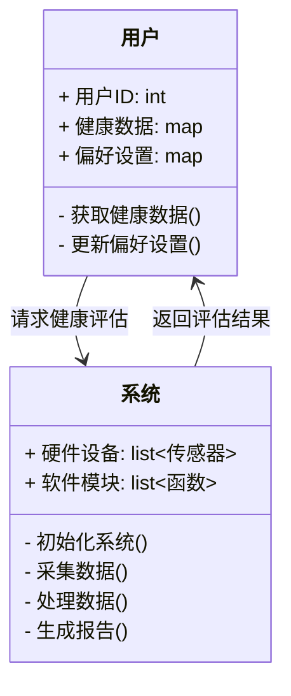
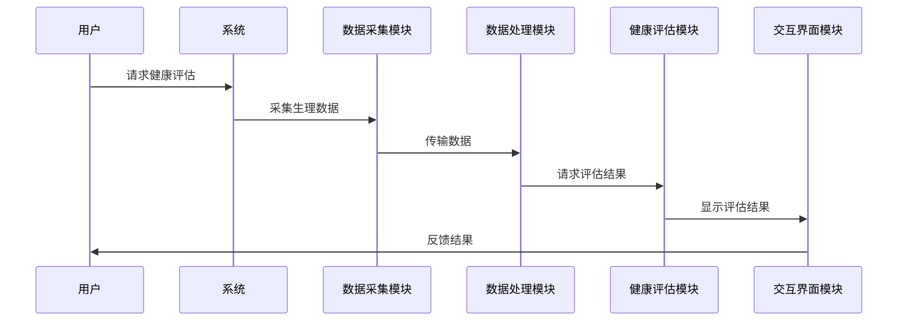

                 


# 智能浴室镜：AI Agent的健康状态评估

## 关键词：智能浴室镜, AI Agent, 健康评估, 人机交互, 数据处理, 系统架构

## 摘要：  
智能浴室镜作为智能家居的重要组成部分，结合AI Agent技术，能够实现个性化的健康状态评估。本文从智能浴室镜的发展背景出发，详细阐述AI Agent在健康评估中的核心作用，包括数据采集、智能分析与个性化建议生成。通过系统架构设计和交互设计，探讨如何构建高效、智能的健康评估系统，并通过实际案例展示AI Agent在智能浴室镜中的具体应用。本文旨在为智能家居领域的开发者和技术爱好者提供理论与实践相结合的深度解析。

---

# 第一部分: 智能浴室镜与AI Agent的背景与概念

## 第1章: 智能浴室镜的发展背景

### 1.1 智能家居的发展趋势  
智能家居近年来迅速普及，已成为现代生活的重要组成部分。智能浴室镜作为智能家居中的关键设备，通过集成AI技术，能够为用户提供更加智能化的服务。  

#### 1.1.1 智能家居的概念与现状  
智能家居是指通过物联网技术将家中的各种设备（如灯光、空调、安防系统等）连接起来，实现智能化管理。目前，智能家居市场发展迅速，设备种类繁多，用户需求日益多样化。  

#### 1.1.2 智能浴室镜的市场潜力  
智能浴室镜不仅是一个普通的镜子，它还可以集成健康监测、语音交互、信息显示等多种功能。随着人们对健康的关注增加，智能浴室镜的市场需求快速增长。  

#### 1.1.3 用户需求与痛点分析  
传统浴室镜功能单一，无法满足用户对健康监测、智能提醒等多样化需求。智能浴室镜通过AI技术，能够解决这些问题，提升用户体验。  

---

### 1.2 AI Agent的基本概念  

#### 1.2.1 人工智能代理的定义  
AI Agent（人工智能代理）是一种能够感知环境、自主决策并执行任务的智能实体。它能够通过传感器获取信息，利用算法进行分析，并通过执行器完成操作。  

#### 1.2.2 AI Agent的核心功能与特点  
- **感知能力**：通过传感器或数据接口获取环境信息。  
- **推理能力**：基于获取的信息进行分析和推理。  
- **自主决策**：根据推理结果做出决策并执行操作。  
- **学习能力**：通过机器学习算法不断优化自身性能。  

#### 1.2.3 AI Agent与传统计算机程序的区别  
AI Agent具有自主性和智能性，能够根据环境变化动态调整行为，而传统程序通常按照预设逻辑执行任务。  

---

### 1.3 智能浴室镜与AI Agent的结合  

#### 1.3.1 智能浴室镜的功能扩展  
智能浴室镜通过集成AI Agent技术，可以实现健康监测、天气预报显示、日历提醒等功能。  

#### 1.3.2 AI Agent在智能浴室镜中的应用场景  
- **健康监测**：通过摄像头和传感器监测用户的生理指标（如心率、体温）。  
- **个性化提醒**：根据用户的健康数据提供个性化的健康建议。  
- **信息显示**：显示天气、日历、新闻等信息。  

#### 1.3.3 人机交互的新模式  
智能浴室镜通过语音交互、触控操作等方式，实现了更加自然的人机交互体验。  

---

## 第2章: 健康状态评估的核心概念  

### 2.1 健康状态评估的定义  

#### 2.1.1 健康状态评估的范围与目标  
健康状态评估是指通过采集和分析人体的各项生理指标，评估个体的健康状况。其目标是为用户提供个性化的健康建议和疾病预警。  

#### 2.1.2 健康状态评估的关键指标  
- **生理指标**：心率、体温、血压等。  
- **行为指标**：运动量、睡眠质量等。  
- **环境指标**：空气质量、光照强度等。  

#### 2.1.3 不同场景下的评估标准  
在智能浴室镜中，健康状态评估需要根据用户的使用场景（如早晨、晚上）调整评估标准。  

---

### 2.2 AI Agent在健康评估中的作用  

#### 2.2.1 数据采集与处理  
AI Agent通过智能浴室镜的摄像头和传感器采集用户的生理数据，并进行预处理。  

#### 2.2.2 智能分析与决策  
AI Agent利用机器学习算法对数据进行分析，评估用户的健康状态，并生成相应的健康建议。  

#### 2.2.3 个性化健康建议的生成  
根据用户的健康数据和生活习惯，AI Agent能够提供个性化的健康建议，如作息调整、饮食建议等。  

---

### 2.3 智能浴室镜的健康评估系统架构  

#### 2.3.1 系统组成与功能模块  
- **数据采集模块**：负责采集用户的生理数据。  
- **数据处理模块**：对采集的数据进行清洗和预处理。  
- **健康评估模块**：基于处理后的数据进行健康评估。  
- **用户交互模块**：通过人机交互向用户展示评估结果和健康建议。  

#### 2.3.2 数据流与信息处理流程  
数据从传感器采集后，首先经过预处理模块，然后进入健康评估模块进行分析，最后通过交互模块将结果反馈给用户。  

#### 2.3.3 系统的边界与外延  
智能浴室镜的健康评估系统仅关注用户在浴室中的健康数据，不涉及其他场景的数据。  

---

## 第3章: AI Agent与智能浴室镜的交互设计  

### 3.1 人机交互的基本原理  

#### 3.1.1 交互设计的核心要素  
- **用户目标**：用户希望通过智能浴室镜获取健康评估结果。  
- **系统功能**：系统通过AI Agent提供数据采集、分析和反馈服务。  
- **交互方式**：支持语音和触控两种交互方式。  

#### 3.1.2 用户体验与易用性  
通过优化界面设计和交互流程，提升用户的使用体验。  

#### 3.1.3 多模态交互的实现  
结合语音识别和图像处理技术，实现多模态交互。  

---

### 3.2 智能浴室镜的交互界面设计  

#### 3.2.1 增强现实（AR）技术的应用  
通过AR技术在镜面上显示健康数据和建议。  

#### 3.2.2 触控与语音交互的结合  
用户可以通过触控操作或语音指令与系统交互。  

#### 3.2.3 个性化界面的定制  
用户可以根据个人喜好调整界面的样式和布局。  

---

### 3.3 AI Agent的自然语言处理能力  

#### 3.3.1 语言理解与生成的原理  
AI Agent通过自然语言处理技术理解用户的输入，并生成相应的回应。  

#### 3.3.2 对话系统的设计与实现  
基于预训练语言模型（如GPT）构建对话系统，实现流畅的用户交互。  

#### 3.3.3 语境理解和上下文管理  
AI Agent需要理解对话的上下文，并根据语境生成合适的回应。  

---

## 第4章: 健康数据采集与处理  

### 4.1 健康数据的采集方式  

#### 4.1.1 摄像头采集  
通过摄像头采集用户的面部特征，用于心率监测和表情识别。  

#### 4.1.2 传感器采集  
使用温度传感器、心率传感器等设备采集用户的生理数据。  

#### 4.1.3 数据融合与同步  
将多种传感器的数据进行融合，确保数据的准确性和一致性。  

---

## 第5章: 系统分析与架构设计方案  

### 5.1 问题场景介绍  

#### 5.1.1 智能浴室镜的功能需求  
- 数据采集：心率、体温、动作识别。  
- 数据处理：数据清洗、特征提取。  
- 健康评估：健康状态分析、个性化建议生成。  

#### 5.1.2 用户角色与权限  
- 用户：普通用户。  
- 管理员：系统管理员。  

### 5.2 项目介绍  

#### 5.2.1 项目目标  
构建一个基于AI Agent的智能浴室镜健康评估系统。  

#### 5.2.2 项目范围  
仅限于智能浴室镜的健康评估功能，不涉及其他智能家居设备。  

---

### 5.3 系统功能设计  

#### 5.3.1 领域模型（Mermaid 类图）  


#### 5.3.2 系统架构设计（Mermaid 架构图）  


#### 5.3.3 系统接口设计  
- **输入接口**：摄像头、麦克风。  
- **输出接口**：显示屏、扬声器。  
- **数据接口**：与云端服务器的数据同步。  

#### 5.3.4 系统交互设计（Mermaid 序列图）  


---

## 第6章: 项目实战  

### 6.1 环境安装  

#### 6.1.1 系统要求  
- 操作系统：Linux/Windows/macOS  
- 硬件设备：智能浴室镜、传感器、摄像头。  
- 开发工具：Python、TensorFlow、OpenCV。  

#### 6.1.2 安装依赖  
```bash
pip install numpy
pip install tensorflow
pip install opencv-python
```

---

### 6.2 系统核心实现  

#### 6.2.1 数据采集模块的实现  
```python
import cv2
import numpy as np

def capture_face():
    cap = cv2.VideoCapture(0)
    ret, frame = cap.read()
    cap.release()
    return frame
```

#### 6.2.2 数据处理模块的实现  
```python
def preprocess_data(data):
    # 数据清洗
    cleaned_data = data.dropna()
    # 特征提取
    features = cleaned_data[['heart_rate', 'temperature']]
    return features
```

#### 6.2.3 健康评估模块的实现  
```python
import tensorflow as tf
from tensorflow.keras import models

def evaluate_health(features):
    model = models.load_model('health_model.h5')
    prediction = model.predict(features)
    return prediction
```

---

### 6.3 代码应用解读与分析  

#### 6.3.1 数据采集模块的代码解读  
上述代码通过OpenCV库捕获用户的面部图像，用于后续的健康数据分析。  

#### 6.3.2 数据处理模块的代码解读  
数据清洗和特征提取是健康评估的基础，确保输入模型的数据质量。  

#### 6.3.3 健康评估模块的代码解读  
基于预训练的深度学习模型，对用户的健康数据进行评估，并返回结果。  

---

### 6.4 实际案例分析  

#### 6.4.1 案例背景  
用户A，28岁，早晨使用智能浴室镜进行健康评估。  

#### 6.4.2 数据采集与处理  
采集到用户的心率、体温等数据，经过清洗和特征提取后输入模型。  

#### 6.4.3 评估结果  
系统评估用户A的健康状态为良好，但建议减少咖啡因摄入。  

---

## 第7章: 总结与展望  

### 7.1 全文总结  

#### 7.1.1 核心内容回顾  
本文详细介绍了智能浴室镜与AI Agent的结合，重点讲解了健康状态评估的核心概念、系统架构和实现方法。  

#### 7.1.2 重点强调  
AI Agent在智能浴室镜中的应用，不仅提升了用户体验，还为智能家居的发展提供了新的方向。  

---

### 7.2 未来展望  

#### 7.2.1 技术发展趋势  
随着AI技术的不断进步，智能浴室镜的功能将更加智能化和个性化。  

#### 7.2.2 市场应用前景  
智能浴室镜作为智能家居的重要组成部分，市场潜力巨大。  

---

### 7.3 最佳实践 Tips  

#### 7.3.1 开发建议  
在开发智能浴室镜时，应注重用户体验和数据安全。  

#### 7.3.2 使用建议  
用户应定期更新系统软件，确保设备的正常运行。  

---

## 作者：AI天才研究院/AI Genius Institute & 禅与计算机程序设计艺术 /Zen And The Art of Computer Programming  

---

这篇文章详细介绍了智能浴室镜与AI Agent的结合，从背景到实现，从理论到实践，为读者提供了全面的解析。

