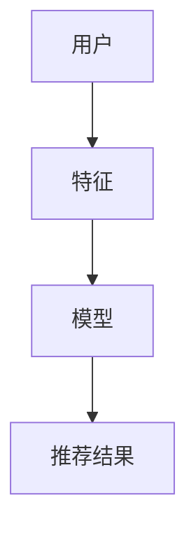
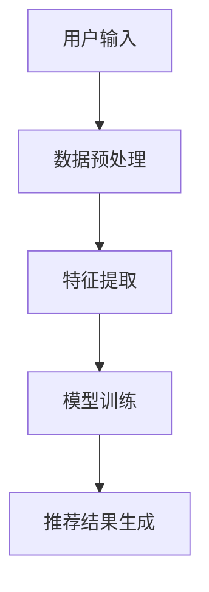
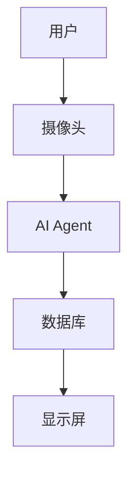
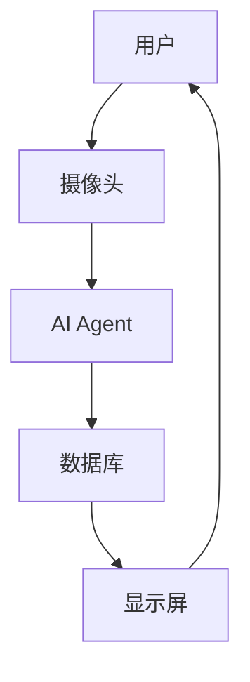

                 


# 智能浴室镜：AI Agent的妆容教程推荐

## 关键词：智能浴室镜, AI Agent, 妆容推荐, 人工智能, 技术博客, 深度学习

## 摘要：  
随着人工智能技术的快速发展，智能浴室镜逐渐成为美妆推荐的重要工具。本文将深入探讨AI Agent如何通过智能浴室镜实现个性化的妆容推荐。通过分析AI Agent的核心算法、系统架构设计以及实际应用案例，本文将揭示如何利用人工智能技术优化美妆推荐体验，为用户提供高效、精准的妆容建议。

---

# 第1章：智能浴室镜与AI Agent的背景介绍

## 1.1 问题背景与描述  
### 1.1.1 智能浴室镜的发展历程  
智能浴室镜作为一种智能家居设备，其发展经历了从简单镜面显示到集成AI技术的智能化推荐系统的演变。随着AI技术的进步，智能浴室镜不再只是一个镜子，而是一个能够理解用户需求、提供个性化服务的智能终端。  

### 1.1.2 AI Agent在美妆推荐中的应用前景  
AI Agent（人工智能代理）是一种能够自主决策并执行任务的智能系统。在美妆推荐领域，AI Agent可以通过分析用户的面部特征、肤色、妆容偏好等信息，提供个性化的妆容建议。这种智能化的推荐方式不仅提高了用户体验，还帮助企业实现了精准营销。  

### 1.1.3 当前妆容推荐的痛点与挑战  
尽管现有的美妆推荐系统取得了一定的进展，但仍面临诸多挑战。例如，如何高效地提取用户的面部特征？如何在复杂场景下实现精准的妆容推荐？这些问题的解决需要结合AI技术与智能硬件的优势。  

## 1.2 核心概念与问题解决  
### 1.2.1 智能浴室镜的功能特点  
智能浴室镜集成了多种功能，包括但不限于：  
1. 高清摄像头：用于捕捉用户的面部特征。  
2. AI算法：用于分析面部数据并生成推荐结果。  
3. 显示屏：用于展示推荐的妆容方案。  

### 1.2.2 AI Agent的核心作用  
AI Agent在智能浴室镜中的作用主要体现在以下几个方面：  
1. **数据采集**：通过摄像头采集用户的面部特征数据。  
2. **数据分析**：利用机器学习算法分析数据，生成个性化推荐。  
3. **结果展示**：将推荐结果以直观的方式呈现给用户。  

### 1.2.3 妆容推荐的实现逻辑  
妆容推荐的实现逻辑可以简单归纳为：  
1. 用户输入：用户在镜子前停留，系统通过摄像头采集用户的面部数据。  
2. 数据处理：AI Agent对数据进行分析，提取关键特征（如肤色、五官特征等）。  
3. 推荐生成：基于特征匹配和算法计算，生成个性化的妆容推荐方案。  
4. 展示结果：将推荐结果以可视化的方式展示给用户。  

## 1.3 边界与外延  
### 1.3.1 智能浴室镜的使用场景  
智能浴室镜主要应用于家庭、酒店、美容院等场景。用户可以在早晨或晚上使用镜子进行自我化妆指导。  

### 1.3.2 AI Agent的应用边界  
AI Agent的应用边界主要集中在数据采集、分析和推荐环节。目前，系统尚未完全实现动态妆容调整和实时反馈功能。  

### 1.3.3 妆容推荐的适用人群  
妆容推荐主要适用于18岁以上的女性用户，尤其是对美妆有一定需求的用户。  

## 1.4 核心要素与概念结构  
### 1.4.1 智能浴室镜的硬件组成  
智能浴室镜的硬件组成包括：  
1. 高清摄像头：用于捕捉用户面部特征。  
2. 显示屏：用于展示推荐结果。  
3. 传感器：用于检测环境光线和用户距离。  

### 1.4.2 AI Agent的算法框架  
AI Agent的算法框架主要由以下几个部分组成：  
1. 数据采集模块：负责采集用户的面部数据。  
2. 数据分析模块：对数据进行清洗、特征提取和模型训练。  
3. 推荐生成模块：基于模型结果生成推荐方案。  

### 1.4.3 妆容推荐系统的功能模块  
妆容推荐系统的功能模块包括：  
1. 用户信息输入模块：采集用户的面部特征数据。  
2. 特征提取模块：提取用户的肤色、五官特征等信息。  
3. 妆容推荐模块：基于特征匹配生成推荐方案。  

## 1.5 本章小结  
本章主要介绍了智能浴室镜与AI Agent的背景，分析了妆容推荐系统的痛点与挑战，并详细阐述了系统的功能模块和核心要素。通过本章的学习，读者可以对智能浴室镜的AI推荐系统有一个全面的了解。

---

# 第2章：AI Agent的核心概念与原理

## 2.1 AI Agent的基本原理  
### 2.1.1 AI Agent的定义与分类  
AI Agent是指能够感知环境、自主决策并执行任务的智能系统。根据应用场景的不同，AI Agent可以分为监督学习型、无监督学习型和强化学习型三种。  

### 2.1.2 基于AI Agent的推荐系统  
基于AI Agent的推荐系统是一种结合了人工智能技术的推荐系统。其核心在于通过AI Agent的自主学习和决策能力，实现个性化推荐。  

### 2.1.3 AI Agent在妆容推荐中的应用  
在妆容推荐中，AI Agent的主要作用是通过分析用户的面部特征，生成个性化的推荐方案。  

## 2.2 核心概念对比分析  
### 2.2.1 AI Agent与传统推荐算法的对比  
AI Agent与传统推荐算法的主要区别在于：  
1. AI Agent具有自主学习能力，能够根据用户反馈动态调整推荐策略。  
2. 传统推荐算法依赖于固定的规则和数据，缺乏灵活性。  

### 2.2.2 不同AI Agent模型的特点  
不同的AI Agent模型具有不同的特点：  
1. 基于协同过滤的模型：适用于数据量较大的场景。  
2. 基于深度学习的模型：适用于数据复杂度较高的场景。  

### 2.2.3 妆容推荐系统的核心要素对比  
妆容推荐系统的核心要素包括：  
1. 用户特征：用户的面部特征、肤色、五官特征等。  
2. 算法模型：协同过滤、深度学习等。  
3. 推荐结果：妆容方案的具体内容。  

## 2.3 ER实体关系图  
以下是妆容推荐系统的ER实体关系图：  


## 2.4 本章小结  
本章主要介绍了AI Agent的核心概念与原理，分析了不同模型的特点，并通过ER实体关系图展示了系统的整体架构。通过本章的学习，读者可以对AI Agent在妆容推荐中的应用有更深入的理解。

---

# 第3章：妆容推荐算法原理

## 3.1 算法原理概述  
### 3.1.1 基于协同过滤的推荐算法  
协同过滤是一种经典的推荐算法，其核心思想是通过分析用户的行为数据，找到与目标用户相似的用户群体，从而推荐相似的物品。  

### 3.1.2 基于深度学习的推荐算法  
深度学习是一种基于人工神经网络的推荐算法，其核心在于通过多层非线性变换，提取数据的高层次特征。  

### 3.1.3 基于AI Agent的混合推荐算法  
混合推荐算法是一种结合了协同过滤和深度学习的推荐算法，其优势在于能够兼顾数据的多样性和复杂性。  

## 3.2 算法流程图  
以下是基于AI Agent的混合推荐算法的流程图：  


## 3.3 算法数学模型  
### 3.3.1 协同过滤算法公式  
$$相似度 = \frac{\sum_{i=1}^{n}(r_{ui} - \bar{r}_u)(r_{vi} - \bar{r}_v)}{\sqrt{\sum_{i=1}^{n}(r_{ui} - \bar{r}_u)^2} \sqrt{\sum_{i=1}^{n}(r_{vi} - \bar{r}_v)^2}}$$  

### 3.3.2 深度学习模型公式  
$$P(y|x) = \sigma(wx + b)$$  

## 3.4 本章小结  
本章主要介绍了妆容推荐算法的原理，包括协同过滤、深度学习和混合推荐算法。通过数学公式和流程图的展示，读者可以清晰地理解推荐算法的实现过程。

---

# 第4章：系统分析与架构设计

## 4.1 问题场景介绍  
### 4.1.1 智能浴室镜的使用场景  
智能浴室镜的主要使用场景包括家庭、酒店、美容院等。用户可以在镜子前进行自我化妆指导。  

### 4.1.2 AI Agent的妆容推荐需求  
AI Agent需要实时采集用户的面部特征数据，并生成个性化的妆容推荐方案。  

### 4.1.3 系统功能目标  
系统的功能目标包括：  
1. 实现实时数据采集。  
2. 提供个性化的妆容推荐。  
3. 支持用户交互与反馈。  

## 4.2 系统功能设计  
### 4.2.1 用户信息输入模块  
用户信息输入模块负责采集用户的面部特征数据，包括肤色、五官特征等。  

### 4.2.2 AI Agent推荐模块  
AI Agent推荐模块通过分析用户数据，生成个性化的妆容推荐方案。  

### 4.2.3 推荐结果展示模块  
推荐结果展示模块将推荐方案以直观的方式呈现给用户，包括具体的妆容步骤和产品推荐。  

## 4.3 系统架构设计  
以下是系统的架构设计图：  


## 4.4 系统接口设计  
系统的接口设计包括：  
1. 摄像头接口：用于采集用户面部数据。  
2. 数据库接口：用于存储用户数据和推荐方案。  
3. 显示屏接口：用于展示推荐结果。  

## 4.5 系统交互设计  
以下是系统的交互流程图：  


## 4.6 本章小结  
本章主要介绍了智能浴室镜的系统架构设计，包括功能模块、接口设计和交互流程。通过本章的学习，读者可以清晰地理解系统的整体架构。

---

# 第5章：AI Agent与妆容推荐系统的实现

## 5.1 项目环境与工具  
### 5.1.1 开发环境  
推荐系统的开发环境包括：  
1. 操作系统：Windows 10或更高版本。  
2. 开发工具：PyCharm、Jupyter Notebook。  
3. AI框架：TensorFlow、Keras。  

### 5.1.2 第三方库  
推荐系统的实现依赖于以下第三方库：  
1. OpenCV：用于图像处理。  
2. Scikit-learn：用于机器学习算法。  
3. Flask：用于Web接口开发。  

## 5.2 核心实现代码  
以下是妆容推荐系统的Python实现代码：  

```python
import cv2
import numpy as np
from sklearn.neighbors import NearestNeighbors

# 数据预处理
def preprocess_image(image):
    # 将图像转换为灰度图
    gray = cv2.cvtColor(image, cv2.COLOR_BGR2GRAY)
    # 检测面部特征
    face_cascade = cv2.CascadeClassifier('haarcascade_frontalface_default.xml')
    faces = face_cascade.detectMultiScale(gray, 1.1, 4)
    return faces

# 特征提取
def extract_features(faces):
    features = []
    for (x, y, w, h) in faces:
        # 提取面部特征
        feature = image[y:y+h, x:x+w]
        features.append(feature)
    return features

# 模型训练
def train_model(features):
    # 初始化最近邻模型
    model = NearestNeighbors(n_neighbors=5)
    model.fit(features)
    return model

# 推荐生成
def generate_recommendation(model, new_image):
    # 预处理新图像
    faces = preprocess_image(new_image)
    features = extract_features(faces)
    # 找出最相似的5个用户
    distances, indices = model.kneighbors(features)
    # 生成推荐结果
    recommendations = []
    for i in indices:
        recommendations.append(users[i])
    return recommendations
```

## 5.3 代码解读与分析  
### 5.3.1 数据预处理模块  
数据预处理模块的主要功能是将图像转换为灰度图，并检测面部特征。  

### 5.3.2 特征提取模块  
特征提取模块通过OpenCV库检测用户的面部特征，并将其提取出来。  

### 5.3.3 模型训练模块  
模型训练模块使用最近邻算法对用户数据进行训练，生成推荐模型。  

### 5.3.4 推荐生成模块  
推荐生成模块通过模型对新用户进行推荐，找出最相似的用户群体，并生成推荐方案。  

## 5.4 本章小结  
本章主要介绍了妆容推荐系统的实现，包括开发环境、核心代码和功能模块的解读。通过本章的学习，读者可以掌握推荐系统的具体实现方法。

---

# 第6章：案例分析与系统优化

## 6.1 案例分析  
### 6.1.1 实际案例  
以下是一个实际案例的分析：  
用户A在镜子前停留，系统通过摄像头采集用户A的面部特征数据，并基于最近邻模型生成推荐方案。  

### 6.1.2 案例结果  
推荐系统为用户A推荐了适合的底妆、眼影和唇色方案。  

## 6.2 系统优化策略  
### 6.2.1 数据优化  
通过增加数据量和优化数据预处理算法，可以提高推荐系统的准确性。  

### 6.2.2 算法优化  
通过引入更复杂的深度学习模型，可以进一步提升推荐系统的推荐精度。  

## 6.3 本章小结  
本章通过实际案例分析，展示了妆容推荐系统的实现效果，并提出了系统的优化策略。通过优化数据和算法，可以进一步提升推荐系统的性能。

---

# 第7章：总结与展望

## 7.1 系统总结  
通过本章的学习，读者可以清晰地理解智能浴室镜的AI推荐系统的实现过程。系统的功能模块和核心算法为用户提供了一个高效、精准的妆容推荐方案。

## 7.2 未来展望  
未来，随着AI技术的不断发展，智能浴室镜的妆容推荐系统将更加智能化和个性化。例如，系统可以实现动态妆容调整和实时反馈功能，进一步提升用户体验。

---

# 作者信息

作者：AI天才研究院/AI Genius Institute & 禅与计算机程序设计艺术 /Zen And The Art of Computer Programming  

---

# 扩展阅读

1. [智能浴室镜的更多技术细节](https://example.com/tech-details)  
2. [AI Agent在美妆推荐中的应用](https://example.com/ai-applications)  
3. [深度学习在推荐系统中的应用](https://example.com/deep-learning)  

---

通过以上目录结构和内容安排，您可以开始撰写具体的章节内容了。希望这篇技术博客能够为您提供有价值的见解和启发！

