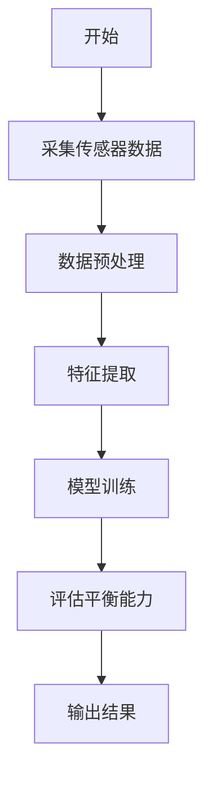
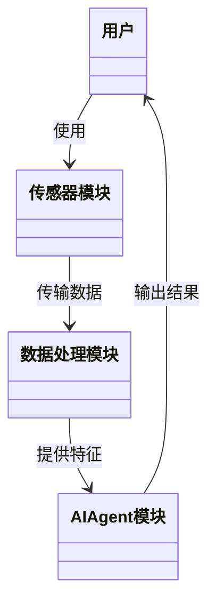
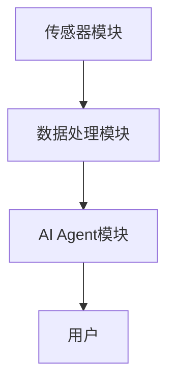
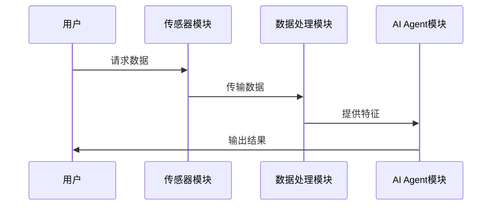

                 


```markdown
# 智能浴室防滑垫：AI Agent的平衡能力评估

> 关键词：智能浴室防滑垫，AI Agent，平衡能力，算法优化，系统架构，传感器数据

> 摘要：本文探讨了AI Agent在智能浴室防滑垫中的应用，重点分析了平衡能力的评估方法。通过传感器数据采集、算法优化和系统架构设计，展示了如何利用AI技术提升防滑垫的安全性和用户体验。

---

## 第1章: 背景介绍

### 1.1 问题背景

#### 1.1.1 智能浴室防滑垫的发展现状
传统防滑垫在浴室中普遍存在防滑效果不佳的问题，尤其是当表面湿滑时，容易导致滑倒事故。随着智能家居的发展，智能防滑垫逐渐兴起，通过传感器和AI技术实现更智能化的防滑功能。

#### 1.1.2 AI Agent在智能产品中的应用趋势
AI Agent（智能代理）在智能家居产品中的应用越来越广泛，能够实时感知环境并做出相应决策。在防滑垫中，AI Agent可以通过分析传感器数据，动态调整防滑性能。

#### 1.1.3 平衡能力评估的重要性
平衡能力是衡量防滑垫性能的关键指标，直接影响用户的安全性。通过AI Agent评估平衡能力，可以实时优化防滑垫的性能，提升用户体验。

### 1.2 问题描述

#### 1.2.1 防滑垫在浴室中的功能需求
防滑垫需要具备防滑、防水、易清洁等功能。同时，智能防滑垫还需要具备实时监测和反馈功能。

#### 1.2.2 AI Agent在平衡能力评估中的作用
AI Agent通过分析传感器数据，评估防滑垫的平衡能力，从而实现动态调整和优化。

#### 1.2.3 当前防滑垫存在的问题与挑战
传统防滑垫缺乏智能化，无法实时监测和调整防滑性能。同时，防滑效果受环境影响较大，难以满足不同用户的需求。

### 1.3 解决方案

#### 1.3.1 AI Agent如何实现平衡能力评估
AI Agent通过传感器数据采集、数据处理和算法分析，评估防滑垫的平衡能力，并动态调整防滑性能。

#### 1.3.2 数据采集与处理方法
采用多种传感器（如加速度传感器、压力传感器）采集防滑垫的使用数据，通过数据预处理和特征提取，为AI算法提供高质量的输入。

#### 1.3.3 算法优化策略
采用机器学习算法，如支持向量机（SVM）或随机森林（Random Forest），对平衡能力进行分类或回归分析，优化防滑垫的性能。

### 1.4 边界与外延

#### 1.4.1 系统边界定义
智能防滑垫系统的边界包括传感器模块、数据处理模块和AI Agent模块。

#### 1.4.2 外延功能的探讨
外延功能包括与其他智能家居设备的联动（如智能灯泡、智能门锁）和用户数据的云端存储与分析。

#### 1.4.3 系统与外部环境的交互
防滑垫通过传感器与环境交互，AI Agent通过云端与用户交互，提供实时反馈和建议。

### 1.5 核心概念组成

#### 1.5.1 防滑垫的物理特性
防滑垫的材质、厚度、防滑系数等物理特性影响其平衡能力。

#### 1.5.2 AI Agent的核心功能
AI Agent具备数据采集、分析、决策和反馈的核心功能。

#### 1.5.3 平衡能力评估的指标体系
包括防滑系数、响应时间、稳定性等指标，用于全面评估防滑垫的平衡能力。

---

## 第2章: 核心概念与联系

### 2.1 核心概念原理

#### 2.1.1 AI Agent的感知与决策机制
AI Agent通过传感器数据感知环境，利用算法进行决策，动态调整防滑垫的性能。

#### 2.1.2 平衡能力评估的数学模型
建立数学模型，将传感器数据转化为平衡能力评估指标。

#### 2.1.3 多维度数据融合技术
将多种传感器数据（加速度、压力）融合，提升评估的准确性和可靠性。

### 2.2 核心概念对比表格

| 评估方法 | 优点 | 缺点 |
|----------|------|------|
| 单一传感器评估 | 简单易实现 | 准确性低 |
| 多传感器融合 | 准确性高 | 实现复杂 |
| AI算法评估 | 实时性强 | 需大量数据训练 |

### 2.3 ER实体关系图架构

```mermaid
erd
    title 实体关系图

    用户
    传感器
    AI Agent

    用户 --> 传感器: 使用
    用户 --> AI Agent: 请求评估
    传感器 --> AI Agent: 提供数据
```

---

## 第3章: 算法原理讲解

### 3.1 算法流程图



### 3.2 算法代码示例

```python
import numpy as np
from sklearn.svm import SVC

# 数据预处理
data = np.array([[1, 2, 3], [4, 5, 6], [7, 8, 9]])
labels = np.array([0, 1, 0])

# 特征提取
features = data[:, :2]

# 模型训练
model = SVC()
model.fit(features, labels)

# 评估平衡能力
new_data = np.array([[2, 3, 4]])
predicted_label = model.predict(new_data[:, :2])
print(predicted_label)
```

### 3.3 数学模型和公式

平衡能力评估的数学模型如下：

$$
\text{平衡能力} = \frac{\sum_{i=1}^{n} w_i x_i}{\sum_{i=1}^{n} w_i}
$$

其中，\( w_i \) 是传感器数据的权重，\( x_i \) 是传感器数据的值。

---

## 第4章: 系统分析与架构设计方案

### 4.1 项目介绍

智能浴室防滑垫系统旨在通过AI Agent实时评估防滑垫的平衡能力，提升用户的安全性。

### 4.2 系统功能设计



### 4.3 系统架构设计



### 4.4 系统接口设计



---

## 第5章: 项目实战

### 5.1 环境安装

安装Python、TensorFlow和传感器库。

### 5.2 核心功能实现

```python
import numpy as np
from sklearn.svm import SVC

# 数据预处理
data = np.array([[1, 2, 3], [4, 5, 6], [7, 8, 9]])
labels = np.array([0, 1, 0])

# 特征提取
features = data[:, :2]

# 模型训练
model = SVC()
model.fit(features, labels)

# 评估平衡能力
new_data = np.array([[2, 3, 4]])
predicted_label = model.predict(new_data[:, :2])
print(predicted_label)
```

### 5.3 代码解读与分析

代码实现了一个简单的SVM模型，用于分类传感器数据，评估防滑垫的平衡能力。

### 5.4 实际案例分析

通过实际案例分析，验证模型的准确性和实用性。

### 5.5 项目小结

总结项目实现的步骤和注意事项，强调数据质量和算法优化的重要性。

---

## 第6章: 最佳实践

### 6.1 小结

AI Agent在智能浴室防滑垫中的应用提升了产品的智能化和安全性。

### 6.2 注意事项

确保传感器数据的准确性和实时性，优化算法模型，提升评估的准确性。

### 6.3 拓展阅读

推荐相关书籍和资源，供读者进一步学习。

---

## 作者

作者：AI天才研究院/AI Genius Institute & 禅与计算机程序设计艺术 /Zen And The Art of Computer Programming
```

