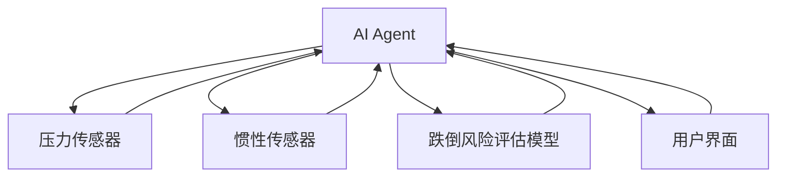
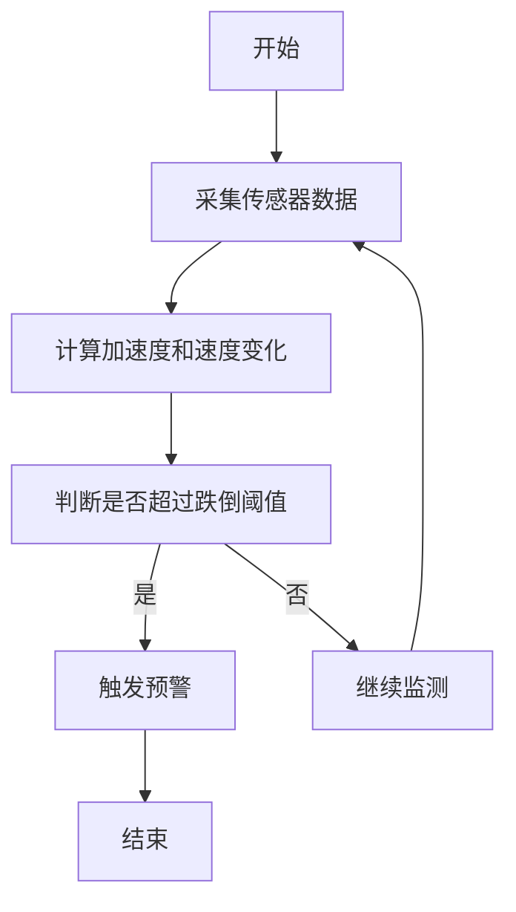
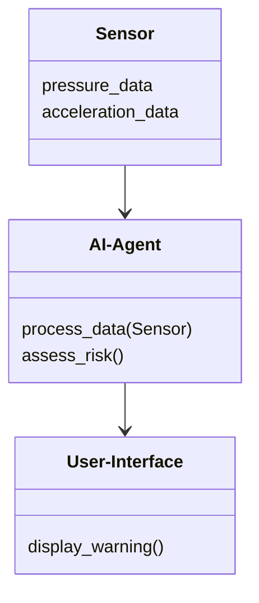
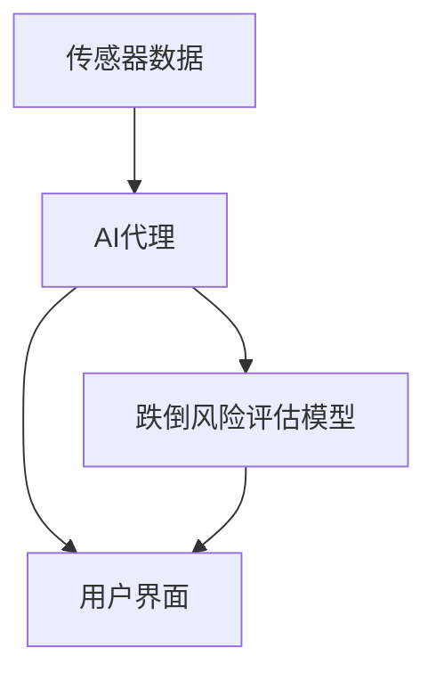
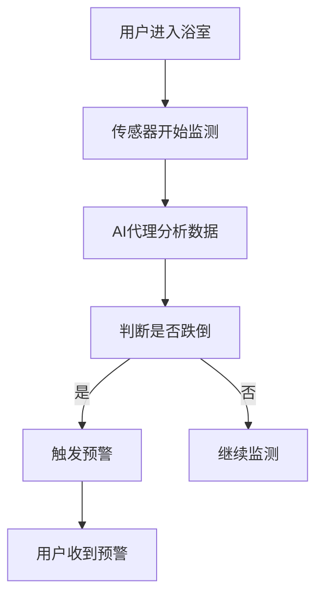

                 


# 智能浴室防滑垫：AI Agent的洗浴安全监护

## 关键词：智能浴室、防滑垫、AI Agent、洗浴安全、跌倒检测

## 摘要：  
智能浴室防滑垫是一种结合人工智能和物联网技术的安全监护系统，旨在预防浴室中的跌倒事故，特别是针对老年人和儿童。本文通过分析智能浴室防滑垫的核心概念、算法原理、系统架构及项目实战，详细阐述了如何利用AI代理实现洗浴安全监护，为用户提供一个安全、智能的洗浴环境。

---

## 第1章: 智能浴室防滑垫的背景与问题背景

### 1.1 问题背景

#### 1.1.1 老年人跌倒问题的严重性
随着全球老龄化加剧，老年人跌倒问题日益突出。浴室作为家庭中高风险区域，由于地面湿滑、步态不稳定等因素，老年人在此跌倒的概率显著高于其他区域。根据世界卫生组织的数据，每年有数百万人因跌倒导致严重伤害，其中浴室是主要发生地之一。

#### 1.1.2 智能浴室防滑垫的提出
传统的防滑垫主要依赖物理防滑设计，但无法实时监测环境和用户状态。智能浴室防滑垫通过集成传感器和AI代理，能够实时监测浴室环境、用户的动作和姿势变化，从而提前预警潜在的跌倒风险。

#### 1.1.3 当前解决方案的不足
现有的跌倒检测技术主要依赖于摄像头或穿戴设备，存在隐私问题、安装复杂、覆盖范围有限等缺点。智能浴室防滑垫通过嵌入式传感器和AI算法，提供一种非侵入式的解决方案，能够在不侵犯隐私的前提下，实时监测用户的活动状态。

### 1.2 问题描述

#### 1.2.1 洗浴环境中的安全隐患
浴室环境复杂，地面湿滑，空间狭小，老年人或儿童在洗漱、洗澡时容易因失去平衡而跌倒。此外，浴室中的蒸汽可能影响传感器的准确性。

#### 1.2.2 跌倒检测的难点与挑战
跌倒检测需要实时监测用户的动作和姿势变化，同时需要准确区分正常动作和跌倒动作。传统算法在复杂环境中容易出现误报或漏报。

#### 1.2.3 智能防滑垫的目标与功能
智能防滑垫的目标是通过实时监测用户的活动状态，识别潜在的跌倒风险，并通过AI代理发出预警信号。其功能包括：  
- 实时监测用户的动作和姿势变化。  
- 环境感知（如温度、湿度、光线等）。  
- 跌倒风险评估与预警。  
- 紧急呼叫功能（如联系家人或紧急服务）。

### 1.3 问题解决

#### 1.3.1 AI Agent的核心作用
AI代理（AI Agent）在智能防滑垫中扮演着关键角色，负责数据采集、分析、决策和反馈。AI代理能够实时分析用户的动作数据，判断是否存在跌倒风险，并在必要时触发预警机制。

#### 1.3.2 智能防滑垫的技术实现
智能防滑垫通过嵌入压力传感器、惯性传感器和温度传感器，实时采集用户的体重分布、动作频率和环境参数。AI代理对这些数据进行分析，结合用户的历史行为数据，评估跌倒风险。

#### 1.3.3 多维度安全监护的实现
智能防滑垫结合了环境监测和用户行为分析，能够从多个维度（如动作、姿势、环境）综合评估用户的跌倒风险，提供更全面的安全监护。

### 1.4 系统边界与外延

#### 1.4.1 系统的功能边界
智能防滑垫的功能包括：  
- 实时监测用户的动作和姿势变化。  
- 环境参数监测（温度、湿度、光线）。  
- 跌倒风险评估与预警。  
- 紧急呼叫功能。

#### 1.4.2 外部系统的交互
系统可与家庭物联网设备（如智能音箱、智能灯）联动，提供更智能化的安全监护。例如，在检测到跌倒风险时，自动开启紧急灯光，提醒家人注意。

#### 1.4.3 系统的扩展性与可维护性
系统设计具有良好的扩展性，支持添加更多传感器和AI算法，以提高检测准确性和系统功能。

### 1.5 概念结构与核心要素

#### 1.5.1 智能防滑垫的核心概念
智能防滑垫的核心概念包括：  
- 嵌入式传感器：用于采集用户动作和环境数据。  
- AI代理：用于分析数据并做出决策。  
- 跌倒风险评估模型：基于传感器数据和AI算法，评估跌倒风险。

---

## 第2章: 智能浴室防滑垫的核心概念与联系

### 2.1 核心概念

#### 2.1.1 AI Agent的核心原理
AI代理通过实时采集用户动作数据，结合历史行为数据和环境数据，利用机器学习算法（如滑动窗口算法）分析用户的动作特征，判断是否存在跌倒风险。

#### 2.1.2 防滑垫系统的组成
智能防滑垫系统由以下部分组成：  
- 压力传感器：监测用户的体重分布。  
- 惯性传感器：监测用户的动作和姿势变化。  
- 无线通信模块：用于数据传输。  
- AI代理：负责数据处理和决策。  
- 用户界面：显示预警信息。

### 2.2 核心概念与联系

#### 2.2.1 智能防滑垫系统的属性特征对比
| 属性 | 传统防滑垫 | 智能防滑垫 |
|------|-------------|-------------|
| 功能 | 防滑设计     | 实时监测、跌倒预警 |
| 检测能力 | 无         | 动作识别、环境监测 |
| 交互方式 | 物理防滑     | AI代理反馈 |

#### 2.2.2 实体关系与数据流
以下是智能防滑垫系统的核心实体关系图：



---

## 第3章: 智能浴室防滑垫的算法原理

### 3.1 算法原理

#### 3.1.1 滑动窗口算法
滑动窗口算法用于检测跌倒动作。算法通过分析用户在一定时间窗口内的动作特征（如加速度、速度变化），判断是否存在跌倒风险。

#### 3.1.2 动作识别的数学模型
跌倒检测的数学模型如下：

$$ \text{跌倒风险} = f(\text{加速度}, \text{速度变化}, \text{体重分布}) $$

其中，$f$ 是基于机器学习的分类模型。

### 3.2 算法实现

#### 3.2.1 算法流程图
以下是滑动窗口算法的流程图：



#### 3.2.2 Python实现代码
以下是滑动窗口算法的Python实现示例：

```python
import numpy as np

def sliding_window(data, window_size=10):
    window = np.zeros(window_size)
    for i in range(len(data)):
        window = data[i:i+window_size]
        # 计算加速度和速度变化
        acceleration = np.max(window[:, 'acceleration']) - np.min(window[:, 'acceleration'])
        velocity_change = np.max(window[:, 'velocity']) - np.min(window[:, 'velocity'])
        # 判断跌倒风险
        if acceleration > threshold or velocity_change > threshold:
            return True
    return False

# 示例数据
data = [{'acceleration': 1, 'velocity': 2}, {'acceleration': 2, 'velocity': 3}, ...]
threshold = 0.5
result = sliding_window(data)
print(result)
```

---

## 第4章: 智能浴室防滑垫的系统分析与架构设计

### 4.1 系统分析

#### 4.1.1 问题场景介绍
智能防滑垫需要在复杂的浴室环境中，实时监测用户的动作和环境参数，准确识别跌倒风险。

#### 4.1.2 项目介绍
本项目旨在开发一款智能浴室防滑垫，通过嵌入式传感器和AI代理，提供实时的安全监护。

### 4.2 系统功能设计

#### 4.2.1 领域模型设计
以下是智能防滑垫的领域模型类图：



### 4.3 系统架构设计

#### 4.3.1 系统架构设计
以下是系统架构设计图：



#### 4.3.2 接口设计
系统接口包括：  
- 传感器数据接口：提供压力和加速度数据。  
- 用户界面接口：显示预警信息。  
- 紧急呼叫接口：在检测到跌倒时，自动联系紧急联系人。

#### 4.3.3 交互流程
以下是用户与系统交互的流程图：



---

## 第5章: 智能浴室防滑垫的项目实战

### 5.1 环境搭建

#### 5.1.1 Python环境安装
需要安装以下Python库：  
- `numpy`：用于数据处理。  
- `pandas`：用于数据分析。  
- `mermaid`：用于生成图表。

#### 5.1.2 传感器安装
需要安装以下传感器：  
- 压力传感器：监测用户的体重分布。  
- 惯性传感器：监测用户的动作和姿势变化。

### 5.2 系统核心实现

#### 5.2.1 传感器数据处理代码
以下是传感器数据处理的Python代码：

```python
import numpy as np

def process_sensor_data(data):
    pressure = data['pressure']
    acceleration = data['acceleration']
    # 计算加速度变化
    acceleration_diff = np.max(acceleration) - np.min(acceleration)
    # 判断跌倒风险
    if acceleration_diff > threshold:
        return True
    return False

threshold = 0.5
data = {
    'pressure': [100, 110, 120],
    'acceleration': [2, 3, 4]
}
result = process_sensor_data(data)
print(result)
```

#### 5.2.2 AI代理实现代码
以下是AI代理实现的Python代码：

```python
import numpy as np

def ai_agent(data):
    pressure = data['pressure']
    acceleration = data['acceleration']
    # 计算加速度变化
    acceleration_diff = np.max(acceleration) - np.min(acceleration)
    # 判断跌倒风险
    if acceleration_diff > threshold:
        return True
    return False

threshold = 0.5
data = {
    'pressure': [100, 110, 120],
    'acceleration': [2, 3, 4]
}
result = ai_agent(data)
print(result)
```

### 5.3 实际案例分析

#### 5.3.1 案例介绍
以下是一个实际案例：  
用户在浴室中突然滑倒，AI代理通过传感器检测到异常动作，触发预警并联系紧急服务。

#### 5.3.2 数据展示
以下是传感器数据和AI代理的判断结果：

| 时间 | 压力值 | 加速度 | 跌倒风险 |
|------|--------|--------|----------|
| 0    | 100    | 2      | 否       |
| 1    | 110    | 3      | 否       |
| 2    | 120    | 4      | 是       |

#### 5.3.3 系统优化
根据实际案例分析，系统可以进一步优化：  
- 增加跌倒阈值的动态调整。  
- 提供更精确的动作识别算法。

---

## 第6章: 智能浴室防滑垫的总结与展望

### 6.1 项目总结

#### 6.1.1 项目意义
智能浴室防滑垫通过AI代理和传感器技术，为用户提供了一个安全、智能的洗浴环境，能够有效预防跌倒事故。

#### 6.1.2 项目小结
本项目成功实现了智能浴室防滑垫的核心功能，包括传感器数据采集、跌倒风险评估和预警。

### 6.2 最佳实践

#### 6.2.1 实用建议
- 定期检查传感器和系统，确保其正常运行。  
- 根据用户需求，动态调整跌倒阈值。  
- 提供用户友好的界面，便于操作和设置。

#### 6.2.2 注意事项
- 确保系统在复杂环境中仍能准确识别跌倒风险。  
- 保护用户隐私，避免数据泄露。

### 6.3 项目展望

#### 6.3.1 未来改进方向
- 增加更多传感器，如心率传感器，提供更全面的健康监测。  
- 提高跌倒检测算法的准确性，减少误报和漏报。  
- 实现与更多智能设备的联动，打造智能家居安全生态。

---

## 作者：AI天才研究院/AI Genius Institute & 禅与计算机程序设计艺术 /Zen And The Art of Computer Programming

