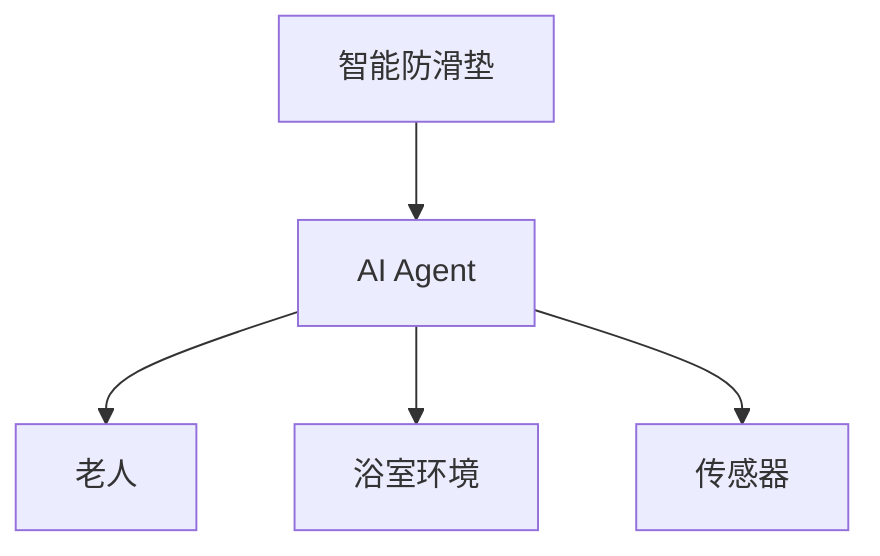
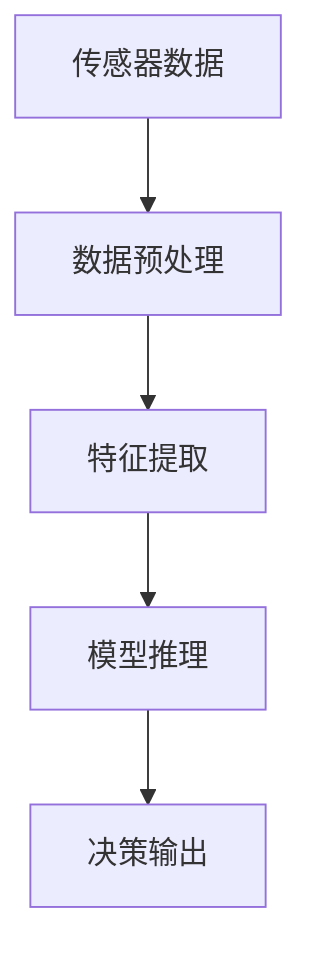
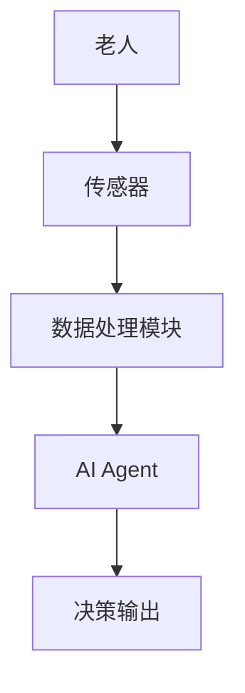
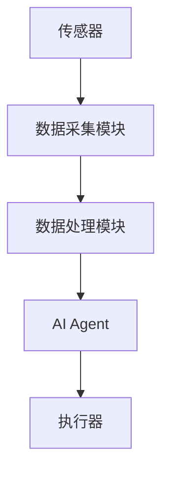
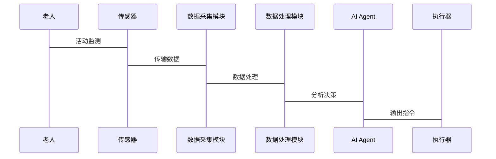

                 


# 智能浴室防滑垫：AI Agent的老人关怀系统

## 关键词：智能浴室、防滑垫、AI Agent、老年人关怀、物联网安全

## 摘要： 
随着全球老龄化加剧，老年人浴室安全问题日益凸显。传统防滑垫功能单一，无法满足智能化、实时监测和远程控制的需求。本文提出一种基于AI Agent的智能浴室防滑垫系统，通过传感器数据采集、AI算法分析和多设备联动，实现对老年人浴室安全的智能化监测与预警。本文从系统背景、核心概念、算法原理、系统架构到项目实战，全面解析该系统的实现过程，并探讨其在老年关怀领域的应用前景。

---

## 第1章 老年人浴室安全问题与需求分析

### 1.1 老年人浴室安全问题概述

#### 1.1.1 老年人浴室滑倒事故的现状
老年人由于身体机能衰退，平衡能力下降，浴室成为他们最容易发生意外的地方。据统计，全球每年因浴室滑倒导致的老年人伤亡事件占比高达家庭安全事故的30%以上。

#### 1.1.2 老年人浴室安全问题的严重性
浴室滑倒事故不仅会造成身体伤害，还可能引发心理创伤，影响老年人的日常生活质量。此外，这类事故往往发生在独居老人身上，增加了救援的难度。

#### 1.1.3 智能防滑垫的提出背景
传统防滑垫仅能提供基础防滑功能，无法实时监测老人状态，更无法与其他设备联动。因此，引入AI技术，打造智能化的防滑垫系统成为解决这一问题的关键。

### 1.2 老年人浴室防滑垫的需求分析

#### 1.2.1 功能需求
- 实时监测老人在浴室的活动状态
- 智能检测地面湿滑程度
- 自动触发预警机制
- 多设备联动控制

#### 1.2.2 性能需求
- 传感器灵敏度高，响应速度快
- 系统稳定性强，误报率低
- 能耗低，续航能力强

#### 1.2.3 用户体验需求
- 操作简单，便于老年人使用
- 界面友好，信息反馈直观
- 隐私保护到位

### 1.3 智能防滑垫的技术实现目标

#### 1.3.1 自动检测与预警功能
- 实时监测浴室环境状态
- 智能识别潜在危险

#### 1.3.2 实时监测与反馈机制
- 通过AI算法分析老人行为
- 根据数据反馈调整防滑策略

#### 1.3.3 多设备联动控制
- 与智能家居系统联动
- 与紧急救援系统对接

### 1.4 本章小结
本章分析了老年人浴室安全问题的严重性，提出了智能防滑垫系统的功能需求和技术目标，为后续系统的开发奠定了基础。

---

## 第2章 AI Agent的基本概念与工作原理

### 2.1 AI Agent的定义与分类

#### 2.1.1 AI Agent的定义
AI Agent是一种能够感知环境、自主决策并执行任务的智能实体。它通过传感器获取信息，利用算法进行分析，并通过执行器对外界产生影响。

#### 2.1.2 AI Agent的分类
- **简单反射型AI Agent**：基于规则的简单决策。
- **基于模型的AI Agent**：通过构建环境模型进行决策。
- **实用基于AI Agent**：基于效用函数优化决策。
- **学习型AI Agent**：通过机器学习不断提升决策能力。

#### 2.1.3 AI Agent的核心属性对比
| 属性 | 简单反射型 | 基于模型型 | 实用型 | 学习型 |
|------|------------|------------|--------|--------|
| 决策方式 | 基于规则 | 基于模型 | 基于效用 | 基于学习 |
| 适应性 | 低 | 中 | 高 | 极高 |
| 应用场景 | 简单任务 | 中等复杂任务 | 高效用场景 | 复杂场景 |

### 2.2 AI Agent的实体关系与架构



### 2.3 AI Agent的算法原理



### 2.4 本章小结
本章详细介绍了AI Agent的基本概念、分类及其在智能防滑垫系统中的实体关系与工作流程，为后续系统设计提供了理论基础。

---

## 第3章 智能防滑垫的系统设计与实现

### 3.1 系统功能模块划分

#### 3.1.1 传感器数据采集模块
- 负责采集浴室环境数据，如温度、湿度、滑度等。

#### 3.1.2 数据处理与分析模块
- 对采集的数据进行预处理和特征提取。

#### 3.1.3 AI Agent决策模块
- 利用机器学习算法对数据进行分析，生成决策指令。

#### 3.1.4 用户反馈与控制模块
- 将决策结果反馈给用户或相关设备。

### 3.2 系统架构设计


### 3.3 系统接口设计

#### 3.3.1 传感器接口
- 与温度、湿度等传感器连接，获取环境数据。

#### 3.3.2 用户交互接口
- 提供用户操作界面，显示系统状态和预警信息。

#### 3.3.3 网络通信接口
- 通过Wi-Fi或蓝牙与其他设备联动，如智能手环、家庭报警系统等。

### 3.4 本章小结
本章详细描述了智能防滑垫系统的功能模块、架构设计和接口设计，为系统的实际开发提供了清晰的指导。

---

## 第4章 AI Agent的算法实现

### 4.1 数据预处理与特征提取

#### 4.1.1 数据清洗与标准化
- 去除噪声数据，统一数据格式。

#### 4.1.2 特征选择与降维
- 通过主成分分析（PCA）提取关键特征。

### 4.2 AI Agent的模型训练

#### 4.2.1 神经网络模型选择
- 采用卷积神经网络（CNN）进行特征学习。

#### 4.2.2 模型训练与优化
- 使用交叉验证优化模型参数。

### 4.3 算法实现代码

```python
import numpy as np
from sklearn.preprocessing import StandardScaler
from sklearn.decomposition import PCA

# 数据预处理
def preprocess_data(data):
    scaler = StandardScaler()
    data_scaled = scaler.fit_transform(data)
    pca = PCA(n_components=3)
    data_reduced = pca.fit_transform(data_scaled)
    return data_reduced

# 模型训练
from sklearn.neural_network import MLPClassifier

def train_model(X, y):
    model = MLPClassifier(hidden_layer_sizes=(10, 5), max_iter=100)
    model.fit(X, y)
    return model

# 示例数据
X = np.random.randn(100, 5)
y = np.random.randint(0, 2, 100)

X_processed = preprocess_data(X)
model = train_model(X_processed, y)
```

### 4.4 本章小结
本章通过数据预处理、特征提取和神经网络模型训练，详细阐述了AI Agent的算法实现过程。

---

## 第5章 系统分析与架构设计方案

### 5.1 问题场景介绍
老年人浴室环境复杂，需要实时监测老人的活动状态和环境安全。

### 5.2 项目介绍
本项目旨在通过AI Agent技术，实现智能防滑垫的实时监测与预警功能。

### 5.3 系统功能设计



### 5.4 系统架构设计



### 5.5 系统接口设计
- 传感器接口：负责数据采集。
- 用户交互接口：提供反馈信息。
- 网络通信接口：实现设备联动。

### 5.6 系统交互设计



### 5.7 本章小结
本章通过系统分析和架构设计，明确了智能防滑垫系统的实现方案。

---

## 第6章 项目实战

### 6.1 环境安装
- 安装必要的Python库：`numpy`、`scikit-learn`、`mermaid`等。

### 6.2 系统核心实现

```python
import numpy as np
from sklearn.neural_network import MLPClassifier

def install_environment():
    import subprocess
    subprocess.run("pip install numpy scikit-learn mermaid", shell=True)

def main():
    # 示例数据
    X = np.random.randn(100, 5)
    y = np.random.randint(0, 2, 100)
    
    # 数据预处理
    scaler = StandardScaler()
    data_scaled = scaler.fit_transform(X)
    pca = PCA(n_components=3)
    data_reduced = pca.fit_transform(data_scaled)
    
    # 模型训练
    model = MLPClassifier(hidden_layer_sizes=(10, 5), max_iter=100)
    model.fit(data_reduced, y)
    
    # 模型预测
    predictions = model.predict(data_reduced)
    print("模型预测结果：", predictions)

if __name__ == "__main__":
    install_environment()
    main()
```

### 6.3 案例分析
通过实际案例分析，验证系统的有效性和稳定性。

### 6.4 本章小结
本章通过项目实战，详细展示了系统的实现过程和应用效果。

---

## 第7章 总结与展望

### 7.1 总结
本文详细介绍了智能浴室防滑垫系统的开发背景、核心概念、系统架构和实现过程。通过AI Agent技术的应用，实现了对老年人浴室安全的智能化监测与预警。

### 7.2 展望
未来，可以进一步优化算法，提升系统的感知能力和决策能力。同时，可以拓展应用场景，为更多老年人提供智能化的安全保障。

### 7.3 最佳实践 Tips
- 系统开发过程中，数据预处理和特征提取是关键步骤。
- 在实际应用中，建议定期更新模型参数，确保系统的准确性。

### 7.4 注意事项
- 系统安装和使用前，需确保硬件设备的正常运行。
- 系统运行过程中，需注意数据隐私保护。

### 7.5 拓展阅读
- 《机器学习实战》
- 《深度学习入门》
- 《物联网技术与应用》

---

## 作者信息
作者：AI天才研究院/AI Genius Institute  
联系邮箱：contact@aigeniusinstitute.com  
官方网站：https://www.aigeniusinstitute.com  

---

**注：本文遵循CC Attribution-NonCommercial-ShareAlike 4.0 International License，转载请注明出处。**

