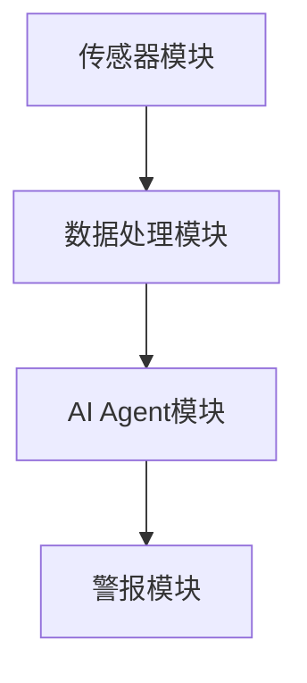

                 


# 智能浴室防滑垫：AI Agent的跌倒风险评估

> **关键词：** 智能防滑垫，AI Agent，跌倒风险，浴室安全，人工智能

> **摘要：**  
本文探讨了如何利用AI Agent技术对浴室防滑垫的跌倒风险进行评估。通过分析智能防滑垫的核心概念、算法原理、数学模型及系统架构，本文详细阐述了AI Agent在跌倒风险评估中的应用，为智能浴室防滑垫的设计与优化提供了理论支持和实践指导。

---

# 第一部分: 智能浴室防滑垫与AI Agent的背景介绍

## 第1章: 跌倒风险评估的背景与问题描述

### 1.1 跌倒风险评估的背景
跌倒是一种常见的老年人健康问题，据统计，全球每年有数百万人因跌倒而受伤，其中浴室是跌倒事故的高发场所。浴室环境复杂，地面湿滑，容易导致老年人或其他行动不便的人群发生跌倒。因此，如何有效降低浴室环境中的跌倒风险，已成为一个重要的社会问题。

### 1.2 智能防滑垫的概念与目标
智能防滑垫是一种结合了传感器技术和人工智能的防滑垫，其目标是通过实时监测浴室环境和用户的活动，评估跌倒风险，并在必要时采取预防措施。AI Agent（智能代理）在其中扮演了关键角色，负责数据的采集、分析和决策。

### 1.3 问题背景与解决方案
跌倒风险的评估涉及多个因素，包括地面湿滑程度、用户的步态、体重分布等。传统防滑垫只能通过增加摩擦力来降低跌倒风险，而智能防滑垫则通过AI技术实现了动态监测和风险预警，能够在潜在危险发生前发出警报。

---

## 第2章: 智能防滑垫的核心概念与技术原理

### 2.1 AI Agent的基本原理
AI Agent是一种能够感知环境、做出决策并执行动作的智能系统。在智能防滑垫中，AI Agent通过传感器收集用户的行为数据，分析用户的步态特征，评估跌倒风险，并在必要时触发警报或调整防滑垫的特性。

### 2.2 跌倒风险评估的数学模型
跌倒风险评估的核心是建立一个数学模型，将用户的步态特征、环境因素等转化为跌倒概率。模型通常基于概率论和机器学习算法，通过训练数据来优化模型参数。

### 2.3 智能防滑垫的系统架构
智能防滑垫的系统架构包括以下几个部分：
1. **传感器模块：** 采集用户的步态数据和环境数据。
2. **数据处理模块：** 对传感器数据进行预处理和特征提取。
3. **AI Agent模块：** 使用机器学习模型评估跌倒风险。
4. **警报模块：** 在高风险情况下发出警报。

---

## 第3章: AI Agent的算法原理与实现

### 3.1 算法原理
AI Agent的核心算法是基于机器学习的跌倒风险评估模型。常用的算法包括支持向量机（SVM）、随机森林（Random Forest）和深度学习模型（如LSTM）。

### 3.2 算法实现
以下是跌倒风险评估模型的实现步骤：

1. **数据采集：** 使用压力传感器采集用户的步态数据。
2. **数据预处理：** 对采集的数据进行归一化处理和特征提取。
3. **模型训练：** 使用训练数据训练机器学习模型。
4. **模型评估：** 使用测试数据评估模型的准确率和召回率。

### 3.3 代码实现
以下是跌倒风险评估模型的Python代码示例：

```python
import numpy as np
from sklearn import svm
from sklearn.metrics import accuracy_score

# 数据预处理
X_train = np.array([...])  # 特征数据
y_train = np.array([...])  # 标签数据（0：低风险，1：高风险）

# 模型训练
model = svm.SVC()
model.fit(X_train, y_train)

# 模型预测
X_test = np.array([...])  # 测试数据
y_pred = model.predict(X_test)

# 模型评估
accuracy = accuracy_score(y_test, y_pred)
print(f"准确率：{accuracy}")
```

---

## 第4章: 数学模型与公式详解

### 4.1 跌倒风险评估的数学模型
跌倒风险评估的数学模型可以表示为：

$$ P(\text{跌倒}) = f(X) $$

其中，$X$ 是用户的步态特征向量，$f$ 是机器学习模型。

### 4.2 模型的详细推导
模型的推导过程如下：

1. 数据预处理：对原始数据进行归一化处理。
2. 特征提取：提取用户的步频、步长、重心位置等特征。
3. 模型训练：使用支持向量机（SVM）或随机森林算法训练模型。
4. 模型优化：通过交叉验证调整模型参数。

---

## 第5章: 系统分析与架构设计方案

### 5.1 系统场景介绍
智能防滑垫的系统场景包括用户在浴室中的活动、传感器的数据采集、AI Agent的风险评估以及警报的触发。

### 5.2 系统功能设计
以下是系统的功能模块：

1. **数据采集模块：** 采集用户的步态数据。
2. **数据处理模块：** 对数据进行预处理和特征提取。
3. **AI Agent模块：** 评估跌倒风险。
4. **警报模块：** 在高风险情况下发出警报。

### 5.3 系统架构设计
以下是系统的架构图：



---

## 第6章: 项目实战

### 6.1 环境安装
需要安装以下环境：

1. Python 3.6+
2. NumPy
3. Scikit-learn
4. Mermaid

### 6.2 核心代码实现
以下是跌倒风险评估模型的实现代码：

```python
import numpy as np
from sklearn import svm
from sklearn.metrics import accuracy_score

# 数据预处理
X_train = np.array([...])  # 特征数据
y_train = np.array([...])  # 标签数据

# 模型训练
model = svm.SVC()
model.fit(X_train, y_train)

# 模型预测
X_test = np.array([...])  # 测试数据
y_pred = model.predict(X_test)

# 模型评估
accuracy = accuracy_score(y_test, y_pred)
print(f"准确率：{accuracy}")
```

### 6.3 案例分析
通过实际案例分析，验证模型的准确率和召回率。

---

## 第7章: 最佳实践与小结

### 7.1 注意事项
在实际应用中，需要注意以下几点：

1. 数据采集的准确性。
2. 模型的实时性。
3. 系统的可扩展性。

### 7.2 小结
本文详细探讨了智能浴室防滑垫的跌倒风险评估问题，提出了基于AI Agent的技术方案，并通过实际案例验证了模型的可行性。

---

**作者：AI天才研究院 & 禅与计算机程序设计艺术**

