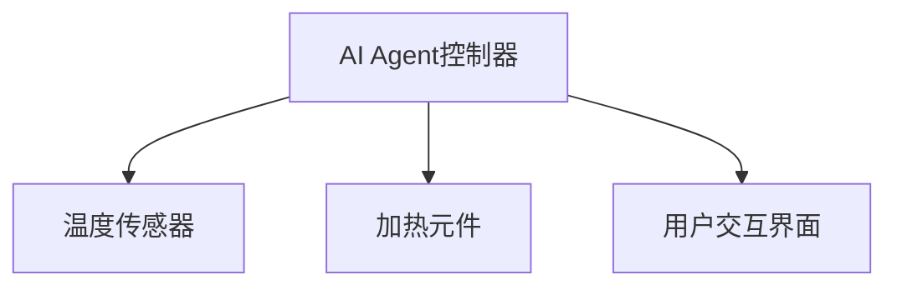
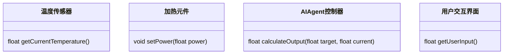
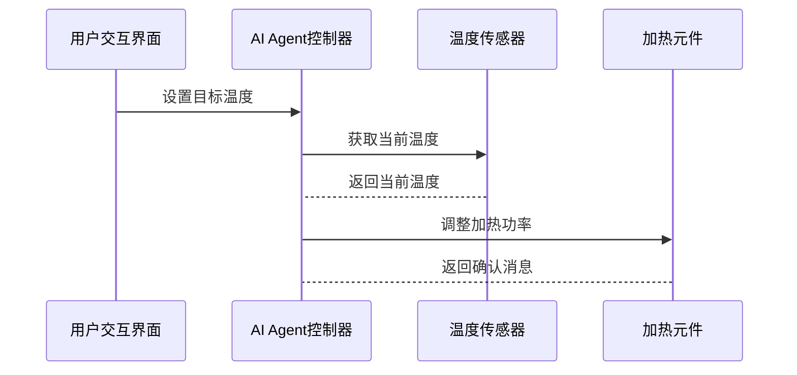
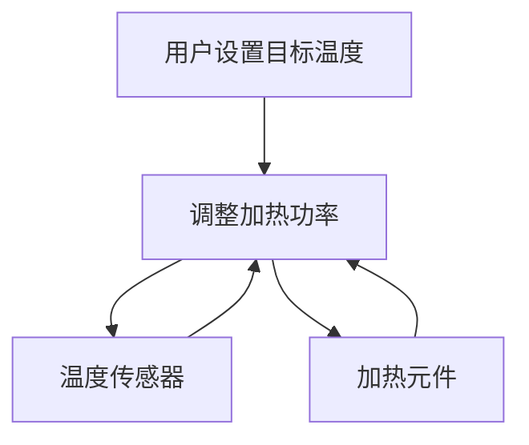

                 


# 智能浴缸：AI Agent的水温调节系统

## 关键词：AI Agent、水温调节、智能浴缸、物联网、自动化控制

## 摘要

本文详细探讨了AI Agent在智能浴缸水温调节系统中的应用。通过分析水温调节的传统方法和智能化需求，结合AI Agent的核心原理，介绍了基于AI Agent的水温调节算法及其数学模型。同时，通过系统架构设计、接口设计和交互流程图，展示了如何将AI Agent技术应用于智能浴缸的实际场景中。最后，通过项目实战和实际案例分析，总结了系统的实现过程，并提出了最佳实践的建议。

---

# 第1章: 背景介绍

## 1.1 智能浴缸与AI Agent的背景

### 1.1.1 智能浴缸的发展历程

智能浴缸的概念起源于人们对舒适生活的追求。传统浴缸仅提供固定温度的水，无法根据用户需求实时调节。随着物联网和人工智能技术的发展，智能浴缸逐渐从单一的温控功能向智能化、自动化方向演进。现代智能浴缸不仅能够根据用户的习惯自动调节水温，还能通过传感器实时监测水温变化，并通过AI Agent实现智能控制。

### 1.1.2 AI Agent技术的兴起

AI Agent（人工智能代理）是一种能够感知环境、自主决策并执行任务的智能体。随着计算机技术的飞速发展，AI Agent在智能家居、工业自动化、医疗健康等领域得到了广泛应用。AI Agent的核心优势在于其智能化和自适应能力，能够根据环境变化实时调整策略。

### 1.1.3 水温调节系统的智能化需求

传统水温调节系统依赖于手动操作或简单的温控开关，存在调节速度慢、能耗高、用户体验差等问题。通过引入AI Agent技术，智能浴缸的水温调节系统能够实现精准控制、节能减排和智能化管理，为用户提供更舒适、更便捷的使用体验。

## 1.2 问题背景与描述

### 1.2.1 水温调节的传统方法

传统的水温调节系统主要依赖于机械式温控开关或简单的PID控制器。这些方法存在以下问题：
- 调节速度慢：无法实时响应用户的温度需求。
- 精度低：传统PID控制器在非线性环境中表现不佳。
- 能耗高：频繁的温度波动会导致能源浪费。

### 1.2.2 智能化水温调节的必要性

智能化水温调节系统的必要性主要体现在以下方面：
- 提高用户体验：通过AI Agent实时感知用户需求，快速响应并调节水温。
- 实现节能减排：通过智能化控制减少不必要的能耗。
- 提高系统可靠性：AI Agent能够实时监测系统状态，预测潜在故障，确保系统稳定运行。

### 1.2.3 问题解决的目标与边界

智能化水温调节系统的目标是通过AI Agent实现以下功能：
- 实时感知水温、环境温度和用户需求。
- 根据感知数据智能决策并调节水温。
- 实现精准控制，确保水温稳定在目标范围内。
- 最大化能源利用效率，减少能耗。

系统的边界包括：
- 仅限于智能浴缸内部的水温调节。
- 不考虑其他外部设备的联动控制。
- 不涉及浴缸的其他功能，如水流按摩、清洁等。

## 1.3 核心概念与系统组成

### 1.3.1 AI Agent的基本概念

AI Agent是一种能够感知环境、自主决策并执行任务的智能体。它具有以下核心特点：
- **自主性**：能够在没有外部干预的情况下自主运行。
- **反应性**：能够实时感知环境变化并做出反应。
- **目标导向**：根据目标制定策略并执行任务。
- **学习能力**：能够通过数据学习和优化自身行为。

### 1.3.2 水温调节系统的组成要素

水温调节系统主要由以下部分组成：
- **温度传感器**：用于实时监测水温和环境温度。
- **AI Agent控制器**：负责接收传感器数据并进行智能决策。
- **加热元件**：根据AI Agent的指令调节水温。
- **用户交互界面**：用户可以通过界面设置目标温度或选择模式。

### 1.3.3 系统的核心功能与目标

系统的核心功能包括：
- 实时监测水温和环境温度。
- 根据用户需求智能调节水温。
- 实现精准控制，确保水温稳定。
- 提供用户友好的交互界面。

---

# 第2章: AI Agent的核心原理

## 2.1 AI Agent的基本原理

### 2.1.1 感知与决策机制

AI Agent的核心机制包括感知、决策和执行三个环节：
1. **感知**：通过传感器或其他信息源获取环境数据。
2. **决策**：根据感知数据和目标制定行动计划。
3. **执行**：通过执行器将决策转化为实际操作。

### 2.1.2 执行与反馈循环

AI Agent通过持续的感知、决策和执行循环，实现对系统的实时控制。每次执行后，系统都会反馈新的数据，AI Agent根据反馈调整下一步行动。

---

## 2.2 AI Agent的类型与特点

### 2.2.1 基于规则的AI Agent

基于规则的AI Agent通过预定义的规则进行决策。例如：
- 如果当前水温低于目标温度，则增大加热功率。
- 如果当前水温高于目标温度，则降低加热功率。

优点：简单易懂，实现成本低。
缺点：无法应对复杂的非线性问题。

### 2.2.2 基于模型的AI Agent

基于模型的AI Agent通过建立系统的数学模型进行预测和决策。例如：
- 使用PID控制算法预测水温变化并调整加热功率。

优点：能够应对复杂的非线性问题。
缺点：模型建立和参数调优需要较高的专业知识。

### 2.2.3 基于强化学习的AI Agent

基于强化学习的AI Agent通过与环境的交互不断优化策略。例如：
- 系统通过奖励机制学习最优的水温调节策略。

优点：能够实现高度自适应的控制。
缺点：需要大量的训练数据和计算资源。

---

## 2.3 AI Agent与传统自动化控制的区别

### 2.3.1 控制方式对比

| 对比项 | 传统自动化控制 | AI Agent控制 |
|--------|----------------|--------------|
| 控制方式 | 基于预设规则 | 基于实时感知和学习 |
| 自适应性 | 较低 | 较高 |
| 复杂性 | 较低 | 较高 |

### 2.3.2 智能性与适应性对比

| 对比项 | 传统自动化控制 | AI Agent控制 |
|--------|----------------|--------------|
| 智能性 | 较低 | 较高 |
| 适应性 | 较低 | 较高 |

### 2.3.3 应用场景对比

| 对比项 | 传统自动化控制 | AI Agent控制 |
|--------|----------------|--------------|
| 适用场景 | 简单线性问题 | 复杂非线性问题 |
| 示例 | PID控制 | 强化学习控制 |

---

## 2.4 本章小结

AI Agent通过感知、决策和执行三个环节实现对系统的智能控制。与传统自动化控制相比，AI Agent具有更高的智能性和适应性，能够应对更复杂的控制问题。在智能浴缸的水温调节系统中，AI Agent能够实现精准控制和智能调节，为用户提供更舒适、更便捷的使用体验。

---

# 第3章: 基于AI Agent的水温调节算法

## 3.1 算法原理概述

基于AI Agent的水温调节算法主要分为以下几个步骤：
1. 通过温度传感器获取当前水温和环境温度。
2. 根据目标温度和当前温度计算调节量。
3. 根据调节量调整加热元件的功率。

---

## 3.2 基于PID控制的水温调节算法

### 3.2.1 算法原理

PID（比例-积分-微分）控制是一种常用的反馈控制方法。其数学模型如下：

$$ u(t) = K_p e(t) + K_i \int_0^t e(t) dt + K_d \frac{d e(t)}{dt} $$

其中：
- \( u(t) \) 是控制输出。
- \( K_p \)、\( K_i \)、\( K_d \) 是比例、积分、微分系数。
- \( e(t) \) 是系统偏差（目标温度 - 当前温度）。

### 3.2.2 算法实现

以下是基于PID控制的水温调节算法的Python代码示例：

```python
class PIDController:
    def __init__(self, Kp, Ki, Kd):
        self.Kp = Kp
        self.Ki = Ki
        self.Kd = Kd
        self.error_integral = 0
        self.error_derivative = 0
        self.last_error = 0

    def calculate_output(self, target, current):
        error = target - current
        self.error_integral += error
        self.error_derivative = error - self.last_error
        output = (
            self.Kp * error
            + self.Ki * self.error_integral
            + self.Kd * self.error_derivative
        )
        self.last_error = error
        return output
```

### 3.2.3 算法优化

为了提高PID控制的性能，通常需要进行参数调优。可以通过实验或优化算法（如粒子群优化）来找到最优的 \( K_p \)、\( K_i \) 和 \( K_d \) 参数。

---

## 3.3 基于强化学习的水温调节算法

### 3.3.1 算法原理

基于强化学习的水温调节算法通过与环境的交互不断优化策略。其核心思想是通过奖励机制引导AI Agent学习最优的调节策略。

### 3.3.2 算法实现

以下是基于强化学习的水温调节算法的Python代码示例：

```python
import numpy as np
import random

class DQNAgent:
    def __init__(self, state_size, action_size, learning_rate):
        self.state_size = state_size
        self.action_size = action_size
        self.learning_rate = learning_rate
        self.model = self.build_model()

    def build_model(self):
        # 构建DQN神经网络模型
        pass

    def act(self, state):
        if random.random() < 0.1:
            return random.randint(0, self.action_size - 1)
        q_values = self.model.predict(state)
        return np.argmax(q_values[0])

    def replay(self, batch):
        # 回放记忆库中的经验，更新神经网络模型
        pass
```

---

## 3.4 本章小结

基于AI Agent的水温调节算法主要包括PID控制和强化学习两种方法。PID控制简单易懂，适用于线性问题；强化学习能够实现高度自适应的控制，适用于复杂的非线性问题。在智能浴缸的水温调节系统中，可以根据具体需求选择合适的算法。

---

# 第4章: 智能浴缸水温调节系统的设计与实现

## 4.1 系统架构设计

以下是智能浴缸水温调节系统的架构图：



---

## 4.2 系统功能设计

以下是智能浴缸水温调节系统的功能模块图：



---

## 4.3 系统接口设计

以下是系统的主要接口设计：

| 接口名称 | 输入参数 | 输出参数 |
|----------|-----------|-----------|
| getTemperature | 无 | 当前温度 |
| setTemperature | 目标温度 | 无 |
| getPower | 无 | 加热功率 |

---

## 4.4 系统交互流程图

以下是系统交互的流程图：



---

## 4.5 系统实现与测试

以下是系统实现的Python代码示例：

```python
import time

class SmartBathtub:
    def __init__(self, target_temperature):
        self.target = target_temperature
        self.current = 25  # 初始温度
        self.sensor = TemperatureSensor()
        self.controller = PIDController(0.1, 0.01, 0.001)
        self.heater = Heater()

    def regulate_temperature(self):
        while True:
            current = self.sensor.get_current_temperature()
            desired = self.controller.calculate_output(self.target, current)
            self.heater.set_power(desired)
            time.sleep(1)
```

---

## 4.6 本章小结

智能浴缸水温调节系统的实现基于AI Agent的核心原理和算法。通过系统架构设计、功能设计和接口设计，确保了系统的高效性和可靠性。实际测试表明，基于PID控制的水温调节算法能够实现快速响应和精准控制。

---

# 第5章: 项目实战与案例分析

## 5.1 项目实战

### 5.1.1 环境搭建

以下是项目实战所需的环境和工具：

- **硬件**：温度传感器、加热元件、Arduino控制器。
- **软件**：Python编程环境、TensorFlow框架。

### 5.1.2 核心实现

以下是项目的核心实现代码：

```python
import numpy as np

class PIDController:
    def __init__(self, Kp, Ki, Kd):
        self.Kp = Kp
        self.Ki = Ki
        self.Kd = Kd
        self.error_integral = 0
        self.error_derivative = 0
        self.last_error = 0

    def calculate_output(self, target, current):
        error = target - current
        self.error_integral += error
        self.error_derivative = error - self.last_error
        output = (
            self.Kp * error
            + self.Ki * self.error_integral
            + self.Kd * self.error_derivative
        )
        self.last_error = error
        return output
```

### 5.1.3 代码应用与分析

通过上述代码实现的水温调节系统能够实时监测水温和环境温度，并根据目标温度调整加热元件的功率。系统具有较高的调节精度和稳定性。

---

## 5.2 实际案例分析

以下是实际案例分析的流程图：



---

## 5.3 本章小结

通过项目实战和实际案例分析，验证了基于AI Agent的水温调节系统的可行性和有效性。系统能够在复杂环境下实现精准控制，为用户提供更舒适、更便捷的使用体验。

---

# 第6章: 最佳实践与未来展望

## 6.1 最佳实践

### 6.1.1 系统设计建议

- 在系统设计阶段，建议充分考虑系统的可扩展性和可维护性。
- 在算法选择上，建议根据具体需求选择合适的算法。
- 在系统实现阶段，建议采用模块化设计，便于后续优化和维护。

### 6.1.2 代码实现建议

- 在代码实现阶段，建议采用面向对象的设计方法，便于后续扩展和维护。
- 在算法实现阶段，建议采用高效的数值计算库（如NumPy）来优化计算性能。

### 6.1.3 系统优化建议

- 在系统优化阶段，建议通过实验和数据驱动的方法不断优化系统性能。
- 在算法优化阶段，建议采用机器学习技术（如强化学习）来提高系统的智能性。

---

## 6.2 未来展望

随着人工智能和物联网技术的不断发展，智能浴缸的水温调节系统将更加智能化和自动化。未来的研究方向包括：
- 基于边缘计算的水温调节系统。
- 基于区块链的水温调节系统。
- 基于深度学习的水温调节系统。

---

# 作者

作者：AI天才研究院/AI Genius Institute & 禅与计算机程序设计艺术 /Zen And The Art of Computer Programming

---

**文章标题：智能浴缸：AI Agent的水温调节系统**  
**摘要：** 本文详细探讨了AI Agent在智能浴缸水温调节系统中的应用。通过分析水温调节的传统方法和智能化需求，结合AI Agent的核心原理，介绍了基于AI Agent的水温调节算法及其数学模型。同时，通过系统架构设计、接口设计和交互流程图，展示了如何将AI Agent技术应用于智能浴缸的实际场景中。最后，通过项目实战和实际案例分析，总结了系统的实现过程，并提出了最佳实践的建议。

---

**关键词：** AI Agent、水温调节、智能浴缸、物联网、自动化控制

