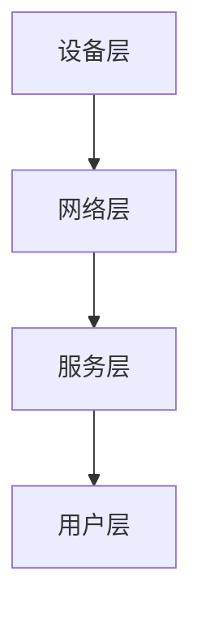
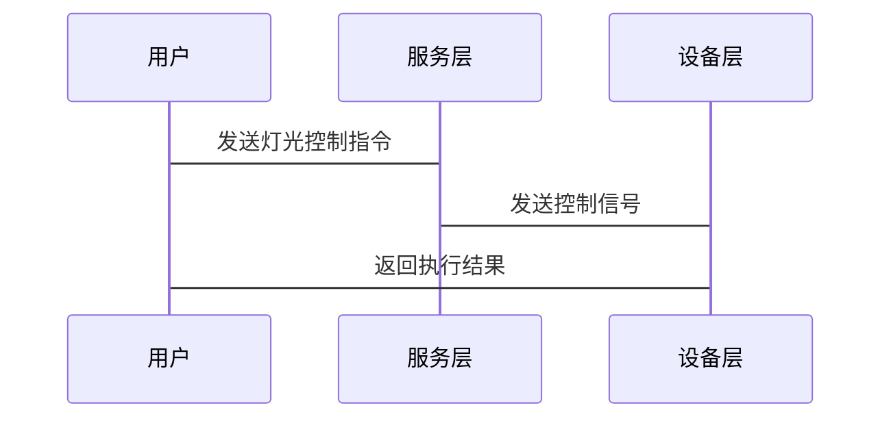

                 


# 智能灯光控制：AI Agent的情境感知系统

## 关键词：智能灯光控制，AI Agent，情境感知，智能家居，物联网，算法原理

## 摘要：
本文探讨了AI Agent在智能灯光控制中的应用，重点分析了情境感知系统的核心原理与实现。通过背景介绍、核心概念、算法原理、系统架构、项目实战和总结等部分，详细阐述了如何利用AI技术提升智能灯光控制的智能化水平。文章结合理论与实践，为读者提供了从基础到应用的全面指导。

---

## 第一部分：背景与概述

### 第1章：智能灯光控制与AI Agent概述

#### 1.1 智能灯光控制的背景与现状
智能家居的普及推动了智能灯光控制的发展。传统灯光控制存在手动操作繁琐、能源浪费等问题，而智能灯光控制通过物联网技术实现了远程控制和自动化管理，但现有系统在情境感知和个性化需求方面仍有不足。

#### 1.2 AI Agent在智能灯光控制中的应用
AI Agent（智能代理）是一种能够感知环境并主动执行任务的智能体。在智能灯光控制中，AI Agent通过情境感知技术，能够理解用户需求和环境变化，从而实现更智能的灯光调节。

#### 1.3 情境感知系统的基本原理
情境感知系统通过收集环境数据（如时间、位置、用户行为等），结合AI算法，推断出用户的意图并做出相应的决策。例如，当用户在晚上阅读时，系统会自动调整灯光亮度以提供最佳阅读体验。

#### 1.4 本章小结
智能灯光控制的背景与现状、AI Agent的核心概念以及情境感知系统的基本原理为后续章节奠定了基础。

---

## 第二部分：核心概念与技术原理

### 第2章：AI Agent与情境感知系统的核心概念

#### 2.1 AI Agent的基本原理
AI Agent由感知模块、推理模块和执行模块组成。感知模块负责收集环境数据，推理模块基于数据进行意图推理，执行模块根据推理结果执行操作。

#### 2.2 情境感知系统的原理与实现
情境感知系统通过多模态数据融合（如用户行为、环境光线、时间等）进行情境推断。基于规则的推理和基于机器学习的推理是两种主要的实现方式。

#### 2.3 情境感知与智能灯光控制的关系
情境感知是智能灯光控制的“大脑”，通过理解用户需求和环境变化，实现智能化的灯光调节。

#### 2.4 本章小结
本章详细阐述了AI Agent和情境感知系统的核心概念及其在智能灯光控制中的作用。

---

## 第三部分：算法原理与数学模型

### 第3章：情境感知算法的原理与实现

#### 3.1 情境感知算法的基本原理
情境感知算法通过数据采集、特征提取、情境推理和决策控制四个步骤实现。数据采集包括用户行为、环境光线等多模态数据。

#### 3.2 基于AI的意图推理算法
意图推理算法基于条件概率模型，通过贝叶斯网络进行推理。例如，当用户在晚上9点阅读书籍时，系统推断用户的意图是阅读。

#### 3.3 基于情境的决策控制算法
决策控制算法根据推理结果和环境状态，生成最优的灯光控制策略。例如，当用户进入睡眠状态时，系统会关闭所有灯光。

#### 3.4 本章小结
本章详细介绍了情境感知算法的原理与实现，重点讲解了意图推理和决策控制的核心算法。

---

## 第四部分：系统架构与设计

### 第4章：智能灯光控制系统的架构设计

#### 4.1 系统架构概述
智能灯光控制系统由设备层（智能灯泡、传感器）、网络层（物联网通信）、服务层（AI Agent）和用户层（移动App）组成。

#### 4.2 系统功能设计
- 设备层：负责采集环境数据和执行灯光控制。
- 网络层：负责数据传输和设备间的通信。
- 服务层：负责情境感知和决策控制。
- 用户层：提供用户交互界面。

#### 4.3 系统架构图


#### 4.4 系统接口设计
系统接口包括设备接口（与智能灯泡通信）和用户接口（与移动App交互）。

#### 4.5 系统交互流程图


#### 4.6 本章小结
本章详细设计了智能灯光控制系统的架构，并通过mermaid图展示了系统的交互流程。

---

## 第五部分：项目实战

### 第5章：智能灯光控制系统的实现

#### 5.1 环境安装
安装Python、TensorFlow、OpenCV等开发工具，搭建AI开发环境。

#### 5.2 核心代码实现
```python
import tensorflow as tf
from tensorflow.keras import layers

# 定义意图推理模型
class IntentionInferenceModel(tf.keras.Model):
    def __init__(self):
        super(IntentionInferenceModel, self).__init__()
        self.dense1 = layers.Dense(64, activation='relu')
        self.dense2 = layers.Dense(1, activation='sigmoid')

    def call(self, inputs):
        x = self.dense1(inputs)
        x = self.dense2(x)
        return x
```

#### 5.3 代码解读与分析
上述代码定义了一个简单的意图推理模型，通过神经网络实现情境感知。

#### 5.4 实际案例分析
以用户在晚上阅读时的灯光调节为例，系统会自动调整灯光亮度，提供最佳阅读体验。

#### 5.5 本章小结
本章通过实际项目实战，详细讲解了智能灯光控制系统的实现过程。

---

## 第六部分：总结与展望

### 第6章：总结与展望

#### 6.1 本章小结
智能灯光控制通过AI Agent和情境感知技术，实现了更智能化的灯光调节。本文详细探讨了其核心原理、系统架构和实现方法。

#### 6.2 未来展望
未来，随着AI技术的进步，智能灯光控制系统将更加智能化和个性化，例如结合更多传感器数据和用户行为分析，提供更精准的情境感知服务。

---

## 作者：AI天才研究院/AI Genius Institute & 禅与计算机程序设计艺术 /Zen And The Art of Computer Programming

