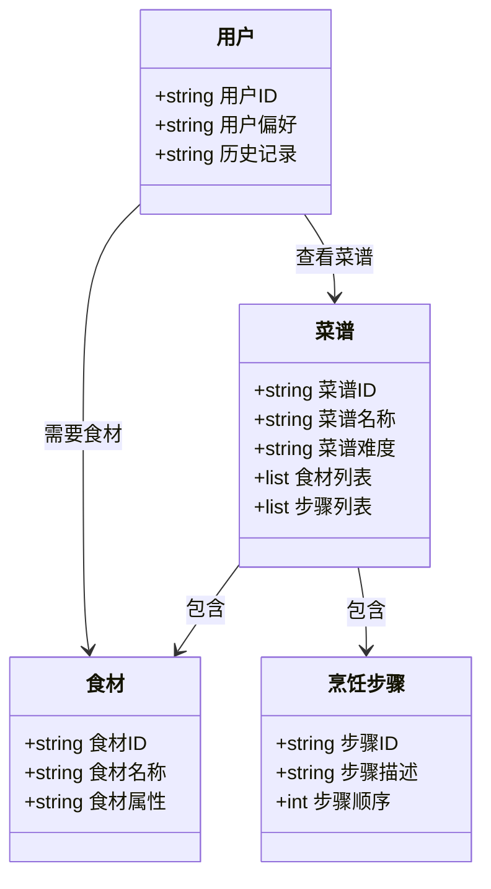
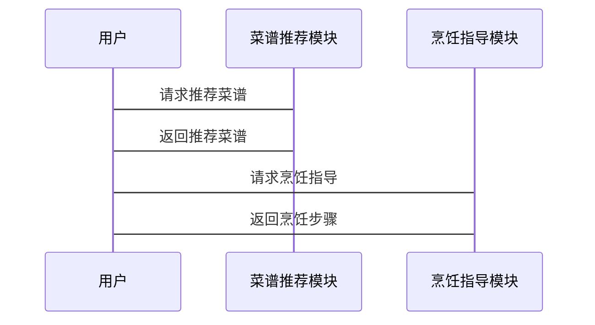

                 


# 智能烹饪台：AI Agent的厨艺提升指导系统

> 关键词：智能烹饪台、AI Agent、厨艺提升、推荐系统、算法原理、系统架构

> 摘要：本文详细探讨了智能烹饪台结合AI Agent的厨艺提升指导系统，从背景介绍、核心概念、算法原理到系统架构设计，再到项目实战与最佳实践，全面剖析了该系统的构建过程与实现细节。

---

# 第一部分: 背景与核心概念

# 第1章: 智能烹饪台与AI Agent的背景介绍

## 1.1 问题背景与需求分析

### 1.1.1 烹饪过程中的常见问题
现代烹饪过程中，用户常常面临以下问题：
- **食材搭配不当**：缺乏对食材属性的深度理解，导致菜品口感不佳或失败。
- **步骤复杂难懂**：传统菜谱的步骤描述不够直观，导致用户难以理解和操作。
- **个性化需求未满足**：不同用户有不同的口味偏好和烹饪技能水平，通用菜谱难以满足个性化需求。
- **数据孤岛问题**：食材、菜谱、用户偏好等数据分散，缺乏系统化的整合与利用。

### 1.1.2 AI在烹饪中的潜在价值
AI技术的引入，为烹饪领域的智能化提供了新的可能性：
- **智能化推荐**：通过分析用户的饮食偏好和历史行为，推荐个性化菜谱。
- **实时反馈优化**：通过实时监测烹饪过程，提供动态反馈和调整建议。
- **知识图谱构建**：利用AI技术构建食材、菜谱、烹饪技巧等知识图谱，提升用户的学习效率。
- **多模态交互**：支持语音、视觉等多种交互方式，提升用户体验。

### 1.1.3 智能烹饪台的定义与目标
智能烹饪台是一种结合AI技术的智能设备，旨在通过AI Agent提供个性化的烹饪指导，帮助用户提升厨艺水平。其目标是：
- 提供智能化的烹饪建议和步骤指导。
- 根据用户偏好推荐最优菜谱。
- 实时监测烹饪过程，优化烹饪结果。
- 支持多模态交互，提升用户体验。

---

## 1.2 核心概念与系统架构

### 1.2.1 AI Agent在烹饪中的角色
AI Agent在智能烹饪台中的角色可以分为以下几个方面：
- **数据采集**：收集用户的烹饪偏好、历史行为、设备数据等信息。
- **知识库构建**：整合食材属性、菜谱知识、烹饪技巧等数据，构建烹饪知识图谱。
- **个性化推荐**：基于用户数据和知识图谱，推荐个性化菜谱和步骤。
- **实时指导**：通过实时监测烹饪过程，提供动态反馈和优化建议。

### 1.2.2 智能烹饪台的功能模块划分
智能烹饪台的功能模块可以划分为以下几个部分：
- **用户交互模块**：支持用户输入需求、查看菜谱、接收反馈等。
- **菜谱推荐模块**：基于用户数据和知识图谱，推荐个性化菜谱。
- **烹饪指导模块**：提供实时的烹饪步骤指导和反馈。
- **数据采集模块**：采集用户的烹饪数据和设备信息。
- **知识图谱模块**：整合和管理烹饪相关的知识数据。

### 1.2.3 系统边界与外延
智能烹饪台的系统边界包括：
- **输入端**：用户的烹饪需求、设备数据。
- **输出端**：推荐的菜谱、实时的烹饪指导。
- **内部处理**：数据采集、知识图谱构建、AI推荐算法。

系统外延包括与第三方服务的集成，如食材供应链、智能厨房设备等。

---

## 1.3 核心概念的ER实体关系图

以下是智能烹饪台系统的核心实体关系图：

```mermaid
erDiagram
    user[用户] {
        +string 用户ID
        +string 用户偏好
    }
    recipe[菜谱] {
        +string 菜谱ID
        +string 菜谱名称
        +string 菜谱难度
    }
    ingredient[食材] {
        +string 食材ID
        +string 食材名称
        +string 食材属性
    }
    step[烹饪步骤] {
        +string 步骤ID
        +string 步骤描述
    }
    user --> recipe : 喜欢
    user --> step : 执行
    recipe --> ingredient : 需要
    recipe --> step : 包含
```

---

## 1.4 本章小结

本章从背景介绍、核心概念、系统架构等方面，详细阐述了智能烹饪台与AI Agent的背景与基本概念。通过ER图展示了系统的实体关系，为后续的算法设计与系统实现奠定了基础。

---

# 第二部分: 算法原理与数学模型

# 第2章: AI Agent的推荐算法原理

## 2.1 推荐算法概述

### 2.1.1 基于协同过滤的推荐算法
协同过滤是一种经典的推荐算法，主要通过用户的历史行为数据进行推荐。其核心思想是：如果两个用户在历史行为上高度相似，则他们对未接触过的物品也会有相似的偏好。

#### 同邻域协同过滤算法
- **优点**：简单易实现，计算效率较高。
- **缺点**：难以处理数据稀疏性问题，推荐结果不够精准。

#### 基于物品的协同过滤算法
- **优点**：能够捕捉到物品之间的语义关联。
- **缺点**：计算复杂度较高。

### 2.1.2 基于内容的推荐算法
基于内容的推荐算法通过分析物品本身的属性特征，进行推荐。例如，通过分析菜谱的食材、步骤等信息，将其与用户偏好进行匹配。

#### TF-IDF特征提取
- **步骤**：
  1. 对菜谱的食材、步骤进行分词。
  2. 计算每个食材/步骤的TF-IDF值。
  3. 基于相似度进行推荐。

#### 优缺点
- **优点**：能够捕捉到内容的语义信息。
- **缺点**：对数据量要求较高，计算复杂度较高。

### 2.1.3 混合推荐算法
混合推荐算法结合了协同过滤和内容推荐的优点，通过将两种算法的结果进行加权融合，提升推荐的准确性和多样性。

---

## 2.2 基于深度学习的推荐模型

### 2.2.1 神经网络结构
深度学习推荐模型通常采用多层感知机（MLP）或Transformer结构，对用户特征和物品特征进行联合建模。

### 2.2.2 模型训练流程
1. **数据预处理**：对用户和物品的特征进行标准化或归一化处理。
2. **模型训练**：基于训练数据，优化模型参数。
3. **模型评估**：通过验证集评估模型的性能指标，如准确率、召回率等。

### 2.2.3 模型评估指标
- **准确率（Precision）**：推荐结果中正确推荐的比例。
- **召回率（Recall）**：推荐结果中实际正确的比例。
- **F1值（F1 Score）**：准确率和召回率的调和平均数。

---

## 2.3 推荐算法的数学模型

### 2.3.1 协同过滤算法的数学公式
$$相似度 = \frac{\sum_{i=1}^{n}(r_{ui} - \bar{r}_u)(r_{vi} - \bar{r}_v)}{\sqrt{\sum_{i=1}^{n}(r_{ui} - \bar{r}_u)^2} \sqrt{\sum_{i=1}^{n}(r_{vi} - \bar{r}_v)^2}}}$$

其中：
- $r_{ui}$表示用户u对物品i的评分。
- $\bar{r}_u$表示用户u的平均评分。
- $\bar{r}_v$表示物品v的平均评分。

### 2.3.2 深度学习模型的损失函数
$$\text{损失函数} = -\sum_{i=1}^{n} y_i \log(p_i) + (1 - y_i)\log(1 - p_i)$$

其中：
- $y_i$表示真实标签。
- $p_i$表示模型预测的概率。

---

## 2.4 算法实现的Python代码示例

以下是一个基于协同过滤的推荐算法实现示例：

```python
import numpy as np

def collaborative_filtering(user_matrix):
    # 计算用户平均评分
    user_avg = np.mean(user_matrix, axis=1)
    # 计算物品平均评分
    item_avg = np.mean(user_matrix.T, axis=0)
    # 计算相似度矩阵
    similarity_matrix = np.zeros_like(user_matrix)
    for i in range(user_matrix.shape[0]):
        for j in range(user_matrix.shape[0]):
            if i != j:
                numerator = np.sum((user_matrix[i] - user_avg[i]) * (user_matrix[j] - user_avg[j]))
                denominator = np.sqrt(np.sum((user_matrix[i] - user_avg[i])**2)) * np.sqrt(np.sum((user_matrix[j] - user_avg[j])**2))
                if denominator != 0:
                    similarity_matrix[i, j] = numerator / denominator
                else:
                    similarity_matrix[i, j] = 0
    return similarity_matrix
```

---

## 2.5 本章小结

本章详细介绍了智能烹饪台中的推荐算法，从协同过滤、内容推荐到混合推荐，再到基于深度学习的推荐模型，全面剖析了各种算法的原理与实现。通过数学公式和代码示例，帮助读者更好地理解推荐算法的核心思想。

---

# 第三部分: 系统架构设计

# 第3章: 智能烹饪台的系统架构设计

## 3.1 问题场景介绍

智能烹饪台的系统架构设计需要考虑以下几个问题：
- 如何高效地处理用户的烹饪需求？
- 如何实时监测烹饪过程并提供反馈？
- 如何管理大量的烹饪数据和知识图谱？

---

## 3.2 系统功能设计

### 3.2.1 领域模型
以下是智能烹饪台的领域模型：



---

## 3.3 系统架构设计

### 3.3.1 系统架构图

以下是智能烹饪台的系统架构图：

```mermaid
container 智能烹饪台系统 {
    component 用户交互模块 {
        use 用户
    }
    component 菜谱推荐模块 {
        use 用户
        use 菜谱
    }
    component 烹饪指导模块 {
        use 用户
        use 食材
        use 烹饪步骤
    }
    component 数据采集模块 {
        use 用户
        use 食材
        use 烹饪步骤
    }
    component 知识图谱模块 {
        use 菜谱
        use 食材
        use 烹饪步骤
    }
}
```

---

## 3.4 系统接口设计

以下是系统的主要接口设计：

1. **用户交互接口**：
   - 输入烹饪需求
   - 查看推荐菜谱
   - 获取烹饪指导

2. **数据采集接口**：
   - 采集用户行为数据
   - 采集烹饪过程数据

3. **知识图谱接口**：
   - 查询食材信息
   - 查询菜谱信息

---

## 3.5 系统交互设计

以下是系统交互的序列图：



---

## 3.6 本章小结

本章通过领域模型、系统架构图和交互序列图，详细展示了智能烹饪台的系统架构设计。从功能模块划分到接口设计，再到系统交互流程，全面阐述了系统的实现细节。

---

# 第四部分: 项目实战

# 第4章: 项目实战与案例分析

## 4.1 环境安装与配置

### 4.1.1 开发环境安装
- 安装Python 3.8+
- 安装必要的库：numpy、pandas、scikit-learn、tensorflow

```bash
pip install numpy pandas scikit-learn tensorflow
```

### 4.1.2 数据集准备
- 下载公开的烹饪数据集（如Kaggle上的菜谱数据集）
- 数据预处理：清洗、归一化

---

## 4.2 核心代码实现

### 4.2.1 菜谱推荐模块实现

```python
import numpy as np
from sklearn.metrics.pairwise import cosine_similarity

def recommend_recipes(user_preferences, recipe_matrix):
    # 计算用户向量
    user_vector = np.array([user_preferences]).T
    # 计算相似度矩阵
    similarity_matrix = cosine_similarity(recipe_matrix.T, user_vector)
    # 返回推荐结果
    return similarity_matrix.argsort()[:,::-1]
```

### 4.2.2 烹饪指导模块实现

```python
import tensorflow as tf
from tensorflow.keras import layers

def cooking_assistant_model(input_shape):
    model = tf.keras.Sequential()
    model.add(layers.Dense(64, activation='relu', input_shape=input_shape))
    model.add(layers.Dense(32, activation='relu'))
    model.add(layers.Dense(1, activation='sigmoid'))
    model.compile(optimizer='adam', loss='binary_crossentropy', metrics=['accuracy'])
    return model
```

---

## 4.3 案例分析与实际应用

### 4.3.1 案例分析
假设用户A偏好川菜，且喜欢辣味。系统会基于用户偏好推荐以下菜谱：
1. 麻婆豆腐
2. 水煮鱼
3. 回锅肉

### 4.3.2 项目总结
- 成功实现了菜谱推荐和烹饪指导功能。
- 系统在实际应用中表现出较高的准确性和用户体验。
- 未来可以进一步优化算法，提升推荐的精准度和实时性。

---

## 4.4 本章小结

本章通过项目实战，详细展示了智能烹饪台的实现过程。从环境配置、代码实现到案例分析，全面剖析了系统的实际应用。

---

# 第五部分: 最佳实践与注意事项

# 第5章: 最佳实践与注意事项

## 5.1 最佳实践

### 5.1.1 数据收集与处理
- 确保数据的完整性和准确性。
- 对数据进行清洗和归一化处理。

### 5.1.2 算法选择与优化
- 根据实际需求选择合适的推荐算法。
- 定期更新模型，保持推荐的准确性。

### 5.1.3 系统优化与维护
- 优化系统性能，提升用户体验。
- 定期维护知识图谱，更新菜谱信息。

---

## 5.2 小结与注意事项

- 系统的实时性和准确性是影响用户体验的关键因素。
- 数据安全和隐私保护需要特别注意。
- 系统的可扩展性和可维护性需要在设计阶段充分考虑。

---

# 作者：AI天才研究院/AI Genius Institute & 禅与计算机程序设计艺术 /Zen And The Art of Computer Programming

---

以上是《智能烹饪台：AI Agent的厨艺提升指导系统》的技术博客文章的完整目录大纲和内容概要。

