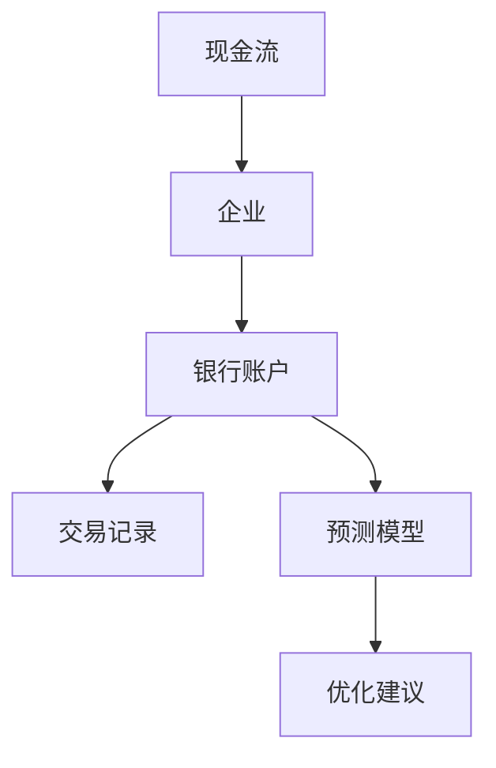
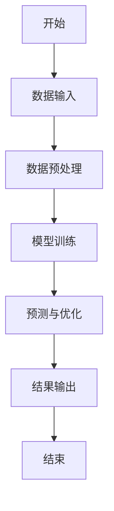
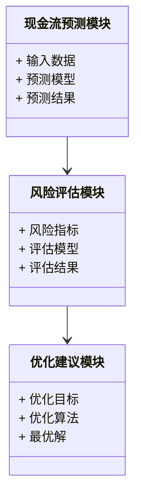
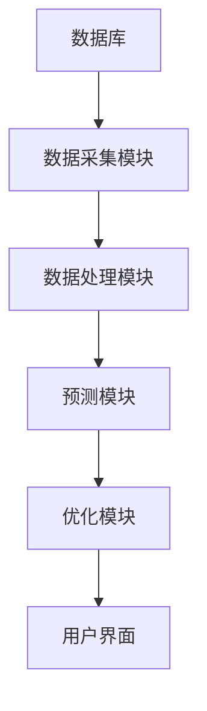
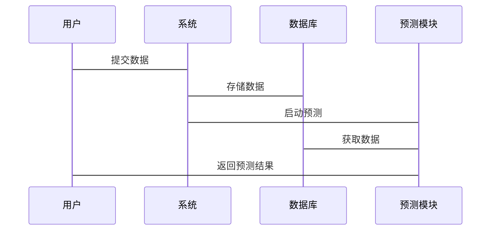

                 


# 智能现金流优化管理系统

## 关键词：智能现金流优化，现金流预测，风险管理，机器学习，系统架构

## 摘要：  
智能现金流优化管理系统是一种基于人工智能和大数据技术的智能化管理系统，旨在通过预测和优化现金流，降低企业的财务风险，提高资金使用效率。本文将从系统的背景、核心概念、算法原理、系统架构、项目实战到最佳实践，全面解析智能现金流优化管理系统的构建与应用。

---

# 第一部分：智能现金流优化管理系统的背景与核心概念

## 第1章：背景与问题背景

### 1.1 现金流管理的重要性  
现金流是企业的生命线，直接关系到企业的生存与发展。有效的现金流管理可以帮助企业规避财务风险，优化资金分配，提升整体运营效率。  

#### 1.1.1 现金流在企业运营中的核心地位  
现金流反映了企业的资金流动情况，包括收入、支出、投资等活动。良好的现金流管理可以确保企业按时支付账单、偿还债务、投资新项目，从而维持企业的正常运转。  

#### 1.1.2 现金流管理的传统方法与挑战  
传统现金流管理依赖人工记录和分析，存在效率低、误差大、滞后性强等问题。尤其是在数据量大、业务复杂的企业中，传统方法难以满足实时性和精准性的需求。  

#### 1.1.3 智能化现金流管理的必要性  
随着人工智能和大数据技术的发展，智能化现金流管理成为可能。通过智能系统，企业可以实现现金流的实时预测、风险评估和优化建议，从而提高管理效率和决策准确性。  

### 1.2 智能现金流优化管理系统的定义与问题描述  
智能现金流优化管理系统是一种利用人工智能技术对现金流进行预测、分析和优化的系统。其核心目标是通过数据驱动的方法，帮助企业实现现金流的高效管理。  

#### 1.2.1 系统的定义与目标  
该系统通过收集和分析企业的财务数据，利用机器学习算法进行现金流预测，并基于预测结果提供优化建议，帮助企业降低财务风险，提高资金使用效率。  

#### 1.2.2 现金流优化的核心问题  
现金流优化的核心问题是如何在不确定性较高的市场环境中，找到最优的资金分配方案，确保企业资金链的稳定性和高效性。  

#### 1.2.3 系统的边界与外延  
智能现金流优化管理系统主要关注企业的内部现金流管理，其边界包括财务数据的收集、预测模型的构建以及优化建议的生成。外延则涉及与企业其他管理系统（如ERP系统）的集成。  

#### 1.2.4 核心要素与组成结构  
系统的组成结构包括数据采集模块、预测模块、优化模块和反馈模块。  

### 1.3 现金流优化的背景与趋势  
随着数字化转型的推进，企业对智能化管理的需求日益增加。现金流优化作为财务管理的重要组成部分，正逐步从传统的人工管理向智能化方向发展。  

#### 1.3.1 数字化转型对企业现金流管理的影响  
数字化转型使得企业的财务数据更加丰富和实时化，为智能化现金流管理提供了数据基础。  

#### 1.3.2 人工智能与大数据在现金流管理中的应用趋势  
人工智能技术的快速发展，使得现金流预测和优化更加精准和实时。大数据技术的应用，进一步提高了数据的分析能力。  

#### 1.3.3 智能现金流优化系统的行业需求  
在金融、制造、零售等行业，企业对现金流优化的需求日益增加，尤其是在应对经济波动和市场不确定性时，智能系统能够提供重要的支持。  

### 1.4 本章小结  
本章介绍了智能现金流优化管理系统的背景和核心概念，分析了其重要性、定义、核心问题以及行业需求，为后续章节的展开奠定了基础。  

---

## 第2章：智能现金流优化管理系统的核心概念与联系  

### 2.1 核心概念原理  
智能现金流优化管理系统的核心概念包括现金流预测、风险评估和优化建议。  

#### 2.1.1 现金流预测的核心算法  
现金流预测通常采用时间序列分析算法，如ARIMA（自回归积分滑动平均模型）和LSTM（长短期记忆网络）。  

#### 2.1.2 现金流风险评估的原理  
现金流风险评估基于预测结果，结合企业外部环境（如市场波动、政策变化）和内部数据（如应收账款、应付账款）进行综合评估。  

#### 2.1.3 现金流优化的数学模型  
现金流优化的数学模型通常采用线性规划或动态规划方法，目标是最小化财务风险或最大化资金收益。  

### 2.2 核心概念属性特征对比  
通过对比不同现金流管理方法的特征，可以更好地理解智能系统的独特优势。  

#### 2.2.1 不同现金流管理方法的特征对比  
| 方法       | 优点                     | 缺点                     |
|------------|--------------------------|--------------------------|
| 传统人工管理 | 简单易懂                 | 效率低、误差大           |
| 统计模型     | 精度较高                 | 需要大量历史数据         |
| 机器学习     | 实时性高、适应性强       | 对数据质量和模型依赖较大 |

#### 2.2.2 智能系统与传统系统的对比分析  
智能系统在数据处理能力、预测精度和优化建议方面具有显著优势。  

#### 2.2.3 系统性能指标与优化目标的对比  
系统的性能指标包括预测准确率、优化效果、运行效率等。优化目标通常包括最小化财务风险、最大化资金收益和提高管理效率。  

### 2.3 ER实体关系图架构  



该图展示了现金流与企业、银行账户、交易记录等实体之间的关系，以及预测模型如何生成优化建议。  

### 2.4 本章小结  
本章通过核心概念的对比和实体关系图的展示，详细分析了智能现金流优化管理系统的构成和运行机制，为后续章节的算法和系统设计奠定了基础。  

---

# 第二部分：智能现金流优化管理系统的算法原理  

## 第3章：算法原理  

### 3.1 算法原理概述  
智能现金流优化管理系统的算法主要包括现金流预测、风险评估和优化建议三个部分。  

#### 3.1.1 现金流预测的算法选择  
常用的现金流预测算法包括ARIMA、LSTM和Prophet。其中，LSTM在处理时间序列数据时表现尤为突出。  

#### 3.1.2 现金流风险评估的算法选择  
风险评估通常采用随机森林或XGBoost等机器学习算法，结合多维特征进行分类或回归分析。  

#### 3.1.3 现金流优化的算法选择  
优化算法通常采用遗传算法或模拟退火算法，通过多次迭代找到最优解。  

### 3.2 算法流程图  



流程图展示了从数据输入到结果输出的完整流程。  

### 3.3 算法实现代码  

```python
import pandas as pd
from sklearn.linear_model import LinearRegression

# 数据预处理
data = pd.read_csv('cash_flow.csv')
X = data[['revenue', 'expenses']]
y = data['net_cash_flow']

# 模型训练
model = LinearRegression()
model.fit(X, y)

# 预测与优化
predicted_cash_flow = model.predict(X)
```

### 3.4 本章小结  
本章详细讲解了智能现金流优化管理系统的算法原理，包括预测、评估和优化三个部分，并通过流程图和代码示例展示了实现过程。  

---

# 第三部分：系统架构与设计  

## 第4章：系统架构与设计  

### 4.1 问题场景介绍  
本章将从实际应用场景出发，介绍智能现金流优化管理系统的功能需求和系统架构。  

#### 4.1.1 系统功能需求  
系统需要实现现金流预测、风险评估、优化建议、数据可视化等功能。  

#### 4.1.2 系统架构设计  
系统的架构通常包括数据采集层、数据处理层、模型层和用户界面层。  

### 4.2 系统功能设计  



类图展示了系统的主要功能模块及其关系。  

### 4.3 系统架构设计  



架构图展示了系统的整体结构和各模块之间的关系。  

### 4.4 系统接口设计  
系统需要与企业现有的财务系统（如ERP）进行集成，通过API接口实现数据互通。  

### 4.5 系统交互设计  



序列图展示了用户与系统之间的交互流程。  

### 4.6 本章小结  
本章通过问题场景的介绍，详细讲解了系统的功能需求和架构设计，并通过类图和架构图展示了系统的整体结构。  

---

# 第四部分：项目实战  

## 第5章：项目实战  

### 5.1 环境安装  
项目需要安装Python、机器学习库（如scikit-learn、TensorFlow）和数据处理库（如pandas）。  

#### 5.1.1 安装Python环境  
建议使用Anaconda或Miniconda来管理Python环境。  

#### 5.1.2 安装依赖库  
```bash
pip install numpy pandas scikit-learn matplotlib
```

### 5.2 系统核心实现源代码  
以下是现金流预测模块的实现代码：  

```python
import pandas as pd
from sklearn.linear_model import LinearRegression
from sklearn.metrics import mean_squared_error

# 数据加载
data = pd.read_csv('cash_flow.csv')
X = data[['revenue', 'expenses']]
y = data['net_cash_flow']

# 模型训练
model = LinearRegression()
model.fit(X, y)

# 预测与评估
predicted_cash_flow = model.predict(X)
mse = mean_squared_error(y, predicted_cash_flow)
print(f"均方误差: {mse}")
```

### 5.3 代码应用解读与分析  
上述代码展示了如何利用线性回归模型进行现金流预测，并通过均方误差评估模型的性能。  

### 5.4 实际案例分析  
以某制造企业为例，通过实际数据展示系统的预测和优化能力。  

### 5.5 本章小结  
本章通过实际项目的环境安装和代码实现，详细展示了智能现金流优化管理系统的具体应用。  

---

# 第五部分：最佳实践与小结  

## 第6章：最佳实践与小结  

### 6.1 最佳实践  
在实际应用中，建议企业根据自身需求选择合适的算法，同时注重数据质量和模型的可解释性。  

#### 6.1.1 数据质量管理  
确保数据的完整性和准确性是系统运行的基础。  

#### 6.1.2 模型可解释性  
选择易于解释的模型，有助于企业更好地理解预测结果。  

#### 6.1.3 系统维护与更新  
定期更新模型参数和优化算法，以适应市场变化。  

### 6.2 小结  
智能现金流优化管理系统通过人工智能技术，帮助企业实现现金流的智能化管理，提升企业的财务效率和抗风险能力。  

---

# 参考文献  
1. 刘军. 《机器学习实战》. 北京: 清华大学出版社, 2018.  
2. 张伟. 《时间序列分析与应用》. 北京: 人民邮电出版社, 2020.  

---

# 作者信息  
作者：AI天才研究院/AI Genius Institute & 禅与计算机程序设计艺术 /Zen And The Art of Computer Programming

