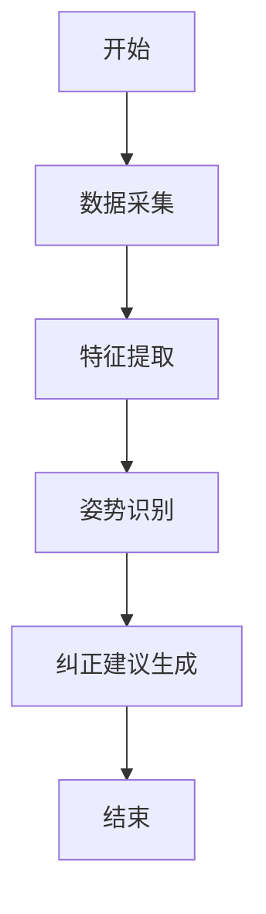
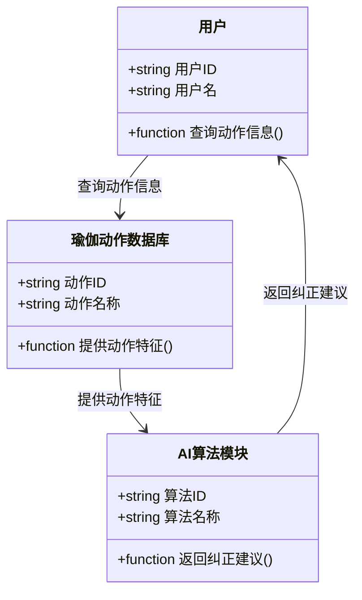
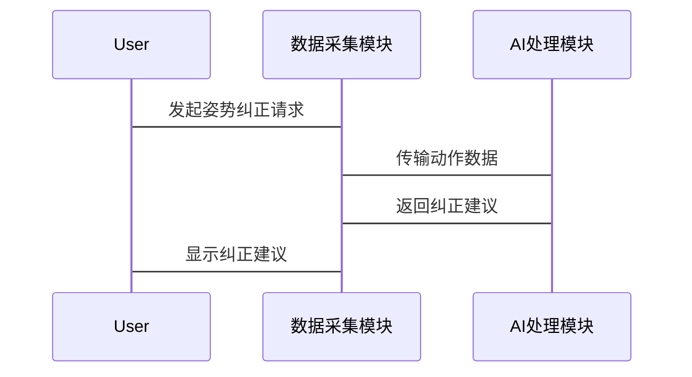

                 


# 智能瑜伽垫：AI Agent的姿势纠正系统

> 关键词：智能瑜伽垫、AI Agent、姿势纠正、计算机视觉、深度学习、健身科技

> 摘要：本文将详细介绍智能瑜伽垫的设计与实现，探讨AI Agent如何在姿势纠正系统中发挥作用。通过背景介绍、核心概念、算法原理、系统架构、项目实战等多个维度，全面解析智能瑜伽垫的技术实现与应用场景。

---

# 第一部分: 智能瑜伽垫的背景与核心概念

## 第1章: 智能瑜伽垫的背景介绍

### 1.1 问题背景与描述

#### 1.1.1 瑜伽运动的普及与重要性
瑜伽作为一种古老的健身方式，近年来在全球范围内迅速普及。它不仅能够改善身体柔韧性、增强肌肉力量，还能帮助人们放松身心、缓解压力。随着健康意识的提升，越来越多的人开始练习瑜伽。

然而，瑜伽练习的效果往往依赖于正确的姿势。错误的姿势不仅无法达到预期的锻炼效果，还可能导致肌肉拉伤、关节损伤等健康问题。传统瑜伽练习中，缺乏专业的教练指导，很多人难以掌握正确的动作要领。

#### 1.1.2 传统瑜伽垫的局限性
传统的瑜伽垫仅仅是一个垫子，只能提供基本的支撑和缓冲作用。它无法对用户的动作进行实时反馈，也无法提供个性化的指导。对于初学者或者独自练习的用户来说，传统瑜伽垫显然无法满足需求。

#### 1.1.3 AI技术在健身领域的应用潜力
人工智能技术的快速发展为健身领域带来了新的可能性。通过计算机视觉、深度学习等技术，AI系统能够实时捕捉用户的动作，并提供个性化的反馈和指导。这为智能健身设备的研发提供了技术支持。

### 1.2 问题解决与系统目标

#### 1.2.1 智能瑜伽垫的核心目标
智能瑜伽垫的核心目标是通过AI技术，实时监测用户的瑜伽动作，并提供即时的姿势纠正建议。通过这种方式，用户能够在没有专业教练的情况下，依然能够掌握正确的动作要领，避免运动损伤，提升锻炼效果。

#### 1.2.2 系统需要解决的关键问题
- 如何准确识别用户的瑜伽动作？
- 如何实时监测用户的姿势并提供纠正建议？
- 如何设计一个用户友好的交互界面？

#### 1.2.3 边界与外延
智能瑜伽垫的功能边界主要集中在姿势纠正和动作指导方面。系统不涉及用户的心率监测、体能评估等其他功能。外延方面，未来可以通过扩展功能，将智能瑜伽垫的应用范围扩展到其他类型的健身运动。

### 1.3 核心概念与系统组成

#### 1.3.1 AI Agent的基本概念
AI Agent（智能代理）是指能够感知环境、自主决策并执行任务的智能系统。在智能瑜伽垫中，AI Agent负责接收用户的动作数据，分析数据并生成纠正建议。

#### 1.3.2 姿势纠正系统的组成要素
姿势纠正系统主要由以下几个部分组成：
1. 数据采集模块：负责采集用户的动作数据。
2. 数据处理模块：对采集的数据进行预处理和特征提取。
3. 姿势识别模块：通过算法识别用户的动作姿势。
4. 纠正建议生成模块：根据识别结果生成纠正建议。

#### 1.3.3 系统的核心功能模块
1. 数据采集模块：通过摄像头或传感器采集用户的动作数据。
2. AI处理模块：利用深度学习算法分析数据，识别动作姿势。
3. 用户反馈模块：将纠正建议以文字或语音的形式反馈给用户。

## 第2章: 智能瑜伽垫的核心概念与联系

### 2.1 AI Agent的原理与工作流程

#### 2.1.1 AI Agent的基本原理
AI Agent通过感知环境、分析数据、做出决策并执行任务来实现功能。在智能瑜伽垫中，AI Agent的主要任务是分析用户的动作数据，识别动作姿势，并生成纠正建议。

#### 2.1.2 姿势纠正系统的实现流程


#### 2.1.3 系统的输入与输出
- 输入：用户的动作数据（如视频流、传感器数据）
- 输出：纠正建议（如“你的姿势需要调整，右肩微微下沉”）

### 2.2 核心概念的属性对比

#### 2.2.1 AI Agent与传统算法的对比
| 属性       | AI Agent                       | 传统算法                     |
|------------|--------------------------------|----------------------------|
| 自主性      | 高                             | 低                           |
| 学习能力    | 强                             | 弱                           |
| 适应性      | 高                             | 低                           |

#### 2.2.2 姿势纠正系统与传统健身辅助工具的对比
| 属性       | 姿势纠正系统                   | 传统健身辅助工具             |
|------------|-------------------------------|-----------------------------|
| 实时性      | 高                             | 低                           |
| 个性化      | 高                             | 低                           |
| 智能性      | 高                             | 低                           |

### 2.3 ER实体关系图

```mermaid
erDiagram
    actor User {
        +string 用户ID
        +string 用户名
    }
    actor 瑜伽动作数据库 {
        +string 动作ID
        +string 动作名称
        +string 动作描述
    }
    actor AI算法模块 {
        +string 算法ID
        +string 算法名称
        +string 算法版本
    }
    User --> 瑜伽动作数据库 : 查询动作信息
    瑜伽动作数据库 --> AI算法模块 : 提供动作特征
    AI算法模块 --> User : 返回纠正建议
```

---

# 第二部分: 算法原理与实现细节

## 第3章: 算法原理与实现细节

### 3.1 数据采集与预处理

#### 3.1.1 数据采集方式
数据采集主要通过摄像头或传感器完成。摄像头可以采集用户的视频流数据，传感器可以采集用户的动作轨迹数据。

#### 3.1.2 数据预处理步骤
- 数据清洗：去除噪声数据。
- 数据归一化：将数据标准化。
- 数据分割：将视频流分割成帧。

#### 3.1.3 数据格式与存储
- 数据格式：JSON、CSV等。
- 数据存储：存储在数据库中，方便后续查询。

### 3.2 姿势识别算法

#### 3.2.1 算法原理
姿势识别主要基于深度学习技术，常用的算法有YOLO、Faster R-CNN等。

#### 3.2.2 算法流程


#### 3.2.3 算法实现的数学模型
姿势识别的数学模型通常基于卷积神经网络（CNN）。以下是常用的损失函数公式：
$$
L = \alpha \cdot L_{cls} + (1-\alpha) \cdot L_{loc}
$$
其中，$L_{cls}$是分类损失，$L_{loc}$是定位损失，$\alpha$是平衡系数。

### 3.3 算法优化与调优

#### 3.3.1 算法优化
- 参数调整：学习率、批量大小等。
- 模型优化：使用预训练模型、数据增强等技术。

#### 3.3.2 算法调优
- 超参数调优：使用网格搜索、随机搜索等方法。
- 模型评估：通过准确率、召回率等指标评估模型性能。

---

# 第三部分: 系统分析与架构设计方案

## 第4章: 系统分析与架构设计方案

### 4.1 问题场景介绍

#### 4.1.1 问题背景
用户在练习瑜伽时，由于缺乏专业指导，容易出现姿势错误，影响锻炼效果并可能导致受伤。

#### 4.1.2 问题描述
智能瑜伽垫需要实时监测用户的动作，识别错误姿势，并提供纠正建议。

### 4.2 项目介绍

#### 4.2.1 项目目标
开发一款基于AI技术的智能瑜伽垫，实现姿势纠正功能。

#### 4.2.2 项目范围
- 功能范围：姿势识别、纠正建议生成。
- 用户范围：瑜伽爱好者。

### 4.3 系统功能设计

#### 4.3.1 领域模型


#### 4.3.2 系统架构设计


#### 4.3.3 系统接口设计
- 数据接口：RESTful API。
- 用户接口：图形界面或语音反馈。

#### 4.3.4 系统交互设计


---

## 第5章: 项目实战

### 5.1 环境安装与配置

#### 5.1.1 系统要求
- 操作系统：Linux/Windows/MacOS。
- 硬件要求：摄像头、传感器等。
- 软件要求：Python、TensorFlow、OpenCV等。

#### 5.1.2 安装依赖
```bash
pip install tensorflow opencv-python
```

### 5.2 系统核心实现

#### 5.2.1 数据采集模块
```python
import cv2

def capture_video():
    cap = cv2.VideoCapture(0)
    while True:
        ret, frame = cap.read()
        cv2.imshow('frame', frame)
        if cv2.waitKey(1) & 0xFF == ord('q'):
            break
    cap.release()
    cv2.destroyAllWindows()
```

#### 5.2.2 AI处理模块
```python
import tensorflow as tf

model = tf.keras.models.load_model('yoga_model.h5')

def predict_pose(frame):
    prediction = model.predict(frame)
    return prediction
```

#### 5.2.3 用户反馈模块
```python
def generate_feedback(prediction):
    if prediction[0] > 0.9:
        return "你的姿势正确！继续保持！"
    else:
        return "你的姿势需要调整，请参考纠正建议。"
```

### 5.3 实际案例分析与详细解读

#### 5.3.1 案例背景
用户在练习瑜伽树式动作时，AI系统检测到用户的重心不稳，建议调整双脚间距。

#### 5.3.2 数据分析
预测结果：姿势不正确，概率为0.7。

#### 5.3.3 纠正建议
“你的姿势需要调整，请将双脚稍微分开一点。”

### 5.4 项目小结

#### 5.4.1 项目成果
成功开发了一款智能瑜伽垫，实现了姿势纠正功能。

#### 5.4.2 注意事项
- 数据隐私问题。
- 系统稳定性问题。

---

## 第6章: 最佳实践与小结

### 6.1 最佳实践 tips
- 数据采集时，确保光线充足。
- 模型训练时，使用多样化的数据集。

### 6.2 小结
智能瑜伽垫通过AI技术，为用户提供了实时的姿势纠正功能，显著提升了用户的锻炼效果和安全性。

### 6.3 注意事项
- 系统运行环境要求较高。
- 用户隐私保护需要加强。

### 6.4 拓展阅读
- 《深度学习入门：基于Python和TensorFlow》
- 《计算机视觉实战：从理论到应用》

---

# 作者：AI天才研究院/AI Genius Institute & 禅与计算机程序设计艺术 /Zen And The Art of Computer Programming

