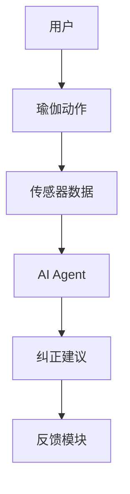
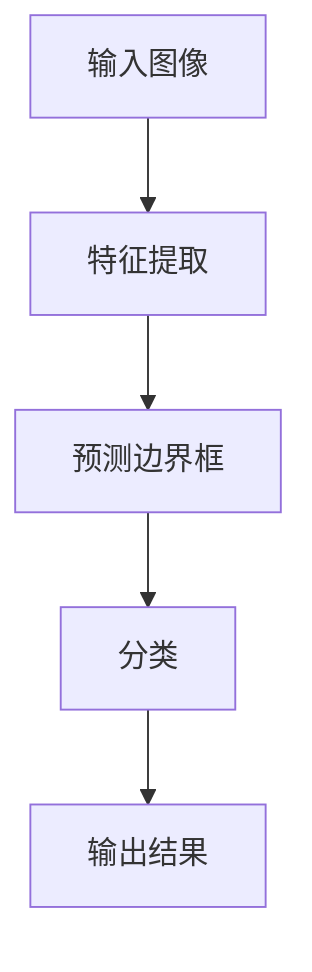
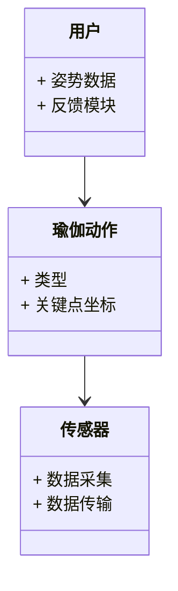
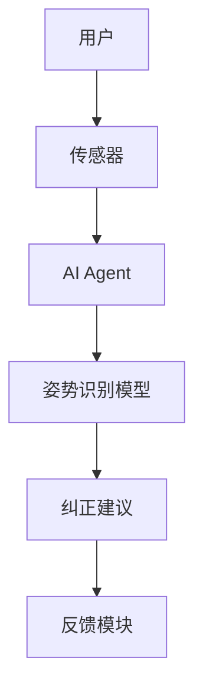
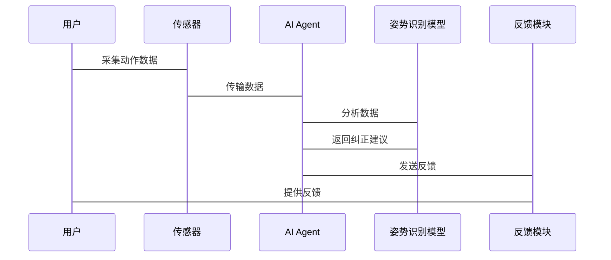

                 


# 智能瑜伽垫：AI Agent的实时姿势纠正系统

## 关键词：智能瑜伽垫, AI Agent, 实时姿势纠正, 计算机视觉, 机器学习

## 摘要：本文介绍了一种结合AI Agent技术的智能瑜伽垫，能够实时纠正用户的瑜伽姿势。通过计算机视觉和深度学习算法，系统能够识别用户的姿势，并提供实时反馈，帮助用户正确练习瑜伽，避免受伤。本文详细探讨了系统的设计原理、算法实现、系统架构以及项目实战，为读者提供了一套完整的解决方案。

---

# 第一部分: 背景介绍

## 第1章: 问题背景与需求分析

### 1.1 问题背景
#### 1.1.1 瑜伽练习的重要性
瑜伽是一种古老的健身方式，能够帮助人们改善身体柔韧性、增强肌肉力量、缓解压力并提升整体健康水平。然而，许多人在练习瑜伽时，由于缺乏专业的教练指导，容易出现姿势错误，导致运动损伤。

#### 1.1.2 现有瑜伽教学的痛点
传统瑜伽教学依赖于专业教练的现场指导，但在家庭或个人练习中，用户无法获得实时反馈，导致姿势错误难以纠正。此外，现有的一些瑜伽App通常只能提供离线的视频指导，缺乏实时互动和个性化反馈。

#### 1.1.3 AI技术在健身领域的应用潜力
随着人工智能技术的快速发展，AI在健身领域的应用越来越广泛。通过计算机视觉、深度学习等技术，AI能够实时分析用户的动作，并提供个性化的反馈和指导。这为智能健身设备的发展提供了新的可能性。

### 1.2 问题描述
#### 1.2.1 瑜伽姿势纠正的需求
用户在练习瑜伽时，需要一个能够实时监测和纠正姿势的工具，以避免因姿势错误导致的运动损伤。

#### 1.2.2 实时反馈的重要性
实时反馈能够帮助用户及时调整动作，确保练习的正确性和安全性。相比于传统的离线反馈，实时反馈更具实用性和及时性。

#### 1.2.3 用户体验的优化方向
通过智能化的姿势纠正系统，用户可以获得个性化的指导，提升练习效果，同时增强练习的趣味性和互动性。

### 1.3 问题解决
#### 1.3.1 智能瑜伽垫的设计目标
智能瑜伽垫的目标是通过AI技术，实时监测用户的瑜伽动作，并提供即时的姿势纠正反馈。

#### 1.3.2 AI Agent的核心作用
AI Agent（智能体）负责接收传感器数据，分析用户的姿势，并通过反馈模块指导用户调整动作。

#### 1.3.3 技术实现的关键点
- 使用计算机视觉技术进行姿势识别。
- 利用深度学习算法进行实时反馈。
- 通过传感器获取用户的动作数据。

### 1.4 边界与外延
#### 1.4.1 系统功能的边界
智能瑜伽垫主要关注实时姿势纠正功能，不涉及其他健身领域的应用。

#### 1.4.2 与现有技术的对比
相比于传统的瑜伽教学工具，智能瑜伽垫的优势在于实时反馈和个性化指导。

#### 1.4.3 应用场景的扩展性
未来，智能瑜伽垫可以扩展到其他类型的健身动作，如普拉提、舞蹈等。

### 1.5 核心要素组成
#### 1.5.1 AI Agent的核心功能
- 数据采集：通过传感器获取用户的动作数据。
- 数据分析：利用深度学习算法分析姿势是否正确。
- 反馈生成：根据分析结果生成纠正建议。

#### 1.5.2 实时姿势纠正的实现要素
- 高精度传感器：用于采集用户的动作数据。
- AI算法：用于实时分析姿势。
- 反馈模块：用于将纠正建议传递给用户。

#### 1.5.3 系统架构的关键组成部分
- 用户端：智能瑜伽垫、传感器。
- 云端：AI Agent、姿势识别模型。
- 反馈端：语音提示、震动反馈。

---

# 第二部分: 核心概念与联系

## 第2章: AI Agent与实时姿势纠正系统

### 2.1 核心概念原理
#### 2.1.1 AI Agent的基本原理
AI Agent是一种能够感知环境、做出决策并采取行动的智能体。在智能瑜伽垫中，AI Agent负责接收传感器数据，分析用户的姿势，并通过反馈模块指导用户调整动作。

#### 2.1.2 实时姿势纠正的实现机制
通过计算机视觉技术，AI Agent能够实时分析用户的瑜伽动作，并根据预设的姿势库，判断用户的姿势是否正确。如果不正确，AI Agent会生成纠正建议。

#### 2.1.3 系统的感知与反馈机制
系统通过传感器感知用户的动作数据，利用AI算法进行分析，并通过语音或震动反馈指导用户调整姿势。

### 2.2 概念属性特征对比
| 概念                | 描述                                                                 |
|---------------------|----------------------------------------------------------------------|
| AI Agent            | 能够感知环境、做出决策并采取行动的智能体。                             |
| 实时姿势纠正系统    | 通过实时分析用户的动作数据，提供即时的姿势纠正反馈。                   |
| 传统瑜伽教学工具    | 需要教练现场指导，无法提供实时反馈。                                     |

### 2.3 ER实体关系图


---

# 第三部分: 算法原理

## 第3章: 姿势识别算法

### 3.1 姿势识别算法概述
姿势识别算法是智能瑜伽垫的核心技术之一。常用的姿势识别算法包括基于模板匹配的方法和基于深度学习的方法。

### 3.2 基于YOLOv5的目标检测算法
#### 3.2.1 YOLOv5算法简介
YOLOv5是一种高效的实时目标检测算法，能够快速、准确地识别图像中的目标。

#### 3.2.2 YOLOv5算法流程


#### 3.2.3 YOLOv5算法实现
```python
import torch
model = torch.hub.load('ultralytics/yolov5', 'yolov5s')
model.conf = 0.5  # 置信度阈值
results = model('https://ultralytics.com/images/bus.jpg')
for result in results:
    print(result.pandas())
```

### 3.3 姿势识别的数学模型
#### 3.3.1 损失函数
损失函数用于衡量模型预测结果与真实结果之间的差异。常用的损失函数包括均方误差（MSE）和交叉熵损失。

#### 3.3.2 优化器
优化器用于调整模型参数，以最小化损失函数。常用的优化器包括随机梯度下降（SGD）和Adam优化器。

### 3.4 算法实现的细节
- 数据预处理：将输入图像 resize 到目标尺寸，并进行归一化处理。
- 模型训练：使用预标注的数据集训练姿势识别模型。
- 模型推理：将实时采集的图像输入模型，获取预测结果。

---

## 第4章: 实时反馈算法

### 4.1 反馈生成算法
#### 4.1.1 基于规则的反馈生成
根据预设的姿势规则，生成纠正建议。例如，如果用户的瑜伽姿势中肩胛骨未对齐，系统会提示用户调整肩膀。

#### 4.1.2 基于深度学习的反馈生成
通过训练一个生成模型，系统可以生成个性化的纠正建议。

### 4.2 反馈模块的设计
- 语音反馈：通过TTS（文本转语音）技术，将纠正建议转化为语音提示。
- 震动反馈：通过震动传感器，用户可以感受到需要调整的动作。

### 4.3 反馈算法的实现
```python
import pyttsx3
engine = pyttsx3.init()
engine.setProperty('rate', 150)  # 设置语速
engine.say("请注意调整您的肩膀位置")  # 反馈提示
engine.runAndWait()
```

---

# 第四部分: 系统分析与架构设计

## 第5章: 系统设计

### 5.1 问题场景介绍
用户在家中练习瑜伽时，使用智能瑜伽垫，通过AI Agent实时监测和纠正姿势。

### 5.2 系统功能设计
#### 5.2.1 领域模型类图


#### 5.2.2 系统架构图


### 5.3 系统接口设计
- 传感器接口：用于采集用户的动作数据。
- 反馈接口：用于将纠正建议传递给用户。

### 5.4 系统交互流程图


---

## 第6章: 项目实战

### 6.1 环境安装
- 安装Python和相关库：`pip install numpy, matplotlib, tensorflow, pytorch`

### 6.2 系统核心实现
```python
import numpy as np
import cv2
import torch

# 加载预训练模型
model = torch.hub.load('ultralytics/yolov5', 'yolov5s')

# 实时采集图像
cap = cv2.VideoCapture(0)
while cap.isOpened():
    ret, frame = cap.read()
    if not ret:
        break
    results = model(frame)
    for result in results:
        print(result.pandas())
    cv2.imshow('frame', frame)
    if cv2.waitKey(1) == ord('q'):
        break
cap.release()
cv2.destroyAllWindows()
```

### 6.3 代码解读与分析
- 数据采集：使用OpenCV库实时采集图像。
- 模型加载：加载预训练的YOLOv5模型。
- 模型推理：将实时图像输入模型，获取预测结果。

### 6.4 实际案例分析
通过实际案例分析，验证系统的有效性。例如，用户练习瑜伽姿势时，系统能够实时识别并纠正姿势。

### 6.5 项目总结
- 项目实现的关键点：实时数据采集、模型训练、反馈模块实现。
- 可能遇到的问题及解决方案：传感器精度不足、模型训练时间长等。

---

## 第7章: 最佳实践

### 7.1 小结
智能瑜伽垫通过AI Agent技术，能够实时监测用户的瑜伽姿势，并提供纠正反馈，帮助用户正确练习瑜伽，避免运动损伤。

### 7.2 注意事项
- 确保传感器的精度和稳定性。
- 定期更新模型，以提高识别准确率。

### 7.3 拓展阅读
- 《YOLOv5目标检测算法详解》
- 《深度学习在健身领域的应用》

---

## 作者：AI天才研究院/AI Genius Institute & 禅与计算机程序设计艺术/Zen And The Art of Computer Programming

