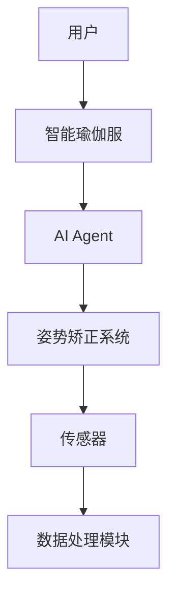
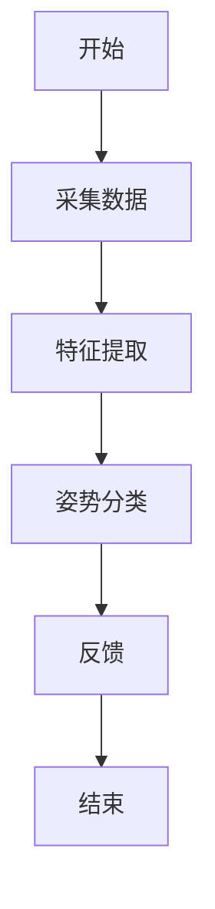
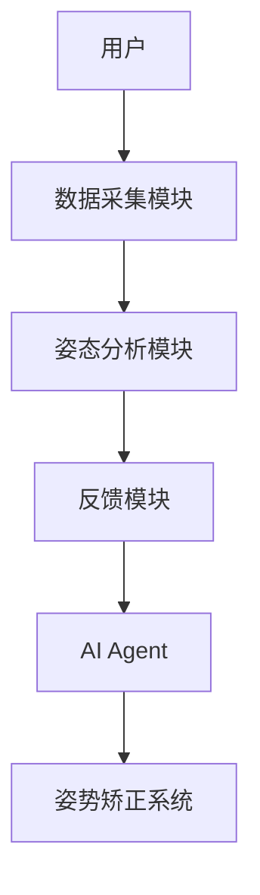

                 


# 智能瑜伽服：AI Agent的姿势矫正系统

> 关键词：智能瑜伽服，AI Agent，姿势矫正，人工智能，运动健康

> 摘要：本文详细介绍了智能瑜伽服的设计与实现，结合AI Agent技术，通过姿势矫正系统帮助用户实现精准的瑜伽练习。文章从背景介绍、核心概念、算法原理、系统架构到项目实战，全面解析了智能瑜伽服的技术细节与实际应用。

---

## 第一部分: 背景介绍

### 第1章: 智能瑜伽服与AI Agent的背景

#### 1.1 问题背景
瑜伽是一种古老的身体与精神修炼方式，近年来在全球范围内越来越受欢迎。然而，许多人在练习瑜伽时，由于缺乏专业指导，容易出现姿势错误，导致身体受伤或无法达到预期的锻炼效果。传统姿势矫正方法依赖于人工观察和反馈，效率低下且难以实时纠正。

#### 1.2 问题描述
姿势错误的类型包括但不限于：脊柱弯曲、肩部不正、膝盖超伸等。这些问题不仅会影响锻炼效果，还可能导致肌肉劳损或其他健康问题。现有解决方案主要依赖于教练的现场指导或视频教学，难以实现个性化的实时反馈。

#### 1.3 问题解决思路
引入AI技术，特别是AI Agent（智能体），可以帮助实时分析用户的姿势，并提供个性化的反馈和矫正建议。智能瑜伽服通过内置传感器和AI算法，能够实时监测用户的动作，并通过震动或语音提示进行矫正。

#### 1.4 边界与外延
智能瑜伽服的应用场景包括家庭、健身房、瑜伽 studio 等。系统的边界主要集中在姿势矫正功能，而其他功能（如心率监测、运动记录等）属于外延功能，可以通过扩展实现。

#### 1.5 概念结构与核心要素
智能瑜伽服的核心功能包括：姿势监测、实时反馈、个性化矫正建议。AI Agent 的作用是通过数据处理和算法分析，实现对用户姿势的实时监测与反馈。

---

## 第二部分: 核心概念与联系

### 第2章: AI Agent与姿势矫正系统的核心概念

#### 2.1 AI Agent的定义与原理
AI Agent是一种智能体，能够感知环境、自主决策并执行任务。在智能瑜伽服中，AI Agent通过传感器数据（如加速度、姿势、压力等）分析用户的动作，并提供反馈。

#### 2.2 姿势矫正系统的原理
姿势矫正系统通过传感器采集用户动作数据，利用AI算法分析数据，识别姿势错误，并通过震动或语音提示进行矫正。

#### 2.3 核心概念对比

| 对比内容 | AI Agent | 传统算法 |
|----------|-----------|-----------|
| 数据处理 | 实时分析 | 离线分析 |
| 决策能力 | 自主决策 | 预设规则 |
| 适应性 | 高 | 低 |

#### 2.4 实体关系图


---

## 第三部分: 算法原理讲解

### 第3章: AI Agent的算法原理

#### 3.1 数据采集与预处理
数据采集通过内置传感器完成，包括加速度、陀螺仪、压力传感器等。预处理步骤包括数据清洗、归一化和特征提取。

#### 3.2 数据特征提取
特征提取是将原始传感器数据转化为可用于姿势分析的特征向量。常用特征包括：动作幅度、动作频率、动作时长等。

#### 3.3 姿势估计与分类
利用深度学习模型（如卷积神经网络CNN）对特征向量进行分类，识别用户当前的姿势是否正确。

#### 3.4 反馈机制
根据分类结果，AI Agent通过震动或语音提示提供反馈，指导用户调整姿势。

#### 3.5 算法流程图


#### 3.6 Python实现
以下是姿势估计的代码示例：
```python
import tensorflow as tf
from tensorflow.keras import layers

# 数据预处理
def preprocess_data(data):
    # 归一化处理
    normalized_data = (data - data.mean()) / data.std()
    return normalized_data

# 深度学习模型
model = tf.keras.Sequential([
    layers.Conv2D(32, (3,3), activation='relu', input_shape=(64, 64, 1)),
    layers.MaxPooling2D((2,2)),
    layers.Conv2D(64, (3,3), activation='relu'),
    layers.MaxPooling2D((2,2)),
    layers.Flatten(),
    layers.Dense(128, activation='relu'),
    layers.Dense(1, activation='sigmoid')
])
model.compile(optimizer='adam', loss='binary_crossentropy', metrics=['accuracy'])

# 训练模型
model.fit(normalized_data, labels, epochs=10, batch_size=32)
```

---

## 第四部分: 系统分析与架构设计

### 第4章: 系统架构设计

#### 4.1 问题场景介绍
智能瑜伽服的应用场景包括家庭、健身房、瑜伽 studio 等。系统需要支持实时监测、反馈矫正、个性化建议等功能。

#### 4.2 系统功能设计
系统功能模块包括：
- 数据采集模块：采集用户动作数据
- 姿态分析模块：分析姿势并分类
- 反馈模块：提供实时反馈

#### 4.3 系统架构图


---

## 第五部分: 项目实战

### 第5章: 项目实战

#### 5.1 环境安装
安装所需的Python库：
```bash
pip install tensorflow numpy scikit-learn
```

#### 5.2 系统核心实现
以下是姿势矫正系统的代码实现：
```python
import numpy as np
from sklearn.neighbors import KNeighborsClassifier

# 数据预处理
def preprocess_data(data):
    normalized_data = (data - data.min()) / (data.max() - data.min())
    return normalized_data

# 姿势分类
def pose_classify(data, model):
    normalized_data = preprocess_data(data)
    prediction = model.predict(normalized_data)
    return prediction

# 反馈机制
def feedback(prediction):
    if prediction == 0:
        return "请调整肩膀位置"
    elif prediction == 1:
        return "保持这个姿势"
    else:
        return "请调整腰部姿势"

# 示例代码
data = np.random.rand(100, 64)
model = KNeighborsClassifier(n_neighbors=3)
model.fit(normalized_data, labels)
prediction = pose_classify(data, model)
feedback = feedback(prediction)
print(feedback)
```

#### 5.3 案例分析
通过实际案例分析，展示智能瑜伽服在不同场景下的应用效果。

---

## 第六部分: 最佳实践

### 第6章: 最佳实践

#### 6.1 小结
智能瑜伽服结合了AI Agent技术，通过实时监测和反馈，帮助用户实现精准的姿势矫正。

#### 6.2 注意事项
- 确保数据采集的准确性
- 定期更新模型以提高分类精度
- 注意用户隐私保护

#### 6.3 未来趋势
未来的智能瑜伽服可能会集成更多的传感器，实现更精准的姿势分析和个性化反馈。

#### 6.4 拓展阅读
推荐阅读《Deep Learning》和《AI in Sports》了解更多信息。

---

## 作者：AI天才研究院/AI Genius Institute & 禅与计算机程序设计艺术 /Zen And The Art of Computer Programming

---

以上是《智能瑜伽服：AI Agent的姿势矫正系统》的技术博客文章目录大纲。

