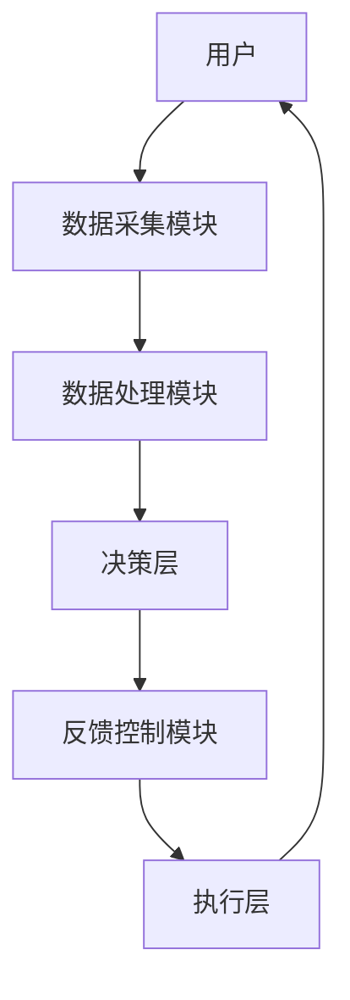

                 


# 智能瑜伽球：AI Agent的平衡训练指导

> 关键词：AI Agent，智能瑜伽球，平衡训练，姿态识别，实时反馈，深度学习

> 摘要：本文深入探讨了AI Agent在智能瑜伽球中的应用，从技术原理到系统实现，详细分析了平衡训练的AI算法和系统架构设计。通过实际案例和项目实战，展示了如何利用AI技术提升瑜伽训练的效果和安全性。

---

# 第1章 引言：AI Agent与智能瑜伽球的结合

## 1.1 问题背景与目标

### 1.1.1 平衡训练的重要性
平衡训练是瑜伽、太极等运动的核心，能够有效提升身体协调性、减少运动损伤，并改善整体健康状况。传统平衡训练依赖教练的指导，但受限于时间和空间，用户难以获得持续的个性化反馈。

### 1.1.2 AI技术在健身领域的应用潜力
AI技术在健身领域的应用日益广泛，从智能穿戴设备到虚拟健身教练，AI能够实时分析用户动作，提供个性化指导和反馈。智能瑜伽球作为一种结合了AI技术的创新产品，能够为用户提供智能化的平衡训练体验。

### 1.1.3 智能瑜伽球的创新价值
智能瑜伽球通过集成AI Agent，能够实时感知用户的平衡状态，并提供个性化的训练建议和反馈。这种结合不仅提升了训练效果，还降低了运动损伤的风险，为用户带来更安全、高效的训练体验。

## 1.2 智能瑜伽球的核心概念

### 1.2.1 AI Agent的基本定义
AI Agent是一种智能实体，能够感知环境、做出决策并执行动作。在智能瑜伽球中，AI Agent通过传感器数据感知用户的平衡状态，并通过算法生成实时反馈。

### 1.2.2 智能瑜伽球的功能特点
智能瑜伽球集成了多种传感器（如IMU、加速度计、陀螺仪等），能够实时采集用户的运动数据，并通过AI算法分析用户的平衡状态，提供个性化的训练指导。

### 1.2.3 产品定位与目标用户群体
智能瑜伽球的目标用户是健身爱好者、瑜伽练习者以及需要平衡训练的康复人群。产品定位为一款智能化的健身工具，旨在通过AI技术提升用户的训练效果和安全性。

## 1.3 本章小结

通过本章的介绍，我们了解了智能瑜伽球的背景、核心概念和创新价值。AI Agent作为智能瑜伽球的核心技术，能够实时感知用户的平衡状态并提供反馈，为用户带来更高效的训练体验。

---

# 第2章 AI Agent的核心原理与技术实现

## 2.1 AI Agent的基本原理

### 2.1.1 感知层：多传感器数据融合
智能瑜伽球通过多种传感器（如IMU、加速度计、陀螺仪）采集用户的运动数据，包括加速度、角速度、姿态等。这些数据通过传感器融合算法（如卡尔曼滤波）进行处理，得到更准确的平衡状态信息。

### 2.1.2 决策层：基于深度学习的平衡算法
决策层通过深度学习算法（如LSTM、CNN）分析用户的运动数据，识别用户的平衡状态，并生成个性化的训练建议。算法模型通过训练大量平衡训练数据，学习用户的平衡特征，实现精准的平衡状态识别。

### 2.1.3 执行层：实时反馈与调整机制
执行层根据决策层的反馈，通过振动、声音或视觉提示，实时指导用户调整动作，优化平衡状态。反馈机制能够根据用户的进步动态调整训练难度，确保训练效果的最大化。

## 2.2 智能瑜伽球的硬件与软件架构

### 2.2.1 硬件组成：传感器、处理器、通信模块
智能瑜伽球的硬件包括多种传感器（IMU、加速度计、陀螺仪）、嵌入式处理器（如STM32、ARM Cortex-M）以及无线通信模块（蓝牙、Wi-Fi）。传感器负责采集数据，处理器负责数据处理和算法运行，通信模块用于与手机或其他设备连接。

### 2.2.2 软件架构：数据采集、处理、反馈
软件架构分为数据采集模块、数据处理模块和反馈模块。数据采集模块通过传感器获取数据，数据处理模块对数据进行预处理和分析，反馈模块根据分析结果生成反馈信号。

## 2.3 AI算法的核心流程

### 2.3.1 数据采集与预处理
数据采集模块通过传感器获取用户的运动数据，包括加速度、角速度、姿态等。预处理步骤包括去噪、归一化和特征提取，确保数据适合后续分析。

### 2.3.2 姿态识别算法
基于深度学习的姿态识别算法通过分析用户的运动数据，识别用户的平衡状态。算法模型通过训练大量数据，学习用户的平衡特征，实现精准的平衡状态识别。

### 2.3.3 实时反馈与训练计划调整
根据用户的平衡状态，系统实时调整训练计划，动态优化训练难度，确保用户在安全范围内逐步提升平衡能力。

## 2.4 本章小结

通过本章的分析，我们了解了AI Agent在智能瑜伽球中的核心原理和技术实现。从感知层到决策层，再到执行层，AI Agent通过多传感器数据融合、深度学习算法和实时反馈机制，为用户提供智能化的平衡训练指导。

---

# 第3章 平衡训练的AI算法实现

## 3.1 姿态识别算法

### 3.1.1 基于IMU传感器的数据分析
IMU传感器通过采集加速度、角速度等数据，计算用户的姿态信息。通过传感器融合算法（如卡尔曼滤波）处理数据，得到更准确的平衡状态信息。

### 3.1.2 姿态估计的数学模型
姿态估计的数学模型包括姿态角计算、旋转矩阵和四元数表示。通过数学模型分析用户的姿态变化，识别平衡状态。

### 3.1.3 算法实现与优化
姿态识别算法通过深度学习模型实现，训练数据包括各种平衡状态下的运动数据。算法优化包括模型轻量化和实时性优化，确保在嵌入式设备上的高效运行。

## 3.2 平衡反馈机制

### 3.2.1 实时反馈算法的设计
实时反馈算法通过分析用户的运动数据，判断用户的平衡状态，并生成反馈信号。反馈信号包括振动、声音或视觉提示，指导用户调整动作。

### 3.2.2 用户行为分析与训练计划调整
系统根据用户的平衡状态，动态调整训练计划。例如，当用户在某个平衡动作上表现不佳时，系统会降低训练难度，提供更多的指导和反馈。

### 3.2.3 系统稳定性与鲁棒性分析
系统稳定性分析包括传感器数据的鲁棒性、算法的容错性和反馈机制的可靠性。通过优化算法和系统设计，确保系统在复杂环境下的稳定运行。

## 3.3 算法实现的代码示例

### 3.3.1 数据采集模块代码
```python
import numpy as np
from sensors import IMU

class DataCollector:
    def __init__(self):
        self.imu = IMU()
        self.acceleration = []
        self.gyroscope = []
    
    def collect_data(self, duration):
        for _ in range(duration):
            a, g = self.imu.get_data()
            self.acceleration.append(a)
            self.gyroscope.append(g)
```

### 3.3.2 姿态识别算法代码
```python
import tensorflow as tf
from tensorflow.keras import layers

def build_model():
    model = tf.keras.Sequential([
        layers.Conv2D(32, (3,3), activation='relu', input_shape=(64,64,3)),
        layers.MaxPooling2D((2,2)),
        layers.Conv2D(64, (3,3), activation='relu'),
        layers.MaxPooling2D((2,2)),
        layers.Flatten(),
        layers.Dense(128, activation='relu'),
        layers.Dense(1, activation='sigmoid')
    ])
    model.compile(optimizer='adam', loss='binary_crossentropy', metrics=['accuracy'])
    return model
```

### 3.3.3 反馈控制模块代码
```python
def feedback_control(balance_state):
    if balance_state < 0.5:
        return "左倾，调整重心"
    elif balance_state > 0.5:
        return "右倾，调整重心"
    else:
        return "平衡状态良好"
```

## 3.4 本章小结

通过本章的分析，我们了解了平衡训练中AI算法的核心实现。从姿态识别到实时反馈，AI技术为智能瑜伽球提供了智能化的训练指导。代码示例展示了算法实现的关键步骤，帮助读者更好地理解和应用这些技术。

---

# 第4章 系统架构设计与实现

## 4.1 系统功能模块划分

### 4.1.1 数据采集模块
负责采集用户的运动数据，包括加速度、角速度等。

### 4.1.2 数据处理模块
对采集的数据进行预处理和分析，识别用户的平衡状态。

### 4.1.3 用户反馈模块
根据分析结果生成反馈信号，指导用户调整动作。

## 4.2 系统架构设计

### 4.2.1 分层架构设计
系统分为感知层、决策层和执行层。感知层负责数据采集，决策层负责数据分析，执行层负责反馈控制。

### 4.2.2 模块之间的交互关系
模块之间的交互通过消息队列或事件驱动实现，确保系统的高效运行。

### 4.2.3 系统架构的Mermaid图


## 4.3 系统稳定性与优化

### 4.3.1 系统稳定性分析
系统稳定性分析包括传感器数据的鲁棒性、算法的容错性和反馈机制的可靠性。

### 4.3.2 性能优化建议
通过算法优化、硬件升级和系统架构改进，提升系统的运行效率和反馈速度。

## 4.4 本章小结

通过本章的分析，我们了解了智能瑜伽球系统的架构设计与实现。分层架构和模块化设计确保了系统的高效运行，为用户提供智能化的平衡训练指导。

---

# 第5章 项目实战：智能瑜伽球的开发与应用

## 5.1 环境搭建与开发工具

### 5.1.1 硬件准备
包括智能瑜伽球硬件、传感器模块、嵌入式开发板等。

### 5.1.2 软件安装
包括Python开发环境、TensorFlow框架、传感器驱动等。

## 5.2 核心功能实现

### 5.2.1 数据采集与处理
通过传感器采集用户的运动数据，进行预处理和特征提取。

### 5.2.2 姿态识别与反馈
基于深度学习算法实现姿态识别，生成实时反馈信号。

## 5.3 代码实现与应用案例

### 5.3.1 数据采集代码
```python
import numpy as np
from sensors import IMU

def collect_data(duration):
    imu = IMU()
    acceleration = []
    gyroscope = []
    for _ in range(duration):
        a, g = imu.get_data()
        acceleration.append(a)
        gyroscope.append(g)
    return acceleration, gyroscope
```

### 5.3.2 姿态识别代码
```python
import tensorflow as tf
from tensorflow.keras import layers

def build_model():
    model = tf.keras.Sequential([
        layers.Conv2D(32, (3,3), activation='relu', input_shape=(64,64,3)),
        layers.MaxPooling2D((2,2)),
        layers.Conv2D(64, (3,3), activation='relu'),
        layers.MaxPooling2D((2,2)),
        layers.Flatten(),
        layers.Dense(128, activation='relu'),
        layers.Dense(1, activation='sigmoid')
    ])
    model.compile(optimizer='adam', loss='binary_crossentropy', metrics=['accuracy'])
    return model
```

### 5.3.3 反馈控制代码
```python
def feedback_control(balance_state):
    if balance_state < 0.5:
        return "左倾，调整重心"
    elif balance_state > 0.5:
        return "右倾，调整重心"
    else:
        return "平衡状态良好"
```

## 5.4 应用案例与分析

### 5.4.1 实际应用案例
展示智能瑜伽球在实际训练中的应用，分析系统的反馈效果和用户评价。

### 5.4.2 系统性能分析
通过实验数据对比传统训练与智能训练的效果，验证系统的有效性和优越性。

## 5.5 本章小结

通过本章的实战分析，我们了解了智能瑜伽球的开发过程和实际应用。代码实现展示了系统的具体实现步骤，应用案例验证了系统的有效性。

---

# 第6章 应用案例与扩展

## 6.1 应用场景分析

### 6.1.1 健身训练中的应用
智能瑜伽球为用户提供个性化的平衡训练指导，帮助用户提升训练效果。

### 6.1.2 康复训练中的应用
智能瑜伽球可用于康复训练，帮助用户恢复平衡能力，预防运动损伤。

## 6.2 系统扩展与优化

### 6.2.1 算法优化
通过模型优化和算法改进，提升系统的实时性和准确性。

### 6.2.2 硬件升级
通过硬件升级，提升系统的数据采集能力和反馈速度。

## 6.3 未来展望

### 6.3.1 AI技术的进一步融合
AI技术的进一步融合将提升智能瑜伽球的智能化水平，实现更精准的平衡训练指导。

### 6.3.2 新型传感器的应用
新型传感器的应用将提升系统的感知能力，实现更准确的平衡状态识别。

## 6.4 本章小结

通过本章的分析，我们了解了智能瑜伽球的应用场景和未来发展方向。AI技术的进一步融合和新型传感器的应用将为智能瑜伽球带来更广阔的发展前景。

---

# 作者

作者：AI天才研究院/AI Genius Institute & 禅与计算机程序设计艺术 /Zen And The Art of Computer Programming

---

# 总结

通过本文的深入分析，我们了解了AI Agent在智能瑜伽球中的应用，从技术原理到系统实现，详细探讨了平衡训练的AI算法和系统架构设计。通过实际案例和项目实战，展示了如何利用AI技术提升瑜伽训练的效果和安全性。未来，随着AI技术的不断发展，智能瑜伽球将为用户提供更智能化、个性化的训练指导，推动健身领域的智能化发展。

