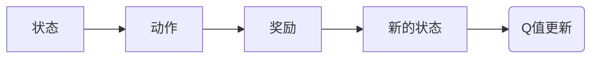

                 


# 智能瑜伽球：AI Agent的核心训练指导系统

> **关键词**：智能瑜伽球，AI Agent，机器学习，强化学习，算法原理，系统架构，Python实现

> **摘要**：本文详细介绍了智能瑜伽球与AI Agent的核心训练指导系统，从概念、原理到系统架构、算法实现，再到项目实战，全面解析了智能瑜伽球如何通过AI技术实现个性化的瑜伽训练指导。通过详细的技术分析和代码实现，本文为读者提供了一套完整的AI Agent训练系统设计方案，适用于计算机编程和人工智能领域的技术人员和研究人员。

---

## 第1章: 智能瑜伽球与AI Agent的背景介绍

### 1.1 智能瑜伽球的概念与定义

智能瑜伽球是一种结合了传统瑜伽训练与人工智能技术的新型健身设备。它通过内置的传感器和AI算法，能够实时感知用户的瑜伽动作，并通过语音或视觉方式给予反馈和指导。智能瑜伽球的核心在于其AI Agent（智能代理），这个代理能够理解用户的行为，预测其需求，并提供个性化的训练建议。

**核心要素**：
- 传感器：用于采集用户的动作数据。
- AI算法：用于分析数据并生成反馈。
- 用户界面：用于展示反馈和指导信息。

### 1.2 AI Agent的核心概念与特点

AI Agent是一种能够感知环境、自主决策并执行任务的智能系统。与传统AI不同，AI Agent具有以下特点：
- **主动性**：能够主动发起动作，而非仅响应输入。
- **反应性**：能够实时感知环境变化并调整行为。
- **学习能力**：通过与用户的互动不断优化自身的决策能力。

### 1.3 智能瑜伽球与AI Agent的结合

智能瑜伽球通过AI Agent实现了以下功能：
- **实时反馈**：用户完成动作后，AI Agent会立即给出反馈，指出动作是否标准。
- **个性化指导**：根据用户的动作数据，AI Agent会推荐适合的训练计划。
- **持续优化**：通过强化学习，AI Agent能够不断优化其反馈和指导策略。

---

## 第2章: AI Agent的核心概念与原理

### 2.1 AI Agent的核心原理

AI Agent的核心原理包括知识表示、行为决策和学习优化三个部分：
1. **知识表示**：将用户动作、瑜伽理论等知识表示为数据结构。
2. **行为决策**：基于当前感知信息，选择最优行为。
3. **学习优化**：通过与用户的互动，不断优化自身的决策模型。

### 2.2 AI Agent的核心功能模块

1. **感知模块**：通过传感器获取用户动作数据。
2. **计划与决策模块**：基于感知数据生成行动计划。
3. **执行与反馈模块**：通过用户界面输出反馈信息。

### 2.3 AI Agent的训练目标与方法

1. **监督学习**：通过标记数据训练模型识别瑜伽动作。
2. **强化学习**：通过奖励机制优化AI Agent的反馈策略。
3. **对抗训练**：通过生成对抗网络优化模型的泛化能力。

---

## 第3章: 智能瑜伽球AI Agent的系统架构设计

### 3.1 系统整体架构

系统架构包括以下部分：
1. **数据采集层**：通过传感器采集用户动作数据。
2. **数据处理层**：对采集到的数据进行预处理和特征提取。
3. **算法层**：基于处理后的数据进行分析和决策。
4. **用户界面层**：将决策结果以用户友好的方式展示。

### 3.2 功能模块详细设计

1. **用户行为识别模块**：基于传感器数据识别用户的瑜伽动作。
2. **瑜伽动作指导模块**：根据识别结果提供个性化指导。
3. **实时反馈与优化模块**：通过用户反馈优化AI Agent的行为策略。

---

## 第4章: AI Agent的核心算法原理

### 4.1 强化学习算法

**Q-learning算法原理**：
- 通过状态-动作-奖励的三元组更新Q值表。
- 算法流程图如下：



**Python代码实现**：

```python
import numpy as np

class QLearning:
    def __init__(self, state_size, action_size, learning_rate=0.1, gamma=0.9):
        self.q_table = np.zeros((state_size, action_size))
        self.learning_rate = learning_rate
        self.gamma = gamma

    def choose_action(self, state, epsilon=0.1):
        if np.random.random() < epsilon:
            return np.random.randint(0, action_size)
        return np.argmax(self.q_table[state])

    def update_q_table(self, state, action, reward, next_state):
        self.q_table[state][action] = self.q_table[state][action] * self.learning_rate + reward + self.gamma * np.max(self.q_table[next_state])
```

---

## 第5章: 智能瑜伽球AI Agent的项目实战

### 5.1 环境搭建与工具安装

- **环境搭建**：安装Python、TensorFlow、Keras等开发工具。
- **传感器接入**：将智能瑜伽球的传感器与计算机连接。

### 5.2 核心代码实现

**用户行为识别模块**：

```python
import numpy as np
from sklearn import neighbors

class UserBehaviorRecognizer:
    def __init__(self, sensors):
        self.sensors = sensors
        self.model = neighbors.KNeighborsClassifier()

    def train(self, X, y):
        self.model.fit(X, y)

    def predict(self, x):
        return self.model.predict(x.reshape(1, -1))[0]
```

---

## 第6章: 系统优化与性能提升

### 6.1 系统优化策略

- **算法优化**：通过剪枝等技术优化神经网络模型。
- **数据增强**：增加数据多样性，提高模型的泛化能力。

### 6.2 性能测试与评估

- **准确率测试**：通过测试集评估模型的识别准确率。
- **响应时间测试**：测试系统的实时反馈速度。

---

## 第7章: 总结与展望

### 7.1 本章小结

智能瑜伽球通过AI Agent实现了个性化的瑜伽训练指导，结合强化学习和监督学习算法，系统能够实时反馈用户动作并优化训练计划。

### 7.2 未来展望

未来，智能瑜伽球可以通过引入更多AI技术（如视觉识别）进一步提升用户体验，同时通过边缘计算优化系统的实时性。

---

## 作者：AI天才研究院 & 禅与计算机程序设计艺术

