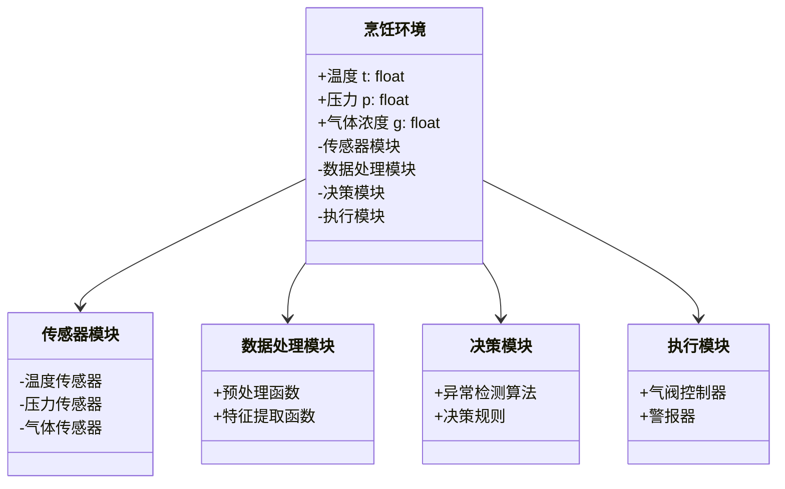

                 


# 智能瓦斯炉：AI Agent的烹饪安全监控

> 关键词：瓦斯炉、AI Agent、烹饪安全、监控系统、智能厨房

> 摘要：本文探讨了AI Agent在烹饪安全监控中的应用，特别是智能瓦斯炉的安全监控系统。文章从背景介绍、核心概念、算法原理、系统架构到项目实战，详细分析了如何利用AI技术实现烹饪过程中的安全监控。通过系统设计、代码实现和实际案例分析，展示了AI Agent在智能厨房中的潜力和实际应用价值。

---

## 第1章: 问题背景与描述

### 1.1 问题背景

#### 1.1.1 烹饪安全的重要性
烹饪是家庭生活中不可或缺的一部分，但烹饪过程中潜在的安全隐患（如火灾、气体泄漏）却常常被忽视。瓦斯炉作为厨房的核心设备之一，其安全使用直接关系到家庭成员的生命财产安全。如何实时监控烹饪过程中的异常情况，预防危险发生，成为智能厨房领域的重要研究方向。

#### 1.1.2 瓦斯炉使用中的安全隐患
瓦斯炉在使用过程中可能存在以下安全隐患：
- **火焰失控**：锅底干涸、气阀故障等可能导致火焰异常。
- **气体泄漏**：管道老化、密封不良等问题可能引发瓦斯泄漏。
- **用户疏忽**：烹饪过程中忘记观察火候，导致锅具干烧或食物烧焦。

#### 1.1.3 AI技术在安全监控中的应用潜力
人工智能技术，特别是AI Agent（智能体），具备实时感知、自主决策和执行的能力，能够有效应对烹饪过程中的复杂场景。通过传感器数据的实时采集与分析，AI Agent可以快速识别异常情况并采取相应措施，从而实现智能化的安全监控。

### 1.2 问题描述

#### 1.2.1 瓦斯炉安全监控的痛点
传统瓦斯炉的安全监控主要依赖手动操作和简单的机械装置，存在以下痛点：
- **反应迟钝**：机械装置无法实时感知环境变化，容易错过最佳干预时机。
- **功能单一**：传统安全装置仅能检测气体泄漏或火焰异常，缺乏智能化的综合判断能力。
- **用户依赖性高**：用户需要时刻关注烹饪状态，稍有疏忽可能导致危险发生。

#### 1.2.2 用户需求与现有解决方案的不足
用户在烹饪过程中对安全监控的需求主要集中在：
- **实时监控**：能够实时感知烹饪过程中的异常情况。
- **智能预警**：在潜在危险发生前主动发出预警。
- **自动干预**：在危险发生时能够自动采取措施（如关闭气阀、发出警报）。

现有解决方案（如传统安全阀、烟雾探测器）往往功能单一，无法满足上述综合需求。

#### 1.2.3 AI Agent在烹饪安全监控中的角色定位
AI Agent通过整合多种传感器（如温度、压力、气体传感器）和环境数据，能够实现对烹饪过程的实时监控。其主要作用包括：
- **实时感知**：通过传感器数据采集烹饪环境的状态。
- **智能决策**：基于感知数据进行分析，判断是否存在潜在危险。
- **主动干预**：在危险发生前或发生时采取相应措施，确保安全。

### 1.3 问题解决

#### 1.3.1 AI Agent的核心功能
AI Agent在智能瓦斯炉中的核心功能包括：
- **数据采集与处理**：通过传感器实时采集烹饪环境的数据（如温度、压力、气体浓度）。
- **环境建模**：基于采集的数据构建烹饪环境的动态模型。
- **异常检测**：通过对比正常状态与当前状态，识别潜在的危险情况。
- **决策与执行**：根据异常情况的严重程度，决定是否采取干预措施（如关闭气阀、发出警报）。

#### 1.3.2 瓦斯炉与AI Agent的结合方式
AI Agent通过以下方式与瓦斯炉结合：
- **硬件集成**：将AI Agent的核心模块（如传感器、控制器）集成到瓦斯炉中。
- **软件协同**：AI Agent通过无线通信（如Wi-Fi、蓝牙）与瓦斯炉进行数据交互。

#### 1.3.3 安全监控的具体实现手段
实现烹饪安全监控的具体手段包括：
- **多传感器融合**：通过多种传感器（如温度、压力、气体传感器）的数据融合，提高异常检测的准确性。
- **实时数据分析**：利用机器学习算法对实时数据进行分析，识别潜在危险。
- **智能干预**：在检测到危险时，AI Agent能够快速响应，采取相应的干预措施。

### 1.4 边界与外延

#### 1.4.1 AI Agent的功能边界
AI Agent的功能主要集中在烹饪过程中的安全监控，不包括以下内容：
- **烹饪过程的优化**：如推荐食谱、优化烹饪时间等。
- **厨房环境的全面监控**：如监控其他设备（微波炉、烤箱）的安全状态。

#### 1.4.2 瓦斯炉安全监控的适用范围
瓦斯炉安全监控的适用范围包括：
- **家庭厨房**：个人用户。
- **商业厨房**：酒店、餐厅等场所。
- **特殊环境**：如高危场所（实验室、化工厂）中的烹饪设备。

#### 1.4.3 相关领域的拓展与延伸
AI Agent技术可以拓展到其他领域，如：
- **智能家居**：家庭安全监控的其他场景（如门窗监控、入侵检测）。
- **工业自动化**：生产线上的设备安全监控。

### 1.5 核心概念结构与组成

#### 1.5.1 核心概念的组成要素
智能瓦斯炉中的AI Agent系统由以下组成要素构成：
- **传感器模块**：用于采集烹饪环境的数据（如温度、压力、气体浓度）。
- **数据处理模块**：对传感器数据进行预处理和特征提取。
- **决策模块**：基于处理后的数据进行异常检测和决策。
- **执行模块**：根据决策结果采取相应措施（如关闭气阀、发出警报）。

#### 1.5.2 各要素之间的关系
各组成要素之间的关系可以表示为：
1. 传感器模块采集环境数据。
2. 数据处理模块对采集的数据进行处理和分析。
3. 决策模块基于处理后的数据进行异常检测，并做出决策。
4. 执行模块根据决策结果采取相应措施。

#### 1.5.3 系统的整体架构
系统整体架构可以分为以下层次：
1. **感知层**：通过传感器采集环境数据。
2. **数据层**：对数据进行存储和管理。
3. **算法层**：利用机器学习算法进行数据处理和分析。
4. **决策层**：基于分析结果做出决策。
5. **执行层**：根据决策结果采取相应措施。

---

## 第2章: AI Agent的核心原理

### 2.1 AI Agent的基本概念

#### 2.1.1 AI Agent的定义
AI Agent（智能体）是指在环境中能够感知并自主行动以实现目标的实体。在智能瓦斯炉中，AI Agent通过传感器感知烹饪环境，并通过执行机构采取行动以确保安全。

#### 2.1.2 AI Agent的核心属性
AI Agent的核心属性包括：
- **自主性**：能够自主决策和行动。
- **反应性**：能够实时感知环境变化并做出反应。
- **目标导向性**：行动以实现特定目标为导向。

#### 2.1.3 AI Agent与传统AI的区别
AI Agent与传统AI的区别主要体现在：
- **自主性**：AI Agent具备自主决策和行动的能力，而传统AI主要依赖于外部指令。
- **实时性**：AI Agent需要实时感知和行动，而传统AI更多关注于静态问题的求解。

### 2.2 AI Agent的感知模块

#### 2.2.1 感知模块的功能
感知模块的主要功能包括：
- **数据采集**：通过传感器采集烹饪环境的数据（如温度、压力、气体浓度）。
- **数据预处理**：对采集的数据进行清洗、归一化等处理。

#### 2.2.2 传感器数据的采集与处理
传感器数据的采集与处理流程如下：
1. 传感器采集环境数据。
2. 数据预处理（如去噪、归一化）。
3. 数据特征提取。

#### 2.2.3 数据分析与特征提取
数据分析与特征提取是感知模块的重要组成部分，其目的是从原始数据中提取有用的信息。常用的特征提取方法包括：
- **统计分析**：计算数据的均值、方差等统计量。
- **时序分析**：分析数据的时间序列特征。
- **频域分析**：将数据转换到频域进行分析。

### 2.3 AI Agent的决策模块

#### 2.3.1 决策算法的原理
决策算法的原理是基于感知模块提供的数据，通过分析和推理做出决策。常用的决策算法包括：
- **规则引擎**：基于预定义的规则进行决策。
- **机器学习算法**：如随机森林、支持向量机等。
- **强化学习算法**：通过试错的方式学习最优决策策略。

#### 2.3.2 决策规则的制定
决策规则的制定需要结合具体的应用场景和需求。例如，在烹饪安全监控中，可以根据以下规则进行决策：
- **如果温度超过安全阈值，则发出警报。**
- **如果检测到气体泄漏，则立即关闭气阀。**

#### 2.3.3 多条件下的决策优化
在复杂的烹饪环境中，可能需要综合考虑多个条件。例如：
- **温度异常且气体浓度异常时，触发紧急停止。**
- **温度异常但气体浓度正常时，发出警报提醒用户。

### 2.4 AI Agent的执行模块

#### 2.4.1 执行机构的控制
执行模块的主要功能是根据决策模块的指令，控制执行机构采取相应措施。例如：
- **关闭气阀**：通过电磁阀控制气阀的开启和关闭。
- **发出警报**：通过蜂鸣器或LED灯发出警报信号。

#### 2.4.2 执行结果的反馈
执行结果的反馈是AI Agent的重要组成部分，用于验证决策的正确性和效果。例如：
- **关闭气阀后，检测气体浓度是否降低。**
- **发出警报后，检测用户是否采取行动。

#### 2.4.3 执行过程中的异常处理
在执行过程中，可能会出现异常情况，例如：
- **执行机构故障**：如电磁阀无法关闭。
- **传感器故障**：如温度传感器损坏。

需要设计相应的异常处理机制，确保系统在异常情况下能够安全运行。

### 2.5 AI Agent的自适应学习

#### 2.5.1 自适应学习的机制
自适应学习是指AI Agent能够根据环境的变化和新的数据，不断优化自身的决策模型。常用的自适应学习方法包括：
- **在线学习**：实时更新模型参数。
- **离线学习**：定期更新模型参数。

#### 2.5.2 数据驱动的优化方法
数据驱动的优化方法是通过分析历史数据，发现规律并优化决策策略。例如：
- **基于历史数据，优化异常检测的阈值。**
- **基于用户行为数据，优化警报的触发条件。

#### 2.5.3 模型的更新与迭代
模型的更新与迭代是自适应学习的重要组成部分。例如：
- **定期更新异常检测模型，以应对环境的变化。**
- **根据用户反馈，优化决策规则。

---

## 第3章: AI Agent的核心概念联系

### 3.1 核心概念属性对比表

| 概念       | 感知模块         | 决策模块         | 执行模块         |
|------------|------------------|------------------|------------------|
| 功能       | 数据采集与处理   | 异常检测与决策   | 控制执行机构     |
| 输入       | 传感器数据       | 处理后的特征数据 | 决策指令         |
| 输出       | 特征数据         | 决策结果         | 执行动作         |
| 依赖       | 传感器           | 特征数据         | 执行机构         |

### 3.2 ER实体关系图


---

## 第4章: 算法原理讲解

### 4.1 算法原理概述

#### 4.1.1 算法的数学模型
AI Agent的决策算法通常基于机器学习模型，常用的模型包括：
- **随机森林**：通过树投票机制进行分类或回归。
- **支持向量机（SVM）**：通过构建超平面进行分类。
- **强化学习（Q-learning）**：通过试错学习最优策略。

#### 4.1.2 算法的实现步骤
算法的实现步骤包括：
1. **数据采集与预处理**：采集烹饪环境的数据并进行预处理。
2. **特征提取**：从预处理后的数据中提取特征。
3. **模型训练**：基于特征数据训练机器学习模型。
4. **模型预测**：利用训练好的模型进行预测。
5. **决策与执行**：根据预测结果做出决策并执行。

### 4.2 Q-learning算法的实现

#### 4.2.1 Q-learning算法的定义
Q-learning是一种基于值的强化学习算法，通过学习状态-动作值函数（Q值）来实现最优决策。其核心公式为：
$$ Q(s, a) = Q(s, a) + \alpha [r + \gamma \max_{a'} Q(s', a') - Q(s, a)] $$
其中：
- \( Q(s, a) \)：当前状态 \( s \) 下采取动作 \( a \) 的Q值。
- \( \alpha \)：学习率。
- \( r \)：奖励。
- \( \gamma \)：折扣因子。
- \( s' \)：下一个状态。

#### 4.2.2 Q-learning算法的实现步骤
Q-learning算法的实现步骤包括：
1. **初始化**：初始化Q值表，所有Q值初始化为0。
2. **环境感知**：通过传感器感知当前状态 \( s \)。
3. **动作选择**：根据当前Q值表选择动作 \( a \)（探索与利用）。
4. **执行动作**：执行动作 \( a \) 并观察环境的反馈，获取奖励 \( r \) 和下一个状态 \( s' \)。
5. **更新Q值**：根据Q-learning公式更新Q值表。
6. **循环迭代**：重复上述步骤，直到达到终止条件。

#### 4.2.3 Q-learning算法的优缺点
Q-learning算法的优点包括：
- **无需环境模型**：适用于复杂且动态变化的环境。
- **离线学习**：可以在没有实时环境反馈的情况下进行学习。

Q-learning算法的缺点包括：
- **收敛速度慢**：需要大量的样本才能达到收敛。
- **状态空间大**：对于复杂环境，状态空间可能非常庞大。

### 4.3 算法实现的数学模型

#### 4.3.1 状态空间的定义
状态空间 \( S \) 是所有可能状态的集合。在智能瓦斯炉中，状态可以表示为：
$$ S = \{ (t, p, g) \} $$
其中：
- \( t \)：温度。
- \( p \)：压力。
- \( g \)：气体浓度。

#### 4.3.2 动作空间的定义
动作空间 \( A \) 是所有可能动作的集合。在智能瓦斯炉中，动作可以表示为：
$$ A = \{ \text{关闭气阀}, \text{保持运行}, \text{发出警报} \} $$

#### 4.3.3 奖励函数的定义
奖励函数 \( R(s, a) \) 表示在状态 \( s \) 下采取动作 \( a \) 所获得的奖励。例如：
- **当动作 \( a = \text{关闭气阀} \) 且状态 \( s \) 是安全状态时，奖励 \( r = 1 \)。**
- **当动作 \( a = \text{保持运行} \) 且状态 \( s \) 是危险状态时，奖励 \( r = -1 \)。**

---

## 第5章: 系统分析与架构设计方案

### 5.1 问题场景介绍

#### 5.1.1 烹饪环境的复杂性
烹饪环境是一个复杂的动态系统，涉及多个变量（如温度、压力、气体浓度）的变化。此外，用户的行为也会影响烹饪环境的状态。

#### 5.1.2 系统需求分析
系统需求分析包括以下内容：
- **功能性需求**：
  - 实时监控烹饪环境的状态。
  - 异常检测与预警。
  - 自动干预。
- **性能需求**：
  - 实时性：毫秒级响应。
  - 可靠性：99.9%以上的可用性。
- **安全性需求**：
  - 数据安全：防止数据泄露。
  - 系统安全：防止恶意攻击。

### 5.2 系统功能设计

#### 5.2.1 领域模型
领域模型可以表示为以下类图：



#### 5.2.2 系统架构设计

```mermaid
archiDiagram
    component 瓦斯炉系统 {
        component 传感器模块 {
            --> 温度传感器
            --> 压力传感器
            --> 气体传感器
        }
        component 数据处理模块 {
            --> 预处理函数
            --> 特征提取函数
        }
        component 决策模块 {
            --> 异常检测算法
            --> 决策规则
        }
        component 执行模块 {
            --> 气阀控制器
            --> 警报器
        }
    }
```

#### 5.2.3 接口设计

- **传感器模块接口**：
  - 输入：无
  - 输出：温度、压力、气体浓度数据
- **数据处理模块接口**：
  - 输入：传感器数据
  - 输出：特征数据
- **决策模块接口**：
  - 输入：特征数据
  - 输出：决策结果
- **执行模块接口**：
  - 输入：决策结果
  - 输出：执行动作

#### 5.2.4 系统交互流程

```mermaid
sequenceDiagram
    actor 用户
    system 烹饪环境
    system 传感器模块
    system 数据处理模块
    system 决策模块
    system 执行模块
    用户 -> 烹饪环境: 开始烹饪
    烹饪环境 -> 传感器模块: 采集数据
    传感器模块 -> 数据处理模块: 传输数据
    数据处理模块 -> 决策模块: 提供特征数据
    决策模块 -> 执行模块: 发出决策指令
    执行模块 -> 烹饪环境: 执行动作
    烹饪环境 -> 用户: 反馈结果
```

---

## 第6章: 项目实战

### 6.1 环境安装

#### 6.1.1 硬件安装
硬件安装包括：
- **传感器模块**：安装温度、压力、气体传感器。
- **执行模块**：安装气阀控制器和警报器。
- **通信模块**：安装Wi-Fi或蓝牙模块，用于与手机或其他设备通信。

#### 6.1.2 软件安装
软件安装包括：
- **操作系统**：安装Linux或其他实时操作系统。
- **数据采集模块**：安装传感器驱动和数据采集软件。
- **决策模块**：安装机器学习框架（如TensorFlow、Scikit-learn）。
- **执行模块**：安装控制驱动和执行机构的控制软件。

### 6.2 核心代码实现

#### 6.2.1 数据采集模块

```python
import serial

# 传感器数据采集函数
def collect_data():
    ser = serial.Serial('COM3', 9600)
    data = ser.readline().decode().strip().split(',')
    ser.close()
    return {
        'temperature': float(data[0]),
        'pressure': float(data[1]),
        'gas_concentration': float(data[2])
    }
```

#### 6.2.2 数据处理模块

```python
import numpy as np

# 数据预处理函数
def preprocess(data):
    processed_data = {}
    processed_data['temperature'] = (data['temperature'] - np.mean(data['temperature'])) / np.std(data['temperature'])
    processed_data['pressure'] = (data['pressure'] - np.mean(data['pressure'])) / np.std(data['pressure'])
    processed_data['gas_concentration'] = (data['gas_concentration'] - np.mean(data['gas_concentration'])) / np.std(data['gas_concentration'])
    return processed_data

# 特征提取函数
def extract_features(data):
    features = []
    for i in range(len(data)):
        features.append([data['temperature'][i], data['pressure'][i], data['gas_concentration'][i]])
    return features
```

#### 6.2.3 决策模块

```python
import numpy as np
from sklearn.ensemble import RandomForestClassifier

# 异常检测模型训练函数
def train_model(features, labels):
    model = RandomForestClassifier(n_estimators=100, max_depth=10, random_state=42)
    model.fit(features, labels)
    return model

# 异常检测函数
def detect_anomaly(model, features):
    prediction = model.predict(features)
    return prediction
```

#### 6.2.4 执行模块

```python
import RPi.GPIO as GPIO

# 气阀控制器
def control_valve(action):
    if action == 'open':
        GPIO.output(17, GPIO.HIGH)
    elif action == 'close':
        GPIO.output(17, GPIO.LOW)

# 警报器
def trigger_alarm():
    import time
    GPIO.output(18, GPIO.HIGH)
    time.sleep(1)
    GPIO.output(18, GPIO.LOW)
```

### 6.3 案例分析

#### 6.3.1 案例背景
假设用户正在烹饪，锅中液体即将烧干，温度急剧上升，压力增加，气体浓度异常。

#### 6.3.2 数据采集与处理
传感器采集到以下数据：
- 温度：250°C
- 压力：500 Pa
- 气体浓度：0.8%

数据经过预处理和特征提取后，输入到异常检测模型中。

#### 6.3.3 决策与执行
异常检测模型预测结果为异常，触发警报并关闭气阀。

#### 6.3.4 结果分析
- **警报触发**：警报器发出声音提醒用户。
- **气阀关闭**：气阀关闭，防止干烧引发火灾。

---

## 第7章: 最佳实践

### 7.1 小结
通过本文的分析与实践，我们可以看到，AI Agent在智能瓦斯炉中的应用能够显著提升烹饪过程的安全性。通过实时监控、智能决策和主动干预，AI Agent能够有效预防烹饪中的危险情况。

### 7.2 注意事项
在实际应用中，需要注意以下几点：
- **数据隐私**：确保用户数据的安全性，防止数据泄露。
- **系统可靠性**：确保系统的高可用性，避免因系统故障引发危险。
- **用户教育**：用户需要了解AI Agent的工作原理和使用方法，避免因误操作引发问题。

### 7.3 拓展阅读
- **相关书籍**：《AI for IOT》、《强化学习实战》。
- **技术博客**：持续关注AI与物联网相关的技术博客，获取最新技术动态。

---

## 作者：AI天才研究院/AI Genius Institute & 禅与计算机程序设计艺术 /Zen And The Art of Computer Programming

---

通过以上思考过程，我们逐步构建了智能瓦斯炉中AI Agent的安全监控系统，并详细分析了其核心概念、算法原理和系统架构。通过项目实战，我们进一步验证了理论的可行性，并提出了实际应用中的注意事项和优化方向。

