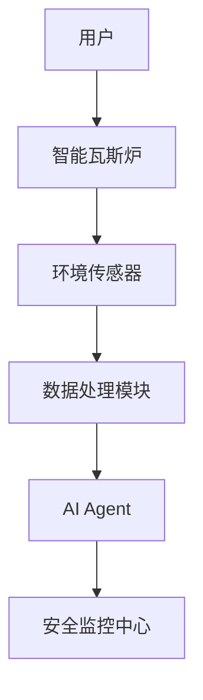
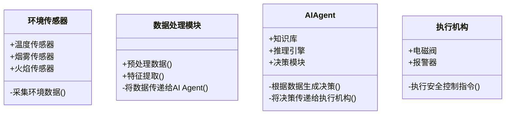
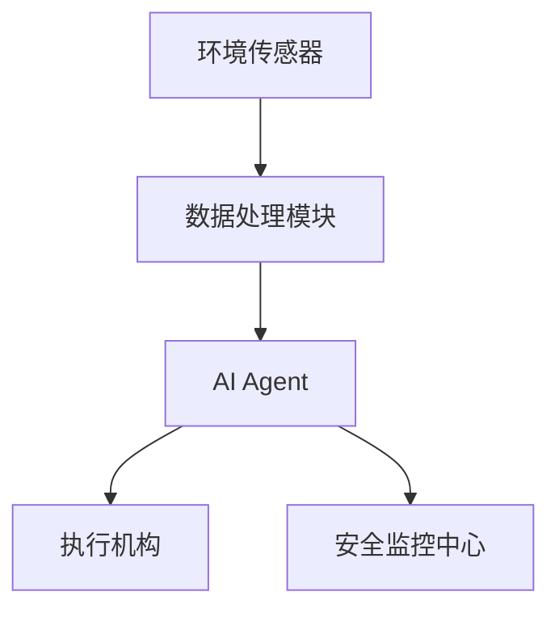
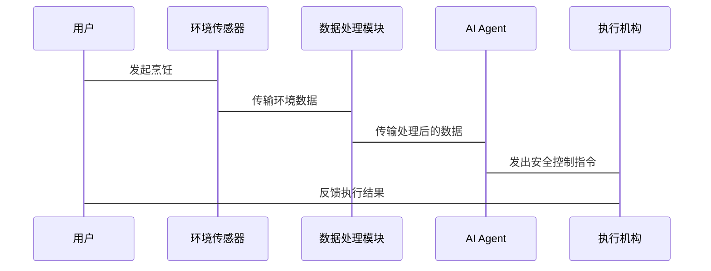

                 


# 智能瓦斯炉：AI Agent的烹饪安全监控系统

> 关键词：智能瓦斯炉, AI Agent, 烹饪安全, 物联网, 多模态感知

> 摘要：本文探讨了智能瓦斯炉结合AI Agent的烹饪安全监控系统的设计与实现。通过分析烹饪过程中的潜在危险，提出了一种基于多模态感知和智能决策的解决方案，旨在提升烹饪安全性和用户体验。文章详细介绍了系统的架构设计、算法原理、实现步骤及实际应用场景，为相关领域的研究和应用提供了参考。

---

# 第一部分: 背景与概念

## 第1章: 问题背景与描述

### 1.1 烹饪安全的重要性

#### 1.1.1 烹饪安全问题的普遍性
烹饪是日常生活中不可或缺的一部分，但烹饪过程中的安全隐患（如火焰失控、气体泄漏等）却常常被忽视。据统计，每年因烹饪事故导致的火灾和人员伤亡事件屡见不鲜。

#### 1.1.2 瓦斯炉事故的潜在风险
瓦斯炉作为最常见的烹饪工具，其安全性直接关系到用户的生命财产安全。传统瓦斯炉缺乏智能化监控能力，无法实时感知和处理异常情况，存在较大的安全隐患。

#### 1.1.3 智能化监控的必要性
随着人工智能和物联网技术的快速发展，将智能监控系统引入烹饪设备已成为提升安全性的重要趋势。通过实时感知、智能分析和主动干预，可以有效降低烹饪事故的发生概率。

### 1.2 智能瓦斯炉的定义与目标

#### 1.2.1 智能瓦斯炉的定义
智能瓦斯炉是一种结合了人工智能技术的烹饪设备，能够通过多种传感器实时感知烹饪环境，并利用AI算法进行智能决策，实现烹饪过程的安全监控和优化。

#### 1.2.2 系统的核心目标
智能瓦斯炉的核心目标是通过实时监控烹饪过程中的各项参数（如温度、烟雾浓度、火焰状态等），识别潜在的安全隐患，并在必要时采取相应的干预措施（如关闭瓦斯、发出警报等）。

#### 1.2.3 系统的边界与外延
智能瓦斯炉系统不仅关注烹饪过程本身的安全性，还涉及用户操作行为的监测、异常事件的预测与处理，以及与智能家居系统的联动。

### 1.3 问题解决思路

#### 1.3.1 AI Agent在烹饪安全中的作用
AI Agent（智能体）在烹饪安全监控中扮演着关键角色。它能够实时感知烹饪环境，分析潜在风险，并采取相应行动（如关闭瓦斯、发出警报等）。

#### 1.3.2 多模态感知技术的应用
为了全面监控烹饪环境，智能瓦斯炉系统需要结合多种传感器（如温度传感器、烟雾传感器、火焰传感器等）实现多模态感知，从而更准确地识别安全隐患。

#### 1.3.3 系统架构的整体思路
智能瓦斯炉系统的整体思路是通过多模态传感器采集烹饪环境数据，利用AI算法进行分析和决策，并通过执行机构（如电磁阀、报警器等）实现安全控制。

## 第2章: 核心概念与联系

### 2.1 AI Agent的基本原理

#### 2.1.1 AI Agent的定义与特征
AI Agent是一种具有感知环境、自主决策和执行能力的智能实体。它能够根据感知到的信息做出决策，并采取相应的行动以实现目标。

#### 2.1.2 知识表示与推理机制
知识表示是AI Agent的核心能力之一。通过将知识表示为符号、规则或概率模型，AI Agent能够进行推理和决策。

#### 2.1.3 多模态数据处理能力
AI Agent需要处理来自多种传感器的数据（如温度、烟雾浓度等），并结合这些数据进行综合分析，以实现更准确的决策。

### 2.2 物联网与智能设备的基础

#### 2.2.1 物联网的基本概念
物联网（IoT）是指通过各种信息传感设备，如传感器、RFID技术、红外感应器等，按照约定的协议，把任何物品与互联网连接起来，进行信息交换和通信，以实现智能化识别、定位、跟踪、监控和管理。

#### 2.2.2 智能设备的核心技术
智能设备的核心技术包括传感器技术、通信技术、数据处理技术和执行机构控制技术。这些技术共同实现了设备的智能化和自动化。

#### 2.2.3 传感器与数据采集
传感器是智能设备获取环境信息的关键部件。通过传感器，智能瓦斯炉能够实时采集烹饪环境中的温度、烟雾浓度、火焰状态等信息。

### 2.3 系统核心要素与关系

#### 2.3.1 核心要素对比分析
智能瓦斯炉系统的核心要素包括：
- **AI Agent**：负责感知、推理和决策。
- **多模态传感器**：负责采集环境数据。
- **执行机构**：负责执行安全控制指令（如关闭瓦斯、发出警报等）。
- **数据通信模块**：负责与智能家居系统或其他设备进行数据交互。

#### 2.3.2 ER实体关系图


---

# 第三部分: 算法原理与数学模型

## 第3章: AI Agent的算法原理

### 3.1 基于规则的推理算法

#### 3.1.1 算法流程
基于规则的推理算法是一种简单且易于实现的推理方法。其基本流程如下：
1. **数据采集**：通过传感器获取烹饪环境数据。
2. **规则匹配**：将采集到的数据与预设的规则进行匹配。
3. **决策生成**：根据匹配到的规则生成相应的决策。
4. **执行决策**：通过执行机构执行决策。

#### 3.1.2 代码实现
以下是一个基于规则的推理算法的Python实现示例：
```python
def rule_based_inference(data, knowledge_base):
    for rule in knowledge_base:
        if rule.condition(data):
            return rule.action(data)
    return default_behavior()
```

#### 3.1.3 示例与解释
假设我们预设了以下规则：
- 如果烟雾浓度超过阈值，则关闭瓦斯并发出警报。
- 如果火焰异常，则降低火力。

当AI Agent检测到烟雾浓度超过阈值时，会触发相应的规则，关闭瓦斯并发出警报。

### 3.2 基于机器学习的模型

#### 3.2.1 模型训练流程
基于机器学习的模型需要通过大量样本数据进行训练，以学习烹饪环境中的异常模式。训练流程如下：
1. **数据采集**：收集烹饪过程中的正常和异常数据。
2. **数据预处理**：清洗和归一化数据。
3. **模型训练**：使用训练数据训练机器学习模型。
4. **模型评估**：通过测试数据评估模型的性能。
5. **模型优化**：调整模型参数以提高性能。

#### 3.2.2 模型数学表达
假设我们使用支持向量机（SVM）进行异常检测。其数学表达式如下：
$$ \text{最大化} \, \frac{1}{2} \|w\|^2 $$
$$ \text{使得} \, y_i (w \cdot x_i + b) \geq 1 \, \text{对于所有} \, i $$

其中，\( w \) 是权重向量，\( b \) 是偏置项，\( y_i \) 是样本的标签，\( x_i \) 是样本特征。

#### 3.2.3 代码实现
以下是一个基于SVM的异常检测模型的Python实现示例：
```python
from sklearn import svm

# 训练模型
model = svm.SVC()
model.fit(X_train, y_train)

# 预测异常
y_pred = model.predict(X_test)
```

---

## 第4章: 系统分析与架构设计

### 4.1 系统功能设计

#### 4.1.1 领域模型设计
以下是智能瓦斯炉系统的领域模型：


#### 4.1.2 系统架构设计
以下是智能瓦斯炉系统的架构设计：


#### 4.1.3 系统接口设计
系统接口设计包括以下几个部分：
- **传感器接口**：与环境传感器连接，获取环境数据。
- **数据接口**：与数据处理模块交互，传递数据。
- **决策接口**：与AI Agent交互，接收决策指令。
- **执行接口**：与执行机构连接，执行安全控制指令。

#### 4.1.4 系统交互设计
以下是系统交互流程图：


---

## 第5章: 项目实战

### 5.1 环境搭建

#### 5.1.1 硬件设备
- 环境传感器（温度、烟雾、火焰传感器）
- 电磁阀
- 报警器
- 单片机或嵌入式控制器（如Arduino、Raspberry Pi）

#### 5.1.2 软件工具
- Python编程语言
- 机器学习库（如scikit-learn、TensorFlow）
- 数据可视化工具（如Matplotlib）

### 5.2 核心代码实现

#### 5.2.1 数据采集与预处理
```python
import numpy as np
import pandas as pd

# 采集环境数据
data = pd.read_csv('environment_data.csv')

# 数据预处理
def preprocess_data(data):
    # 数据清洗
    data = data.dropna()
    # 数据归一化
    data = (data - data.mean()) / data.std()
    return data

processed_data = preprocess_data(data)
```

#### 5.2.2 AI Agent的实现
```python
class AIAgent:
    def __init__(self, knowledge_base):
        self.knowledge_base = knowledge_base

    def infer(self, data):
        for rule in self.knowledge_base:
            if rule.condition(data):
                return rule.action(data)
        return default_behavior()

# 示例规则
class Rule:
    def __init__(self, condition, action):
        self.condition = condition
        self.action = action

# 定义规则
rule1 = Rule(condition=lambda x: x['烟雾浓度'] > 0.5, action='关闭瓦斯并报警')
rule2 = Rule(condition=lambda x: x['火焰异常'] == True, action='降低火力')

# 初始化AI Agent
agent = AIAgent([rule1, rule2])

# 推理示例
data_point = {'烟雾浓度': 0.6, '火焰异常': True}
decision = agent.infer(data_point)
print(decision)  # 输出: 关闭瓦斯并报警
```

### 5.3 实际案例分析

#### 5.3.1 案例一：正常烹饪过程
- **输入数据**：温度=100°C，烟雾浓度=0.3，火焰状态=正常
- **AI Agent推理**：所有规则的条件均不满足，执行默认行为（继续烹饪）

#### 5.3.2 案例二：烟雾浓度异常
- **输入数据**：温度=120°C，烟雾浓度=0.6，火焰状态=异常
- **AI Agent推理**：匹配规则1，执行“关闭瓦斯并报警”

---

## 第6章: 总结与展望

### 6.1 全文总结
智能瓦斯炉结合AI Agent的烹饪安全监控系统通过多模态感知、智能推理和主动干预，显著提升了烹饪过程的安全性。本文详细介绍了系统的架构设计、算法原理和实现步骤，并通过实际案例展示了系统的有效性。

### 6.2 未来展望
未来，智能瓦斯炉系统可以在以下几个方面进行改进：
- **多模态感知的优化**：引入更多类型的传感器，如气体传感器、压力传感器等，进一步提高感知能力。
- **AI算法的优化**：研究更先进的AI算法（如深度学习、强化学习等），提高系统的决策能力。
- **系统联动的优化**：与智能家居系统深度集成，实现更加智能化的烹饪管理。

### 6.3 最佳实践 Tips

#### 6.3.1 注意事项
- 确保系统的安全性，避免误报或漏报。
- 定期维护传感器和执行机构，确保系统的可靠性。
- 在实际应用中，根据具体需求调整系统的参数和规则。

#### 6.3.2 小结
智能瓦斯炉结合AI Agent的烹饪安全监控系统是一项具有重要意义的技术创新。通过本文的介绍，读者可以深入了解系统的实现细节，并为实际应用提供参考。

---

# 作者：AI天才研究院/AI Genius Institute & 禅与计算机程序设计艺术 /Zen And The Art of Computer Programming

---

感谢您的阅读！希望本文能为您提供有价值的信息和启发。

