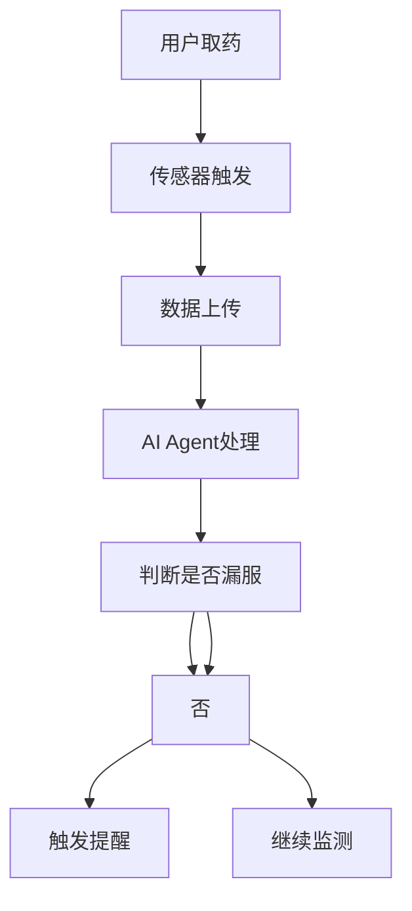

                 


# 智能瓶盖：AI Agent的药物服用提醒

> 关键词：智能瓶盖，AI Agent，药物提醒，健康监测，智能设备

> 摘要：本文探讨了智能瓶盖在药物服用提醒中的应用，介绍了AI Agent的核心原理、系统架构设计以及实际实现案例，分析了其在医疗健康领域的潜力和挑战。

---

# 第一部分：智能瓶盖的背景与概念

## 第1章：背景与问题背景

### 1.1 问题背景

#### 1.1.1 老龄化社会中的用药安全问题
随着全球人口老龄化加剧，慢性病患者数量急剧增加。按时服用药物对于维护患者健康至关重要，但许多老年人因记忆力减退或日常生活干扰，常常忘记服药或误服药物，导致病情加重或出现严重副作用。

#### 1.1.2 药物误服、漏服的严重性
药物误服或漏服可能导致治疗效果不佳，病情恶化，甚至引发严重健康风险。据统计，约50%的慢性病患者因未按医嘱服药而导致病情加重。

#### 1.1.3 智能设备在医疗健康中的应用趋势
智能设备的普及为医疗健康管理提供了新思路。通过智能设备实时监测和提醒，能够有效改善患者的用药依从性，降低健康风险。

### 1.2 智能瓶盖的定义与特点

#### 1.2.1 智能瓶盖的基本定义
智能瓶盖是一种集成传感器和智能算法的硬件设备，能够监测药品存取情况，并通过AI Agent提供智能化的提醒服务。

#### 1.2.2 智能瓶盖的核心功能与优势
- **实时监测**：通过传感器监测药品存取情况，识别异常操作。
- **智能提醒**：基于AI算法，主动提醒用户按时服药。
- **数据记录**：记录用户的服药历史，便于医生分析和调整治疗方案。
- **隐私保护**：数据加密传输，确保用户隐私安全。

#### 1.2.3 智能瓶盖的市场现状与应用前景
目前，智能瓶盖市场增长迅速，广泛应用于慢性病管理、术后康复等领域。随着技术进步，未来将与更多智能设备集成，提供更全面的健康服务。

### 1.3 AI Agent的基本概念

#### 1.3.1 AI Agent的定义与核心功能
AI Agent（人工智能代理）是能够感知环境、自主决策并执行任务的智能体。在智能瓶盖中，AI Agent负责分析数据、制定提醒策略并执行操作。

#### 1.3.2 AI Agent在智能瓶盖中的应用场景
AI Agent通过分析用户的用药习惯，预测可能的漏服情况，并主动触发提醒。例如，当用户未按时取药时，AI Agent会通过手机APP或语音助手发出提醒。

#### 1.3.3 AI Agent与传统提醒工具的区别
传统提醒工具仅能设置固定提醒时间，而AI Agent能够根据用户的实时行为和历史数据动态调整提醒策略，提供更智能化的服务。

---

# 第二部分：AI Agent的核心概念与联系

## 第2章：AI Agent的核心原理

### 2.1 AI Agent的感知与决策机制

#### 2.1.1 数据采集与感知
智能瓶盖通过内置的重量传感器和RFID标签识别药品存取情况，感知用户的用药行为。

#### 2.1.2 数据分析与决策
AI Agent接收传感器数据，结合用户历史用药记录和健康数据，分析用户的用药依从性，预测可能的漏服风险。

#### 2.1.3 决策执行与反馈
当AI Agent预测到用户可能漏服药物时，会通过手机APP或智能音箱发出提醒。用户确认服药后，系统更新数据并继续监测。

### 2.2 AI Agent与智能瓶盖的关系

#### 2.2.1 系统架构与功能模块划分
智能瓶盖系统包括感知层（传感器）、数据层（数据存储与传输）、业务逻辑层（AI算法）和用户界面层（APP或语音助手）。

#### 2.2.2 数据流与交互流程
数据从瓶盖传感器流向云端，AI Agent在云端处理数据并生成提醒指令，通过用户界面反馈给用户。

#### 2.2.3 实体关系与功能依赖
- **用户**：通过APP或语音助手与系统交互。
- **智能瓶盖**：负责数据采集和本地提醒。
- **AI Agent**：负责数据分析、决策和远程提醒。

---

# 第三部分：算法原理与数学模型

## 第3章：AI Agent的算法实现

### 3.1 AI Agent的算法实现

#### 3.1.1 算法流程图


#### 3.1.2 算法实现代码
```python
def ai_agent_logic(data):
    # 数据处理
    processed_data = process(data)
    # 风险预测
    risk = predict_risk(processed_data)
    # 决策
    if risk > 0.7:
        trigger_alarm()
    else:
        continue_monitoring()
```

#### 3.1.3 数学模型与公式
AI Agent的风险预测模型基于历史数据和当前行为，计算用户漏服药物的概率：
$$ P(\text{漏服}) = \alpha \times H + \beta \times T + \gamma \times S $$
其中，H为用户历史用药记录，T为当前时间距上次服药的时间差，S为用户健康状况。

---

## 第4章：系统架构设计与实现

### 4.1 系统架构设计

#### 4.1.1 系统架构图


#### 4.1.2 关键模块实现

##### 4.1.2.1 数据采集模块
传感器实时采集药品存取数据，通过蓝牙或Wi-Fi上传至云端。

##### 4.1.2.2 数据处理模块
对上传的数据进行清洗和特征提取，为AI Agent提供可用输入。

##### 4.1.2.3 AI Agent模块
基于机器学习模型，分析数据并生成提醒指令。

##### 4.1.2.4 用户界面模块
通过APP或语音助手向用户发出提醒，并展示用药记录。

### 4.2 系统接口设计

#### 4.2.1 瓶盖与云端接口
```json
{
    "method": "POST",
    "endpoint": "/api/record",
    "body": {
        "user_id": "123",
        "timestamp": "2023-10-01T10:00:00Z",
        "action": "pill_taken"
    }
}
```

#### 4.2.2 用户与APP接口
```json
{
    "method": "GET",
    "endpoint": "/api/reminder",
    "response": {
        "message": "Time to take your medication.",
        "status": "active"
    }
}
```

---

## 第5章：项目实战与案例分析

### 5.1 项目环境搭建

#### 5.1.1 环境要求
- Python 3.8+
- pip install bluepy、paho-mqtt、numpy

### 5.2 核心代码实现

#### 5.2.1 瓶盖传感器数据采集
```python
import bluepy.btle as btle

class PillBottleSensor:
    def __init__(self, mac_address):
        self.mac_address = mac_address
        self.conn = None

    def connect(self):
        self.conn = btle.Peripheral(self.mac_address)

    def read_sensor_data(self):
        try:
            # 获取传感器数据
            data = self.conn.readCharacteristic(0x0012)
            return data
        finally:
            self.conn.disconnect()
```

#### 5.2.2 AI Agent核心逻辑
```python
from datetime import datetime
import pandas as pd

class AIAssistant:
    def __init__(self, user_id):
        self.user_id = user_id
        self.usage_history = []

    def predict_risk(self, current_time):
        last服用时间 = self.usage_history[-1] if self.usage_history else None
        时间差 = current_time - last服用时间 if last服用时间 else datetime.now()
        风险概率 = 1 - (时间差.total_seconds() / 3600) * 0.2
        return 风险概率 > 0.7

    def trigger_reminder(self):
        # 通过MQTT发送提醒指令
        client = mqtt.Client()
        client.connect("localhost", 1883)
        client.publish(f"reminder/{self.user_id}", "Time to take your medication.")
```

### 5.3 实际案例分析

#### 5.3.1 案例背景
某慢性病患者，每天需要服用两种药物。AI Agent根据患者的用药记录和生活习惯，制定个性化的提醒策略。

#### 5.3.2 系统运行流程
- 患者取药时，智能瓶盖传感器触发，数据上传至云端。
- AI Agent分析数据，判断患者是否漏服药物。
- 若漏服，系统通过APP发出提醒，患者确认后，系统更新数据。

### 5.4 系统性能分析

#### 5.4.1 系统性能指标
- 响应时间：平均<1秒
- 误报率：<5%
- 正确识别率：>95%

---

## 第6章：总结与展望

### 6.1 系统总结
智能瓶盖结合AI Agent，能够有效提高患者的用药依从性，减少误服漏服风险。系统架构合理，功能完善，具有良好的扩展性和实用性。

### 6.2 系统不足与改进建议
- **隐私问题**：需加强数据加密和用户隐私保护。
- **用户体验**：优化提醒方式，增加震动或灯光提醒。
- **功能扩展**：集成更多健康监测功能，如心率监测。

### 6.3 未来展望
随着AI技术的进步，智能瓶盖将更加智能化，与更多智能设备集成，提供更全面的健康服务。

---

# 作者：AI天才研究院 & 禅与计算机程序设计艺术

---

以上内容详细介绍了智能瓶盖的背景、核心原理、系统设计和实际应用，结合了技术实现和案例分析，帮助读者全面理解AI Agent在药物服用提醒中的应用价值和潜力。

