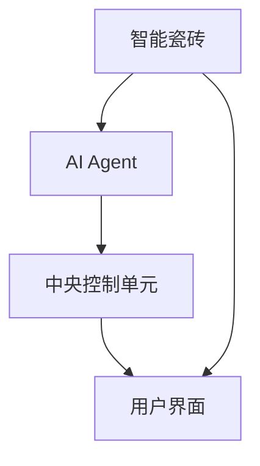
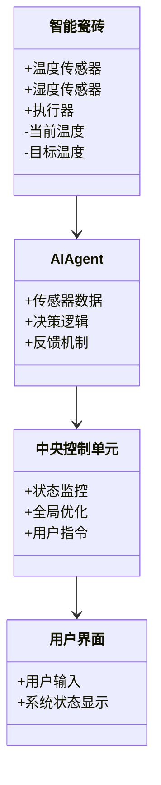
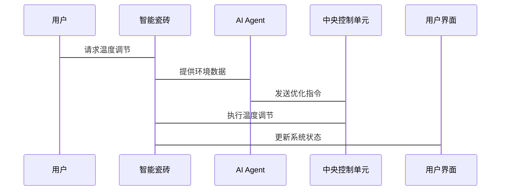

                 


# 智能瓷砖：AI Agent的室内温度均衡系统

> 关键词：智能瓷砖，AI Agent，温度均衡，物联网，智能家居

> 摘要：本文详细探讨了智能瓷砖与AI Agent结合的室内温度均衡系统。通过分析系统的背景、核心概念、算法原理、系统架构及项目实战，本文旨在展示如何利用AI技术实现精准的室内温度控制，提升居住舒适度并优化能源效率。

---

## 第一部分: 背景介绍

### 第1章: 问题背景与描述

#### 1.1 传统室内温度控制的痛点
##### 1.1.1 现有解决方案的不足
传统温度控制依赖于恒温器和空调，存在以下问题：
- **覆盖不均匀**：空调通常只能调节整个房间的平均温度，难以处理角落或特定区域的温度差异。
- **能效低下**：集中式系统在局部区域可能导致过度制冷或制热，增加能耗。
- **用户需求多样化**：不同人对温度的敏感度不同，传统系统难以满足个性化需求。

##### 1.1.2 用户需求的多样化
现代用户对智能家居的需求日益增长：
- **个性化温度调节**：不同区域、不同时间、不同人群的温度需求。
- **智能化与便捷性**：期望通过智能设备实现便捷的温度控制。

##### 1.1.3 温度控制的智能化趋势
随着物联网和AI技术的发展，温度控制趋向智能化：
- **实时感知与反馈**：通过传感器实时监测环境数据。
- **智能决策**：利用AI算法优化温度调节策略。
- **能源效率提升**：通过智能调节减少能源浪费。

#### 1.2 智能瓷砖的概念与特点
##### 1.2.1 智能瓷砖的定义
智能瓷砖是具有感知、计算和执行功能的瓷砖，能够通过AI Agent实现智能化的温度调节。

##### 1.2.2 智能瓷砖的核心功能
- **温度感知**：内置传感器实时监测表面温度。
- **智能调节**：根据AI算法调整温度。
- **通信能力**：通过无线网络与其他设备和中央系统交互。

##### 1.2.3 智能瓷砖与传统瓷砖的区别
| 属性 | 智能瓷砖 | 传统瓷砖 |
|------|----------|-----------|
| 材质 | 智能材料，支持温度调节 | 普通材料，仅用于装饰 |
| 功能 | 集成传感器和执行器 | 仅用于装饰和保护 |
| 连接性 | 支持物联网连接 | 无智能连接 |
| 能效 | 高效节能 | 无能效优化 |

#### 1.3 AI Agent在温度均衡中的作用
##### 1.3.1 AI Agent的基本概念
AI Agent是一种智能体，具备以下特点：
- **自主性**：无需外部干预，自主决策。
- **反应性**：能感知环境并实时响应。
- **社交能力**：能与其他智能体或人类交互。

##### 1.3.2 AI Agent在智能瓷砖中的应用
- **数据采集**：收集瓷砖表面的温度、环境湿度、用户行为等数据。
- **信息处理**：分析数据，预测温度变化，优化调节策略。
- **执行指令**：根据决策结果，调整瓷砖的温度设置。

##### 1.3.3 AI Agent的优势与挑战
- **优势**：
  - **实时响应**：快速感知并调整温度。
  - **精准控制**：通过局部调节实现均匀温度分布。
  - **能效优化**：通过智能算法减少能源浪费。
- **挑战**：
  - **数据隐私**：如何保护用户数据不被滥用。
  - **系统安全**：防止恶意攻击，确保系统稳定运行。
  - **算法优化**：在复杂环境中实现高效决策。

#### 1.4 本章小结
本章介绍了传统温度控制的痛点，智能瓷砖的定义和特点，以及AI Agent在温度均衡系统中的作用和优势。智能瓷砖通过AI Agent实现了从被动调节到主动优化的转变，为室内温度控制提供了新的解决方案。

---

## 第二部分: 核心概念与联系

### 第2章: 核心概念原理

#### 2.1 AI Agent的基本原理
##### 2.1.1 AI Agent的感知机制
AI Agent通过以下方式感知环境：
- **温度传感器**：实时监测瓷砖表面温度。
- **湿度传感器**：辅助判断环境湿度，影响温度调节策略。
- **用户行为传感器**：检测用户活动，优化温度设置。

##### 2.1.2 AI Agent的决策过程
决策过程分为以下几个步骤：
1. **数据收集**：从传感器获取环境数据。
2. **数据分析**：分析数据，判断当前温度状态。
3. **策略选择**：根据分析结果，选择最优调节策略。
4. **决策执行**：向执行机构发送指令。

##### 2.1.3 AI Agent的执行方式
- **局部调节**：单独调整有问题的区域。
- **全局优化**：协调所有瓷砖，实现整体温度均衡。
- **反馈机制**：根据用户反馈，动态调整设置。

#### 2.2 智能瓷砖的系统架构
##### 2.2.1 系统整体架构
系统架构包括以下几个部分：
- **智能瓷砖**：作为执行单元，负责温度调节。
- **AI Agent**：负责数据处理和决策。
- **中央控制单元**：协调各瓷砖，实现全局优化。
- **用户界面**：提供人机交互界面，供用户设置和监控。

##### 2.2.2 各模块的功能与交互
| 模块 | 功能 | 交互 |
|------|------|------|
| 智能瓷砖 | 温度调节 | 接收AI Agent指令，反馈温度数据 |
| AI Agent | 数据处理与决策 | 收集传感器数据，向瓷砖发送指令 |
| 中央控制单元 | 协调全局 | 监控所有瓷砖状态，优化整体温度 |
| 用户界面 | 人机交互 | 接收用户输入，显示系统状态 |

##### 2.2.3 系统的灵活性与扩展性
- **模块化设计**：各模块独立，便于维护和扩展。
- **插件支持**：支持多种传感器和执行器的接入。
- **可扩展性**：可以根据需求增加更多功能模块。

#### 2.3 温度均衡的数学模型
##### 2.3.1 温度均衡的基本原理
温度均衡系统的目标是通过调整各区域的温度，使得整个空间的温度分布均匀且舒适。数学模型如下：

$$ T_{target} = \frac{\sum T_i}{n} $$

其中，$T_{target}$是目标温度，$T_i$是各区域的当前温度，$n$是区域数量。

##### 2.3.2 温度均衡的数学公式
为了实现温度均衡，AI Agent需要解决以下优化问题：

$$ \min_{x} \sum_{i=1}^{n} (T_i - x)^2 $$

其中，$x$是目标温度，$T_i$是各区域的当前温度。通过求解这个优化问题，可以找到最优的温度分布。

##### 2.3.3 温度均衡的优化算法
常用梯度下降算法进行优化：

$$ x_{k+1} = x_k - \alpha \frac{\partial}{\partial x} \sum_{i=1}^{n} (T_i - x)^2 $$

其中，$\alpha$是学习率，$\frac{\partial}{\partial x}$是梯度。

#### 第3章: 核心概念对比与实体关系

##### 3.1 核心概念对比分析
| 概念 | 传统空调系统 | AI Agent驱动的智能瓷砖系统 |
|------|--------------|----------------------------|
| 温度调节 | 集中式调节 | 分布式调节 |
| 能效 | 较低 | 较高 |
| 智能化程度 | 低 | 高 |

##### 3.2 实体关系图


---

## 第三部分: 算法原理讲解

### 第4章: AI Agent的算法原理

#### 4.1 AI Agent的感知与决策算法
##### 4.1.1 感知算法的实现
AI Agent通过传感器数据进行实时感知，算法如下：

```python
def感知环境():
    读取温度传感器数据
    读取湿度传感器数据
    返回环境数据
```

##### 4.1.2 决策算法的实现
基于感知数据，AI Agent进行决策：

```python
def决策():
    分析环境数据
    判断是否需要调整温度
    选择最优调节策略
    返回指令
```

##### 4.1.3 执行算法的实现
根据决策结果，执行温度调节：

```python
def执行():
    发送指令到瓷砖
    等待反馈
    更新环境数据
```

#### 4.2 温度预测模型
##### 4.2.1 温度预测模型的建立
温度预测模型基于历史数据，使用时间序列分析：

$$ T_{预测} = aT_{当前} + bT_{历史} + c $$

其中，$a$、$b$、$c$是模型参数。

##### 4.2.2 温度预测模型的优化
通过反馈机制优化模型参数：

$$ \theta_{k+1} = \theta_k - \alpha \frac{\partial}{\partial \theta} (T_{预测} - T_{实际})^2 $$

---

## 第四部分: 系统分析与架构设计方案

### 第5章: 系统架构设计

#### 5.1 问题场景介绍
智能瓷砖通过AI Agent实现室内温度均衡，主要应用于家庭、办公室等场所。

#### 5.2 系统功能设计
##### 5.2.1 领域模型


##### 5.2.2 系统架构设计


##### 5.2.3 系统接口设计
- **传感器接口**：用于采集环境数据。
- **通信接口**：用于与其他设备和中央系统交互。
- **用户接口**：用于人机交互，接收用户指令和显示系统状态。

##### 5.2.4 系统交互流程


---

## 第五部分: 项目实战

### 第6章: 项目实战

#### 6.1 环境安装
##### 6.1.1 硬件安装
- **智能瓷砖**：安装传感器和执行器。
- **通信模块**：连接Wi-Fi或ZigBee模块。
- **中央控制单元**：安装服务器和AI算法。

##### 6.1.2 软件安装
- **AI框架**：安装TensorFlow或Keras。
- **通信协议**：安装MQTT或WebSocket库。

#### 6.2 系统核心实现
##### 6.2.1 核心功能实现
```python
import mqtt
from tensorflow import keras

def温度调节():
    数据 = 读取传感器数据()
    预测温度 = 模型预测(数据)
    发送指令到瓷砖(预测温度)
```

##### 6.2.2 代码应用解读
- **传感器数据读取**：通过MQTT协议接收传感器数据。
- **AI模型预测**：使用预训练的神经网络模型进行温度预测。
- **指令发送**：通过ZigBee协议发送指令到瓷砖。

#### 6.3 实际案例分析
##### 6.3.1 案例背景
某住户安装了10块智能瓷砖，通过AI Agent实现温度均衡。

##### 6.3.2 实施步骤
1. **硬件安装**：安装智能瓷砖和通信模块。
2. **软件配置**：配置中央控制单元和AI模型。
3. **系统测试**：进行压力测试和功能验证。
4. **用户反馈**：收集用户反馈，优化系统。

#### 6.4 项目小结
本章通过实际案例展示了智能瓷砖的安装和系统实现过程，强调了AI技术在温度调节中的重要作用。

---

## 第六部分: 最佳实践

### 第7章: 最佳实践

#### 7.1 小结
智能瓷砖通过AI Agent实现了室内温度的精准调节，显著提升了居住舒适度和能源效率。

#### 7.2 注意事项
- **数据隐私**：确保用户数据的安全。
- **系统维护**：定期更新AI模型和系统软件。
- **兼容性**：确保与现有智能家居设备兼容。

#### 7.3 拓展阅读
- **相关技术**：研究其他智能家居技术，如智能照明、智能安防。
- **前沿研究**：关注AI在能源管理中的最新应用。

---

## 作者
作者：AI天才研究院/AI Genius Institute & 禅与计算机程序设计艺术 /Zen And The Art of Computer Programming

