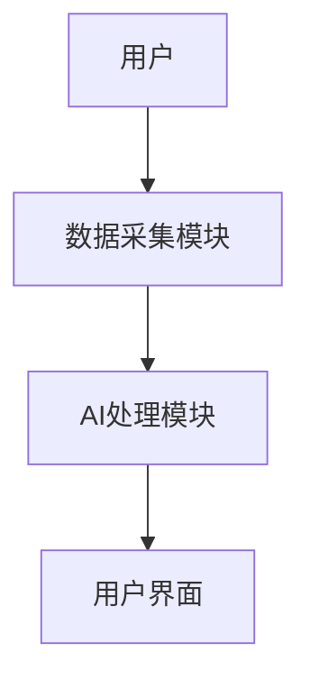
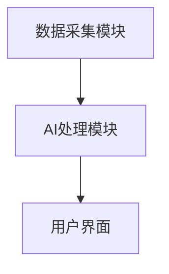
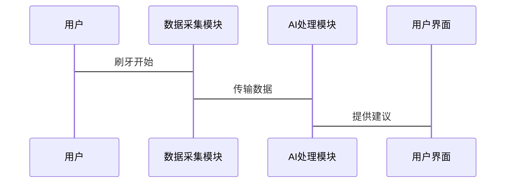

                 


# 智能电动牙刷：AI Agent的个性化刷牙指导

**关键词**：智能电动牙刷、AI Agent、个性化刷牙、自然语言处理、推荐算法、系统架构

**摘要**：  
智能电动牙刷通过集成AI Agent技术，能够提供个性化的刷牙指导，显著提升用户的口腔健康水平。本文从背景、技术原理、系统架构到实际应用，全面解析智能电动牙刷的智能化之路，探讨AI Agent如何通过数据采集、分析和个性化推荐实现精准的刷牙指导。

---

# 第一部分：智能电动牙刷的背景与现状

## 第1章：智能电动牙刷与AI Agent概述

### 1.1 智能电动牙刷的发展历程

#### 1.1.1 传统牙刷的局限性  
传统牙刷依赖手动操作，难以保证刷牙的全面性和正确性。用户可能因为习惯问题，无法有效清洁口腔中的每个角落，导致口腔健康问题。  

#### 1.1.2 智能电动牙刷的出现与演变  
智能电动牙刷通过电动驱动和智能传感器，能够实时监测用户的刷牙动作，提供更高效的清洁体验。  

#### 1.1.3 AI Agent在智能牙刷中的作用  
AI Agent（智能代理）通过分析用户的刷牙数据，提供个性化建议，帮助用户改善刷牙习惯。

### 1.2 AI Agent的核心概念

#### 1.2.1 什么是AI Agent  
AI Agent是一种能够感知环境、自主决策并执行任务的智能实体。在智能牙刷中，AI Agent负责分析用户的刷牙数据，提供个性化的指导。

#### 1.2.2 AI Agent的分类与特点  
- **反应式AI Agent**：基于当前输入做出实时反馈，如根据用户的刷牙压力调整清洁力度。  
- **认知式AI Agent**：具备学习和推理能力，能够根据用户的长期数据提供个性化建议。

#### 1.2.3 AI Agent在智能牙刷中的作用  
AI Agent通过分析用户的刷牙时间、力度、频率等数据，优化用户的刷牙习惯，预防口腔问题。

### 1.3 智能电动牙刷的市场现状

#### 1.3.1 市场规模与用户需求  
随着人们对口腔健康的关注增加，智能电动牙刷市场迅速增长，用户对个性化指导的需求日益旺盛。

#### 1.3.2 竞争格局与技术趋势  
市场竞争激烈，技术趋势主要集中在AI Agent的深度应用和用户体验优化上。

#### 1.3.3 用户痛点与改进方向  
用户普遍反映传统牙刷清洁效果差，希望通过智能牙刷获得更科学的指导。

### 1.4 本章小结  
本章介绍了智能电动牙刷的发展历程和AI Agent的核心作用，为后续的技术分析奠定基础。

---

# 第二部分：AI Agent的个性化刷牙指导原理

## 第2章：AI Agent的核心原理与系统架构

### 2.1 AI Agent的核心原理

#### 2.1.1 自然语言处理（NLP）基础  
AI Agent需要理解用户的语言指令，如“帮我调整刷牙力度”，并通过NLP技术解析用户的意图。

#### 2.1.2 个性化推荐算法  
基于用户的刷牙数据，AI Agent会推荐适合的刷牙模式，如“敏感牙龈模式”或“深度清洁模式”。

#### 2.1.3 多模态数据融合  
AI Agent整合用户的刷牙时间、力度、角度等多种数据，提供全面的个性化建议。

### 2.2 系统架构设计

#### 2.2.1 系统模块划分  
- 数据采集模块：收集用户的刷牙数据。  
- 用户画像模块：构建用户的个性化档案。  
- 刷牙指导模块：基于数据提供个性化建议。

#### 2.2.2 数据流与交互流程  
用户刷牙时，数据采集模块实时收集数据，传输至AI处理模块进行分析，最后通过用户界面反馈指导建议。

#### 2.2.3 系统架构图  


---

## 第3章：个性化刷牙指导算法

### 3.1 算法原理

#### 3.1.1 用户画像构建  
AI Agent通过用户的刷牙数据，构建用户的口腔健康档案，包括刷牙频率、力度、时间等。

#### 3.1.2 刷牙习惯分析  
AI Agent分析用户的刷牙习惯，识别潜在的口腔健康问题，如刷牙时间过短或力度过大。

#### 3.1.3 个性化推荐模型  
基于机器学习算法，AI Agent为用户推荐适合的刷牙模式，如“敏感牙龈模式”。

### 3.2 算法实现

#### 3.2.1 数据预处理  
对收集的刷牙数据进行清洗和标准化处理，确保数据质量。

#### 3.2.2 模型训练  
使用协同过滤算法训练推荐模型，基于用户的刷牙数据预测个性化建议。

#### 3.2.3 推荐系统实现  
通过Python代码实现推荐系统，例如：
```python
# 协同过滤算法示例
import numpy as np

def collaborative_filtering(user_data):
    # 用户数据处理
    pass

user_id = 123
recommendation = collaborative_filtering(user_data[user_id])
return recommendation
```

### 3.3 算法优化

#### 3.3.1 参数调优  
通过交叉验证调整模型参数，提高推荐的准确性。

#### 3.3.2 模型评估  
使用准确率、召回率等指标评估模型性能。

#### 3.3.3 实际案例分析  
通过具体案例分析模型的优化效果，如提升推荐准确率。

---

## 第4章：系统分析与架构设计

### 4.1 系统功能设计

#### 4.1.1 用户界面设计  
用户友好的界面，实时显示刷牙数据和AI建议。

#### 4.1.2 数据采集模块  
通过传感器实时采集用户的刷牙数据。

#### 4.1.3 AI处理模块  
分析数据并生成个性化建议。

### 4.2 系统架构设计

#### 4.2.1 分层架构  
- 数据层：存储用户数据。  
- 业务逻辑层：处理数据并生成建议。  
- 用户界面层：展示结果。

#### 4.2.2 微服务架构  
将系统拆分为独立的服务，如数据采集服务、AI处理服务等。

#### 4.2.3 架构图  


### 4.3 系统接口设计

#### 4.3.1 用户接口  
用户通过手机App或智能牙刷与系统交互。

#### 4.3.2 数据接口  
系统与第三方数据源（如口腔医院）交互，获取更多健康数据。

#### 4.3.3 第三方接口  
支持与智能家居等第三方设备的联动，如与智能镜子联动显示口腔健康数据。

### 4.4 系统交互设计

#### 4.4.1 用户与系统的交互流程  
用户刷牙时，系统实时采集数据，分析后给出建议。

#### 4.4.2 数据流与服务调用  
数据从传感器传输到云端，经过AI处理后反馈到用户界面。

#### 4.4.3 交互序列图  


---

## 第5章：项目实战与优化

### 5.1 项目实战

#### 5.1.1 环境安装  
安装必要的开发工具和库，如Python、TensorFlow等。

#### 5.1.2 核心代码实现  
实现AI Agent的核心功能，如数据采集和推荐算法。

#### 5.1.3 实际案例分析  
通过具体案例展示系统如何根据用户的刷牙数据提供个性化建议。

### 5.2 最佳实践

#### 5.2.1 系统优化建议  
优化算法和架构，提升系统的响应速度和准确性。

#### 5.2.2 用户体验提升  
设计友好的用户界面，确保用户能够轻松理解和使用系统的建议。

#### 5.2.3 注意事项  
注意数据隐私保护，确保用户的刷牙数据安全。

### 5.3 小结  
本章通过实际案例展示了智能电动牙刷的实现过程，强调了系统优化和用户体验的重要性。

---

# 第六部分：总结与展望

## 第6章：总结与展望

### 6.1 总结  
智能电动牙刷结合AI Agent，通过个性化指导显著提升了用户的口腔健康水平。

### 6.2 未来展望  
未来的智能牙刷将更加智能化，可能集成更多的健康监测功能，如口腔细菌检测。

---

# 作者：AI天才研究院 & 禅与计算机程序设计艺术

---

通过以上结构，我系统地分析了智能电动牙刷与AI Agent的结合，从背景到技术实现，再到实际应用，为读者提供了全面的知识和实践指导。

