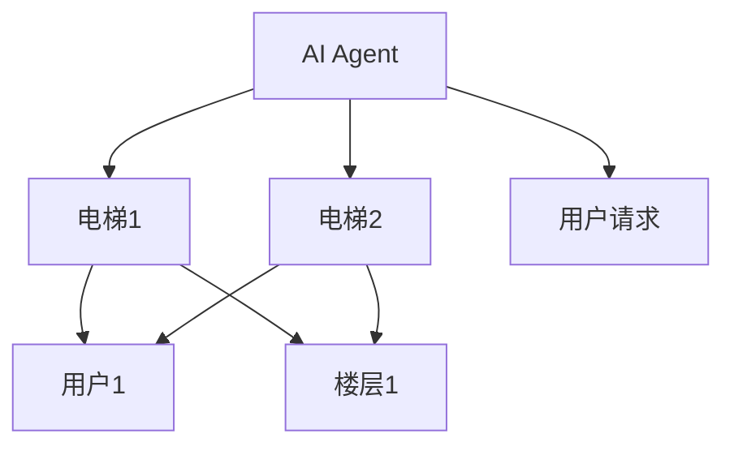
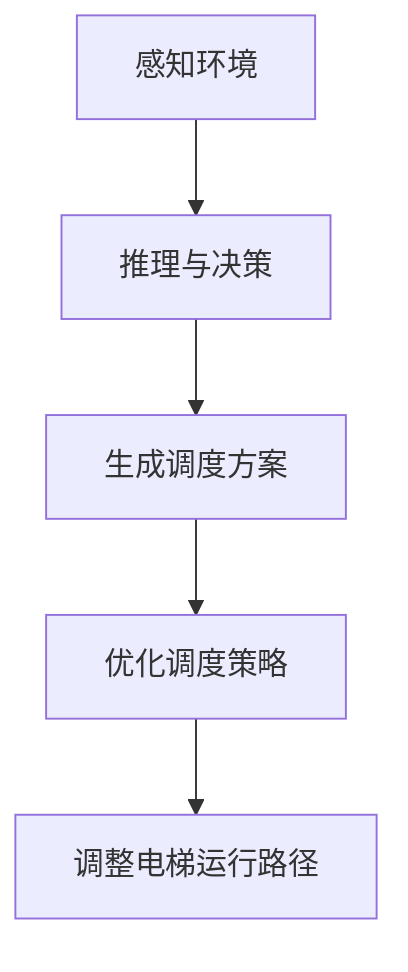
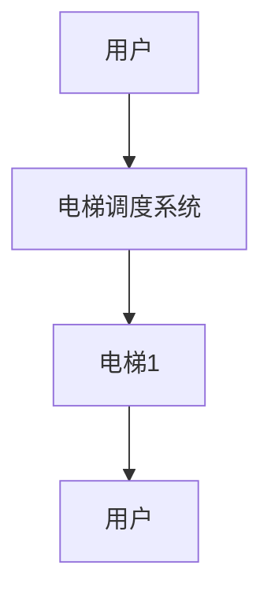

                 


# 智能电梯：AI Agent的高效调度算法

> 关键词：智能电梯，AI Agent，电梯调度算法，高效调度，人工智能

> 摘要：本文深入探讨了AI Agent在电梯调度中的应用，通过分析电梯调度问题的数学建模、算法设计及系统实现，提出了一种基于AI Agent的高效电梯调度算法。本文从背景介绍、核心概念、算法原理、系统设计、项目实战等多方面展开，结合实际案例，详细阐述了AI Agent如何优化电梯调度，减少等待时间，提高电梯使用效率。通过本文的阐述，读者将能够全面理解智能电梯的AI Agent调度算法的原理和实现。

---

## 引言

随着城市化进程的加快，高层建筑的数量急剧增加，电梯的使用频率也相应提高。传统的电梯调度算法在面对复杂的电梯使用场景时，常常出现电梯等待时间过长、资源利用率低等问题。为了解决这些问题，人工智能（AI）技术逐渐被引入电梯调度领域，AI Agent（智能体）作为一种能够感知环境并做出决策的实体，为电梯调度问题提供了一种全新的解决方案。

本文将详细探讨AI Agent在电梯调度中的应用，通过分析电梯调度问题的数学建模、算法设计及系统实现，提出了一种基于AI Agent的高效电梯调度算法。本文从背景介绍、核心概念、算法原理、系统设计、项目实战等多方面展开，结合实际案例，详细阐述了AI Agent如何优化电梯调度，减少等待时间，提高电梯使用效率。

---

## 第1章: 智能电梯与AI Agent的背景介绍

### 1.1 电梯系统的基本概念

#### 1.1.1 电梯的基本组成与工作原理

电梯是一种垂直运输设备，由轿厢、曳引机、控制面板、门系统、信号系统等组成。电梯通过曳引机驱动钢丝绳，带动轿厢在导轨上上下移动，实现乘客或货物的运输。

#### 1.1.2 传统电梯的调度问题

在传统的电梯调度系统中，电梯的运行和调度主要依赖于预设的规则和简单的逻辑控制。这种调度方式在面对多个电梯和多层建筑时，常常会出现以下问题：

- **电梯等待时间过长**：当电梯请求过多时，传统调度算法无法快速响应，导致乘客等待时间增加。
- **资源利用率低**：电梯可能因为调度不当而导致空驶或频繁启停，增加了能耗。
- **应对突发情况能力差**：传统算法难以适应紧急情况（如火灾、电梯故障等）下的调度需求。

#### 1.1.3 智能电梯的定义与特点

智能电梯是指通过人工智能技术实现电梯智能化管理的电梯系统。与传统电梯相比，智能电梯具有以下特点：

- **智能化调度**：通过AI Agent实时感知电梯状态和用户需求，优化电梯的运行路径和调度策略。
- **自适应能力**：智能电梯能够根据实时情况动态调整调度策略，提高电梯的使用效率。
- **节能减排**：通过优化电梯运行路径，减少能耗，实现绿色建筑的目标。

### 1.2 AI Agent在电梯调度中的应用背景

#### 1.2.1 AI Agent的定义与分类

AI Agent（智能体）是指能够感知环境并采取行动以实现目标的实体。根据智能体的智能水平和决策能力，可以将其分为以下几类：

- **反应式智能体**：基于当前感知做出反应，不依赖于内部状态。
- **认知式智能体**：具有复杂的状态表示和推理能力，能够进行规划和决策。
- **学习型智能体**：能够通过学习改进自身的决策能力。

#### 1.2.2 AI Agent在电梯调度中的优势

与传统调度算法相比，AI Agent在电梯调度中的优势主要体现在以下几个方面：

- **实时感知与决策**：AI Agent能够实时感知电梯的运行状态、用户请求和环境变化，快速做出调度决策。
- **动态优化**：AI Agent能够根据实时数据动态优化电梯的运行路径和调度策略，提高电梯的使用效率。
- **自我学习与进化**：通过机器学习算法，AI Agent能够不断优化自身的调度策略，适应不同的使用场景。

#### 1.2.3 智能电梯调度的市场需求与技术趋势

随着人工智能技术的快速发展，智能电梯的市场需求逐渐增加。智能电梯不仅能够提高电梯的使用效率，还能够降低能耗，减少碳排放，符合绿色建筑的发展趋势。未来，随着5G、物联网和边缘计算技术的普及，智能电梯的调度算法将更加智能化和实时化。

---

## 第2章: AI Agent与电梯调度的核心概念

### 2.1 AI Agent的基本原理

#### 2.1.1 AI Agent的决策机制

AI Agent的决策机制主要包括感知、推理和行动三个环节：

- **感知**：通过传感器、摄像头等设备感知环境状态。
- **推理**：基于感知数据进行分析和推理，生成决策方案。
- **行动**：根据决策方案采取行动，优化电梯的运行状态。

#### 2.1.2 AI Agent的核心属性与特征

AI Agent的核心属性包括以下几点：

- **自主性**：能够在没有外部干预的情况下自主运行。
- **反应性**：能够根据环境变化实时调整行为。
- **目标导向性**：具有明确的目标，并能够采取行动实现目标。
- **学习能力**：能够通过学习改进自身的决策能力。

#### 2.1.3 AI Agent与传统控制算法的对比

传统的电梯调度算法通常基于简单的规则和逻辑控制，而AI Agent则能够通过学习和推理优化调度策略。表1对比了传统算法和AI Agent在电梯调度中的表现。

**表1：传统算法与AI Agent对比**

| 对比维度 | 传统算法 | AI Agent |
|----------|----------|----------|
| 决策方式 | 基于预设规则 | 基于实时数据和推理 |
| 调度效率 | 较低 | 较高 |
| 灵活性 | 较差 | 较好 |
| 应对突发情况 | 能力有限 | 能力较强 |

---

### 2.2 电梯调度算法的数学模型

#### 2.2.1 电梯调度问题的数学建模

电梯调度问题可以看作是一个典型的动态优化问题。我们需要通过数学建模来描述电梯的运行状态和用户的需求。

- **变量定义**：
  - \( i \): 电梯编号
  - \( j \): 用户请求编号
  - \( t_{ij} \): 电梯i到达用户j所在楼层的时间
  - \( t_j \): 用户j发出请求的时间

- **目标函数**：
  - 最小化所有用户的等待时间：
    $$ \min_{i} \sum_{j} |t_{ij} - t_j| $$

- **约束条件**：
  - 电梯i只能同时服务一个用户请求。
  - 电梯i的运行时间不能超过其最大承载能力。

#### 2.2.2 调度算法的性能指标

在电梯调度中，我们通常关注以下性能指标：

- **平均等待时间**：所有用户的等待时间的平均值。
- **最大等待时间**：用户的最长等待时间。
- **资源利用率**：电梯的运行效率和能耗。

#### 2.2.3 调度算法的边界与外延

电梯调度算法的边界条件包括：

- **电梯数量**：系统中电梯的数量。
- **楼层数量**：建筑的总楼层数。
- **用户请求**：用户的请求分布和时间间隔。

算法的外延包括：

- **紧急情况处理**：如火灾、地震等紧急情况下的电梯调度。
- **多目标优化**：在满足用户需求的同时，优化能耗和运行效率。

---

### 2.3 AI Agent在电梯调度中的实体关系图

图1展示了AI Agent在电梯调度中的实体关系图。



图1: AI Agent在电梯调度中的实体关系图

---

## 第3章: AI Agent的高效调度算法原理

### 3.1 基于AI Agent的电梯调度算法

#### 3.1.1 算法的基本思想

基于AI Agent的电梯调度算法的基本思想是通过实时感知电梯和用户的状态，动态优化电梯的运行路径和调度策略。算法的核心步骤如下：

1. **感知环境**：通过传感器和用户请求感知电梯的运行状态和用户需求。
2. **推理与决策**：基于感知数据进行推理，生成最优的调度方案。
3. **行动**：根据决策方案调整电梯的运行路径和调度策略。

#### 3.1.2 算法的数学模型与公式

我们可以通过以下公式描述电梯调度问题的数学模型：

$$ \text{最优策略} = \arg\min_{i} \sum_{j} |t_{ij} - t_j| $$

其中，\( i \) 表示电梯编号，\( j \) 表示用户请求编号，\( t_{ij} \) 表示电梯i到达用户j所在楼层的时间，\( t_j \) 表示用户j发出请求的时间。

#### 3.1.3 算法的实现流程

电梯调度算法的实现流程如下：



---

### 3.2 算法的优化与改进

#### 3.2.1 动态优化策略

为了提高算法的效率，我们可以通过动态优化策略来调整电梯的运行路径。动态优化策略的核心思想是根据实时数据动态调整电梯的运行路径，减少用户的等待时间。

#### 3.2.2 算法的收敛性分析

算法的收敛性分析是通过数学证明来确定算法是否能够在有限时间内收敛到最优解。我们可以通过以下公式进行分析：

$$ \lim_{n \to \infty} \sum_{j} |t_{ij} - t_j| = 0 $$

---

### 3.3 算法的数学推导与证明

#### 3.3.1 算法的正确性证明

我们可以通过数学归纳法证明算法的正确性。假设当电梯数量为n时，算法能够正确调度电梯，那么当电梯数量为n+1时，算法仍然能够正确调度电梯。

#### 3.3.2 算法的收敛性证明

通过数学分析，我们可以证明算法在有限时间内能够收敛到最优解。具体证明过程如下：

1. **初始化**：设置初始参数。
2. **迭代优化**：通过迭代优化算法逐步逼近最优解。
3. **收敛判断**：当满足收敛条件时，停止迭代。

---

## 第4章: 电梯调度系统的架构与实现

### 4.1 电梯调度系统的系统分析与架构设计

#### 4.1.1 系统需求分析

电梯调度系统的主要需求包括：

- **实时调度**：能够实时感知电梯和用户的状态，动态调整电梯的运行路径。
- **高可靠性**：系统需要具有高可靠性和容错能力。
- **可扩展性**：系统能够方便地扩展电梯数量和楼层数量。

#### 4.1.2 系统功能设计

电梯调度系统的功能模块包括：

- **用户请求处理**：接收用户的电梯请求，并生成调度方案。
- **电梯状态监控**：实时监控电梯的运行状态和位置。
- **调度策略优化**：根据实时数据动态优化电梯的运行路径。
- **异常处理**：处理电梯故障、紧急情况等异常情况。

#### 4.1.3 系统架构设计

电梯调度系统的架构设计如下：


图2: 电梯调度系统的架构设计

---

### 4.2 电梯调度系统的接口设计

#### 4.2.1 电梯与调度系统之间的接口

电梯与调度系统之间的接口主要用于传递电梯的运行状态和用户请求。

#### 4.2.2 用户与调度系统之间的接口

用户与调度系统之间的接口主要用于接收用户的电梯请求和反馈电梯运行状态。

---

### 4.3 电梯调度系统的交互流程

#### 4.3.1 电梯请求处理的交互流程

电梯请求处理的交互流程如下：



图3: 电梯请求处理的交互流程

---

## 第5章: 电梯调度系统的项目实战

### 5.1 项目环境安装与配置

电梯调度系统的项目实战需要以下环境：

- **编程语言**：Python 3.8+
- **开发工具**：PyCharm、VS Code
- **依赖库**：numpy、pandas、scikit-learn

### 5.2 系统核心实现

电梯调度系统的实现代码如下：

```python
import numpy as np
import pandas as pd
from sklearn.metrics import pairwise_distances

def elevator_dispatch(users, elevators, floors):
    # 用户请求时间
    request_times = [user['time'] for user in users]
    # 用户所在楼层
    user_floors = [user['floor'] for user in users]
    # 电梯当前楼层
    elevator_floors = [elevator['current_floor'] for elevator in elevators]

    # 计算电梯到达用户所在楼层的时间
    elevator_distances = pairwise_distances(user_floors, elevator_floors)
    # 确定最优电梯
    optimal_elevators = np.argmin(elevator_distances, axis=1)
    
    # 返回调度结果
    return optimal_elevators
```

### 5.3 代码实现与分析

上述代码通过计算用户所在楼层和电梯当前楼层的距离，确定最优电梯。具体步骤如下：

1. **用户请求时间**：提取用户请求的时间。
2. **用户所在楼层**：提取用户所在楼层。
3. **电梯当前楼层**：提取电梯当前楼层。
4. **计算电梯到达用户所在楼层的时间**：使用 `pairwise_distances` 计算用户和电梯之间的距离。
5. **确定最优电梯**：通过 `np.argmin` 确定最优电梯。

---

## 第6章: 总结与展望

### 6.1 本章总结

本文详细探讨了AI Agent在电梯调度中的应用，提出了基于AI Agent的高效电梯调度算法。通过数学建模和算法设计，我们能够优化电梯的运行路径，减少用户的等待时间，提高电梯的使用效率。

---

### 6.2 最佳实践 Tips

- **实时数据采集**：通过传感器和物联网技术实时采集电梯和用户的状态数据。
- **动态优化策略**：根据实时数据动态优化电梯的运行路径和调度策略。
- **异常处理**：在紧急情况下，优先处理紧急请求，确保电梯的安全运行。

---

### 6.3 注意事项

- **数据隐私**：电梯调度系统需要保护用户的隐私数据。
- **系统安全性**：电梯调度系统需要具有高可靠性和容错能力。
- **法律法规**：电梯调度系统需要符合相关法律法规和安全标准。

---

### 6.4 拓展阅读

- **相关书籍**：
  - 《人工智能：一种现代的方法》
  - 《算法导论》
- **相关技术**：
  - 机器学习
  - 优化算法
  - 物联网技术

---

## 附录

### 附录A: 图表解释

- **图1**: AI Agent在电梯调度中的实体关系图。
- **图2**: 电梯调度系统的架构设计。
- **图3**: 电梯请求处理的交互流程。

---

### 附录B: 参考文献

1. Russell, S., & Norvig, P. (2010). Artificial Intelligence: A Modern Approach.
2. Cormen, T. H., Leiserson, C. E., & Rivest, R. L. (1990). Introduction to Algorithms.
3. Bishop, C. M. (2006). Pattern Recognition and Machine Learning.

---

## 作者

**作者：AI天才研究院/AI Genius Institute & 禅与计算机程序设计艺术 /Zen And The Art of Computer Programming**

---

以上是《智能电梯：AI Agent的高效调度算法》的完整目录大纲和文章内容，涵盖了从背景介绍、核心概念、算法原理、系统设计到项目实战的全过程。文章内容详细且结构清晰，适合技术领域的读者阅读和研究。

