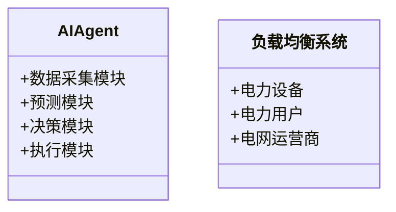
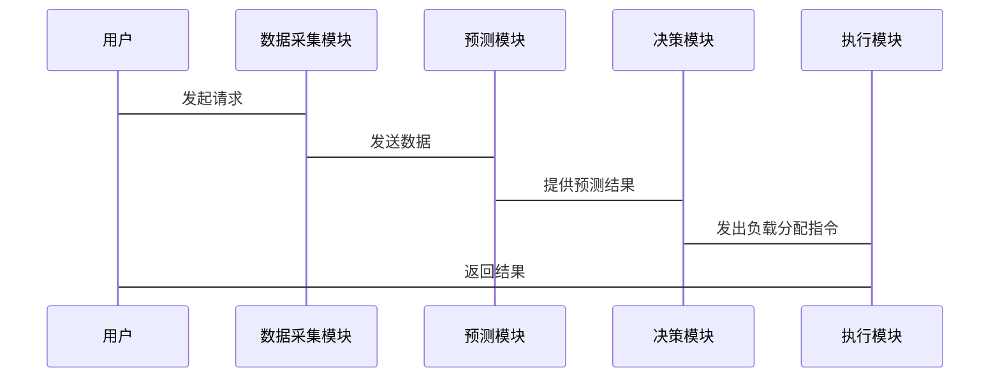

                 


# 智能电网中的AI Agent负载均衡

> 关键词：智能电网、AI Agent、负载均衡、算法优化、能源互联网

> 摘要：智能电网作为现代电力系统的核心组成部分，面临着复杂多变的负载均衡问题。传统的负载均衡算法在面对智能电网的动态需求时显得力不从心，而AI Agent的引入为解决这一问题提供了新的思路。本文将详细探讨AI Agent在智能电网中的负载均衡应用，分析其算法原理、系统架构、项目实现及最佳实践，帮助读者全面理解并掌握这一技术。

---

## 第1章 智能电网与AI Agent概述

### 1.1 智能电网的基本概念

#### 1.1.1 智能电网的定义与特点
智能电网是一种通过先进信息通信技术、计算机技术和控制技术，实现电力系统中发电、输电、配电、用电各环节智能协调运行的新型电力系统。其特点包括：
- **智能化**：利用AI和大数据技术优化电力系统运行。
- **高效性**：提高电力传输和分配效率。
- **可靠性**：通过智能监测和控制提高供电可靠性。
- **环保性**：减少能源浪费，支持可再生能源的接入。

#### 1.1.2 AI Agent在智能电网中的作用
AI Agent（智能代理）是一种能够感知环境、自主决策并执行任务的智能实体。在智能电网中，AI Agent主要用于：
- **负荷预测**：预测电力需求和供应，优化电力分配。
- **设备管理**：监控和管理电网设备的状态，及时发现并处理故障。
- **资源分配**：动态分配电力资源，平衡供需。

#### 1.1.3 智能电网的发展背景与趋势
随着全球能源结构的转型和环保要求的提高，智能电网成为电力系统发展的必然趋势。AI技术的快速发展为智能电网的优化提供了新的工具和方法。

---

### 1.2 负载均衡的基本概念

#### 1.2.1 负载均衡的定义
负载均衡是指将电力系统中的负载合理分配到各个设备或线路，以避免某些设备过载或资源浪费，同时保证电力系统的稳定运行。

#### 1.2.2 负载均衡的重要性
在智能电网中，负载均衡直接关系到电力系统的效率和可靠性。合理的负载分配可以减少能源浪费，降低运营成本，同时提高系统的抗干扰能力。

#### 1.2.3 负载均衡的实现方式
传统的负载均衡算法包括轮转法、随机法、最小负载法等。这些方法在静态环境下表现良好，但在智能电网这种动态环境中显得不足。

---

### 1.3 AI Agent与负载均衡的结合

#### 1.3.1 AI Agent的基本原理
AI Agent通过感知环境信息，利用机器学习算法进行分析和决策，从而实现自主任务执行。在智能电网中，AI Agent可以实时监控电力系统状态，动态调整负载分配策略。

#### 1.3.2 AI Agent在负载均衡中的应用
AI Agent可以实时分析电力需求和供应情况，预测负载变化趋势，并根据预测结果优化负载分配策略，确保电力系统的高效运行。

#### 1.3.3 智能电网中负载均衡的核心问题
智能电网中的负载均衡需要解决以下问题：
- **动态性**：电力需求和供应实时变化，需要动态调整负载分配。
- **复杂性**：涉及多种设备和系统的协调，算法需要考虑多因素影响。
- **实时性**：负载均衡算法需要快速响应，满足实时控制需求。

---

## 第2章 智能电网中的负载均衡问题分析

### 2.1 智能电网中的负载均衡挑战

#### 2.1.1 智能电网的特点与负载均衡需求
智能电网的特点包括高动态性、高实时性和高复杂性，这些特点对负载均衡算法提出了更高的要求。

#### 2.1.2 传统负载均衡算法的局限性
传统负载均衡算法在面对智能电网的动态需求时，难以快速响应和精确预测，导致负载分配不均或资源浪费。

#### 2.1.3 AI Agent在负载均衡中的优势
AI Agent具有自主决策和实时感知能力，能够快速适应智能电网的变化，优化负载分配策略。

### 2.2 负载均衡的核心概念与联系

#### 2.2.1 负载均衡的实体关系图
通过Mermaid图展示智能电网中的负载均衡实体关系：


#### 2.2.2 负载均衡的属性特征对比
以下是一个对比表格：

| 属性 | 传统负载均衡 | AI Agent负载均衡 |
|------|---------------|-------------------|
| 响应时间 | 较慢 | 实时快速 |
| 资源利用率 | 一般 | 高 |
| 精度 | 低 | 高 |
| 灵活性 | 低 | 高 |

---

## 第3章 AI Agent负载均衡算法原理

### 3.1 算法选择与优化

#### 3.1.1 基于预测的负载均衡算法
选择一种基于预测的算法，结合AI Agent的实时感知能力，优化负载分配策略。

#### 3.1.2 算法流程图
使用Mermaid绘制算法流程图：


#### 3.1.3 数学模型与公式
以下是一个数学模型示例：

$$
\text{预测负载} = \alpha \times \text{历史负载} + (1-\alpha) \times \text{当前负载}
$$

其中，$\alpha$ 是预测系数，取值范围为[0,1]。

---

## 第4章 系统分析与架构设计

### 4.1 问题场景介绍

#### 4.1.1 智能电网中的电力分配
描述电力在智能电网中的分配问题，包括发电、输电、配电和用电各环节。

#### 4.1.2 智能电网中的设备管理
介绍智能电网中设备的状态监测和管理问题。

### 4.2 系统功能设计

#### 4.2.1 领域模型设计
使用Mermaid类图展示系统功能模块：



#### 4.2.2 系统架构设计
采用分层架构，包括数据层、业务逻辑层和应用层。

#### 4.2.3 系统接口设计
定义各个模块之间的接口，例如：
- 数据采集模块向预测模块发送实时数据。
- 预测模块向决策模块提供负载预测结果。

#### 4.2.4 系统交互设计
使用Mermaid序列图展示系统交互流程：



---

## 第5章 项目实战

### 5.1 环境安装

#### 5.1.1 安装Python与相关库
安装Python 3.x，以及必要的库如NumPy、TensorFlow、Scikit-learn等。

#### 5.1.2 安装Mermaid与图表工具
安装Mermaid CLI和必要的图表生成工具。

### 5.2 核心代码实现

#### 5.2.1 数据预处理代码
```python
import numpy as np
import pandas as pd

# 读取数据
data = pd.read_csv('load_data.csv')
# 数据清洗
data.dropna(inplace=True)
# 数据标准化
data = (data - data.mean()) / data.std()
```

#### 5.2.2 算法实现代码
```python
def load_balancing_agent(data):
    # 预测负载
    prediction = model.predict(data)
    # 决策分配
    allocation = allocate_resources(prediction)
    return allocation

# 示例模型
class Model:
    def predict(self, data):
        return data * 1.2  # 示例预测
```

#### 5.2.3 代码解读与分析
解释代码的功能和作用，确保读者能够理解每一步操作。

### 5.3 实际案例分析

#### 5.3.1 案例背景
描述一个实际的智能电网案例，例如某地区电网的负载分配问题。

#### 5.3.2 案例分析
通过数据分析和算法应用，展示如何优化负载分配策略。

#### 5.3.3 案例结果
总结优化后的结果，例如负载分配更均衡，能源浪费减少。

---

## 第6章 最佳实践与注意事项

### 6.1 实践 tips

#### 6.1.1 算法选择
根据具体场景选择合适的算法，例如动态变化较大的场景适合基于预测的算法。

#### 6.1.2 数据质量
确保数据的准确性和实时性，数据质量直接影响算法效果。

#### 6.1.3 系统维护
定期维护和更新系统，确保算法的有效性和系统的稳定性。

### 6.2 注意事项

#### 6.2.1 数据隐私
注意电力数据的隐私保护，确保数据的安全性和合规性。

#### 6.2.2 算法适应性
根据实际需求调整算法参数，确保算法的适应性和稳定性。

#### 6.2.3 系统扩展性
设计时考虑系统的扩展性，方便未来功能的添加和性能的优化。

---

## 第7章 总结与展望

### 7.1 总结
本文详细探讨了AI Agent在智能电网中的负载均衡应用，分析了其算法原理、系统架构、项目实现及最佳实践。通过实际案例分析，展示了AI Agent在智能电网中的巨大潜力。

### 7.2 展望
未来，随着AI技术的不断发展，智能电网中的负载均衡将更加智能化和高效化。研究方向包括更精准的预测算法、更高效的决策机制以及更安全的数据处理方法。

---

## 作者：AI天才研究院/AI Genius Institute & 禅与计算机程序设计艺术 /Zen And The Art of Computer Programming

---

**[END]**

