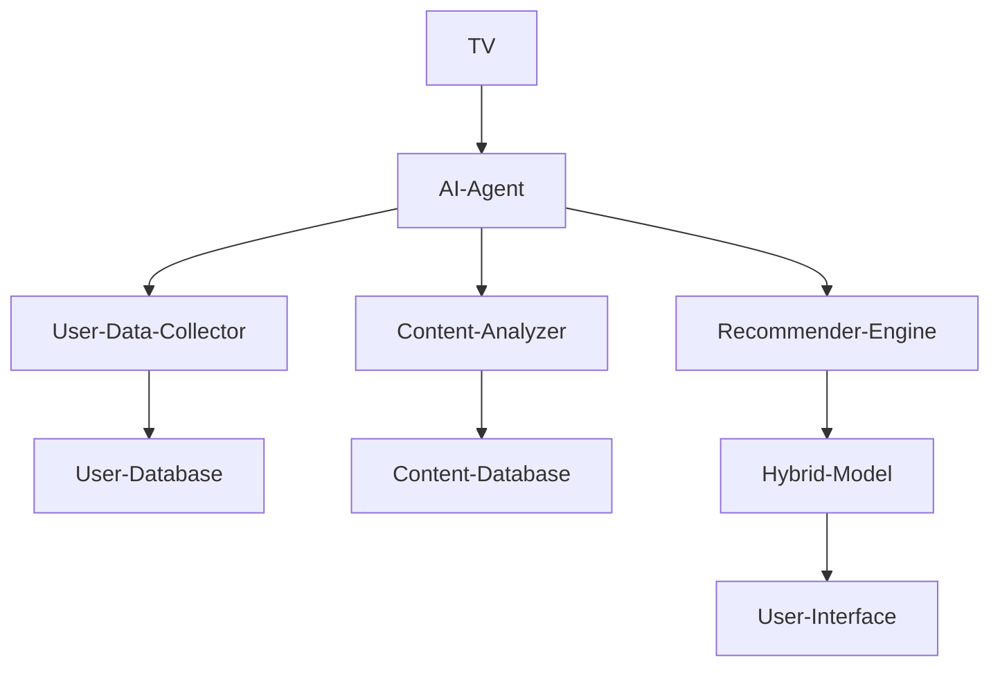

                 


# 智能电视：AI Agent的个性化内容推荐引擎

## 关键词：智能电视、AI Agent、个性化推荐、推荐引擎、协同过滤、内容推荐

## 摘要：  
随着人工智能技术的快速发展，智能电视逐渐从单纯的娱乐设备演变为具备智能化功能的家庭中心。本文将深入探讨AI Agent在智能电视中的应用，重点分析如何通过个性化内容推荐引擎提升用户体验。文章从背景介绍、核心概念、算法原理、系统架构到项目实战，全面解析AI Agent在智能电视推荐系统中的实现与优化。通过本文的阅读，读者将能够理解智能电视个性化推荐的核心技术，并掌握其实际应用的实现方法。

---

# 第一部分: 智能电视与AI Agent的背景与概述

## 第1章: 智能电视的发展与AI Agent的引入

### 1.1 智能电视的发展历程

#### 1.1.1 传统电视的功能局限  
传统电视的功能相对单一，仅能接收电视台的信号或播放本地存储的内容。用户无法根据个人喜好进行内容筛选，也无法通过电视与其他设备或网络进行交互。

#### 1.1.2 智能电视的定义与特点  
智能电视是指集成了智能操作系统、具备网络连接功能的电视。它能够通过互联网获取海量内容，并支持多种应用的安装与运行。其特点是：  
1. 网络连接能力：支持Wi-Fi或有线网络，可访问互联网内容。  
2. 多功能整合：支持视频点播、应用下载、智能家居控制等功能。  
3. 人工智能功能：通过AI技术实现智能推荐、语音交互等高级功能。  

#### 1.1.3 AI Agent在智能电视中的作用  
AI Agent（智能代理）是一种能够自主执行任务的计算机程序，通过感知用户需求和环境信息，提供智能化的服务。在智能电视中，AI Agent主要用于：  
1. 用户行为分析：通过收集用户的观看记录、偏好数据，了解用户的兴趣。  
2. 内容推荐：基于用户的偏好，智能推荐相关内容。  
3. 交互优化：通过语音或手势交互，提升用户体验。  

---

### 1.2 AI Agent的基本概念

#### 1.2.1 AI Agent的定义  
AI Agent是一种能够感知环境、自主决策并执行任务的智能实体。它可以基于用户输入、环境数据或历史行为，提供个性化服务。

#### 1.2.2 AI Agent的核心功能  
1. **感知环境**：通过传感器、网络数据或用户输入获取信息。  
2. **理解需求**：分析用户的行为和偏好，理解用户的需求。  
3. **自主决策**：基于理解的需求，选择最优的行动方案。  
4. **执行任务**：通过执行预设的操作或调用外部服务，实现目标。  

#### 1.2.3 AI Agent与传统推荐系统的区别  
传统推荐系统通常基于规则或统计模型，而AI Agent推荐引擎则结合了机器学习、自然语言处理等技术，能够动态适应用户需求的变化。

---

### 1.3 个性化内容推荐的重要性

#### 1.3.1 用户需求的多样化  
现代用户对娱乐内容的需求日益多样化，用户希望获得符合自己兴趣的内容，而非被动接受固定节目。

#### 1.3.2 个性化推荐的必要性  
通过个性化推荐，智能电视能够提高用户的满意度，增加用户粘性，同时优化内容分发效率。

#### 1.3.3 AI Agent在推荐系统中的优势  
AI Agent能够通过深度学习技术，实时分析用户行为和内容特征，实现更精准的推荐。

---

## 第2章: 智能电视中的AI Agent推荐引擎

### 2.1 AI Agent推荐引擎的原理

#### 2.1.1 数据采集与处理  
推荐引擎需要收集用户的行为数据（如观看记录、搜索历史、点赞/点踩等），并对这些数据进行清洗和预处理。

#### 2.1.2 用户行为分析  
通过分析用户的观看时长、暂停次数、跳过率等行为数据，理解用户的兴趣偏好。

#### 2.1.3 内容特征提取  
对视频内容进行特征提取，包括类别、演员、导演、剧情简介等，为推荐提供依据。

---

### 2.2 推荐算法的核心概念

#### 2.2.1 协同过滤算法  
协同过滤是一种基于用户相似性或物品相似性的推荐方法。  
- **基于用户的协同过滤**：寻找与当前用户相似的其他用户，推荐这些用户喜欢的内容。  
- **基于物品的协同过滤**：基于内容之间的相似性，推荐与当前内容相似的其他内容。  

#### 2.2.2 基于内容的推荐  
基于内容的推荐方法通过分析内容本身的特征，向用户推荐相似的内容。例如，如果用户喜欢一部科幻电影，系统会推荐其他科幻电影。

#### 2.2.3 混合推荐模型  
结合协同过滤和基于内容的推荐方法，构建混合推荐模型，以提高推荐的准确性和多样性。

---

### 2.3 AI Agent推荐引擎的实现流程

#### 2.3.1 数据预处理  
对收集的用户行为数据和内容特征数据进行清洗、归一化处理。  
- 数据清洗：去除无效数据，处理缺失值。  
- 数据归一化：将不同维度的数据转换为同一尺度。  

#### 2.3.2 模型训练  
使用机器学习算法对数据进行训练，构建推荐模型。  
- 训练协同过滤模型：计算用户相似度或物品相似度。  
- 训练内容推荐模型：提取内容特征并建立分类或回归模型。  

#### 2.3.3 推荐结果生成  
根据训练好的模型，生成推荐列表，并将结果返回给用户。

---

## 第三部分: AI Agent推荐引擎的核心算法与数学模型

## 第3章: 协同过滤算法的实现与优化

### 3.1 协同过滤算法的原理

#### 3.1.1 基于用户的协同过滤  
基于用户的协同过滤通过计算用户之间的相似度，将用户划分为不同的群体，推荐相似用户喜欢的内容。  
- 相似度计算：常用余弦相似度或欧氏距离。  
- 推荐结果：根据相似用户的评分加权平均。  

#### 3.1.2 基于物品的协同过滤  
基于物品的协同过滤通过分析内容之间的相似性，推荐相似内容。  
- 相似度计算：基于内容特征的向量相似度。  
- 推荐结果：根据内容相似度加权平均。  

#### 3.1.3 混合协同过滤  
混合协同过滤结合用户和物品的相似性，综合考虑用户偏好和内容特征，生成推荐结果。

---

### 3.2 协同过滤算法的数学模型

#### 3.2.1 相似度计算公式  
- 余弦相似度：  
$$ \text{sim}(u, v) = \frac{\sum_{i=1}^n u_i v_i}{\sqrt{\sum_{i=1}^n u_i^2} \cdot \sqrt{\sum_{i=1}^n v_i^2}} $$  
- 欧氏距离：  
$$ \text{distance}(u, v) = \sqrt{\sum_{i=1}^n (u_i - v_i)^2} $$  

#### 3.2.2 评分预测公式  
基于用户的协同过滤评分预测公式：  
$$ \hat{r}_{u,i} = \frac{\sum_{v \in N(u)} w(u, v) \cdot r_{v,i}}{\sum_{v \in N(u)} w(u, v)} $$  
其中，\( N(u) \) 是与用户 \( u \) 相似的用户集合，\( w(u, v) \) 是相似度权重。

---

### 3.3 协同过滤算法的实现代码

#### 3.3.1 数据预处理代码  
```python
import pandas as pd

# 假设我们有一个评分矩阵 ratings
# ratings = pd.DataFrame(...)
```

#### 3.3.2 相似度计算代码  
```python
from sklearn.metrics.pairwise import cosine_similarity

# 计算用户相似度矩阵
user_similarity = cosine_similarity(ratings)
```

#### 3.3.3 推荐结果生成代码  
```python
def recommend_items(user_id, user_similarity, ratings):
    # 找出与当前用户最相似的k个用户
    similar_users = user_similarity[user_id].argsort()[::-1][:5]
    # 根据相似用户的评分加权平均
   推荐结果 = ratings.loc[similar_users].mean()
    return 推荐结果
```

---

## 第4章: 基于内容的推荐算法

### 4.1 基于内容的推荐原理

#### 4.1.1 内容特征提取  
对视频内容进行多维度特征提取，包括：  
- 类别特征（如动作、喜剧、科幻等）  
- 文本特征（如剧情简介、演员信息）  
- 视频特征（如画面风格、音频特征）  

#### 4.1.2 基于内容的推荐模型  
使用机器学习算法（如TF-IDF、Word2Vec）对内容特征进行建模，生成推荐列表。

---

### 4.2 基于内容的推荐实现代码

#### 4.2.1 特征提取代码  
```python
from sklearn.feature_extraction.text import TfidfVectorizer

# 假设我们有一个电影简介的数据集
movies = pd.DataFrame({'description': [...]})
vectorizer = TfidfVectorizer()
tfidf_matrix = vectorizer.fit_transform(movies['description'])
```

#### 4.2.2 推荐结果生成代码  
```python
def recommend_content(user_id, tfidf_matrix, ratings):
    # 假设用户偏好向量为 user_vector
    user_vector = tfidf_matrix[user_id]
    # 计算余弦相似度
    similarity = cosine_similarity(user_vector, tfidf_matrix)
    # 根据相似度排序并推荐前5个
    recommendations = movies.iloc[similarity.argsort()[::-1][:5]]
    return recommendations
```

---

## 第5章: 混合推荐模型的实现与优化

### 5.1 混合推荐模型的原理  
混合推荐模型结合了协同过滤和基于内容的推荐方法，通过加权融合两种方法的结果，提升推荐的准确性和多样性。

---

### 5.2 混合推荐模型的实现代码

#### 5.2.1 协同过滤推荐结果  
```python
# 假设协同过滤推荐结果为 collaborative_recommendations
```

#### 5.2.2 基于内容的推荐结果  
```python
# 假设基于内容的推荐结果为 content_recommendations
```

#### 5.2.3 混合推荐结果  
```python
# 根据权重融合两种推荐结果
hybrid_recommendations = collaborative_recommendations * 0.6 + content_recommendations * 0.4
```

---

## 第6章: 系统分析与架构设计方案

### 6.1 系统功能设计

#### 6.1.1 用户画像  
- 收集用户的基本信息（如年龄、性别、兴趣爱好）  
- 分析用户的观看历史和偏好  

#### 6.1.2 内容分析  
- 对视频内容进行多维度特征提取  
- 建立内容标签和分类体系  

#### 6.1.3 推荐算法设计  
- 实现协同过滤、基于内容的推荐和混合推荐算法  
- 根据用户行为动态调整推荐策略  

#### 6.1.4 推荐结果展示  
- 在电视界面上显示推荐内容  
- 提供排序、筛选等功能  

---

### 6.2 系统架构设计

#### 6.2.1 系统架构图  


---

## 第7章: 项目实战

### 7.1 环境搭建

#### 7.1.1 安装必要的库  
- Python：3.8+  
- NumPy、Pandas、Scikit-learn、TensorFlow  

#### 7.1.2 数据准备  
- 用户行为数据：包含用户ID、内容ID、评分  
- 内容特征数据：视频简介、演员信息等  

---

### 7.2 核心实现代码

#### 7.2.1 数据预处理  
```python
import pandas as pd
from sklearn.metrics.pairwise import cosine_similarity

# 读取数据
ratings = pd.read_csv('ratings.csv')
items = pd.read_csv('items.csv')

# 合并用户数据和内容数据
merged_data = pd.merge(ratings, items, on='item_id')
```

#### 7.2.2 协同过滤推荐  
```python
user_similarity = cosine_similarity(ratings)
similar_users = user_similarity[user_id].argsort()[::-1][:5]
recommendations = ratings[ratings['user_id'].isin(similar_users)]
```

#### 7.2.3 基于内容的推荐  
```python
from sklearn.feature_extraction.text import TfidfVectorizer

vectorizer = TfidfVectorizer()
tfidf_matrix = vectorizer.fit_transform(items['description'])
similarity = cosine_similarity(tfidf_matrix[user_id], tfidf_matrix)
recommendations = items.iloc[similarity.argsort()[::-1][:5]]
```

---

## 第8章: 总结与展望

### 8.1 本文总结  
本文详细介绍了AI Agent在智能电视中的应用，重点分析了个性化内容推荐引擎的实现与优化。通过协同过滤、基于内容的推荐和混合推荐模型的实现，为智能电视的推荐系统提供了理论和实践指导。

### 8.2 未来展望  
未来，随着人工智能技术的不断发展，智能电视的推荐系统将更加智能化和个性化。通过引入深度学习技术，推荐系统将能够更好地理解和满足用户的多样化需求。

---

## 附录: 参考文献与工具

### 附录A: 参考文献  
1. 《推荐系统实战：基于Python的高效推荐系统实现》  
2. 《机器学习实战：基于Scikit-learn和TensorFlow》  
3. 《深度学习入门：基于Python的CNN与RNN实践》  

---

## 作者：AI天才研究院/AI Genius Institute & 禅与计算机程序设计艺术 /Zen And The Art of Computer Programming

