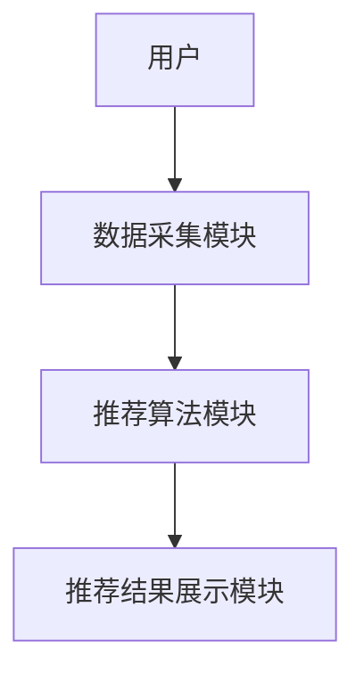

                 


# 智能电视：AI Agent的内容个性化推荐

> **关键词**：智能电视、AI Agent、内容推荐、协同过滤、个性化推荐、深度学习

> **摘要**：本文深入探讨了AI Agent在智能电视内容个性化推荐中的应用，从推荐系统的原理到算法实现，再到系统架构设计，结合实际案例分析，全面解析了如何利用AI技术提升智能电视用户的观看体验。通过分析协同过滤和深度学习算法，本文为智能电视的内容推荐提供了理论基础和实践指导。

---

# 第一章: 智能电视与AI Agent的背景介绍

## 1.1 智能电视的发展历程

智能电视的出现标志着电视从单纯的娱乐设备向智能化、网络化方向转型。传统电视的功能相对单一，仅限于接收电视台的信号。随着互联网技术的发展，智能电视逐渐融入了更多的功能，如网络浏览、视频点播、应用程序安装等。这些功能的增加使得智能电视的操作更加复杂，用户需要面对海量的内容选择。在这种背景下，AI Agent的引入为智能电视的用户体验提升提供了新的可能性。

### 1.1.1 从传统电视到智能电视的演进

传统电视的局限性主要体现在内容的单一性和用户操作的被动性。用户只能通过电视台的节目表来选择观看内容，缺乏灵活性和个性化。而智能电视通过互联网技术，将电视的功能扩展到了前所未有的程度。用户可以通过智能电视访问各种在线视频平台，如Netflix、YouTube等，还可以通过智能电视的应用商店下载各种应用程序。

### 1.1.2 AI Agent在智能电视中的角色

AI Agent（人工智能代理）是一种能够感知环境并执行任务的智能实体。在智能电视中，AI Agent的主要作用是通过分析用户的观看历史、偏好和实时行为，为用户提供个性化的内容推荐。AI Agent能够理解用户的意图，并主动为用户筛选出感兴趣的内容，从而提升用户体验。

### 1.1.3 智能电视的市场现状与发展趋势

当前，智能电视市场呈现出快速发展的态势。各大厂商纷纷推出自家的智能电视产品，市场竞争日益激烈。AI技术的引入使得智能电视的功能更加智能化，用户体验得到了显著提升。未来，随着AI技术的进一步发展，智能电视的内容推荐将更加精准，用户体验也将更加个性化。

## 1.2 AI Agent的核心概念与特点

### 1.2.1 AI Agent的定义与分类

AI Agent是一种能够感知环境并执行任务的智能实体。根据功能和应用场景的不同，AI Agent可以分为多种类型。在智能电视中，AI Agent主要用于内容推荐，其核心功能包括数据采集、分析和推荐生成。

### 1.2.2 AI Agent在智能电视中的应用场景

AI Agent在智能电视中的应用场景主要集中在内容推荐、用户行为分析和智能搜索等方面。通过AI Agent，智能电视能够实时分析用户的观看历史、搜索记录和偏好，从而为用户提供个性化的推荐内容。

### 1.2.3 AI Agent与传统推荐算法的区别

传统的推荐算法主要基于协同过滤和基于内容的推荐。而AI Agent推荐算法则引入了机器学习和深度学习技术，能够更好地理解和预测用户的偏好。AI Agent推荐算法的核心优势在于其能够动态适应用户的行为变化，提供实时的推荐结果。

## 1.3 内容个性化推荐的重要性

### 1.3.1 用户需求分析

用户在观看智能电视时，最核心的需求是获取符合自己兴趣的内容。传统电视的节目表无法满足用户的个性化需求，而智能电视通过AI Agent的推荐功能，能够为用户提供高质量的内容推荐。

### 1.3.2 内容多样性的挑战

随着互联网的快速发展，智能电视可以访问的内容种类和数量急剧增加。然而，内容的多样性也为用户的筛选带来了困难。如何在海量的内容中找到符合用户兴趣的内容，成为了智能电视设计中的重要挑战。

### 1.3.3 个性化推荐的商业价值

个性化推荐不仅能够提升用户体验，还具有重要的商业价值。通过精准的内容推荐，智能电视可以提高用户的观看时长和满意度，进而为内容提供商和广告商带来更多的商业机会。

## 1.4 本章小结

本章主要介绍了智能电视的发展历程、AI Agent的核心概念以及内容个性化推荐的重要性。通过分析智能电视的功能演进和AI Agent的应用场景，我们了解了AI Agent在智能电视中的重要作用。同时，通过对内容个性化推荐重要性的分析，我们认识到精准推荐对提升用户体验和商业价值的重要性。

---

# 第二章: 推荐系统的核心概念与原理

## 2.1 推荐系统的定义与分类

### 2.1.1 协同过滤推荐

协同过滤推荐是一种基于用户行为和偏好相似性的推荐方法。协同过滤推荐可以分为基于用户的协同过滤和基于物品的协同过滤两种类型。

#### 1. 基于用户的协同过滤

基于用户的协同过滤通过分析用户的行为数据，找到与目标用户行为相似的其他用户，并基于这些用户的偏好推荐内容。这种方法的核心在于找到具有相似兴趣的用户群体。

#### 2. 基于物品的协同过滤

基于物品的协同过滤则是通过分析物品之间的相似性，找到与目标用户已观看内容相似的其他内容进行推荐。这种方法适用于内容类型较多的场景。

### 2.1.2 基于内容的推荐

基于内容的推荐方法是通过分析内容本身的特征，找到与目标用户偏好相似的内容进行推荐。这种方法的核心在于内容本身的特征分析，例如电影的 genres、actors 等。

### 2.1.3 混合推荐模型

混合推荐模型是一种结合多种推荐方法的推荐策略。通过将协同过滤和基于内容的推荐方法结合起来，可以更好地利用数据特征，提高推荐的准确性。

### 2.1.4 对比分析

为了更好地理解不同推荐方法的特点，我们可以通过对比分析来选择适合的推荐方法。以下是一个简单的对比表格：

| 推荐方法 | 数据需求 | 优点 | 缺点 |
|----------|----------|------|------|
| 协同过滤 | 用户行为数据 | 精度高 | 数据稀疏性问题 |
| 基于内容的推荐 | 内容特征数据 | 冷启动问题 | 无法处理用户偏好 |
| 混合推荐 | 用户行为 + 内容特征 | 高精度和多样性 | 实现复杂 |

---

## 2.2 推荐系统的评价指标

### 2.2.1 准确性指标

准确性指标是衡量推荐系统推荐结果与用户实际需求的匹配程度的重要指标。常用的准确性指标包括精确率（Precision）、召回率（Recall）、F1分数等。

#### 精确率（Precision）

精确率是指推荐系统中实际被用户接受的推荐结果占所有推荐结果的比例。

$$ Precision = \frac{正确推荐的数量}{总推荐数量} $$

#### 召回率（Recall）

召回率是指推荐系统中被正确推荐的内容占用户实际感兴趣内容的比例。

$$ Recall = \frac{正确推荐的数量}{用户感兴趣的内容总数} $$

#### F1分数

F1分数是精确率和召回率的调和平均数，用于综合衡量推荐系统的性能。

$$ F1 = 2 \times \frac{Precision \times Recall}{Precision + Recall} $$

### 2.2.2 多样性指标

多样性指标用于衡量推荐系统推荐结果的多样性。一个优秀的推荐系统不仅要准确，还需要能够提供多样化的推荐内容，避免推荐结果过于集中。

### 2.2.3 计算效率指标

计算效率指标用于衡量推荐系统的运行效率。推荐系统的实时性对于用户体验至关重要，因此计算效率是推荐系统设计中需要重点关注的指标。

---

## 2.3 AI Agent在推荐系统中的优势

### 2.3.1 自然语言处理能力

AI Agent通过自然语言处理技术，能够理解和分析用户的搜索记录和评论，从而更准确地把握用户的兴趣偏好。

### 2.3.2 实时学习与优化

AI Agent具有实时学习和优化的能力，能够根据用户的实时行为动态调整推荐策略，提高推荐的准确性和实时性。

### 2.3.3 多模态数据融合

AI Agent能够整合多种数据源，如用户的观看历史、搜索记录、社交数据等，通过多模态数据融合，提高推荐的准确性和多样性。

---

## 2.4 本章小结

本章主要介绍了推荐系统的定义与分类，重点分析了协同过滤推荐、基于内容的推荐和混合推荐模型的特点和优缺点。同时，我们还探讨了AI Agent在推荐系统中的优势，包括自然语言处理能力、实时学习与优化和多模态数据融合。这些内容为后续章节的算法实现和系统设计奠定了理论基础。

---

# 第三章: AI Agent推荐算法的数学模型与实现

## 3.1 协同过滤推荐算法

### 3.1.1 协同过滤的基本原理

协同过滤是一种基于用户行为数据的推荐算法。其核心思想是通过分析用户之间的相似性，找到与目标用户兴趣相似的其他用户，并基于这些用户的偏好进行推荐。

### 3.1.2 协同过滤的数学模型

协同过滤的数学模型可以表示为：

$$ sim(i,j) = \frac{\sum_{k=1}^{n} (r_{ik} - \bar{r_i})(r_{jk} - \bar{r_j})}{\sqrt{\sum_{k=1}^{n} (r_{ik} - \bar{r_i})^2} \times \sqrt{\sum_{k=1}^{n} (r_{jk} - \bar{r_j})^2}}} $$

其中，$sim(i,j)$ 表示用户i和用户j之间的相似度，$r_{ik}$ 表示用户i对物品k的评分，$\bar{r_i}$ 表示用户i的平均评分。

### 3.1.3 协同过滤的实现步骤

1. **数据采集**：收集用户的观看历史和评分数据。
2. **相似度计算**：计算用户之间的相似度。
3. **推荐生成**：基于相似用户的偏好生成推荐内容。

---

## 3.2 深度学习推荐算法

### 3.2.1 深度学习推荐算法的原理

深度学习推荐算法通过构建神经网络模型，能够自动提取数据中的特征，从而实现更精准的推荐。

### 3.2.2 基于神经网络的推荐模型

基于神经网络的推荐模型可以表示为：

$$ p(i,j) = \sigma(w_1 \cdot x_i + w_2 \cdot x_j + b) $$

其中，$p(i,j)$ 表示用户i对物品j的偏好概率，$\sigma$ 是sigmoid函数，$x_i$ 和 $x_j$ 分别是用户i和物品j的特征向量，$w_1$ 和 $w_2$ 是权重，$b$ 是偏置。

### 3.2.3 深度学习推荐算法的实现步骤

1. **数据预处理**：对数据进行归一化和特征提取。
2. **模型训练**：通过反向传播算法训练神经网络模型。
3. **推荐生成**：基于训练好的模型生成推荐结果。

---

## 3.3 本章小结

本章主要介绍了协同过滤推荐算法和深度学习推荐算法的数学模型与实现步骤。通过对比分析，我们了解到不同推荐算法的特点和适用场景。协同过滤推荐算法适用于数据稀疏性问题，而深度学习推荐算法则能够更好地处理复杂的数据特征。

---

# 第四章: 智能电视推荐系统的系统架构设计

## 4.1 系统功能设计

### 4.1.1 用户行为分析

用户行为分析是智能电视推荐系统的核心功能之一。通过分析用户的观看历史、搜索记录和点击行为，系统能够准确把握用户的兴趣偏好。

### 4.1.2 内容特征提取

内容特征提取是基于内容的推荐方法的重要组成部分。通过提取内容的特征，如电影的 genres、actors 等，系统能够更好地理解内容本身的属性。

### 4.1.3 推荐结果生成

推荐结果生成是智能电视推荐系统的最终目标。通过综合分析用户行为和内容特征，系统能够生成符合用户兴趣的推荐内容。

---

## 4.2 系统架构设计

### 4.2.1 系统架构图

以下是智能电视推荐系统的系统架构图：



### 4.2.2 数据采集模块

数据采集模块负责收集用户的观看历史、搜索记录和点击行为等数据。这些数据是推荐算法的核心输入。

### 4.2.3 推荐算法模块

推荐算法模块是智能电视推荐系统的核心模块。它通过分析数据采集模块提供的数据，生成推荐结果。

### 4.2.4 推荐结果展示模块

推荐结果展示模块负责将推荐算法模块生成的结果展示给用户。通常，推荐结果以列表或卡片形式呈现。

---

## 4.3 本章小结

本章主要介绍了智能电视推荐系统的系统功能设计和架构设计。通过分析用户行为和内容特征，系统能够生成精准的推荐结果。同时，通过合理的系统架构设计，我们能够实现推荐结果的实时展示。

---

# 第五章: 项目实战——基于协同过滤的电影推荐系统

## 5.1 项目背景

本项目旨在通过实现一个基于协同过滤的电影推荐系统，展示AI Agent在智能电视内容推荐中的应用。

## 5.2 环境搭建

### 5.2.1 Python环境搭建

安装Python和必要的库，如NumPy、Pandas、Scikit-learn等。

## 5.3 代码实现

### 5.3.1 数据加载与预处理

```python
import pandas as pd
import numpy as np
from sklearn.metrics.pairwise import cosine_similarity

# 加载数据
ratings = pd.read_csv('ratings.csv')
movies = pd.read_csv('movies.csv')

# 数据预处理
movies = movies[['movieId', 'title', 'genres']]
ratings = ratings[['userId', 'movieId', 'rating']]

# 构建用户-物品矩阵
user_movie_matrix = ratings.pivot(index='userId', columns='movieId', values='rating')

# 计算相似度
user_movie_matrix = user_movie_matrix.fillna(0)
similarity_matrix = cosine_similarity(user_movie_matrix.T)
```

### 5.3.2 推荐算法实现

```python
def recommend_users(user_id, similarity_matrix, user_movie_matrix):
    # 获取用户的相似用户
    similar_users = similarity_matrix[user_id]
    # 找到相似度最高的用户
    top_users = np.argsort(similar_users)[::-1][:5]
    # 基于相似用户的推荐
    recommendations = []
    for user in top_users:
        recommendations.extend(user_movie_matrix.iloc[user].index[user_movie_matrix.iloc[user] > 0])
    # 去重并排序
    recommendations = list(set(recommendations))
    recommendations.sort(key=lambda x: user_movie_matrix.iloc[user_id][x], reverse=True)
    return recommendations

# 推荐结果
user_id = 1
recommendations = recommend_users(user_id, similarity_matrix, user_movie_matrix)
print(recommendations)
```

### 5.3.3 结果分析与优化

通过对推荐结果的分析，我们可以看到基于协同过滤的推荐算法能够有效捕捉用户的兴趣偏好。然而，该算法也存在数据稀疏性问题，可以通过引入基于内容的推荐方法进行优化。

---

## 5.4 本章小结

本章通过实现一个基于协同过滤的电影推荐系统，展示了AI Agent在智能电视内容推荐中的应用。通过对项目的实战，我们能够更好地理解推荐算法的实现细节和优化方法。

---

# 第六章: 总结与展望

## 6.1 本章总结

本文深入探讨了AI Agent在智能电视内容个性化推荐中的应用。从推荐系统的原理到算法实现，再到系统架构设计，我们全面解析了如何利用AI技术提升智能电视用户的观看体验。通过分析协同过滤和深度学习算法，本文为智能电视的内容推荐提供了理论基础和实践指导。

## 6.2 未来展望

随着AI技术的不断发展，智能电视的内容推荐将更加精准和个性化。未来，我们可以期待更多基于深度学习的推荐算法，如图神经网络和强化学习，能够进一步提升推荐系统的性能。同时，多模态数据的融合和实时学习能力的提升，也将为智能电视的推荐系统带来更多的可能性。

---

# 作者：AI天才研究院/AI Genius Institute & 禅与计算机程序设计艺术 /Zen And The Art of Computer Programming

