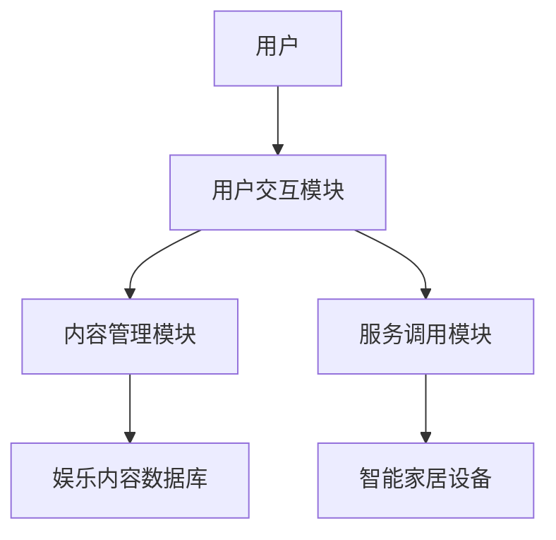
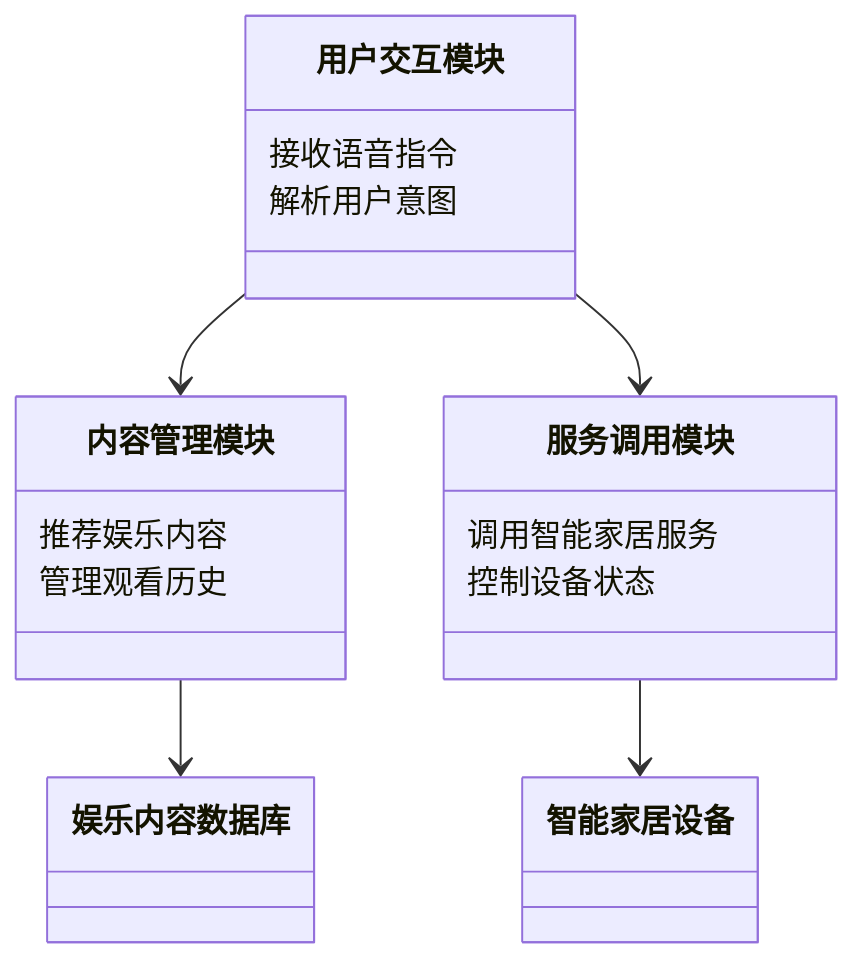
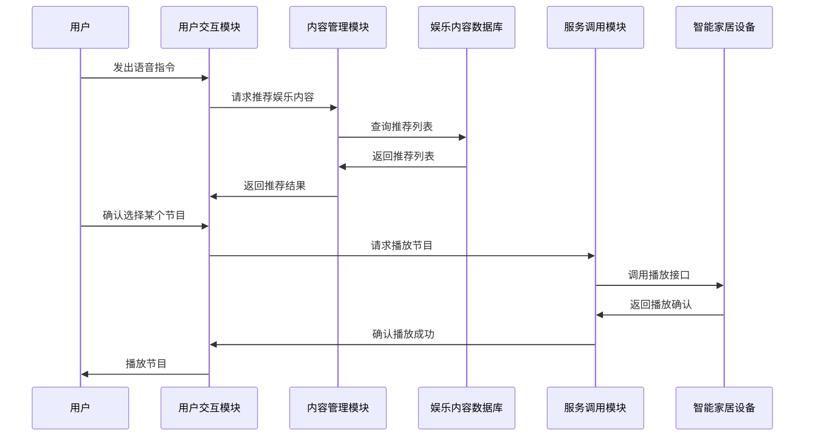

                 


# 智能电视：AI Agent的家庭娱乐管家系统

> 关键词：智能电视，AI Agent，家庭娱乐，人工智能，管家系统，智能交互

> 摘要：本文详细探讨了智能电视与AI Agent的结合，介绍了家庭娱乐管家系统的概念、技术原理、系统架构设计、用户交互设计、项目实现案例以及未来发展趋势。通过分析智能电视AI Agent的核心技术，包括自然语言处理、语音识别与合成、机器学习等，结合系统架构设计和项目实战，展示了如何构建一个智能化的家庭娱乐管家系统。本文还讨论了系统的优化与测试方法，以及未来的发展方向。

---

## 第一部分：智能电视与AI Agent概述

### 第1章：智能电视与AI Agent概述

#### 1.1 智能电视的发展历程

##### 1.1.1 传统电视的功能与局限
传统电视的功能相对单一，主要局限于接收电视台节目和简单的菜单操作。其局限性包括：
- **内容来源有限**：仅限于电视台节目，无法接入互联网内容。
- **交互方式简单**：用户只能通过遥控器进行简单的选择操作，无法进行自然语言交互。
- **缺乏智能化**：无法根据用户喜好推荐内容，也无法与其他智能设备联动。

##### 1.1.2 智能电视的定义与特点
智能电视是指集成了计算机技术、互联网技术以及人工智能技术的电视设备。其特点包括：
- **联网能力**：能够接入互联网，获取丰富的在线内容。
- **智能化**：具备一定的智能处理能力，可以实现语音交互、内容推荐等功能。
- **多设备联动**：能够与其他智能家居设备联动，实现场景化的智能控制。

##### 1.1.3 智能电视的发展趋势
随着人工智能技术的快速发展，智能电视正朝着以下方向发展：
- **AI驱动**：通过AI技术实现更智能的内容推荐、语音交互和自动化控制。
- **多模态交互**：结合语音、触控、手势等多种交互方式，提升用户体验。
- **家庭娱乐中心**：智能电视逐渐成为家庭娱乐的核心设备，整合家庭影院、游戏娱乐、智能家居控制等多种功能。

#### 1.2 AI Agent的核心概念

##### 1.2.1 AI Agent的基本定义
AI Agent（人工智能代理）是指能够感知环境、执行任务的智能实体。它可以理解用户的意图，执行相应的操作，并通过与环境的交互提供服务。AI Agent的核心能力包括：
- **感知能力**：通过传感器或用户输入获取环境信息。
- **决策能力**：基于感知的信息进行分析和决策。
- **执行能力**：根据决策结果执行操作。

##### 1.2.2 AI Agent的核心功能
AI Agent在家庭娱乐管家系统中的核心功能包括：
- **语音交互**：通过自然语言处理技术实现与用户的对话交互。
- **内容推荐**：根据用户的喜好推荐娱乐内容。
- **智能控制**：联动智能家居设备，实现场景化的控制。

##### 1.2.3 AI Agent与智能电视的结合
AI Agent与智能电视的结合使得智能电视具备了更强的智能化能力。通过AI Agent，用户可以通过语音交互控制电视、推荐节目、管理智能家居设备等。

#### 1.3 家庭娱乐管家系统的定义

##### 1.3.1 系统的目标与功能
家庭娱乐管家系统的目标是通过AI Agent实现对家庭娱乐设备的智能化管理。其主要功能包括：
- **智能推荐**：根据用户的观看历史和偏好推荐娱乐内容。
- **语音交互**：通过语音指令控制电视、智能家居设备等。
- **场景联动**：在特定场景下自动调整设备状态，例如观影模式、家庭影院模式等。

##### 1.3.2 系统的核心模块
家庭娱乐管家系统的核心模块包括：
- **用户交互模块**：负责接收用户的语音指令并进行解析。
- **内容管理模块**：负责管理和推荐娱乐内容。
- **设备控制模块**：负责联动智能家居设备，实现场景化的控制。

##### 1.3.3 系统的用户价值
家庭娱乐管家系统为用户带来了以下价值：
- **提升用户体验**：通过智能化的推荐和控制，让用户享受更便捷的娱乐体验。
- **优化家庭娱乐场景**：通过场景化的控制，提升家庭娱乐的沉浸感和互动性。
- **实现智能家居联动**：通过AI Agent实现家庭娱乐设备与其他智能家居设备的联动，打造智能化的家庭生活环境。

#### 1.4 本章小结
本章介绍了智能电视的发展历程、AI Agent的核心概念以及家庭娱乐管家系统的定义和功能。通过分析智能电视与AI Agent的结合，展示了家庭娱乐管家系统在提升用户体验和优化家庭娱乐场景中的重要作用。

---

## 第二部分：AI Agent的技术原理

### 第2章：AI Agent的核心技术

#### 2.1 自然语言处理技术

##### 2.1.1 NLP的基本原理
自然语言处理（NLP）是AI Agent实现语音交互的核心技术。NLP的基本流程包括：
1. **文本预处理**：对输入文本进行分词、去停用词等处理。
2. **意图识别**：通过机器学习模型识别用户的意图。
3. **响应生成**：根据用户的意图生成相应的回应。

##### 2.1.2 Transformer模型的介绍
Transformer模型是一种基于自注意力机制的深度学习模型，广泛应用于NLP任务。其核心思想是通过计算输入序列中每个词与其他词的相关性来生成更准确的表示。

##### 2.1.3 BERT模型的应用
BERT（Bidirectional Encoder Representations from Transformers）是一种预训练的Transformer模型，广泛应用于问答系统、文本摘要等任务。通过BERT模型，AI Agent可以更准确地理解用户的意图。

#### 2.2 语音识别与合成技术

##### 2.2.1 语音识别的实现流程
语音识别的实现流程包括：
1. **语音采集**：通过麦克风采集用户的语音信号。
2. **特征提取**：对语音信号进行特征提取，例如梅尔频率倒谱系数（MFCC）。
3. **模型训练**：使用深度学习模型（如CTC、Transformer）对特征进行训练。
4. **语音解码**：将模型输出的编码转换为文本。

##### 2.2.2 TTS技术的基本原理
文本到语音（TTS）技术通过将文本转换为语音，实现AI Agent的语音输出功能。其基本流程包括：
1. **文本分析**：对输入文本进行语法分析和语义理解。
2. **语音合成**：基于预训练的语音模型生成相应的语音信号。

##### 2.2.3 常见的语音识别算法
常见的语音识别算法包括：
- **CTC（Connectionist Temporal Classification）**：基于RNN的语音识别模型。
- **Transformer**：基于自注意力机制的语音识别模型。

#### 2.3 机器学习与深度学习

##### 2.3.1 机器学习的基本概念
机器学习是一种通过数据训练模型，使其能够从数据中学习规律并进行预测的技术。其主要流程包括数据预处理、模型训练、模型评估等。

##### 2.3.2 深度学习的核心算法
深度学习的核心算法包括：
- **神经网络**：通过多层神经网络模型实现特征提取和分类。
- **卷积神经网络（CNN）**：广泛应用于图像识别任务。
- **循环神经网络（RNN）**：适用于序列数据处理任务。

##### 2.3.3 神经网络的结构与应用
神经网络的结构包括输入层、隐藏层和输出层。其应用领域包括图像识别、语音识别、自然语言处理等。

#### 2.4 算法原理与数学模型

##### 2.4.1 Transformer模型的数学公式
Transformer模型的核心公式包括：
- **自注意力机制**：通过计算输入序列中每个词与其他词的相关性，生成注意力权重。
- **前向网络**：通过多层感知机（MLP）实现特征变换。

##### 2.4.2 BERT模型的训练流程
BERT模型的训练流程包括：
1. **预训练**：通过对未标注数据进行掩码预测和序列分类任务，训练模型的参数。
2. **微调**：在特定任务上进行微调，例如问答系统、文本分类等。

##### 2.4.3 深度学习的优化算法
深度学习的优化算法包括：
- **随机梯度下降（SGD）**：通过随机采样数据更新模型参数。
- **Adam优化器**：结合动量和自适应学习率的优化算法。

#### 2.5 本章小结
本章详细介绍了AI Agent的核心技术，包括自然语言处理、语音识别与合成、机器学习与深度学习等。通过对这些技术的分析，展示了AI Agent实现智能化交互的数学模型和算法原理。

---

## 第三部分：智能电视AI Agent的系统架构

### 第3章：系统架构设计

#### 3.1 系统功能模块划分

##### 3.1.1 用户交互模块
用户交互模块负责接收用户的输入并进行解析。其主要功能包括：
- **语音输入**：通过麦克风采集用户的语音指令。
- **文本解析**：对用户的输入进行语义分析，生成相应的操作指令。

##### 3.1.2 内容管理模块
内容管理模块负责管理娱乐内容并推荐给用户。其主要功能包括：
- **内容推荐**：根据用户的观看历史和偏好推荐娱乐内容。
- **内容分类**：对娱乐内容进行分类，例如按类型、演员、导演等。

##### 3.1.3 服务调用模块
服务调用模块负责调用智能家居设备的服务。其主要功能包括：
- **设备联动**：通过API调用智能家居设备的服务，例如灯光、空调、窗帘等。
- **场景控制**：根据用户的指令控制智能家居设备的场景模式。

#### 3.2 系统架构设计

##### 3.2.1 分层架构的设计思想
系统的分层架构包括：
1. **用户层**：负责与用户的交互，接收用户的指令并进行解析。
2. **服务层**：负责调用智能家居设备的服务，实现场景化的控制。
3. **数据层**：负责管理和存储用户的观看历史、偏好等数据。

##### 3.2.2 模块划分与交互流程
系统的模块划分与交互流程包括：
- **用户交互模块**：接收用户的语音指令，解析用户的意图。
- **内容管理模块**：根据用户的意图推荐娱乐内容。
- **服务调用模块**：调用智能家居设备的服务，实现场景化的控制。

#### 3.3 系统架构图


#### 3.4 系统功能设计

##### 3.4.1 领域模型


#### 3.5 系统交互流程图


#### 3.6 系统接口设计

##### 3.6.1 API接口
系统的API接口包括：
- `/api/v1/users`：用户管理接口。
- `/api/v1/content`：内容管理接口。
- `/api/v1/devices`：智能家居设备管理接口。

##### 3.6.2 接口协议
系统的接口协议包括：
- HTTP/HTTPS：用于API通信。
- WebSocket：用于实时通信。

#### 3.7 本章小结
本章详细介绍了智能电视AI Agent的系统架构设计，包括模块划分、系统架构图、领域模型和系统交互流程图。通过对系统架构的分析，展示了如何实现智能化的家庭娱乐管家系统。

---

## 第四部分：项目实战

### 第4章：家庭娱乐管家系统开发实战

#### 4.1 环境搭建

##### 4.1.1 开发环境
- **操作系统**：Linux（推荐）或Windows。
- **开发工具**：Python、Jupyter Notebook。
- **依赖库**：TensorFlow、Keras、PyTorch、自然语言处理库（如spaCy）、语音处理库（如SpeechRecognition）。

##### 4.1.2 项目安装
通过以下命令安装所需的依赖库：
```bash
pip install tensorflow keras spacy speechRecognition
```

#### 4.2 核心代码实现

##### 4.2.1 用户交互模块实现
```python
import speech_recognition as sr

def recognize_speech():
    r = sr.Recognizer()
    with sr.AudioFile("input.wav") as source:
        audio = r.record(source)
        try:
            text = r.recognize_google(audio)
            return text
        except sr.UnknownValueError:
            return ""
```

##### 4.2.2 内容推荐模块实现
```python
import pandas as pd

def recommend_content(user_id):
    # 加载用户数据和内容数据
    user_data = pd.read_csv('user.csv')
    content_data = pd.read_csv('content.csv')
    
    # 获取用户的偏好
    preferences = user_data[user_data['user_id'] == user_id]['preferences'].values[0]
    
    # 过滤推荐内容
    recommendations = content_data[content_data['category'].isin(preferences)]
    
    return recommendations
```

##### 4.2.3 设备控制模块实现
```python
import requests

def control_device(action, device_id):
    url = f"http://localhost:8080/api/v1/devices/{device_id}/{action}"
    try:
        response = requests.get(url)
        return response.json()
    except requests.exceptions.RequestException as e:
        print(f"Error: {e}")
        return None
```

#### 4.3 项目实战案例分析

##### 4.3.1 案例背景
假设用户希望通过语音指令播放某个电视剧集。用户说：“播放《权力的游戏》第一集。”

##### 4.3.2 实现步骤
1. **语音识别**：将用户的语音指令转换为文本。
2. **意图识别**：识别用户的意图是播放电视剧集。
3. **内容推荐**：根据用户的偏好推荐《权力的游戏》第一集。
4. **设备控制**：调用智能家居设备的播放接口，实现电视剧集的播放。

##### 4.3.3 实战代码
```python
# 语音识别模块
def process_voice_command():
    text = recognize_speech()
    if not text:
        return
    # 意图识别
    intent = get_intent(text)
    if intent == 'play':
        content = extract_content(text)
        recommend_content(content)
        control_device('play', content['device_id'])

# 意图识别模块
def get_intent(text):
    # 简单实现，根据关键词判断意图
    if '播放' in text or '看电影' in text:
        return 'play'
    elif '关闭' in text or '关掉' in text:
        return 'stop'
    else:
        return 'other'

# 实战案例
process_voice_command()
```

#### 4.4 系统优化与测试

##### 4.4.1 系统优化
- **性能优化**：通过缓存技术优化数据库查询性能。
- **负载均衡**：通过分布式系统提升系统的扩展性。
- **容错设计**：通过异常处理和冗余设计提升系统的可靠性。

##### 4.4.2 系统测试
- **单元测试**：对各个模块进行独立测试，确保每个模块的功能正常。
- **集成测试**：对系统整体进行测试，确保模块之间的接口和交互正常。
- **性能测试**：通过压力测试评估系统的负载能力。

#### 4.5 本章小结
本章通过具体的项目实战，展示了家庭娱乐管家系统的开发流程，包括环境搭建、核心代码实现和系统优化与测试。通过对项目的详细分析，读者可以更好地理解如何将AI Agent技术应用于智能电视的家庭娱乐场景。

---

## 第五部分：未来展望

### 第5章：智能电视AI Agent的未来发展趋势

#### 5.1 未来技术挑战

##### 5.1.1 多模态交互
未来的AI Agent将支持更多的交互方式，例如手势、面部表情等。

##### 5.1.2 实时性与响应速度
随着用户对实时性的要求越来越高，AI Agent需要实现更快速的响应。

##### 5.1.3 隐私与安全
随着AI Agent的普及，隐私和数据安全问题将更加突出，需要开发更安全的解决方案。

#### 5.2 技术创新与突破

##### 5.2.1 新型算法
未来的AI Agent将采用更先进的算法，例如基于Transformer的改进模型。

##### 5.2.2 大数据与云计算
通过大数据和云计算技术，AI Agent可以实现更精准的内容推荐和更高效的系统运行。

##### 5.2.3 边缘计算
边缘计算将使得AI Agent能够更快速地响应用户的指令，减少延迟。

#### 5.3 未来应用场景

##### 5.3.1 家庭娱乐场景
未来的家庭娱乐场景将更加智能化和个性化，AI Agent将能够实现更复杂的场景控制和内容推荐。

##### 5.3.2 智慧家庭
AI Agent将与更多的智能家居设备联动，实现更全面的智慧家庭管理。

##### 5.3.3 社交娱乐
未来的娱乐场景将更加社交化，AI Agent可以实现多人在线互动。

#### 5.4 本章小结
本章展望了智能电视AI Agent的未来发展趋势，分析了技术挑战和创新方向，并探讨了未来的应用场景。通过对未来的预测，读者可以更好地理解AI Agent在家庭娱乐中的重要作用。

---

## 作者：AI天才研究院/AI Genius Institute & 禅与计算机程序设计艺术/Zen And The Art of Computer Programming

---

本文通过系统化的分析和实践，深入探讨了智能电视AI Agent的家庭娱乐管家系统的实现与应用。从技术原理到系统架构，从项目实战到未来展望，本文为读者提供了全面的视角和深入的解析。通过本文的学习，读者可以更好地理解AI Agent在家庭娱乐中的应用价值，并能够将其应用于实际的开发实践中。

