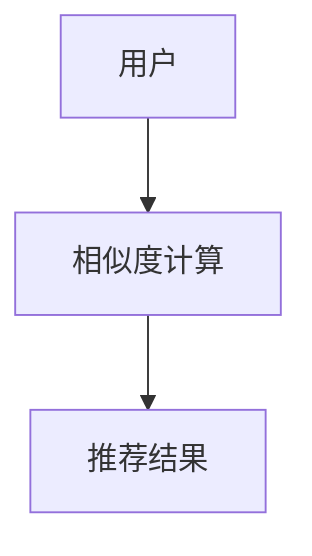
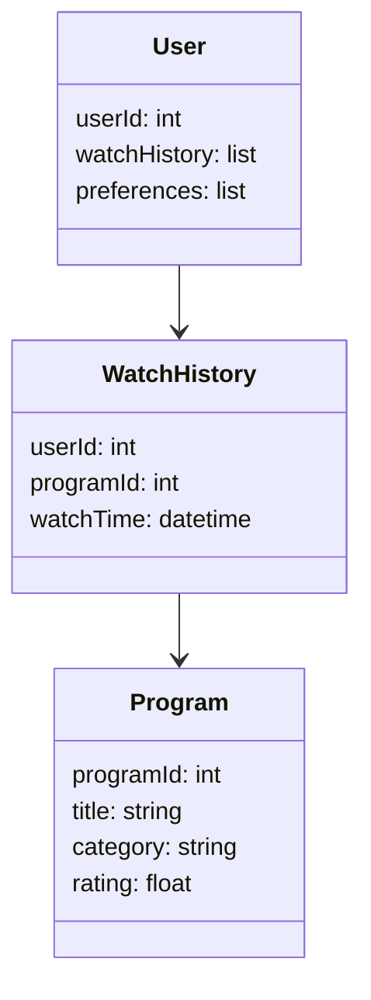
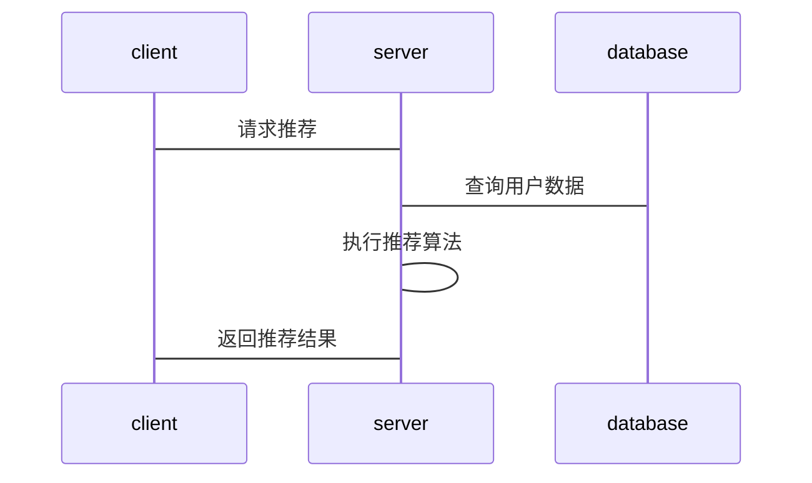

                 


# 《智能电视：AI Agent的观看习惯分析》

> 关键词：智能电视，AI Agent，观看习惯，推荐算法，协同过滤

> 摘要：本文深入探讨了AI Agent在智能电视中的应用，特别是如何通过分析用户的观看习惯来优化内容推荐。从背景介绍、核心概念到算法原理，再到系统设计和项目实战，本文全面解析了智能电视中AI Agent的工作原理和实际应用。通过详细的技术分析和实例解读，本文为读者提供了从理论到实践的全面指导。

---

# 第一部分: 智能电视与AI Agent的背景介绍

## 第1章: 智能电视与AI Agent概述

### 1.1 智能电视的发展历程
#### 1.1.1 传统电视的功能与局限
- 传统电视的功能受限于硬件和软件，无法实现智能化和个性化推荐。
- 传统电视无法记录用户的观看历史和偏好，难以满足多样化的观看需求。

#### 1.1.2 智能电视的定义与特点
- 智能电视的定义：集成了智能操作系统、网络连接和丰富的应用程序的电视。
- 智能电视的特点：
  - 支持互联网连接，可以访问在线视频内容。
  - 集成智能推荐算法，能够根据用户观看历史推荐内容。
  - 支持语音控制和人工智能助手，提供更便捷的交互方式。

#### 1.1.3 智能电视的市场现状与发展趋势
- 智能电视的市场现状：全球市场普及率不断提高，用户对个性化推荐的需求日益增长。
- 智能电视的发展趋势：AI技术的深度融合，推荐算法的不断优化，用户体验的持续提升。

### 1.2 AI Agent的基本概念与功能
#### 1.2.1 AI Agent的定义
- AI Agent（人工智能代理）：一种能够感知环境并采取行动以实现目标的智能实体。
- AI Agent的核心功能：数据采集、分析、决策和执行。

#### 1.2.2 AI Agent在智能电视中的应用场景
- 数据采集：通过记录用户的观看历史、搜索记录、评分等数据，了解用户的观看偏好。
- 数据分析：利用机器学习算法对用户数据进行分析，挖掘用户的观看习惯和偏好。
- 内容推荐：基于分析结果，向用户推荐符合其兴趣的内容。

### 1.3 智能电视中AI Agent的观看习惯分析
#### 1.3.1 观看习惯分析的定义与意义
- 观看习惯分析：通过对用户的观看数据进行分析，了解用户的观看偏好、观看时间、观看时长等习惯。
- 观看习惯分析的意义：为智能电视提供个性化推荐的依据，提升用户体验。

#### 1.3.2 AI Agent在观看习惯分析中的作用
- AI Agent通过数据采集和分析，帮助智能电视实现精准的内容推荐。
- AI Agent能够实时分析用户的观看行为，动态调整推荐策略。

#### 1.3.3 本章小结
- 本章介绍了智能电视和AI Agent的基本概念，以及AI Agent在智能电视中的应用场景。
- 强调了AI Agent在观看习惯分析中的重要性，为后续章节的深入分析奠定了基础。

---

## 第2章: 智能电视AI Agent的核心概念与联系

### 2.1 核心概念原理
#### 2.1.1 数据采集与处理
- 数据采集：通过智能电视的传感器、用户输入和网络日志获取用户的观看数据。
- 数据处理：对采集到的数据进行清洗、归一化处理，为后续分析做准备。

#### 2.1.2 数据分析与挖掘
- 数据分析：利用统计学方法和机器学习算法对用户数据进行分析，挖掘用户的观看习惯和偏好。
- 数据挖掘：通过关联规则挖掘、聚类分析等技术，发现用户行为中的隐含模式。

#### 2.1.3 观看习惯预测与推荐
- 观看习惯预测：基于历史数据，预测用户的未来观看行为。
- 内容推荐：根据预测结果，向用户推荐相关内容。

### 2.2 核心概念属性特征对比
#### 2.2.1 数据采集方法对比
| 数据采集方法 | 描述 | 优缺点 |
|--------------|------|--------|
| 日志采集 | 记录用户的观看历史、评分等数据 | 数据量大，但需要存储和处理 |
| 传感器采集 | 通过传感器获取用户的观看时长、位置等信息 | 数据实时性强，但可能受硬件限制 |
| 用户输入 | 用户主动输入评分、偏好等信息 | 数据准确，但依赖用户参与度 |

#### 2.2.2 数据分析算法对比
| 算法 | 描述 | 优缺点 |
|------|------|--------|
| 协同过滤 | 基于用户相似性推荐内容 | 适用于数据稀疏场景，但计算复杂度较高 |
| 基于内容的推荐 | 基于内容特征推荐相似内容 | 内容相关性高，但可能忽略用户偏好 |
| 混合推荐 | 结合协同过滤和基于内容的推荐 | 综合性强，但实现复杂 |

#### 2.2.3 推荐算法效果对比
| 推荐算法 | 精准度 | 计算复杂度 | 适用场景 |
|----------|-------|------------|----------|
| 协同过滤 | 高 | 高 | 数据稀疏场景 |
| 基于内容的推荐 | 中 | 低 | 内容丰富场景 |
| 混合推荐 | 高 | 中 | 综合推荐场景 |

### 2.3 ER实体关系图架构
```mermaid
erd
    user
    --N:M--> watch_history
    watch_history --M:N--> program
    program --1:many--> category
```

---

## 第3章: 智能电视AI Agent的算法原理讲解

### 3.1 算法原理概述
#### 3.1.1 协同过滤推荐算法
- 协同过滤的核心思想：找到与目标用户相似的用户群体，基于这些用户的偏好推荐内容。
- 协同过滤的类型：
  - 基于用户的协同过滤：通过用户相似度计算推荐内容。
  - 基于物品的协同过滤：通过物品相似度计算推荐内容。

#### 3.1.2 基于内容的推荐算法
- 基于内容的推荐算法：根据内容的特征（如节目类型、演员、导演等）进行推荐。
- 内容特征的提取：使用自然语言处理技术提取文本特征，或基于图像特征提取视频内容特征。

#### 3.1.3 混合推荐算法
- 混合推荐算法：结合协同过滤和基于内容的推荐算法，利用两者的优势进行推荐。

### 3.2 协同过滤算法的实现
#### 3.2.1 协同过滤算法的流程


#### 3.2.2 协同过滤算法的Python实现
```python
def calculate_similarity(user1, user2):
    # 计算用户之间的相似度
    pass

def collaborative_filtering_recommendation(user_id):
    # 基于协同过滤的推荐算法
    pass
```

### 3.3 协同过滤算法的数学模型与公式
#### 3.3.1 相似度计算公式
$$ sim(u_i, u_j) = \frac{\sum_{k} (r_{i,k} - \bar{r}_i)(r_{j,k} - \bar{r}_j)}{\sqrt{\sum_{k} (r_{i,k} - \bar{r}_i)^2} \sqrt{\sum_{k} (r_{j,k} - \bar{r}_j)^2}} $$

#### 3.3.2 推荐评分公式
$$ \hat{r}_{i,j} = \bar{r}_i + \sum_{k} w_{i,k} (r_j,k - \bar{r}_j) $$

---

## 第4章: 智能电视AI Agent的系统分析与架构设计

### 4.1 系统分析与架构设计
#### 4.1.1 问题场景介绍
- 用户需求：用户希望智能电视能够根据自己的观看习惯推荐相关内容。
- 系统目标：设计一个基于AI Agent的智能电视推荐系统，实现精准的内容推荐。

#### 4.1.2 项目介绍
- 项目目标：开发一个智能电视AI Agent，能够分析用户的观看习惯并推荐相关内容。
- 项目范围：涵盖数据采集、数据分析、推荐算法实现和系统集成。

#### 4.1.3 系统功能设计
- 领域模型设计：定义系统的功能模块和交互流程。
- 领域模型Mermaid类图：


#### 4.1.4 系统架构设计
- 系统架构Mermaid架构图：


#### 4.1.5 系统接口设计
- 系统接口：智能电视与AI Agent之间的接口，用于数据传输和推荐结果返回。
- 接口设计：定义API接口，实现数据的交互和推荐结果的返回。

#### 4.1.6 系统交互Mermaid序列图


---

## 第5章: 智能电视AI Agent的项目实战

### 5.1 环境安装与配置
#### 5.1.1 环境安装
- 安装Python和相关库（如NumPy、Pandas、Scikit-learn）。
- 安装智能电视开发环境，如Android TV开发工具。

#### 5.1.2 系统核心实现源代码
```python
import numpy as np
from sklearn.metrics.pairwise import cosine_similarity

def calculate_similarity(user_profiles, target_user):
    # 计算目标用户与其他用户的相似度
    similarities = cosine_similarity([target_user], user_profiles)
    return similarities[0]

def collaborative_filtering_recommendation(user_profiles, target_user, programs):
    # 基于协同过滤的推荐算法
    similarities = calculate_similarity(user_profiles, target_user)
    # 根据相似度排序，推荐相似度最高的几个用户喜欢的节目
    recommended_programs = []
    for i in range(len(similarities)):
        recommended_programs.append((i, similarities[i]))
    recommended_programs.sort(key=lambda x: x[1], reverse=True)
    return recommended_programs
```

### 5.2 代码应用解读与分析
#### 5.2.1 代码功能解读
- `calculate_similarity`函数：计算目标用户与其他用户的相似度。
- `collaborative_filtering_recommendation`函数：基于协同过滤的推荐算法，返回推荐结果。

#### 5.2.2 代码实现细节
- 使用Scikit-learn库中的`cosine_similarity`函数计算相似度。
- 根据相似度对用户进行排序，推荐相似度最高的用户喜欢的内容。

### 5.3 实际案例分析
#### 5.3.1 案例背景
- 假设我们有一个包含1000个用户的数据库，每个用户有10个观看记录。
- 目标用户是用户A，我们希望根据用户A的观看记录推荐新的节目。

#### 5.3.2 数据分析与处理
- 提取用户A的观看记录，计算与其他用户的相似度。
- 根据相似度排序，推荐相似度最高的用户的观看记录。

#### 5.3.3 推荐结果解读
- 推荐结果：用户A可能喜欢的节目列表，基于相似用户的观看记录。

### 5.4 项目小结
- 本章通过实际案例展示了如何在智能电视中实现基于协同过滤的推荐算法。
- 强调了代码实现和数据分析的重要性，为读者提供了从理论到实践的指导。

---

## 第6章: 智能电视AI Agent的最佳实践与总结

### 6.1 最佳实践
#### 6.1.1 小结
- 总结本章的主要内容，强调AI Agent在智能电视中的重要性。

#### 6.1.2 注意事项
- 数据隐私保护：在采集和处理用户数据时，需要注意数据隐私和用户隐私保护。
- 算法优化：根据实际需求，不断优化推荐算法，提升推荐精准度。

#### 6.1.3 拓展阅读
- 推荐相关领域的书籍和论文，供读者进一步学习。

### 6.2 作者信息
- 作者：AI天才研究院/AI Genius Institute & 禅与计算机程序设计艺术/Zen And The Art of Computer Programming

---

通过以上目录结构，我们可以看到本文从背景介绍、核心概念、算法原理到系统设计和项目实战，全面解析了智能电视中AI Agent的观看习惯分析。每一章节都详细展开，确保读者能够深入理解相关技术，并能够实际应用到智能电视的开发和优化中。

