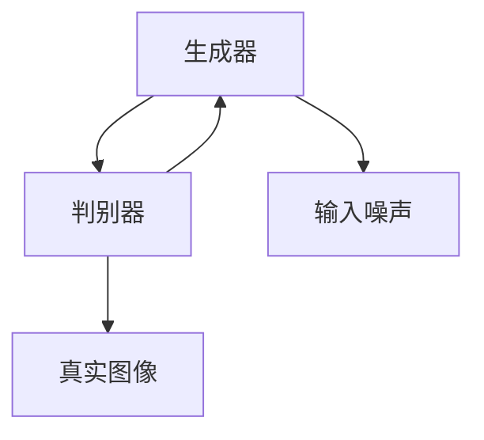
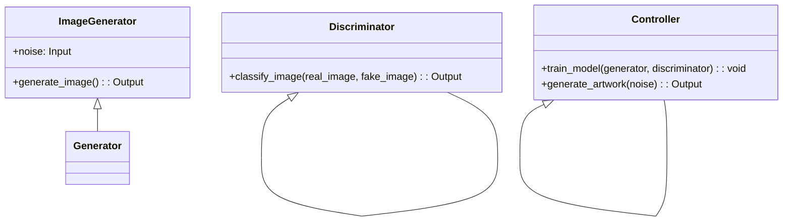
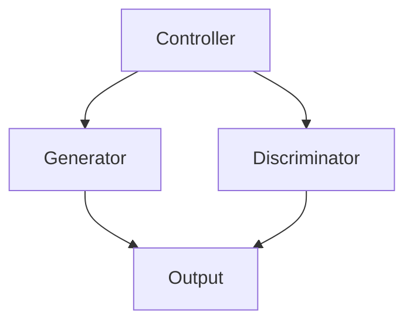
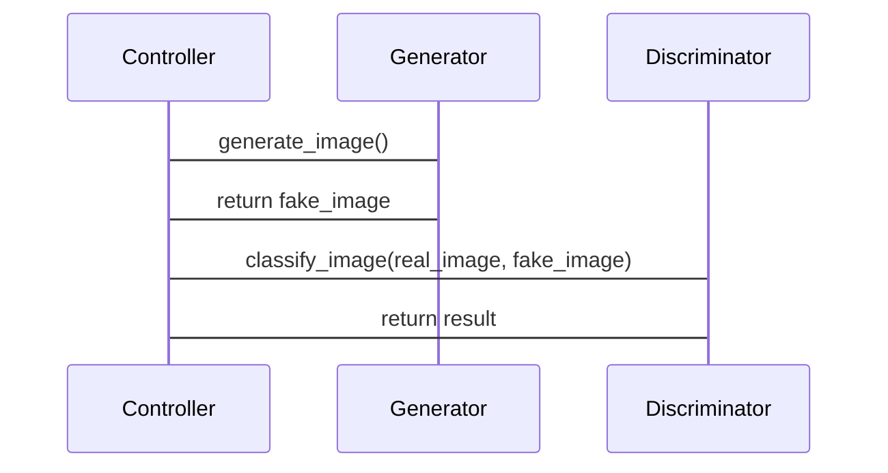

                 


```markdown
# 智能画架：AI Agent的绘画技巧指导

> 关键词：AI绘画、生成对抗网络、深度学习、图像处理、艺术设计、技术实现

> 摘要：本文深入探讨了AI绘画的核心概念、技术原理和实现方法。通过分析生成对抗网络（GAN）和变体自编码器（VAE）等图像生成模型，揭示AI绘画的数学基础和算法实现。结合实际案例，详细讲解了AI绘画系统的架构设计和项目实战，为读者提供从理论到实践的全面指导。最后，总结了AI绘画的最佳实践经验和未来发展趋势，帮助读者更好地理解和应用AI绘画技术。

---

## 第1章: AI绘画的背景与概念

### 1.1 AI绘画的背景介绍

#### 1.1.1 从传统绘画到AI绘画的演变
传统绘画依赖艺术家的创造力和技巧，而AI绘画通过算法模拟人类的视觉系统和艺术创作过程，实现了自动化和个性化的艺术生成。这种演变不仅改变了艺术创作的方式，还为设计领域带来了新的可能性。

#### 1.1.2 AI绘画的核心概念与问题背景
AI绘画的核心在于利用深度学习模型生成高质量的图像。其关键问题包括图像生成的质量、多样性、可控性以及生成效率等。这些问题的解决需要结合计算机视觉、深度学习和图像处理等多方面的知识。

#### 1.1.3 AI绘画的边界与外延
AI绘画不仅仅局限于生成图像，还包括图像编辑、风格迁移、图像修复等多种应用场景。其外延涉及艺术设计、广告创意、教育培训等多个领域。

### 1.2 AI绘画的核心概念

#### 1.2.1 AI绘画的定义与特点
AI绘画是通过算法生成图像的过程，具有自动化、个性化和高效性的特点。与传统绘画相比，AI绘画可以在短时间内生成大量高质量的艺术作品，为设计师和艺术家提供了新的工具和创作方式。

#### 1.2.2 AI绘画与传统绘画的对比
| 特性         | 传统绘画                | AI绘画                  |
|--------------|-------------------------|--------------------------|
| 创作主体     | 人类艺术家              | AI算法                  |
| 创作速度     | 较慢                    | 较快                    |
| 创作多样性   | 受限于艺术家的风格      | 无限多样                 |
| 创作工具     | 画笔、颜料等            | 计算机、深度学习模型      |

#### 1.2.3 AI绘画的实现原理与技术背景
AI绘画主要依赖深度学习模型，尤其是生成对抗网络（GAN）和变体自编码器（VAE）。这些模型通过学习大量图像数据，生成新的图像。

### 1.3 AI绘画的应用场景与未来发展

#### 1.3.1 AI绘画在艺术创作中的应用
AI绘画可以生成抽象画、风景画等多种艺术作品，为艺术家提供灵感和创作工具。

#### 1.3.2 AI绘画在设计领域的潜力
在广告设计、游戏角色设计等领域，AI绘画可以快速生成多种设计稿，提高设计效率。

#### 1.3.3 AI绘画技术的未来发展趋势
随着深度学习技术的不断发展，AI绘画将更加智能化和个性化，生成的图像质量也将进一步提升。

### 1.4 本章小结
本章介绍了AI绘画的背景、核心概念和应用场景，为后续章节的深入分析奠定了基础。

---

## 第2章: 图像生成模型原理

### 2.1 图像生成模型的分类与对比

#### 2.1.1 生成对抗网络（GAN）的原理
生成对抗网络由生成器和判别器组成，通过对抗训练生成逼真的图像。生成器的目标是欺骗判别器，使其认为生成的假数据是真实的；而判别器的目标是区分真实数据和生成数据。

#### 2.1.2 变体自编码器（VAE）的原理
变体自编码器通过最大化生成样本的似然和正则化目标分布来生成图像。与GAN相比，VAE的生成过程更加稳定，但生成的图像质量可能稍逊于GAN。

#### 2.1.3 其他图像生成模型的对比分析
| 模型         | GAN                     | VAE                     |
|--------------|--------------------------|--------------------------|
| 优势         | 生成质量高               | 生成过程稳定             |
| 缺点         | 训练不稳定                | 生成质量较低             |

### 2.2 图像生成模型的特征提取与图像重建

#### 2.2.1 特征提取的数学模型
深度卷积神经网络（CNN）常用于特征提取，其核心是卷积层和池化层。例如，VGG网络和ResNet网络在图像特征提取中表现优异。

#### 2.2.2 图像重建的优化算法
图像重建通常采用变分自编码器（VAE）或去噪自编码器（DAE）进行优化。VAE通过最大化似然和正则化目标分布来重建图像，DAE则通过去噪过程来增强图像的鲁棒性。

### 2.3 图像生成模型的训练与优化

#### 2.3.1 损失函数的定义与优化
生成对抗网络的损失函数包括生成器损失和判别器损失：
$$ \text{生成器损失} = -\log(D(G(x))) $$
$$ \text{判别器损失} = -(\log(D(x)) + \log(1-D(G(x)))) $$

#### 2.3.2 模型训练的收敛性分析
生成器和判别器的损失函数需要同时优化，这可能导致模型训练过程中生成器和判别器交替主导，最终达到某种平衡状态。

#### 2.3.3 模型优化的技巧与策略
- 使用合理的学习率和优化算法（如Adam优化器）。
- 增加判别器和生成器的交替训练步骤。
- 使用预训练模型或迁移学习来加速训练。

### 2.4 本章小结
本章详细介绍了图像生成模型的分类、原理和优化方法，为后续章节的实现提供了理论基础。

---

## 第3章: 生成对抗网络（GAN）的实现

### 3.1 GAN的基本原理与数学模型

#### 3.1.1 GAN的生成器与判别器结构
生成器通常由转置卷积层组成，而判别器由卷积层组成。例如，深度卷积生成对抗网络（DCGAN）是一种经典的实现方式。

#### 3.1.2 GAN的损失函数公式
生成器的损失函数为：
$$ \mathcal{L}_G = -\log(D(G(x))) $$
判别器的损失函数为：
$$ \mathcal{L}_D = -(\log(D(x)) + \log(1-D(G(x)))) $$

### 3.2 GAN的训练流程与优化策略

#### 3.2.1 GAN的训练流程图


#### 3.2.2 GAN的训练优化技巧
- 使用Adam优化器（$\alpha=0.0002$，$\beta_1=0.5$）。
- 增加判别器和生成器的交替训练步数（例如，每训练1次生成器，训练1次判别器）。

### 3.3 GAN的实现代码与应用案例

#### 3.3.1 环境安装
需要安装TensorFlow或PyTorch框架，并安装必要的依赖库。

#### 3.3.2 GAN的实现代码
```python
import torch
import torch.nn as nn
import torch.optim as optim
import numpy as np

# 定义生成器
class Generator(nn.Module):
    def __init__(self, latent_dim=100):
        super(Generator, self).__init__()
        self.latent_dim = latent_dim
        self.model = nn.Sequential(
            nn.ConvTranspose2d(latent_dim, 512, 4, 1, 0),
            nn.BatchNorm2d(512),
            nn.ReLU(True),
            nn.ConvTranspose2d(512, 256, 4, 2, 1),
            nn.BatchNorm2d(256),
            nn.ReLU(True),
            nn.ConvTranspose2d(256, 128, 4, 2, 1),
            nn.BatchNorm2d(128),
            nn.ReLU(True),
            nn.ConvTranspose2d(128, 3, 4, 2, 1),
            nn.Tanh()
        )
    
    def forward(self, x):
        return self.model(x)

# 定义判别器
class Discriminator(nn.Module):
    def __init__(self):
        super(Discriminator, self).__init__()
        self.model = nn.Sequential(
            nn.Conv2d(3, 128, 4, 2, 1),
            nn.LeakyReLU(0.2),
            nn.Conv2d(128, 256, 4, 2, 1),
            nn.LeakyReLU(0.2),
            nn.Conv2d(256, 512, 4, 2, 1),
            nn.LeakyReLU(0.2),
            nn.Conv2d(512, 1, 4, 2, 1),
            nn.Sigmoid()
        )
    
    def forward(self, x):
        return self.model(x)

# 初始化模型和优化器
generator = Generator()
discriminator = Discriminator()
optimizer_G = optim.Adam(generator.parameters(), lr=0.0002, betas=(0.5, 0.999))
optimizer_D = optim.Adam(discriminator.parameters(), lr=0.0002, betas=(0.5, 0.999))

# 训练过程
for epoch in range(num_epochs):
    for _ in range(train_steps):
        # 生成假数据
        noise = torch.randn(batch_size, latent_dim, 1, 1)
        fake = generator(noise)
        
        # 训练判别器
        optimizer_D.zero_grad()
        real_output = discriminator(real_img)
        fake_output = discriminator(fake.detach())
        loss_D = -torch.mean(torch.log(real_output) + torch.log(1 - fake_output))
        loss_D.backward()
        optimizer_D.step()
        
        # 训练生成器
        optimizer_G.zero_grad()
        fake_output = discriminator(fake)
        loss_G = -torch.mean(torch.log(fake_output))
        loss_G.backward()
        optimizer_G.step()
```

#### 3.3.3 GAN的应用案例分析
通过训练GAN模型，可以生成高质量的图像，例如生成逼真的风景画或人物图像。生成器的结构和参数选择对生成图像的质量有重要影响。

### 3.4 本章小结
本章通过详细的代码示例和流程图，介绍了生成对抗网络（GAN）的实现过程，并分析了其在AI绘画中的应用。

---

## 第4章: 系统分析与架构设计

### 4.1 问题场景介绍

#### 4.1.1 系统功能需求
- 图像生成：根据输入的噪声或条件生成图像。
- 图像编辑：支持图像的风格迁移、图像修复等功能。
- 用户交互：提供用户友好的界面，方便用户输入和输出。

### 4.2 系统功能设计

#### 4.2.1 领域模型（mermaid类图）


### 4.3 系统架构设计

#### 4.3.1 系统架构图（mermaid架构图）


#### 4.3.2 系统接口设计
- 输入接口：接收噪声向量或条件图像。
- 输出接口：生成图像或编辑后的图像。

#### 4.3.3 系统交互图（mermaid序列图）


### 4.4 本章小结
本章通过系统设计的方法，详细描述了AI绘画系统的架构和交互流程，为后续的实现提供了指导。

---

## 第5章: 项目实战

### 5.1 项目环境安装

#### 5.1.1 安装Python和必要的库
```bash
pip install torch torchvision matplotlib numpy
```

### 5.2 系统核心实现

#### 5.2.1 生成器实现
```python
class Generator(nn.Module):
    def __init__(self, latent_dim=100):
        super(Generator, self).__init__()
        self.latent_dim = latent_dim
        self.model = nn.Sequential(
            nn.ConvTranspose2d(latent_dim, 512, 4, 1, 0),
            nn.BatchNorm2d(512),
            nn.ReLU(True),
            nn.ConvTranspose2d(512, 256, 4, 2, 1),
            nn.BatchNorm2d(256),
            nn.ReLU(True),
            nn.ConvTranspose2d(256, 128, 4, 2, 1),
            nn.BatchNorm2d(128),
            nn.ReLU(True),
            nn.ConvTranspose2d(128, 3, 4, 2, 1),
            nn.Tanh()
        )
    
    def forward(self, x):
        return self.model(x)
```

#### 5.2.2 判别器实现
```python
class Discriminator(nn.Module):
    def __init__(self):
        super(Discriminator, self).__init__()
        self.model = nn.Sequential(
            nn.Conv2d(3, 128, 4, 2, 1),
            nn.LeakyReLU(0.2),
            nn.Conv2d(128, 256, 4, 2, 1),
            nn.LeakyReLU(0.2),
            nn.Conv2d(256, 512, 4, 2, 1),
            nn.LeakyReLU(0.2),
            nn.Conv2d(512, 1, 4, 2, 1),
            nn.Sigmoid()
        )
    
    def forward(self, x):
        return self.model(x)
```

#### 5.2.3 训练过程实现
```python
def train_gan(generator, discriminator, optimizer_G, optimizer_D, device, epochs=100, batch_size=64):
    for epoch in range(epochs):
        for _ in range(batch_size):
            # 生成假数据
            noise = torch.randn(batch_size, latent_dim, 1, 1).to(device)
            fake = generator(noise)
            
            # 训练判别器
            optimizer_D.zero_grad()
            real = real_images.to(device)
            real_output = discriminator(real)
            fake_output = discriminator(fake.detach())
            loss_D = -torch.mean(torch.log(real_output) + torch.log(1 - fake_output))
            loss_D.backward()
            optimizer_D.step()
            
            # 训

