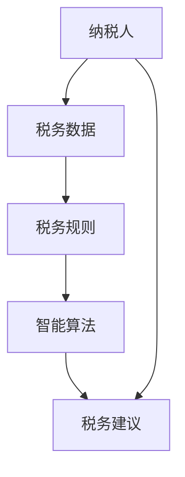
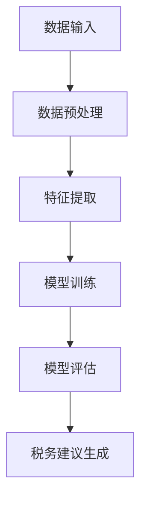
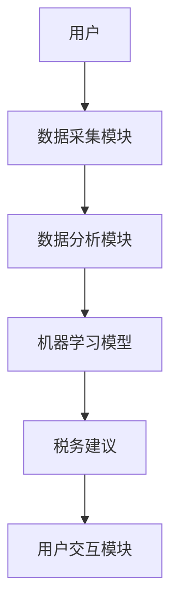

                 


# 智能税务规划与建议

> 关键词：智能税务规划，人工智能，数据分析，机器学习，税务优化

> 摘要：本文探讨了智能税务规划与建议的背景、核心概念、算法原理、系统架构以及实际应用。通过结合人工智能和大数据技术，分析如何优化税务策略，提升税务管理效率。文章详细介绍了智能税务规划的核心要素、机器学习算法的应用、系统架构设计以及实际案例分析，为读者提供全面的技术视角。

---

# 第一部分: 智能税务规划与建议的背景与概念

## 第1章: 智能税务规划与建议的定义与背景

### 1.1 智能税务规划的核心概念

#### 1.1.1 税务规划的基本定义
税务规划是指通过合法手段，优化纳税人的税务负担，使其在合规的前提下实现税负最小化。传统税务规划主要依赖人工分析和经验判断，而智能税务规划则借助人工智能（AI）和大数据技术，实现更精准和高效的税务优化。

#### 1.1.2 智能化在税务规划中的应用
智能化税务规划利用机器学习、自然语言处理（NLP）和数据挖掘等技术，从海量数据中提取有价值的信息，帮助纳税人制定最优的税务策略。例如，通过分析企业的财务数据和市场趋势，AI系统可以预测税负变化并提出相应的优化建议。

#### 1.1.3 智能税务规划的边界与外延
智能税务规划不仅关注税务本身，还涉及企业财务、法律合规、市场环境等多个方面。其边界在于合法合规的前提下，最大化税后收益；外延则包括与其他业务系统的集成，如ERP系统和财务管理系统。

### 1.2 智能税务规划的背景与意义

#### 1.2.1 数字化与智能化的税务管理趋势
随着数字化转型的推进，税务管理逐渐从人工化向智能化转变。智能税务规划能够提高税务管理的效率和准确性，同时降低成本。

#### 1.2.2 智能税务规划的经济价值
通过智能税务规划，企业可以降低税负，优化现金流，提升财务健康度。个人也能通过智能税务建议实现资产配置优化和税务合规。

#### 1.2.3 政策法规对智能税务规划的影响
税法的复杂性和变化性对智能税务规划提出了更高的要求。AI系统需要实时更新法规知识库，确保建议的合法性和合规性。

### 1.3 智能税务规划的核心要素

#### 1.3.1 数据驱动的税务分析
智能税务规划依赖于高质量的数据输入，包括财务数据、市场数据和法规数据。通过数据分析，系统可以识别潜在的优化机会。

#### 1.3.2 人工智能算法的应用
机器学习算法（如随机森林、神经网络）被用于预测税负变化和优化策略。NLP技术则用于分析法规文本，提取关键信息。

#### 1.3.3 个性化与合规性的平衡
智能税务规划需要在个性化需求和合规性之间找到平衡点。系统需根据用户的具体情况制定个性化建议，同时确保建议符合相关法律法规。

---

## 第2章: 智能税务规划与建议的核心概念体系

### 2.1 核心概念与属性对比

#### 2.1.1 智能税务规划与传统税务规划的对比
| 对比维度 | 传统税务规划 | 智能税务规划 |
|----------|---------------|---------------|
| 方法     | 人工分析       | 数据驱动 + AI |
| 效率     | 较低           | 高             |
| 准确性   | 受限于经验     | 高             |

#### 2.1.2 数据驱动与规则驱动的差异
- 数据驱动：基于历史数据和模式识别，提供个性化建议。
- 规则驱动：基于固定的法规和规则，提供标准化建议。

#### 2.1.3 个性化服务与标准化服务的平衡
个性化服务注重用户体验，而标准化服务注重效率。智能税务规划通过动态调整服务模式，实现两者的平衡。

### 2.2 实体关系图（ER图）



---

# 第二部分: 智能税务规划的算法与技术实现

## 第3章: 智能税务规划的核心算法原理

### 3.1 数据预处理与特征提取

#### 3.1.1 数据清洗与标准化
- 数据清洗：去除重复数据、处理缺失值。
- 标准化：将数据归一化，便于模型训练。

#### 3.1.2 特征选择与降维
- 特征选择：使用相关性分析或递归特征消除法（RFE）。
- 降维：使用主成分分析（PCA）。

#### 3.1.3 时间序列数据分析
- 使用ARIMA模型或LSTM网络进行时间序列预测。

### 3.2 机器学习模型的选择与训练

#### 3.2.1 监督学习与无监督学习的对比
| 对比维度 | 监督学习 | 无监督学习 |
|----------|----------|------------|
| 数据类型 | 标签数据 | 无标签数据 |
| 目标     | 预测或分类 | 聚类或关联规则挖掘 |

#### 3.2.2 常见算法的适用场景
- 决策树：适合分类问题。
- 随机森林：适合特征重要性分析。
- 神经网络：适合复杂非线性关系。

#### 3.2.3 模型调优与评估指标
- 调整超参数：使用网格搜索或随机搜索。
- 评估指标：准确率、召回率、F1分数。

### 3.3 智能算法流程图



### 3.4 数学模型与公式

#### 3.4.1 线性回归模型
$$ y = \beta_0 + \beta_1x + \epsilon $$

#### 3.4.2 随机森林算法
$$ y = \text{多数投票}(\text{树}1, \text{树}2, ..., \text{树}n) $$

---

## 第4章: 智能税务规划的系统架构设计

### 4.1 系统功能模块划分

#### 4.1.1 数据采集模块
- 从企业ERP系统获取财务数据。
- 从税务机关获取法规更新。

#### 4.1.2 数据分析模块
- 使用机器学习模型进行预测和优化。

#### 4.1.3 用户交互模块
- 提供用户友好的界面，展示税务建议。

### 4.2 系统架构设计



---

## 第5章: 智能税务规划的项目实战

### 5.1 环境安装
- 安装Python、Pandas、Scikit-learn、TensorFlow等库。

### 5.2 核心实现代码

```python
import pandas as pd
from sklearn.ensemble import RandomForestRegressor
from sklearn.metrics import mean_absolute_error

# 数据加载
data = pd.read_csv('tax_data.csv')

# 特征与目标分离
X = data.drop('tax', axis=1)
y = data['tax']

# 模型训练
model = RandomForestRegressor()
model.fit(X, y)

# 预测与评估
预测值 = model.predict(X)
print(mean_absolute_error(预测值, y))
```

### 5.3 案例分析
- 某企业通过智能税务规划，优化了增值税和企业所得税的缴纳方式，降低了整体税负。

### 5.4 项目总结
智能税务规划系统能够显著提高税务管理效率，同时降低税负。

---

## 第6章: 总结与展望

### 6.1 本章总结
智能税务规划通过结合人工智能和大数据技术，为纳税人提供了高效、精准的税务优化方案。

### 6.2 未来展望
随着技术的进步，智能税务规划将更加智能化和个性化，可能与区块链等技术结合，实现更高效的税务管理。

---

作者：AI天才研究院/AI Genius Institute & 禅与计算机程序设计艺术 /Zen And The Art of Computer Programming

