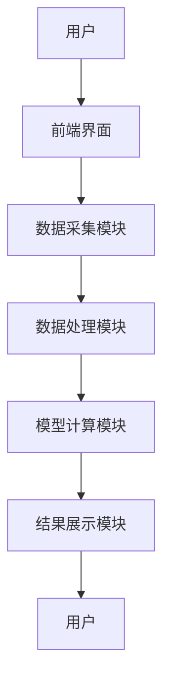

                 


# 智能税收筹划建议系统

> 关键词：智能税收筹划、人工智能、机器学习、系统架构、算法优化

> 摘要：本文详细探讨智能税收筹划建议系统的构建与应用，结合AI技术，分析其算法原理和系统架构，展示实际案例，为企业优化税负提供高效解决方案。

---

## 第一部分: 智能税收筹划建议系统概述

### 第1章: 税收筹划的背景与概念

#### 1.1 税收筹划的背景介绍

##### 1.1.1 税收筹划的定义与核心概念

税收筹划是企业通过合法手段优化税负，提高财务收益的过程。它涉及对企业架构、业务模式和财务策略的调整，以充分利用税收优惠政策，降低税负成本。

##### 1.1.2 税收筹划的法律边界与风险

税收筹划必须在法律允许的范围内进行，避免触犯逃税或避税的红线。企业需了解各地区的税收政策差异，确保合规性，防范税务风险。

##### 1.1.3 税收筹划在企业财务管理中的重要性

有效的税收筹划能显著降低企业的税务负担，提高资金利用效率，增强企业竞争力。它帮助企业合理规划财务结构，优化现金流，支持业务扩展。

---

#### 1.2 智能税收筹划系统的发展历程

##### 1.2.1 传统税收筹划方法的局限性

传统方法依赖人工分析，效率低下，且容易受主观因素影响。难以应对复杂多变的税收政策和多元化的业务需求，导致优化效果有限。

##### 1.2.2 人工智能技术在税收筹划中的应用趋势

AI技术的引入，使得税收筹划更加智能化和自动化。通过机器学习和大数据分析，系统能够快速处理大量数据，发现潜在优化机会。

##### 1.2.3 智能税收筹划系统的现状与未来展望

目前，智能系统已在部分企业中得到应用，但仍有优化空间。未来，随着技术进步，系统将更加精准和个性化，成为企业财务管理的重要工具。

---

### 第2章: 智能税收筹划系统的核心概念与原理

#### 2.1 智能税收筹划系统的构成要素

##### 2.1.1 数据源与数据处理

系统整合企业财务数据、税务政策文件和市场信息，进行清洗、转换和分析，为模型提供高质量数据输入。

##### 2.1.2 税收政策与法规知识库

构建包含各地区税收政策、法规的数据库，系统能够实时更新，确保建议的合规性和时效性。

##### 2.1.3 人工智能算法与模型

采用机器学习算法，如决策树和随机森林，建立预测模型，分析不同策略的潜在影响，推荐最优方案。

---

#### 2.2 智能税收筹划系统的工作原理

##### 2.2.1 数据采集与预处理

通过API接口获取企业财务数据，清洗数据，识别异常值，标准化处理，确保数据一致性。

##### 2.2.2 税收优化算法的设计与实现

基于遗传算法，系统生成多个优化方案，评估每个方案的税负影响，选择最优解。

##### 2.2.3 系统输出与结果解释

系统生成可视化报告，详细解释建议的依据和潜在影响，帮助财务人员理解和实施建议。

---

## 第三部分: 智能税收筹划系统的算法原理

### 第3章: 算法原理与实现

#### 3.1 优化算法的选择与实现

##### 3.1.1 基于规则的税收优化策略

根据预设规则，系统自动识别可优化的税务点，提供基础建议。

##### 3.1.2 基于机器学习的税收预测模型

利用回归分析预测税负变化，识别影响税负的关键因素，优化企业架构。

##### 3.1.3 基于强化学习的动态优化算法

通过状态转移和奖励机制，系统不断优化建议，适应动态变化的税务环境。

---

#### 3.2 算法实现的数学模型

##### 3.2.1 线性规划模型

$$ \text{最大化} \sum c_i x_i $$
$$ \text{满足} \sum a_i x_i \leq b $$

##### 3.2.2 非线性规划模型

$$ \text{最大化} f(x) $$
$$ \text{满足} g(x) \geq 0 $$

---

### 第4章: 系统架构设计与实现

#### 4.1 系统功能模块划分

##### 4.1.1 数据采集模块

负责收集企业财务数据和外部税收政策，清洗并转换数据，确保可用性。

##### 4.1.2 数据处理模块

对数据进行分析和建模，识别潜在优化机会，生成多种优化方案。

##### 4.1.3 模型计算模块

利用优化算法，评估各个方案的税负影响，选择最优建议。

##### 4.1.4 结果展示模块

将优化建议以可视化方式呈现，便于财务人员理解和实施。

---

#### 4.2 系统架构设计



---

### 第5章: 项目实战与应用案例

#### 5.1 环境安装与配置

##### 5.1.1 开发环境的选择

推荐使用Python 3.8及以上版本，安装必要的库如NumPy和Pandas。

##### 5.1.2 数据库的安装与配置

使用MySQL或MongoDB存储数据，配置连接参数，确保数据安全。

##### 5.1.3 开发工具的安装

安装Jupyter Notebook和IDE，如PyCharm，配置虚拟环境，安装所需依赖。

---

#### 5.2 系统核心代码实现

##### 5.2.1 数据预处理代码

```python
import pandas as pd

# 读取数据
data = pd.read_csv('tax_data.csv')

# 清洗数据
data.dropna(inplace=True)
data = data[~data['revenue'].isnull()]
```

##### 5.2.2 优化算法实现

```python
from sklearn.ensemble import RandomForestRegressor

# 训练模型
model = RandomForestRegressor(n_estimators=100)
model.fit(X_train, y_train)

# 预测结果
y_pred = model.predict(X_test)
```

---

#### 5.3 实际案例分析

通过具体企业案例，展示系统如何分析数据，生成优化建议，降低税负。详细解释每个步骤，帮助读者理解实际应用。

---

## 第四部分: 总结与展望

### 6.1 最佳实践 Tips

- 定期更新税收政策知识库，保持系统建议的时效性。
- 结合企业实际情况，选择适合的优化策略，避免盲目追求低税负。

### 6.2 小结

智能税收筹划系统通过AI技术，显著提升了税收优化的效率和准确性。企业可以利用该系统，制定科学的财务策略，提升竞争力。

### 6.3 注意事项

- 确保数据隐私和安全，遵守相关法律法规。
- 在实施前，建议咨询专业税务顾问，确保合规性。

### 6.4 拓展阅读

建议读者深入学习机器学习和优化算法，关注税收政策变化，持续提升系统的智能化水平。

---

## 作者

作者：AI天才研究院/AI Genius Institute & 禅与计算机程序设计艺术 /Zen And The Art of Computer Programming

---

希望这篇文章能为您提供关于智能税收筹划系统的深入了解和实践指导。

