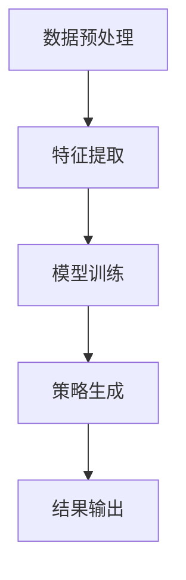

                 


# 智能税收筹划策略推荐系统

## 关键词：智能税收筹划，策略推荐，机器学习，税收优化，数据驱动

## 摘要：  
本文系统地介绍智能税收筹划策略推荐系统的构建与应用，从背景、核心概念到算法实现，再到系统架构设计与项目实战，全面解析如何利用智能化技术实现最优税收策略推荐。文章结合实际案例，深入探讨如何利用机器学习、数据挖掘等技术，为企业和个人提供高效、合规的税收优化方案。

---

# 第一部分：智能税收筹划策略推荐系统概述

## 第1章：智能税收筹划策略推荐系统背景介绍

### 1.1 税收筹划的基本概念  
税收筹划是指通过合法、合规的方式，优化税务结构，降低税负成本，提高资金使用效率的过程。其核心在于在不违反税法的前提下，合理利用税收政策，实现经济效益最大化。

### 1.2 智能化技术在税收筹划中的优势  
传统的税收筹划依赖人工分析，存在效率低、覆盖面窄、实时性差等问题。而智能化技术（如机器学习、大数据分析）能够快速处理海量数据，发现潜在的优化机会，提供个性化、动态化的税收策略。

### 1.3 问题背景与问题描述  
企业在经营过程中面临复杂的税收政策和多变的市场环境，如何在合法合规的前提下，找到最优的税收筹划方案，成为企业财务管理的核心挑战。传统的人工方法难以满足快速变化的需求，亟需智能化解决方案。

---

## 第2章：智能税收筹划策略推荐系统的核心概念与联系  

### 2.1 核心概念原理  
智能税收筹划推荐系统的核心在于将税收政策、企业数据和推荐算法相结合。通过数据挖掘、机器学习等技术，系统能够分析企业的财务数据，匹配最优的税收策略。

### 2.2 核心概念属性对比  
| 核心概念 | 特性 | 优势 |
|----------|------|------|
| 数据驱动 | 大数据支持 | 高精度分析 |
| 智能推荐 | 机器学习算法 | 实时动态优化 |
| 税收政策 | 法规库 | 合规性保障 |

### 2.3 ER实体关系图  
```mermaid
erDiagram
    税务主体 o-- 计划方案 : "提交"
    计划方案 o-- 税收政策 : "适用"
    税收政策 o-- 税务机关 : "发布"
```

---

## 第3章：智能税收筹划策略推荐系统的算法原理  

### 3.1 算法选择与原理  
推荐算法是系统的核心，常见的算法包括协同过滤、基于内容的推荐和混合推荐。本文采用基于决策树的推荐算法，结合特征工程，实现高精度的策略推荐。

### 3.2 算法实现流程  


### 3.3 数学模型与公式  
决策树模型的核心是信息增益，公式为：
$$ \text{信息增益} = \sum p_i \log \frac{1}{p_i} $$
其中，\( p_i \) 是各个特征的概率。

---

## 第4章：系统架构设计与实现  

### 4.1 系统功能设计  
系统功能模块包括数据采集、模型训练、策略推荐和结果展示。

### 4.2 系统架构图  


---

## 第5章：项目实战与案例分析  

### 5.1 环境搭建  
需安装Python、机器学习库（如scikit-learn）和数据处理工具。

### 5.2 核心代码实现  
```python
from sklearn.tree import DecisionTreeClassifier
from sklearn.model_selection import train_test_split
import pandas as pd

# 数据加载
data = pd.read_csv('tax_data.csv')
X = data.drop('label', axis=1)
y = data['label']

# 数据分割
X_train, X_test, y_train, y_test = train_test_split(X, y, test_size=0.2)

# 模型训练
model = DecisionTreeClassifier()
model.fit(X_train, y_train)

# 预测与评估
print(model.score(X_test, y_test))
```

### 5.3 案例分析  
以某企业为例，通过数据清洗、特征提取和模型训练，系统生成最优税收策略，并验证其效果。

---

## 第6章：总结与展望  

### 6.1 系统总结  
本文详细介绍了智能税收筹划策略推荐系统的构建过程，从理论到实践，展示了其在企业中的应用价值。

### 6.2 未来展望  
未来，随着AI技术的进步，税收筹划系统将更加智能化，实现个性化、实时化的税收优化。

---

## 作者：AI天才研究院 & 禅与计算机程序设计艺术

