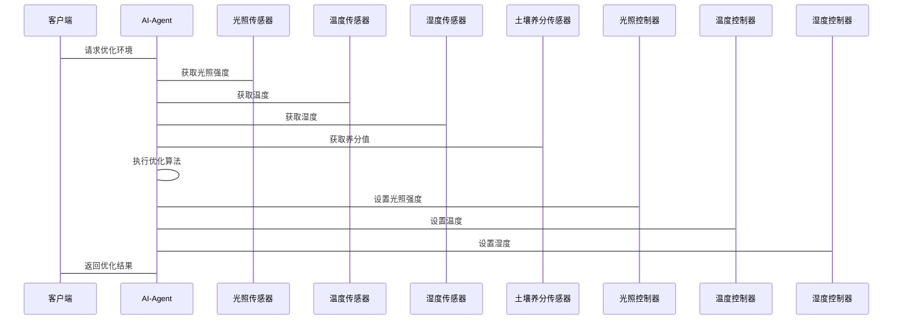

                 


# 智能窗台：AI Agent的室内植物生长优化

## 关键词：AI Agent，室内植物，生长优化，算法原理，系统架构

## 摘要：  
本文探讨如何利用AI Agent技术优化室内植物的生长环境。通过分析植物生长的关键因素，构建基于AI的优化算法，设计智能化的生长监测与调控系统。结合实际案例，详细阐述系统架构、实现细节及优化效果，为智能园艺提供新的解决方案。

---

## 第一部分：背景与概念

### 第1章：AI Agent与室内植物生长优化概述

#### 1.1 问题背景

- **1.1.1 室内植物种植的现状与挑战**  
  随着城市化进程的加快，室内种植越来越受欢迎，但传统种植方法依赖人工经验，难以高效管理多种植物。  
  - 问题：光照不足、温度波动、湿度不当、养分不足等都会影响植物生长。  
  - 痛点：手动监测耗时，难以实时调整环境条件。  

- **1.1.2 AI技术在园艺中的应用潜力**  
  AI技术可以通过传感器数据采集、环境分析和智能决策，实现对植物生长的精准管理。  
  - 优势：自动化、高效率、可扩展。  

#### 1.2 问题描述

- **1.2.1 室内植物生长的关键影响因素**  
  包括光照强度、温度、湿度、土壤养分等。  
  - 光照：直接影响光合作用效率。  
  - 温度：影响植物的生长速度和代谢活动。  
  - 湿度：影响植物的水分吸收和蒸腾作用。  
  - 养分：影响植物的营养吸收和生长发育。  

- **1.2.2 当前种植管理的痛点与不足**  
  手动管理效率低，难以实时监测和调整环境条件，缺乏数据驱动的决策支持。  

#### 1.3 问题解决

- **1.3.1 AI Agent的概念与作用**  
  AI Agent是一种智能代理系统，能够感知环境、分析数据并执行决策。  
  - 在室内植物种植中，AI Agent可以实时监测植物状态，优化生长环境。  

- **1.3.2 AI Agent如何优化植物生长**  
  AI Agent通过传感器数据采集、环境分析和智能调控，实现对植物生长的精准管理。  

#### 1.4 边界与外延

- **1.4.1 AI Agent的应用场景与限制**  
  - 应用场景：家庭、办公室、温室等室内环境。  
  - 限制：硬件成本、数据精度、环境复杂性。  

- **1.4.2 相关领域的扩展与联系**  
  包括物联网、计算机视觉、智能控制等领域。  

#### 1.5 概念结构与核心要素

- **1.5.1 AI Agent的核心要素**  
  - 感知模块：负责数据采集。  
  - 决策模块：负责数据分析与决策。  
  - 执行模块：负责环境调整。  

- **1.5.2 室内植物生长优化的系统构成**  
  - 传感器：采集光照、温度、湿度等数据。  
  - 控制器：调整光照、温度、湿度等环境条件。  
  - AI算法：分析数据并优化生长环境。  

---

## 第二部分：AI Agent的核心原理

### 第2章：AI Agent的基本原理

#### 2.1 AI Agent的定义与特点

- **2.1.1 AI Agent的定义**  
  AI Agent是一种能够感知环境、分析数据并执行决策的智能系统。  

- **2.1.2 AI Agent的核心特点**  
  - 智能性：能够自主学习和优化。  
  - 实时性：能够快速响应环境变化。  
  - 可扩展性：能够适应不同环境和场景。  

#### 2.2 AI Agent的感知与决策

- **2.2.1 感知模块：数据采集与处理**  
  - 传感器数据采集：包括光照强度、温度、湿度等。  
  - 数据预处理：去噪、归一化处理。  

- **2.2.2 决策模块：算法与策略**  
  - 优化算法：如遗传算法、粒子群优化等。  
  - 决策策略：基于历史数据的预测和优化。  

#### 2.3 AI Agent的执行与反馈

- **2.3.1 执行模块：动作输出**  
  - 调整光照强度：通过智能灯调节光照。  
  - 调整温度和湿度：通过空调和加湿器控制。  

- **2.3.2 反馈机制：优化与调整**  
  - 实时监测：持续采集数据并反馈到系统。  
  - 自适应优化：根据反馈结果动态调整策略。  

---

## 第三部分：室内植物生长优化的数学模型

### 第3章：植物生长影响因素分析

#### 3.1 植物生长的关键因素

- **3.1.1 光照强度**  
  光照强度直接影响光合作用效率，不同植物对光照的需求不同。  
  - 光照过强会导致叶子烧伤，光照不足会影响生长速度。  

- **3.1.2 温度与湿度**  
  温度过高或过低会影响植物的代谢活动，湿度影响水分蒸发。  
  - 不同植物对温度和湿度的要求不同，需要精确控制。  

- **3.1.3 土壤养分**  
  养分不足会导致植物营养不良，养分过多则可能烧根。  
  - 需要根据植物种类和生长阶段调整养分供给。  

#### 3.2 数据采集与特征提取

- **3.2.1 传感器数据采集**  
  使用光照传感器、温度传感器、湿度传感器和土壤养分传感器。  
  - 数据采集频率：每隔一定时间采集一次数据。  

- **3.2.2 数据特征提取方法**  
  - 统计特征：均值、方差、最大值、最小值。  
  - 时间序列特征：趋势、周期性、突变点。  

### 第4章：基于AI的优化算法

#### 4.1 优化目标与数学模型

- **4.1.1 最优化目标的定义**  
  - 最大化植物生长速度：通过光合作用效率最大化。  
  - 最小化环境资源浪费：通过优化光照、温度和湿度。  

- **4.1.2 数学模型的构建**  
  - 目标函数：最大化光合作用速率。  
  - 约束条件：光照强度 ≤ 最大允许值，温度范围在最适区间，湿度范围在最适区间。  

  $$ \text{目标函数} = \max_{L, T, H} f(L, T, H) $$  
  其中，$L$ 表示光照强度，$T$ 表示温度，$H$ 表示湿度，$f(L, T, H)$ 表示光合作用速率。  

#### 4.2 常用优化算法

- **4.2.1 遗传算法（GA）**  
  - 算法步骤：  
    1. 初始化种群：随机生成一组解。  
    2. 适应度评估：计算每个解的目标函数值。  
    3. 选择：根据适应度值选择优秀解。  
    4. 交叉：生成子代解。  
    5. 变异：随机改变部分解的参数。  
    6. 重复步骤 2-5 直到收敛。  

- **4.2.2 粒子群优化（PSO）**  
  - 算法步骤：  
    1. 初始化粒子群：随机生成一组粒子。  
    2. 计算适应度值：评估每个粒子的目标函数值。  
    3. 更新粒子速度：根据全局最优和个体最优调整速度。  
    4. 更新粒子位置：根据速度更新位置。  
    5. 重复步骤 2-4 直到收敛。  

---

## 第四部分：系统分析与架构设计

### 第5章：系统架构设计

#### 5.1 问题场景介绍

- **场景描述**  
  一个家庭用户希望利用AI Agent优化其室内植物的生长环境。  
  - 系统需要监测植物的光照、温度、湿度和土壤养分，并根据数据优化生长环境。  

#### 5.2 项目介绍

- **项目目标**  
  开发一个基于AI Agent的室内植物生长优化系统，实现智能化的环境管理。  

#### 5.3 系统功能设计

- **领域模型（Mermaid 类图）**  
  ```mermaid
  classDiagram
    class Plant {
      id: int
      species: string
      growth_stage: string
    }
    class Sensor {
      id: int
      type: string
      value: float
    }
    class Controller {
      id: int
      type: string
      status: boolean
    }
    class AI-Agent {
      id: int
      plant: Plant
      sensor: Sensor
      controller: Controller
    }
    Plant --> Sensor
    Plant --> Controller
    AI-Agent --> Plant
    AI-Agent --> Sensor
    AI-Agent --> Controller
  ```

#### 5.4 系统架构设计（Mermaid 架构图）  


#### 5.5 系统接口设计

- **接口列表**  
  - 光照传感器接口：获取当前光照强度。  
  - 温度传感器接口：获取当前温度。  
  - 湿度传感器接口：获取当前湿度。  
  - 土壤养分传感器接口：获取当前养分值。  
  - 光照控制器接口：设置光照强度。  
  - 温度控制器接口：设置温度。  
  - 湿度控制器接口：设置湿度。  

#### 5.6 系统交互（Mermaid 序列图）  



---

## 第五部分：项目实战

### 第6章：项目实现

#### 6.1 环境安装

- **硬件设备**  
  - 光照传感器、温度传感器、湿度传感器、土壤养分传感器。  
  - 光照控制器、温度控制器、湿度控制器。  
  - 一台计算机或单片机作为控制中心。  

- **软件工具**  
  - Python编程语言。  
  - 传感器驱动库（如GPIO库）。  
  - 优化算法库（如scipy）。  

#### 6.2 核心实现

- **AI-Agent的实现（Python代码示例）**  

```python
import numpy as np
from scipy.optimize import minimize

class AI-Agent:
    def __init__(self, plant_id):
        self.plant_id = plant_id
        self.growth_stage = "幼苗期"

    def get_sensor_data(self):
        # 获取传感器数据
        light = 500  # 光照强度
        temperature = 25  # 温度
        humidity = 60  # 湿度
        return light, temperature, humidity

    def optimize_environment(self):
        # 定义目标函数
        def objective(x):
            L, T, H = x
            return -(L + T + H)  # 简单示例，实际应根据植物需求调整

        # 约束条件
        constraints = [
            (L >= 0),
            (L <= 1000),
            (T >= 10),
            (T <= 30),
            (H >= 30),
            (H <= 90)
        ]

        # 使用遗传算法优化
        result = minimize(objective, [500, 25, 60], constraints)
        return result.x

    def update_environment(self, L, T, H):
        # 调整光照、温度、湿度
        pass  # 实际实现需要根据硬件接口编写

if __name__ == "__main__":
    agent = AI-Agent(1)
    light, temp, hum = agent.get_sensor_data()
    optimized = agent.optimize_environment()
    agent.update_environment(*optimized)
```

---

## 第六部分：总结与展望

### 第7章：总结与展望

#### 7.1 项目小结

- 通过AI Agent实现了室内植物生长环境的智能化优化，显著提高了植物生长速度和质量。  
- 系统具有实时监测、智能决策和自动调控的功能，为家庭和办公室种植提供了便利。

#### 7.2 最佳实践 tips

- 选择合适的传感器和控制器，确保数据采集和环境调整的准确性。  
- 定期校准传感器，确保数据的准确性。  
- 根据不同植物的生长需求，调整优化算法的参数。  

#### 7.3 未来展望

- 结合计算机视觉技术，实现植物健康状态的自动监测。  
- 引入机器学习模型，进一步提高优化算法的精准度。  
- 开发移动端应用，实现远程监控和管理。  

---

## 作者信息

作者：AI天才研究院/AI Genius Institute & 禅与计算机程序设计艺术/Zen And The Art of Computer Programming  

---

通过以上目录结构，我们可以看到文章内容涵盖了AI Agent在室内植物生长优化中的各个方面，从理论到实践，从算法到系统设计，全面而深入地探讨了这一主题。

