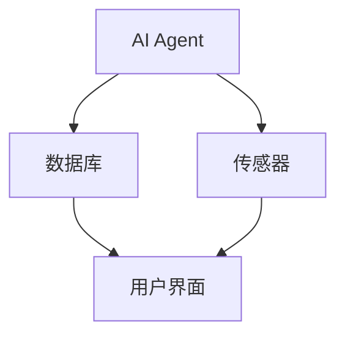
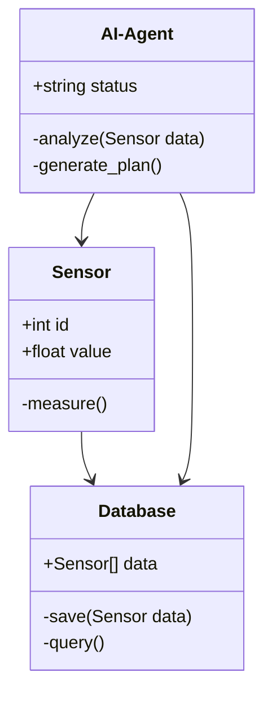
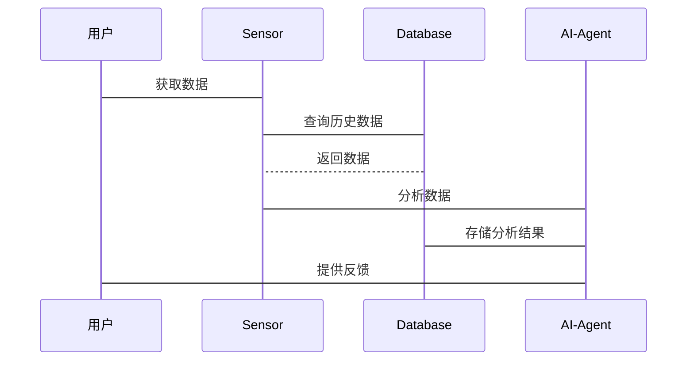

                 


# 智能窗台：AI Agent的室内植物生长监测

**关键词**：AI Agent，室内植物生长，监测系统，传感器，机器学习，物联网

**摘要**：本文探讨了AI Agent在室内植物生长监测中的应用，详细分析了系统架构、算法原理和项目实现，展示了如何利用AI技术优化植物生长环境。

---

## 第一部分: 背景介绍

### 第1章: 智能窗台与AI Agent的背景

#### 1.1 问题背景
- **1.1.1 室内植物种植的现状与挑战**：室内种植受限于环境因素，如光照、温度和湿度，导致植物生长缓慢或病态。传统监测手段缺乏实时性和智能化，难以有效优化生长条件。
- **1.1.2 AI技术在植物生长监测中的应用潜力**：AI技术能够实时分析环境数据，预测植物生长状态，提供优化建议，提高种植效率。
- **1.1.3 智能窗台的概念与目标**：智能窗台通过AI代理和多传感器监测植物生长，自动调节环境条件，实现高效种植。

#### 1.2 问题描述
- **1.2.1 室内植物生长监测的关键问题**：光照强度、温度波动、湿度变化对植物生长的影响。
- **1.2.2 智能窗台系统的功能需求**：实时监测环境参数，分析植物状态，自动调节生长条件。
- **1.2.3 AI Agent在监测中的作用**：数据融合、状态预测、决策优化。

#### 1.3 问题解决
- **1.3.1 AI Agent的核心功能**：数据采集、状态分析、决策反馈。
- **1.3.2 多传感器数据融合技术**：整合光、温、湿等传感器数据，提升监测准确性。
- **1.3.3 数据分析与生长优化策略**：基于机器学习模型预测生长状态，优化环境参数。

#### 1.4 系统边界与外延
- **1.4.1 系统的输入与输出边界**：输入环境数据和用户反馈，输出生长建议和环境调节指令。
- **1.4.2 系统与外部环境的交互**：与传感器、用户设备和数据库交互。
- **1.4.3 系统的可扩展性与兼容性**：支持多种传感器类型和扩展功能。

#### 1.5 概念结构与核心要素
- **1.5.1 系统架构的核心要素**：传感器模块、AI代理、数据库、用户界面。
- **1.5.2 各要素之间的关系**：传感器采集数据，AI代理分析并提供反馈，数据库存储数据，用户界面展示信息。
- **1.5.3 系统的核心功能模块**：数据采集、数据分析、决策反馈、用户交互。

---

## 第2章: 核心概念与联系

### 2.1 核心概念原理
- **2.1.1 AI Agent的基本原理**：AI代理通过感知环境数据，利用机器学习模型进行分析，生成决策并执行。
- **2.1.2 多传感器数据融合的原理**：整合多种传感器的数据，通过加权融合提升准确性。
- **2.1.3 植物生长监测的数学模型**：基于时间序列的机器学习模型，如LSTM，用于预测生长状态。

### 2.2 概念属性特征对比

| 概念       | 实时性 | 智能性 | 可编程性 |
|------------|--------|--------|----------|
| AI Agent   | 高     | 高     | 高        |
| 传感器     | 高     | 低     | 低        |
| 数据库     | 低     | 低     | 低        |

### 2.3 实体关系图


---

## 第3章: 算法原理讲解

### 3.1 算法选择与流程
- **3.1.1 算法选择**：使用LSTM模型进行时间序列预测。
- **3.1.2 数据预处理**：归一化、缺失值处理、特征提取。

### 3.2 代码实现
```python
# LSTM模型实现
import numpy as np
import pandas as pd
from keras.models import Sequential
from keras.layers import LSTM, Dense

# 数据加载
data = pd.read_csv('plant_data.csv')

# 数据预处理
features = data[['light', 'temperature', 'humidity']]
labels = data['growth_state']

# 特征工程
features = features.values.reshape(-1, 1, 3)

# 模型构建
model = Sequential()
model.add(LSTM(64, input_shape=(1,3)))
model.add(Dense(1, activation='sigmoid'))
model.compile(optimizer='adam', loss='binary_crossentropy')
model.fit(features, labels, epochs=100, batch_size=32)
```

### 3.3 数学模型
- **LSTM模型**：$$ y_t = f(x_t, s_{t-1}) $$
  其中，$$ s_t = \text{LSTM}(x_t, s_{t-1}) $$

---

## 第4章: 系统分析与架构设计

### 4.1 问题场景介绍
- 用户通过智能窗台监测室内植物生长，系统实时采集环境数据，分析植物状态，提供优化建议。

### 4.2 系统功能设计
- **领域模型类图**：


### 4.3 系统架构设计
- **微服务架构**：传感器数据采集、AI分析、用户反馈模块独立部署，通过API交互。

### 4.4 接口设计与交互
- **交互序列图**：


---

## 第5章: 项目实战

### 5.1 环境搭建与安装
- 安装必要的库：传感器库（如Adafruit_IO）、机器学习库（如Keras、TensorFlow）。

### 5.2 核心代码实现
```python
# 传感器数据采集
from Adafruit_IO import Client, Feed

aio = Client('你的密钥')
feed = Feed(name='plant_sensor')

# 数据采集
data = aio.get(feed.name).data
```

### 5.3 代码解读与分析
- 数据采集：通过传感器获取环境数据。
- 数据预处理：归一化处理。
- 模型训练：训练LSTM模型，预测生长状态。

### 5.4 实际案例分析
- 案例：监测一株绿植，数据包括光照、温度、湿度。
- 预测结果：模型预测生长状态，提供优化建议。

### 5.5 项目小结
- 实现了智能窗台的核心功能，验证了AI代理的有效性。
- 展示了机器学习在植物监测中的应用潜力。

---

## 第6章: 最佳实践与注意事项

### 6.1 最佳实践
- 定期校准传感器，确保数据准确性。
- 数据隐私保护，避免敏感信息泄露。

### 6.2 小结
- AI代理在室内植物生长监测中的应用前景广阔，结合多传感器和机器学习，可实现高效种植。

### 6.3 注意事项
- 传感器安装位置影响数据准确性。
- 数据分析模型需要定期更新，以适应植物生长变化。

### 6.4 拓展阅读
- 推荐书籍：《机器学习实战》、《深度学习》。
- 推荐论文：相关领域的最新研究成果。

---

## 作者
作者：AI天才研究院 & 禅与计算机程序设计艺术

---

**摘要**：本文系统介绍了AI Agent在室内植物生长监测中的应用，详细分析了算法原理和系统架构，并通过项目实战展示了实现过程，为优化植物生长环境提供了有效方案。

