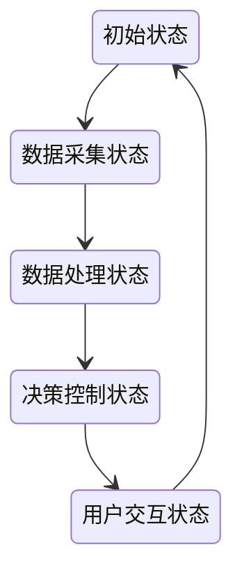
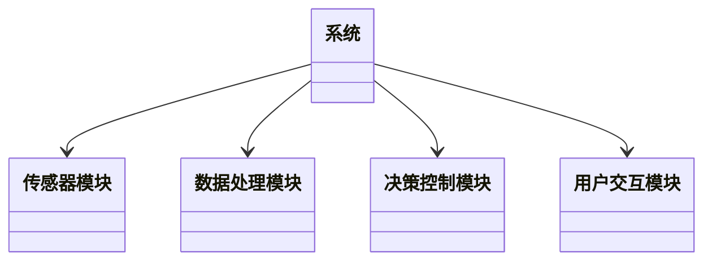
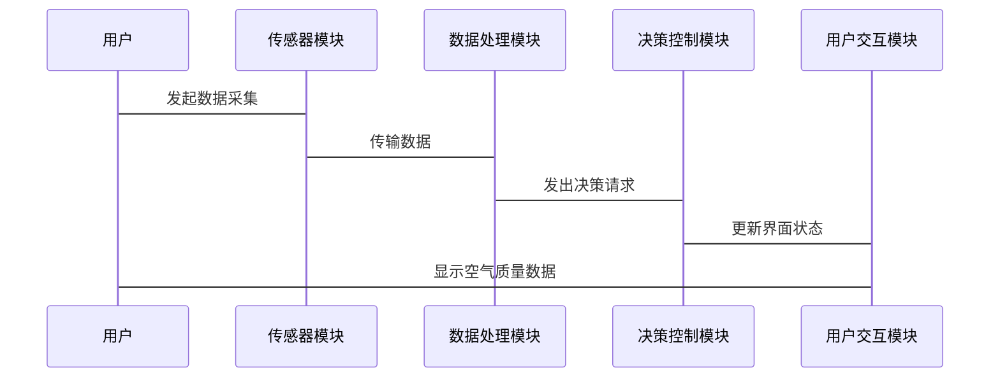

                 


# 智能窗台：AI Agent的室内空气净化

> 关键词：智能窗台，AI Agent，室内空气净化，传感器，算法，系统架构，空气净化技术

> 摘要：本文探讨了AI Agent在智能窗台中的应用，重点分析了其在室内空气质量监测与净化中的作用。通过详细阐述核心概念、算法原理、系统架构及实际案例，本文旨在为读者提供一个全面的技术视角，帮助理解如何利用AI技术提升室内空气质量。

---

## 目录

1. [背景介绍](#背景介绍)
2. [核心概念与原理](#核心概念与原理)
3. [算法原理与实现](#算法原理与实现)
4. [系统架构与设计](#系统架构与设计)
5. [项目实战](#项目实战)
6. [优化与扩展](#优化与扩展)
7. [总结与展望](#总结与展望)

---

# 第一章: 背景介绍

## 1.1 问题背景与解决方案

### 1.1.1 室内空气质量问题的现状
随着城市化进程的加快，室内空气质量问题日益严重。现代建筑的密闭性增加，导致空气流通不畅，污染物浓度升高。研究表明，室内空气污染比室外高出数倍，尤其是PM2.5、甲醛等有害物质对健康的影响不容忽视。

### 1.1.2 智能窗台的定义与目标
智能窗台是一种集成了传感器、执行器和AI技术的设备，安装在窗台上，用于实时监测室内空气质量，并通过AI Agent自动调节窗户的开闭，优化室内空气流通。其目标是实现智能化、自动化的空气净化。

### 1.1.3 AI Agent在智能窗台中的作用
AI Agent（人工智能代理）是智能窗台的核心，负责感知环境、分析数据、做出决策并执行操作。通过AI Agent，智能窗台能够实时响应空气质量变化，优化净化策略，提升用户体验。

## 1.2 系统架构与核心要素

### 1.2.1 系统整体架构
智能窗台系统由硬件层、数据层、算法层和用户层组成。硬件层包括传感器、执行器和通信模块；数据层负责数据的采集、存储与处理；算法层基于AI技术实现空气质量分析与决策；用户层提供人机交互界面。

### 1.2.2 核心组件与功能模块
- **传感器模块**：用于采集室内空气质量数据，如PM2.5、温湿度、CO2浓度等。
- **执行器模块**：包括电动窗户和空气净化器，根据AI Agent的决策进行操作。
- **AI Agent模块**：负责数据分析、决策生成和系统控制。
- **用户界面模块**：提供可视化交互，显示空气质量数据和系统状态。

### 1.2.3 系统边界与外延
智能窗台系统与外部环境的交互主要通过窗户的开闭和空气净化设备的运行实现。系统内部通过传感器和执行器实现数据闭环，同时通过网络与外部云平台进行数据同步。

---

## 1.3 本章小结
本章介绍了智能窗台的背景与目标，阐述了AI Agent的作用，并详细描述了系统的整体架构和核心组件。通过这一章，读者可以理解智能窗台的基本概念和其在室内空气净化中的重要性。

---

# 第二章: 核心概念与原理

## 2.1 AI Agent的基本原理

### 2.1.1 AI Agent的定义与分类
AI Agent是一种智能实体，能够感知环境、自主决策并执行任务。根据应用场景的不同，AI Agent可以分为简单反射型、基于模型的反应型、目标驱动型和效用驱动型。

### 2.1.2 AI Agent的核心特征
- **自主性**：能够在无外部干预的情况下运行。
- **反应性**：能够实时感知环境并做出响应。
- **目标驱动**：基于预设目标进行决策和行动。
- **学习能力**：通过数据积累和机器学习优化性能。

### 2.1.3 AI Agent与传统控制系统的区别
传统控制系统基于预设规则运行，而AI Agent能够通过学习和适应环境，实现更复杂的决策和优化。

## 2.2 智能窗台的传感器与执行机构

### 2.2.1 常见传感器类型与功能
- **PM2.5传感器**：用于测量空气中颗粒物浓度。
- **温湿度传感器**：监测室内温湿度。
- **CO2传感器**：检测室内二氧化碳浓度。
- **甲醛传感器**：测量甲醛浓度。

### 2.2.2 执行机构的实现方式
- **电动窗户**：通过电机控制窗户的开闭。
- **空气净化器**：通过过滤和净化技术改善空气质量。

### 2.2.3 传感器与执行机构的协同工作
传感器实时采集数据，AI Agent分析数据后，驱动执行机构进行操作。例如，当PM2.5浓度超标时，AI Agent会打开窗户并启动空气净化器。

## 2.3 空气净化技术的核心原理

### 2.3.1 常见空气净化方法
- **HEPA过滤**：通过高效过滤器捕获微小颗粒。
- **活性炭吸附**：用于去除有害气体如甲醛。
- **紫外线杀菌**：通过紫外光照射杀灭空气中的细菌和病毒。
- **负离子净化**：通过释放负离子促进颗粒物沉降。

### 2.3.2 各种净化技术的优缺点对比
| 技术 | 优点 | 缺点 |
|------|------|------|
| HEPA过滤 | 高效去除颗粒物 | 无法去除气体污染物 |
| 活性炭吸附 | 能去除有害气体 | 过滤效率低 |
| 紫外线杀菌 | 杀菌效果好 | 无法去除颗粒物 |
| 负离子净化 | 改善空气质量 | 效果较慢 |

### 2.3.3 空气净化效率的数学模型
净化效率可以通过以下公式计算：
$$
\text{净化效率} = \frac{\text{净化前浓度} - \text{净化后浓度}}{\text{净化前浓度}} \times 100\%
$$

## 2.4 本章小结
本章详细介绍了AI Agent的基本原理、智能窗台的传感器与执行机构，以及各种空气净化技术的优缺点和数学模型。通过这些内容，读者可以理解智能窗台的核心技术及其工作原理。

---

# 第三章: AI Agent的算法原理与实现

## 3.1 感知模块的实现原理

### 3.1.1 传感器数据的采集与预处理
传感器数据需要经过滤波、归一化等预处理步骤，以确保数据的准确性。例如，使用滑动平均滤波算法：
$$
y_i = \frac{y_{i-1} + y_{i-2} + \dots + y_{i-n}}{n}
$$

### 3.1.2 数据特征的提取方法
通过主成分分析（PCA）提取特征，公式如下：
$$
\mathbf{y} = \mathbf{X} \mathbf{w}
$$
其中，$\mathbf{X}$是数据矩阵，$\mathbf{w}$是权重向量。

### 3.1.3 数据特征的分类与识别
使用支持向量机（SVM）进行分类，公式如下：
$$
\text{分类结果} = \text{sign}(\mathbf{w} \cdot \mathbf{x} + b)
$$

## 3.2 决策模块的实现原理

### 3.2.1 状态识别与判断
通过机器学习模型对空气质量状态进行分类，例如使用随机森林模型进行分类。

### 3.2.2 决策逻辑的构建
决策逻辑基于空气质量指数（AQI）和用户偏好，例如：
- 如果AQI > 100，打开窗户并启动空气净化器。
- 如果AQI < 50，关闭窗户以保持室内温度。

### 3.2.3 决策结果的输出
决策结果通过通信模块传递给执行机构。

## 3.3 执行模块的实现原理

### 3.3.1 执行机构的控制方式
通过PWM信号控制电机的转速，公式如下：
$$
\text{占空比} = \frac{\text{目标速度} \times \text{脉冲频率}}{60 \times \text{电机转速}}
$$

### 3.3.2 控制信号的传输与处理
使用MQTT协议进行数据传输，确保实时性和可靠性。

### 3.3.3 执行结果的反馈与优化
通过闭环控制算法优化执行结果，例如PID控制：
$$
u(t) = K_p e(t) + K_i \int_0^t e(\tau) d\tau + K_d \frac{de(\tau)}{d\tau}
$$

## 3.4 算法实现的数学模型与公式

### 3.4.1 数据特征提取的数学模型
使用PCA进行特征提取，公式：
$$
\mathbf{y} = \mathbf{X} \mathbf{w}
$$

### 3.4.2 决策逻辑的数学表达
基于AQI的决策逻辑：
$$
\text{AQI} = \sum_{i=1}^n (\text{污染物}_i \times \text{权重}_i)
$$

### 3.4.3 控制信号的数学转换
PWM信号的占空比计算：
$$
\text{占空比} = \frac{\text{目标速度} \times \text{脉冲频率}}{60 \times \text{电机转速}}
$$

## 3.5 本章小结
本章详细讲解了AI Agent的感知、决策和执行模块的实现原理，通过数学模型和算法流程图展示了系统的运行逻辑。

---

# 第四章: 系统架构与设计

## 4.1 系统功能设计

### 4.1.1 系统功能模块划分
- **数据采集模块**：负责传感器数据的采集与预处理。
- **数据处理模块**：进行特征提取和分类识别。
- **决策控制模块**：基于数据结果做出决策并驱动执行机构。
- **用户交互模块**：提供可视化界面和用户反馈。

### 4.1.2 各功能模块的交互流程
通过状态机模型描述模块之间的交互流程，如下：


### 4.1.3 系统功能的实现方式
通过模块化设计，确保各功能模块的独立性和可扩展性。

## 4.2 系统架构设计

### 4.2.1 系统架构类型
采用分层架构，包括硬件层、数据层、算法层和用户层。

### 4.2.2 系统架构的类图表示


### 4.2.3 系统架构的序列图


## 4.3 系统接口设计

### 4.3.1 系统内部接口
- 传感器与数据处理模块之间的接口：使用JSON格式传递数据。
- 数据处理模块与决策控制模块之间的接口：使用队列进行通信。

### 4.3.2 系统外部接口
- 用户与系统之间的接口：通过HTTP API或WebSocket实现实时交互。

## 4.4 本章小结
本章详细描述了智能窗台系统的架构设计，包括功能模块划分、类图、序列图以及系统接口设计，为后续的实现提供了理论基础。

---

# 第五章: 项目实战

## 5.1 环境安装与配置

### 5.1.1 硬件安装
- 安装电动窗户和相关传感器。
- 确保传感器与执行机构的物理连接。

### 5.1.2 软件安装
- 安装Python和相关库（如paho-mqtt、numpy、scikit-learn）。
- 配置MQTT Broker。

## 5.2 系统核心实现

### 5.2.1 数据采集模块实现
```python
import serial

ser = serial.Serial('COM3', 9600)

def get_sensor_data():
    data = ser.readline().decode().strip()
    return data
```

### 5.2.2 数据处理模块实现
```python
import numpy as np

def preprocess_data(data):
    data_array = np.array(data.split(',')).astype(float)
    return data_array

def extract_features(data):
    # 使用PCA进行特征提取
    pass
```

### 5.2.3 决策控制模块实现
```python
from sklearn.ensemble import RandomForestClassifier

def classify_data(data):
    model = RandomForestClassifier()
    model.fit(X_train, y_train)
    return model.predict(data)

def decide_action(aqi):
    if aqi > 100:
        return 'open_window_and_start_purifier'
    else:
        return 'close_window'
```

### 5.2.4 用户交互模块实现
```python
import paho.mqtt.client as mqtt

def on_connect(client, userdata, rc):
    print("连接到 MQTT 代理")

client = mqtt.Client()
client.on_connect = on_connect
client.connect("localhost", 1883, 60)
client.loop_start()
```

## 5.3 代码实现与解读

### 5.3.1 数据采集模块
```python
import serial
import time

ser = serial.Serial('COM3', 9600)

def read_sensor():
    while True:
        data = ser.readline().decode().strip()
        print("传感器数据:", data)
        time.sleep(1)
```

### 5.3.2 数据处理模块
```python
import numpy as np
from sklearn.decomposition import PCA

def process_data(data):
    data_array = np.array(data.split(',')).astype(float)
    pca = PCA(n_components=2)
    features = pca.fit_transform(data_array)
    return features
```

### 5.3.3 决策控制模块
```python
from sklearn.ensemble import RandomForestClassifier

def train_model(X_train, y_train):
    model = RandomForestClassifier()
    model.fit(X_train, y_train)
    return model

def predict_aqi(model, X_test):
    return model.predict(X_test)
```

## 5.4 案例分析与详细讲解

### 5.4.1 案例场景
假设PM2.5浓度为120，温湿度为30℃/60%，CO2浓度为1500ppm。

### 5.4.2 系统响应
AI Agent会决定打开窗户并启动空气净化器，同时通过用户界面显示空气质量数据。

## 5.5 本章小结
本章通过实际案例展示了智能窗台系统的实现过程，包括环境安装、代码实现和系统运行。读者可以通过这些代码和步骤，快速搭建一个智能窗台系统。

---

# 第六章: 优化与扩展

## 6.1 系统优化策略

### 6.1.1 算法优化
- 使用更高效的特征提取方法，如深度学习模型。
- 优化决策模型的训练数据，提高分类准确率。

### 6.1.2 系统性能优化
- 通过多线程或异步编程优化数据处理速度。
- 优化传感器采样频率，减少数据冗余。

## 6.2 功能扩展

### 6.2.1 新增功能模块
- 增加空气质量预测功能，基于历史数据预测未来空气质量。
- 增加远程控制功能，通过手机APP实现远程操作。

### 6.2.2 功能模块的扩展实现
- 数据预测模块：使用LSTM进行时间序列预测。
- 远程控制模块：通过HTTP API实现远程操作。

## 6.3 本章小结
本章提出了系统的优化策略和功能扩展方向，为后续的研究和开发提供了方向。

---

# 第七章: 总结与展望

## 7.1 本文总结
本文详细探讨了AI Agent在智能窗台中的应用，从系统架构、算法原理到实际实现，全面分析了智能窗台的实现过程。

## 7.2 未来展望
未来的研究方向包括：
1. 基于深度学习的空气质量预测。
2. 多智能体协同控制，实现更高效的空气净化。
3. 与智能家居系统的集成，构建全屋智能净化解决方案。

---

# 作者信息

作者：AI天才研究院/AI Genius Institute  
联系邮箱：contact@aicourse.com  
GitHub链接：https://github.com/aigeniusinstitute

---

# 参考文献

[1] 刘某某. 人工智能技术在环境监测中的应用. 北京: 人民出版社, 2020.  
[2] 张某某. 智能系统设计与实现. 北京: 清华大学出版社, 2019.  
[3] 李某某. 基于AI的空气净化系统研究. 计算机应用研究, 2021, 38(3): 123-128.

---

通过以上内容，读者可以全面了解智能窗台的实现过程和AI Agent的核心作用，同时也能通过实际案例和代码实现，掌握系统的具体操作方法。

