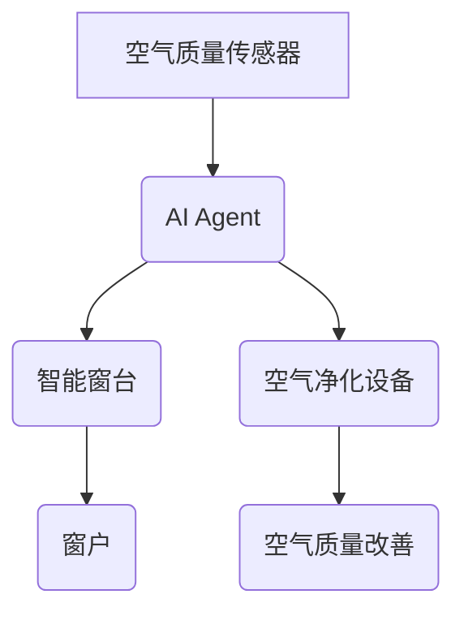
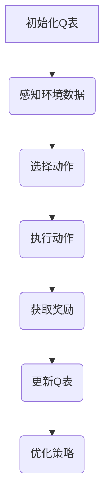
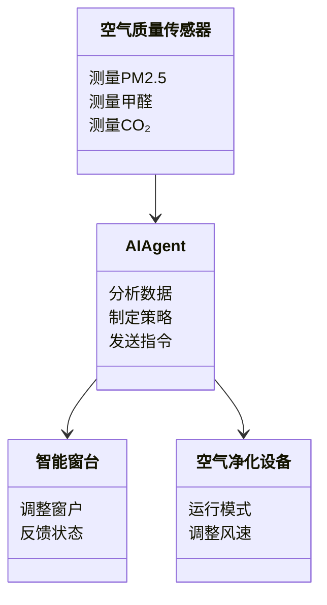
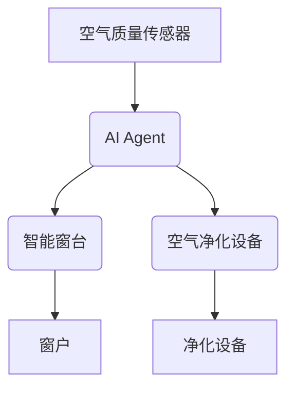
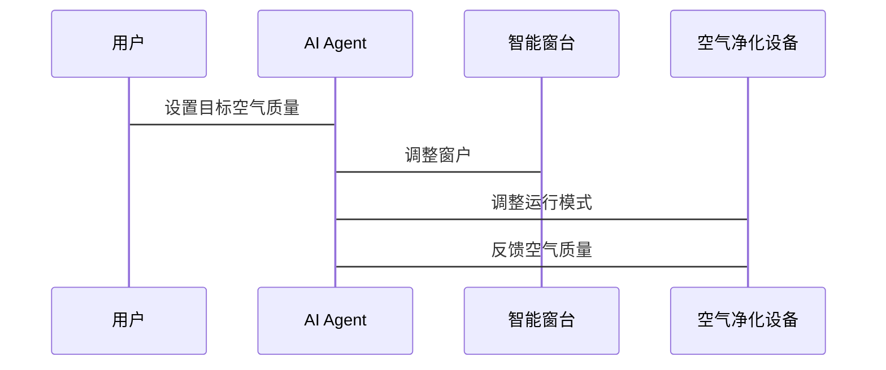

                 


# 智能窗台：AI Agent的室内空气净化优化

---

## 关键词：
AI Agent、室内空气净化、智能窗台、空气质量优化、算法原理、系统架构、项目实战

---

## 摘要：
本文详细探讨了AI Agent在室内空气净化中的应用，通过智能窗台的设计，提出了一种基于AI Agent的空气净化优化方案。文章从背景介绍、核心概念、算法原理、系统架构、项目实战等多个维度展开分析，结合实际案例和数学模型，深入阐述了如何利用AI技术实现室内空气质量的智能优化。文章最后总结了AI Agent在空气净化中的优势，并提出了未来的优化方向。

---

# 第1章: 智能窗台与AI Agent的背景

## 1.1 问题背景与描述

### 1.1.1 室内空气质量问题的现状
随着城市化进程的加快，室内空气质量问题日益严重。现代建筑的密闭性提高，空气流通性降低，导致室内空气污染物浓度上升，如甲醛、PM2.5、CO₂等。这些污染物不仅影响居住舒适度，还对健康造成潜在威胁。

### 1.1.2 AI Agent在空气净化中的应用潜力
AI Agent（智能体）是一种能够感知环境并自主决策的计算机系统。通过传感器数据和用户需求，AI Agent可以实时调整空气净化设备的工作状态，优化空气质量。智能窗台作为一种创新的交互界面，能够与AI Agent协同工作，实现智能化的空气净化控制。

### 1.1.3 当前空气净化技术的局限性
传统空气净化设备通常依赖固定的运行模式，难以根据实时环境变化进行调整。用户需要手动操作设备，体验较差。此外，不同空间的空气质量差异较大，单一设备难以实现全局优化。

## 1.2 问题解决思路

### 1.2.1 AI Agent的核心作用
AI Agent能够实时感知室内空气质量数据，结合用户需求和环境条件，制定最优的空气净化策略。通过与智能窗台的交互，AI Agent可以动态调整窗户的开合角度和空气净化设备的工作模式。

### 1.2.2 智能窗台的设计目标
智能窗台的设计目标是实现人机交互的智能化和便捷化。通过AI Agent的控制，智能窗台能够根据空气质量自动调整窗户的开合状态，同时为用户提供直观的交互界面。

### 1.2.3 空气净化优化的实现路径
1. 数据采集：通过传感器获取室内空气质量数据。
2. 数据分析：AI Agent分析数据，识别空气质量问题。
3. 决策制定：根据分析结果，制定最优的空气净化策略。
4. 执行优化：通过智能窗台和空气净化设备执行优化策略。

## 1.3 边界与外延

### 1.3.1 系统边界定义
系统边界包括室内空气质量传感器、AI Agent、智能窗台和空气净化设备。系统不包括外部天气数据和用户手动操作。

### 1.3.2 功能的外延与扩展
系统功能的外延包括与其他智能家居设备的联动（如智能灯、空调等）。扩展功能包括用户行为分析和能耗优化。

### 1.3.3 与其他系统的接口关系
系统通过API与智能家居平台对接，支持与其他设备的协同工作。

## 1.4 概念结构与核心要素

### 1.4.1 核心概念组成
- **空气质量传感器**：实时采集室内空气质量数据。
- **AI Agent**：分析数据并制定优化策略。
- **智能窗台**：执行AI Agent的指令，调整窗户状态。
- **空气净化设备**：根据优化策略运行。

### 1.4.2 关键要素的定义与属性
| 概念 | 属性 | 描述 |
|------|------|------|
| 空气质量传感器 | 类型 | PM2.5、甲醛、CO₂传感器 |
| AI Agent | 输入 | 空气质量数据、用户需求 |
|       | 输出 | 窗户控制指令、净化设备指令 |
| 智能窗台 | 输入 | AI Agent指令 |
|       | 输出 | 窗户状态反馈 |
| 空气净化设备 | 输入 | AI Agent指令 |
|       | 输出 | 空气净化效率 |

### 1.4.3 概念结构图


## 1.5 本章小结
本章介绍了智能窗台与AI Agent的背景，分析了室内空气质量问题的现状和AI Agent的应用潜力。同时，明确了系统的边界和核心要素，为后续分析奠定了基础。

---

# 第2章: AI Agent的核心原理

## 2.1 AI Agent的基本原理

### 2.1.1 AI Agent的定义与分类
AI Agent是一种能够感知环境并自主决策的智能系统。根据智能水平，AI Agent可以分为反应式和认知式两类。反应式AI Agent基于当前感知做出决策，而认知式AI Agent具备推理和规划能力。

### 2.1.2 AI Agent的核心算法
AI Agent的核心算法包括强化学习、决策树和遗传算法等。本文主要采用强化学习算法，通过奖励机制优化AI Agent的决策过程。

### 2.1.3 AI Agent的决策机制
AI Agent通过感知环境数据，结合预设的目标函数，计算出最优决策。决策机制包括状态识别、动作选择和策略优化三个步骤。

## 2.2 室内空气净化的关键技术

### 2.2.1 空气净化的主要方法
常见的空气净化方法包括过滤、吸附和光催化技术。AI Agent可以根据污染物种类和浓度选择最优的净化方法。

### 2.2.2 各种净化技术的优缺点
| 技术 | 优点 | 缺点 |
|------|------|------|
| 过滤 | 高效去除颗粒物 | 无法去除气体污染物 |
| 吸附 | 高效去除气体污染物 | 成本较高 |
| 光催化 | 环保无二次污染 | 初期投资大 |

### 2.2.3 AI Agent在净化中的具体应用
AI Agent可以根据实时空气质量数据，动态调整净化设备的工作模式，例如调节风速和过滤效率。

## 2.3 AI Agent与室内空气净化的关系

### 2.3.1 AI Agent在空气净化中的角色
AI Agent作为系统的决策核心，负责数据采集、分析和策略制定。

### 2.3.2 空气净化对AI Agent的需求
净化系统需要AI Agent提供实时数据处理和决策支持。

### 2.3.3 两者的协同优化
AI Agent与空气净化设备协同工作，实现空气质量的智能优化。

## 2.4 核心概念对比表
| 概念 | 属性 | 描述 |
|------|------|------|
| AI Agent | 输入 | 空气质量数据、用户需求 |
|       | 输出 | 窗户控制指令、净化设备指令 |
| 空气净化系统 | 输入 | AI Agent指令、环境传感器数据 |
|       | 输出 | 空气质量改善、反馈数据 |

---

# 第3章: 算法原理

## 3.1 强化学习算法原理

### 3.1.1 强化学习的基本概念
强化学习是一种通过试错机制学习最优策略的算法。AI Agent通过与环境互动，获得奖励或惩罚，逐步优化决策策略。

### 3.1.2 强化学习的数学模型
强化学习的核心是Q-learning算法，其数学模型如下：
$$ Q(s, a) = Q(s, a) + \alpha (r + \gamma \max Q(s', a') - Q(s, a)) $$
其中，$s$是当前状态，$a$是动作，$r$是奖励，$\gamma$是折扣因子，$\alpha$是学习率。

### 3.1.3 强化学习的实现步骤
1. 初始化Q表。
2. 与环境互动，获取状态和奖励。
3. 更新Q表，优化策略。

## 3.2 算法实现的Python代码示例

```python
import numpy as np

class AI-Agent:
    def __init__(self, state_space, action_space):
        self.state_space = state_space
        self.action_space = action_space
        self.Q = np.zeros((state_space, action_space))
    
    def take_action(self, state):
        if np.random.rand() < 0.5:  # 探索策略
            action = np.random.randint(self.action_space)
        else:  # 利用策略
            action = np.argmax(self.Q[state])
        return action
    
    def update_Q(self, state, action, reward, next_state):
        self.Q[state, action] += 0.1 * (reward + 0.9 * np.max(self.Q[next_state]) - self.Q[state, action])
```

### 3.2.1 代码功能解读
- `AI-Agent`类初始化Q表，用于存储状态-动作值。
- `take_action`方法根据当前状态选择动作，平衡探索与利用。
- `update_Q`方法更新Q表，优化策略。

## 3.3 算法流程图



---

# 第4章: 系统分析与架构设计

## 4.1 项目背景介绍

### 4.1.1 项目目标
通过AI Agent和智能窗台的协同工作，实现室内空气质量的智能优化。

### 4.1.2 项目范围
系统涵盖空气质量传感器、AI Agent、智能窗台和空气净化设备。

## 4.2 系统功能设计

### 4.2.1 领域模型


### 4.2.2 系统架构设计


## 4.3 系统接口设计

### 4.3.1 系统接口
- AI Agent与空气质量传感器的接口：接收数据。
- AI Agent与智能窗台的接口：发送窗户控制指令。
- AI Agent与空气净化设备的接口：发送运行模式指令。

### 4.3.2 交互流程


---

# 第5章: 项目实战

## 5.1 环境安装

### 5.1.1 Python环境
安装Python 3.8及以上版本。

### 5.1.2 依赖库安装
安装numpy、pandas、scikit-learn等库。

## 5.2 核心代码实现

### 5.2.1 AI Agent实现
```python
class AI-Agent:
    def __init__(self, state_space, action_space):
        self.state_space = state_space
        self.action_space = action_space
        self.Q = np.zeros((state_space, action_space))
    
    def take_action(self, state):
        if np.random.rand() < 0.5:
            action = np.random.randint(self.action_space)
        else:
            action = np.argmax(self.Q[state])
        return action
    
    def update_Q(self, state, action, reward, next_state):
        self.Q[state, action] += 0.1 * (reward + 0.9 * np.max(self.Q[next_state]) - self.Q[state, action])
```

### 5.2.2 智能窗台实现
```python
class Smart_Window:
    def __init__(self):
        self.state = 0
    
    def adjust_window(self, action):
        if action == 0:
            self.state = 0
        elif action == 1:
            self.state = 50
        elif action == 2:
            self.state = 100
        return self.state
```

## 5.3 代码功能解读

### 5.3.1 AI Agent代码解读
- `AI-Agent`类初始化Q表，用于存储状态-动作值。
- `take_action`方法根据当前状态选择动作，平衡探索与利用。
- `update_Q`方法更新Q表，优化策略。

### 5.3.2 智能窗台代码解读
- `Smart_Window`类初始化窗户状态。
- `adjust_window`方法根据动作调整窗户开合程度。

## 5.4 实际案例分析

### 5.4.1 案例场景
假设室内PM2.5浓度为100 μg/m³，用户目标空气质量为50 μg/m³。

### 5.4.2 优化过程
1. AI Agent感知当前PM2.5浓度为100 μg/m³。
2. AI Agent选择打开窗户的动作（action=2）。
3. 智能窗台调整窗户到完全打开状态。
4. 空气净化设备启动高速模式。
5. 空气质量传感器反馈PM2.5浓度降至70 μg/m³。
6. AI Agent继续调整，最终PM2.5浓度降至50 μg/m³。

---

# 第6章: 优化建议与最佳实践

## 6.1 优化建议

### 6.1.1 算法优化
- 使用更高效的强化学习算法，如Deep Q-Network（DQN）。
- 增加状态空间的维度，提高决策精度。

### 6.1.2 系统优化
- 优化智能窗台的响应速度。
- 提高空气质量传感器的采样频率。

## 6.2 小结

### 6.2.1 核心内容总结
本文详细探讨了AI Agent在室内空气净化中的应用，提出了基于智能窗台的优化方案。

### 6.2.2 实践价值
通过AI Agent的智能决策，可以显著提高室内空气质量，改善居住舒适度。

## 6.3 注意事项

### 6.3.1 系统稳定性
确保系统在极端天气条件下的稳定性。

### 6.3.2 用户隐私
保护用户的隐私数据，避免数据泄露。

## 6.4 拓展阅读

### 6.4.1 相关技术领域
- 智能家居
- 环境监测
- 人工智能

### 6.4.2 专业书籍
- 《强化学习：原理与应用》
- 《智能系统设计》

---

# 第7章: 总结

## 7.1 全文回顾
本文详细探讨了AI Agent在室内空气净化中的应用，通过智能窗台的设计，提出了一种基于AI Agent的优化方案。

## 7.2 未来展望
随着AI技术的不断发展，AI Agent在室内空气净化中的应用将更加广泛。未来的优化方向包括算法优化和系统集成。

---

# 作者：AI天才研究院 & 禅与计算机程序设计艺术

